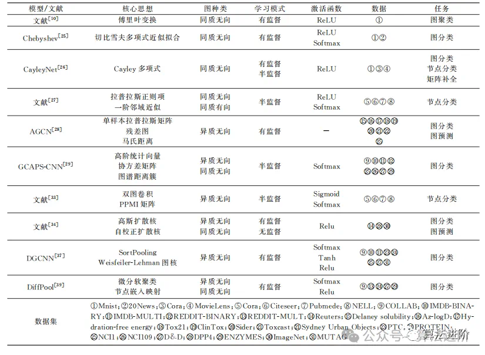

# Deep Learning

## RNN

Recurrent Neural Network，循环神经网络，用于处理**序列数据**的神经网络。RNN具有内部记忆功能，可以在序列中的当前步骤依赖于前一步骤的信息。这使得RNN特别适合于处理诸如时间序列、语言文本、语音识别等需要考虑上下文的任务。

### 数学原理

**1. 基本结构**

RNN 的基本单元由一个循环结构组成，它允许信息在网络的时间步骤之间传递。假设我们有一个输入序列 $$({x^{(1)}, x^{(2)}, \dots, x^{(T)}})$$，RNN 通过以下公式来更新其隐藏状态和输出：

*   **隐藏状态更新：**

    \
    $$h^{(t)} = f\bigl(W_{hh} h^{(t-1)} + W_{xh} x^{(t)} + b_h\bigr)$$\
    \
    其中：

    * $$h^{(t)}$$是时间步 (t) 的隐藏状态。
    * $$W_{hh}$$是隐藏状态到隐藏状态的权重矩阵，维度为 $$\mathbb{R}^{H\times H}$$。
    * $$W_{xh}$$是输入到隐藏状态的权重矩阵，维度为 $$\mathbb{R}^{D\times H}$$。
    * $$b_h$$ 是隐藏层的偏置项，维度为 $$\mathbb{R}^{H}$$。
    * $$f(x)$$是激活函数通常是 $$\tanh$$或 $$ReLU$$）。
*   **输出计算：**

    \
    $$y^{(t)} = g\bigl(W_{hy} h^{(t)} + b_y\bigr)$$

    其中：

    * $$y^{(t)}$$ 是时间步 t 的输出。
      * $$W_{hy}$$ 是隐藏状态到输出的权重矩阵，维度为 $$\mathbb{R}^{H\times O}$$。
      * $$b_y$$是输出层的偏置项，维度为 $$\mathbb{R}^{O}$$。
      * $$g$$是输出的激活函数（根据任务不同，可能是 softmax、sigmoid 等）。

***

**2. 前向传播过程**

1.  **初始化隐藏状态：**

    \
    $$h^{(0)} = \mathbf{0} \quad\text{或随机初始化}$$

    1.  **通过时间步更新隐藏状态和输出：**

        \
        对于每个时间步 $$t=1,2,\dots,T$$：

        *   计算隐藏状态：

            \
            $$h^{(t)} = f\bigl(W_{hh} h^{(t-1)} + W_{xh} x^{(t)} + b_h\bigr)$$
        *   计算输出：

            \
            $$y^{(t)} = g\bigl(W_{hy} h^{(t)} + b_y\bigr)$$

***

**3. 损失函数和反向传播过程**

*   **总损失：**

    \
    $$\mathcal{L} = \sum_{t=1}^{T} \ell\bigl(y^{(t)},\, \hat{y}^{(t)}\bigr)$$

    \
    其中：
* $$\ell$$ 是每个时间步的损失函数（如交叉熵损失）。\\
* $$\hat{y}^{(t)}$$ 是时间步 (t) 的真实值。
* **BPTT（Backpropagation Through Time）：**
  1.  **初始化梯度：**

      $$
      \frac{\partial \mathcal{L}}{\partial W_{hh}} = 0,\quad
        \frac{\partial \mathcal{L}}{\partial W_{hy}} = 0,\quad
        \frac{\partial \mathcal{L}}{\partial b_h} = 0,\quad
        \frac{\partial \mathcal{L}}{\partial b_y} = 0.\
      $$
  2. **反向传播误差（从 (t=T) 到 (t=1)）：**
     *   输出层梯度：

         $$
         z^{(t)} = W_{hy} h^{(t)} + b_y.\
         $$
     *   隐藏层梯度：

         \
         $$\delta_h^{(t)} = \bigl(W_{hy}^\top \delta_y^{(t)} + W_{hh}^\top \delta_h^{(t+1)}\bigr) \odot f'\bigl(a^{(t)}\bigr),$$

         \
         其中 $$a^{(t)} = W_{hh} h^{(t-1)} + W_{xh} x^{(t)} + b_h$$。
     *   累计权重梯度：

         $$
         \begin{aligned}
           \frac{\partial \mathcal{L}}{\partial W_{hy}} &\mathrel{+}= \delta_y^{(t)}\,h^{(t)\top},\\
           \frac{\partial \mathcal{L}}{\partial b_y}  &\mathrel{+}= \delta_y^{(t)},\\
           \frac{\partial \mathcal{L}}{\partial W_{hh}} &\mathrel{+}= \delta_h^{(t)}\,h^{(t-1)\top},\\
           \frac{\partial \mathcal{L}}{\partial W_{xh}} &\mathrel{+}= \delta_h^{(t)}\,x^{(t)\top},\\
           \frac{\partial \mathcal{L}}{\partial b_h}  &\mathrel{+}= \delta_h^{(t)}.
         \end{aligned}
         \
         $$
  3.  **参数更新（梯度下降）：**

      $$
      \begin{aligned}
        W_{xh} &\leftarrow W_{xh} - \eta \frac{\partial \mathcal{L}}{\partial W_{xh}},\\
        W_{hh} &\leftarrow W_{hh} - \eta \frac{\partial \mathcal{L}}{\partial W_{hh}},\\
        W_{hy} &\leftarrow W_{hy} - \eta \frac{\partial \mathcal{L}}{\partial W_{hy}},\\
        b_h    &\leftarrow b_h    - \eta \frac{\partial \mathcal{L}}{\partial b_h},\\
        b_y    &\leftarrow b_y    - \eta \frac{\partial \mathcal{L}}{\partial b_y}.
      \end{aligned}
      $$

RNN 通过循环结构捕捉序列中的依赖关系，通过前向传播计算隐藏状态和输出，并通过时间反向传播来更新权重，从而在处理序列数据时有效利用上下文信息。

在优化RNN模型时，可以考虑以下技术：

1. **正则化**：使用Dropout层来防止过拟合。
2. **不同的RNN变体**：尝试LSTM或GRU，这些变体在处理长序列时表现更好。
3. **调整超参数**：通过网格搜索或随机搜索调整学习率、批量大小、隐藏单元数等超参数。
4. **数据增强**：扩充训练数据集，增加模型的泛化能力。

### 代码实现

简单的实现代码：

```python
from tensorflow.keras.models import Sequential
from tensorflow.keras.layers import SimpleRNN, Dense, Dropout

model = Sequential()
model.add(SimpleRNN(units=50, return_sequences=True, input_shape=(X.shape[1], 1)))
model.add(Dropout(0.2))
model.add(SimpleRNN(units=50))
model.add(Dropout(0.2))
model.add(Dense(1))

model.compile(optimizer='adam', loss='mean_squared_error')

# 训练模型
history = model.fit(X, y, epochs=50, batch_size=32, validation_split=0.2, verbose=1)

# 可视化训练过程
plt.figure(figsize=(14, 7))
plt.plot(history.history['loss'], label='Training Loss')
plt.plot(history.history['val_loss'], label='Validation Loss')
plt.title('Model Loss During Training')
plt.xlabel('Epoch')
plt.ylabel('Loss')
plt.legend()
plt.show()
```

## LSTM

Long Short-Term Memory，长短期记忆网络，是循环神经网络（RNN）的特殊形式，通过引入遗忘门、输入门和输出门来控制信息的流动，从而允许网络更有效地学习和处理长期依赖关系。

### 数学原理

**1. 遗忘门（Forget Gate）**

遗忘门控制着当前单元状态中哪些信息需要被丢弃。遗忘门的输出是一个 0 到 1 之间的值，表示每个信息保留的程度。

$$
f^{(t)} = \sigma\bigl(W_f \,[h^{(t-1)},\, x^{(t)}] + b_f\bigr)
$$

* $$f^{(t)}$$ 是遗忘门的输出。
* $$\sigma$$ 是 sigmoid 激活函数。
* $$W_f$$ 是遗忘门的权重矩阵。
* $$[h^{(t-1)},\, x^{(t)}]$$ 表示上一个时刻的隐藏状态和当前输入的拼接向量。
* $$b_f$$ 是遗忘门的偏置项。

***

**2. 输入门（Input Gate）**

输入门控制着新信息的加入程度。它包括两个部分：一个 sigmoid 层决定需要更新的信息，另一个 tanh 层生成新的候选记忆单元。

$$
i^{(t)} = \sigma\bigl(W_i \,[h^{(t-1)},\, x^{(t)}] + b_i\bigr)
\quad
\tilde{c}^{(t)} = \tanh\bigl(W_c \,[h^{(t-1)},\, x^{(t)}] + b_c\bigr)
$$

* $$i^{(t)}$$ 是输入门的输出。
* $$\tilde{c}^{(t)}$$ 是新的候选记忆单元。
* $$W_i, W_c$$ 分别是输入门和候选记忆单元的权重矩阵。
* $$b_i, b_c$$ 分别是输入门和候选记忆单元的偏置项。

***

**3. 更新记忆单元状态**

通过遗忘门和输入门的作用，更新当前的记忆单元状态：

$$
c^{(t)} = f^{(t)} \odot c^{(t-1)} + i^{(t)} \odot \tilde{c}^{(t)}
$$

* $$c^{(t)}$$ 是当前时刻的记忆单元状态。
* $$c^{(t-1)}$$ 是上一个时刻的记忆单元状态。
* $$\odot$$ 表示逐元素相乘。

***

**4. 输出门（Output Gate）**

输出门控制着当前时刻的隐藏状态输出。它决定哪些部分的记忆单元状态将被输出。

$$
o^{(t)} = \sigma\bigl(W_o \,[h^{(t-1)},\, x^{(t)}] + b_o\bigr)
\quad
h^{(t)} = o^{(t)} \odot \tanh\bigl(c^{(t)}\bigr)
$$

* $$o^{(t)}$$ 是输出门的输出。
* $$h^{(t)}\$$ 是当前时刻的隐藏状态。
* $$W_o$$ 是输出门的权重矩阵。
* $$b_o$$ 是输出门的偏置项。

***

**LSTM 的算法流程**

下面是 LSTM 在处理时间序列数据时的详细算法流程：

1. **初始化：**\
   初始化所有权重矩阵 $$\{W_f, W_i, W_c, W_o\}$$ 和偏置项 $$\{b_f, b_i, b_c, b_o\}$$。
2. **输入数据：**\
   输入时间序列数据 $$\{x^{(1)}, x^{(2)}, \dots, x^{(T)}\}$$。
3.  **计算遗忘门输出：**

    $$
    f^{(t)} = \sigma\bigl(W_f [h^{(t-1)}, x^{(t)}] + b_f\bigr)
    $$
4.  **计算输入门输出：**

    $$
    i^{(t)} = \sigma\bigl(W_i [h^{(t-1)}, x^{(t)}] + b_i\bigr)
    $$
5.  **生成候选记忆单元：**

    $$
    \tilde{c}^{(t)} = \tanh\bigl(W_c [h^{(t-1)}, x^{(t)}] + b_c\bigr)
    $$
6.  **更新记忆单元状态：**

    $$
    c^{(t)} = f^{(t)} \odot c^{(t-1)} + i^{(t)} \odot \tilde{c}^{(t)}
    $$
7.  **计算输出门输出：**

    $$
    o^{(t)} = \sigma\bigl(W_o [h^{(t-1)}, x^{(t)}] + b_o\bigr)
    $$
8.  **计算当前隐藏状态：**

    $$
    h^{(t)} = o^{(t)} \odot \tanh\bigl(c^{(t)}\bigr)
    $$
9. **输出隐藏状态** $$h^{(t)}$$ **并更新内部状态** $$\{h^{(t)}, c^{(t)}\}$$**。**

LSTM 通过遗忘门、输入门、候选记忆单元和输出门来控制信息的流动和更新，克服了传统 RNN 中梯度消失和梯度爆炸的问题，使其能够更好地捕捉长时间依赖关系。其核心思想是通过门控机制选择性地保留和更新信息，从而实现对时间序列数据的有效建模和预测。

## CNN

Convolutional Neural Network，卷积神经网络，专门用于处理图像和视频数据。它通过卷积层（Convolutional Layers）自动提取特征，避免了传统机器学习中手动设计特征的过程。主要由 卷积层（Convolutional Layer）、池化层（Pooling Layer）和全连接层（Fully Connected Layer） 组成。

### 数学原理

#### CNN 的输入表示

输入通常是三维张量：

$$
\text{Input shape: } (H, W, C)
$$

* $$H$$：图像高度
* $$W$$：图像宽度
* $$C$$：通道数（如 RGB 图像为 3）

***

#### 卷积层

**卷积运算：**

$$
y_{i,j} = \sum_m \sum_n x_{i+m,j+n} \cdot w_{m,n} + b
$$

其中：

* $$x$$：输入图像，$$w$$：卷积核，$$b$$：偏置项
* $$y_{i,j}$$：输出特征图上的第 $$i,j$$ 个元素

***

本质上是用一个小的「滤波器」在图像上滑动，并计算局部区域的加权和

**卷积核（Filter）：**

* 通常为 $$3 \times 3$$、$$5 \times 5$$大小
* 输入通道为 $$C$$，则卷积核尺寸为 $$C \times K \times K$$
* 参数通过反向传播自动学习

***

**步长（Stride）与填充（Padding）：**

* **步长 Stride**：卷积核每次移动的步数（如 1, 2）
* **填充 Padding**：为了防止卷积后图像尺寸缩小，可以在输入图像边缘填充p个像素
  * "valid"：不填充，输出尺寸变小
  * "same"：填充使输出尺寸等于输入尺寸 $$P = \frac{K-1}{2}$$

***

#### 激活函数（Activation Function）

CNN 中最常用的是 ReLU（Rectified Linear Unit）：

$$
\text{ReLU}(x) = \max(0, x)
$$

作用：

* 增加非线性
* 加速收敛
* 缓解梯度消失问题

***

#### 池化层（Pooling Layer）

池化层用于降低特征图的维度，同时保留重要信息。

**最大池化（Max Pooling）**

$$
O(i,j)=\max_{(m,n)\in P}I(i+m,j+n)
$$

**平均池化（Average Pooling）**

$$
O(i,j)=\frac{1}{|P|}\sum_{(m,n)\in P}I(i+m,j+n)
$$

#### 扁平化（Flatten）

将卷积/池化后的输出展平为一维向量：

$$
\text{Tensor shape } (C, H, W) \Rightarrow \text{Vector shape } (C \times H \times W)
$$

***

#### Softmax 分类层

将最后的全连接输出变为概率分布：

$$
\text{Softmax}(z_i) = \frac{e^{z_i}}{\sum_{j} e^{z_j}}
$$

其中：

* $$z$$：FC 层输出向量
* 输出为每个类别的概率

***

### CNN 的训练流程

1. **前向传播**：依次计算各层输出，得到预测值$$L(y,\hat{y})$$
2. **计算损失**：通常使用交叉熵损失函数常用 **交叉熵损失（Cross Entropy Loss）**$$\mathcal{L} = - \sum_{i=1}^C y_i \log(\hat{y}_i)$$

* $$y$$：真实标签的 one-hot 编码
* $$\hat{y}$$：预测的概率分布

3. **反向传播**：计算梯度(使用链式法则)，传播误差
4. **参数更新**：使用梯度下降（如 SGD, Adam）更新参数

***

### 总结

* 卷积层（Convolutional Layer）- 提取局部特征
  * 模拟人类视觉的“看局部”能力，使用滤波器（Kernel）滑动图像区域，提取边缘、纹理、颜色等信息。
  * 每次滑动执行局部加权求和（卷积操作），提取不同层次特征。
* 全连接层（Fully Connected Layer, FC）- 做最终分类决策
  * 将前面提取的特征展平为一维向量
  * 输入到传统神经网络层中，输出分类结果
* 池化层（Pooling Layer）- 缩小数据，保留关键信息
  * 通过 **最大池化（Max Pooling）** 或 **平均池化（Average Pooling）** 缩小特征图。类似于「压缩图片，但保留主要内容」
  * 保留最重要的特征，并减少计算复杂度
* Softmax 层：输出为各类概率分布
* 通过反向传播 + 优化器训练整个网络

## Transform

由两个主要部分组成：编码器（Encoder）和解码器（Decoder），编码器就像一个阅读器，它把输入的信息（比如一句话）进行理解和抽象；而解码器则像一个说话器，把这种抽象的理解重新生成成另一种形式（比如另一种语言的翻译）

编码器和解码器都不是简单的单层结构，而是堆叠了多层，每一层都做一些类似的信息加工。

每一层内部的主要工作就是通&#x8FC7;**“注意力机制”（Attention）**&#x6765;确定哪些信息是关键，应该被重点关注，同时还会通过一些数学运算对信息进行转化和增强。具体来说：

* **输入表示**：把文本数据先变成数字化的向量表示，并加入位置信息（因为模型本身不具备位置信息的顺序概念）。
* **编码器堆叠**：多层编码器各自关注不同层次的信息特征，通过注意力机制互相“对话”，提取全局和局部的重要信息。
* **解码器堆叠**：解码器同样有多层，它不仅关注已经生成的内容，还从编码器那里获取输入的关键信息，通过注意力机制将这两部分信息融合，生成最终的输出。
* **输出生成**：经过解码器处理，最终生成所需的目标序列，比如翻译后的句子或其他任务的输出。

### 数学原理

#### 编码器（Encoder）

每层编码器包含两个子模块：

1.  **多头自注意力机制（Multi-Head Self-Attention）**

    该机制使模型在处理当前词时，能够关注序列中其他词的相关信息。

    **核心公式：**

    $$
    \text{Attention}(Q, K, V) = \text{softmax}\left( \frac{QK^\top}{\sqrt{d_k}} \right)V
    $$

    其中：

    * $$Q$$（Query）、$$K$$（Key）和 $$V$$（Value）分别是输入经过线性变换后的矩阵。
    * $$d_k$$ 是 Key 的维度，用于缩放避免数值过大。
2.  **前馈神经网络（Feed Forward Neural Network, FFN）**

    在自注意力机制之后，每个位置的输出都会通过一个前馈神经网络进行进一步处理。

    **公式：**

    $$
    \text{FFN}(x) = \max(0, xW_1 + b_1)W_2 + b_2
    $$

    其中：

    * $$W_1$$ 和 $$W_2$$ 是权重矩阵。
    * $$b_1$$ 和 $$b_2$$ 是偏置项。
    * $$\max(0, x)$$ 表示 ReLU 激活函数。

#### 解码器（Decoder）

每层解码器包含三个子模块：

1.  **掩蔽自注意力机制（Masked Self-Attention）**

    类似于编码器的自注意力机制，但在计算注意力时，对未来的词进行屏蔽，确保解码器在生成时只依赖于已生成的部分。
2.  **编码器-解码器注意力机制（Encoder-Decoder Attention）**

    该机制使解码器在生成每个词时，能够结合编码器的输出信息。

    **公式：**

    $$
    \text{Attention}(Q, K, V) = \text{softmax}\left( \frac{QK^\top}{\sqrt{d_k}} \right)V
    $$

    其中：

    * $$Q$$ 来自解码器的输入。
    * $$K$$ 和 $$V$$ 来自编码器的输出。
3.  **前馈神经网络（FFN）**

    与编码器部分相同，对经过注意力模块处理后的输出进行进一步的非线性转换。

此外，编码器和解码器的每一层都配备有残差连接和层归一化，这有助于缓解深层网络训练中的梯度消失问题和训练不稳定问题。

## GCN

### 基于谱方法的图卷积神经网络

<figure><figcaption></figcaption></figure>

GCN 最早是从谱图理论出发提出的，其核心步骤包括：

* **图拉普拉斯矩阵**  
  对于图 $$G$$ 来说，定义邻接矩阵 $$A$$ 和度矩阵 $$D$$（其中 $$D_{ii} = \sum_j A_{ij}$$），图的标准拉普拉斯矩阵为  

  $$
  L = D - A
  $$

  为了更好地数值稳定和归一化，通常采用对称归一化拉普拉斯：

  $$
  L_{sym} = I - D^{-1/2} A D^{-1/2}
  $$

* **谱分解与图傅里叶变换**  
  对称归一化拉普拉斯 $$L_{sym}$$ 可分解为  

  $$
  L_{sym} = U \Lambda U^\top
  $$

  其中 $$U$$ 是特征向量矩阵，$$\Lambda$$ 是对角矩阵（包含特征值）。  
  图信号 $$x$$ 在谱域中的表示为：  

  $$
  \hat{x} = U^\top x
  $$

  而逆变换为：  

  $$
  x = U \hat{x}
  $$

* **谱域下的卷积定义**  
  通过图傅里叶变换，可以在谱域中定义卷积操作：  

  $$
  g_{\theta} * x = U\, g_{\theta}(\Lambda)\, U^\top x
  $$

  其中 $$g_{\theta}(\Lambda)$$ 表示对特征值 $$\Lambda$$ 的函数作用，即对每个特征值 $$\lambda_i$$ 进行变换：

  $$
  g_{\theta}(\Lambda) = \text{diag}\bigl(g_{\theta}(\lambda_1),\, g_{\theta}(\lambda_2),\, \dots,\, g_{\theta}(\lambda_N)\bigr)
  $$

  这个函数通常通过多项式（例如切比雪夫多项式）进行近似，以便实现局部化滤波并降低计算复杂度。

**简化与一阶近似**

为提高计算效率，Kipf 和 Welling 提出了一个简化模型，通过一阶近似将谱域卷积转化为如下形式：

$$
H^{(l+1)} = \sigma\Bigl(\tilde{D}^{-1/2}\tilde{A}\tilde{D}^{-1/2} H^{(l)} W^{(l)}\Bigr)
$$

其中：

* $$\tilde{A} = A + I$$ 是加入自连接后的邻接矩阵。  
* $$\tilde{D}$$ 为 $$\tilde{A}$$ 的度矩阵。  

这种形式不仅避免了昂贵的特征分解运算，还能保证仅依赖于局部邻域内的信息，从而实现高效且稳定的特征传播。

***

**前向传播过程**

在 GCN 模型中，前向传播主要包括以下几个步骤：

* **输入层**：节点原始特征 $$X$$ 被直接输入到网络中。  
* **图卷积层**：依次通过多层图卷积，每层按照上述公式更新节点特征表示。  
* **输出层**：根据任务需求（如节点分类或图分类），最后一层输出经过激活和线性变换，得到预测结果。

---

## GIN

Graph Isomorphism Network (GIN) 图同构网络，一种图神经网络，其核心设计理念在于利用具有单射性质的聚合与更新机制，使得网络具有与 Weisfeiler-Lehman 同构测试相当甚至更强的判别能力，从而能够区分在图结构上存在细微差别的图。

### 数学原理

**1. 节点特征聚合与更新**

GIN 采用多层图神经网络逐层更新节点表示，其基本更新公式为：

$$
h^{(k)}_v = \text{MLP}^{(k)}\Big((1 + \epsilon^{(k)}) \cdot h^{(k-1)}_v + \sum_{u \in N(v)} h^{(k-1)}_u\Big)
$$

* $$h^{(k)}_v$$ 表示节点 $$v$$ 在第 $$k$$ 层的特征表示。
* $$h^{(k-1)}_v$$ 表示节点 $$v$$ 在上一层的特征表示。
* $$N(v)$$ 表示节点 $$v$$ 的邻居集合。
* $$\epsilon^{(k)}$$ 是一个可学习参数或固定常数，用于调整节点自身特征与邻居特征的相对重要性。
* $$\text{MLP}^{(k)}$$ 是第 $$k$$ 层的多层感知机（MLP），用于对聚合结果进行非线性变换。

***

**2. 唯一性保证的理论基础**

GIN 的设计依赖于以下关键理论结果，以确保节点（以及图）的表示具有唯一性，从而增强区分能力。

*   **引理**

    假设输入空间 $$\mathcal{X}$$ 是可数的，则存在一个函数

    $$
    f: \mathcal{X} \to \mathbb{R}^n
    $$

    使得对于任意有界大小的多重集 $$X \subset \mathcal{X}$$，聚合表示

    $$
    h(X) = \sum_{x \in X} f(x)
    $$

    是唯一的。更进一步，任何在多重集上的函数 $$g$$ 都可以写成：

    $$
    g(X) = \phi\Big(\sum_{x \in X} f(x)\Big)
    $$

    其中 $$\phi$$ 为某个映射函数。
*   **推论**

    对于任意中心元素 $$c \in \mathcal{X}$$ 和其邻居构成的多重集 $$X \subset \mathcal{X}$$（大小有界），存在函数 $$f$$ 和无限多的 $$\epsilon$$（包括所有无理数），使得下式

    $$
    h(c, X) = (1 + \epsilon) \cdot f(c) + \sum_{x \in X} f(x)
    $$

    对每一对 $$(c, X)$$ 都是唯一的。同时，任意定义在这类对上的函数 $$g$$ 都可以分解为：

    $$
    g(c, X) = \phi\Big((1 + \epsilon) \cdot f(c) + \sum_{x \in X} f(x)\Big)
    $$

    这意味着，通过对中心节点和邻居特征的组合聚合，可以构造出具有单射性质的表示，确保不同的节点及其邻居结构对应不同的聚合结果。
*   **定理**

    若图神经网络（GNN）的节点更新与聚合过程采用了上述单射函数（即所有操作均保持不同输入映射到不同输出），并且层数足够，则对于任何在 WL 同构测试下判定为非同构的图，GNN 都能生成不同的图嵌入。这保证了 GIN 拥有极强的图区分能力。

***

**3. 实现上的注意事项**

*   **MLP 的应用**

    根据通用逼近定理，多层感知机（MLP）可以逼近任意连续函数，因此可以用来同时实现函数 $$f$$ 和 $$\phi$$ 的组合映射。实际应用中，通常将 $$f$$ 与 $$\phi$$ 的组合建模为单个 MLP，以简化网络结构。
*   **输入特征**

    当输入特征为 one-hot 编码时，其求和操作本身已具备单射性质，因此在第一层中可以直接进行求和而无需额外的 MLP 预处理。
*   $$\epsilon$$ **参数**

    $$\epsilon$$ 的引入（尤其选取无理数值）可以确保在聚合中心节点与邻居信息时避免混淆。该参数可以设计为可学习的，也可以固定为某个标量，从而调控两部分特征的相对影响力。

***

综上所述，GIN 通过以下几个步骤实现其数学原理：

1. 为每个节点构造初始表示，并通过 one-hot 编码或其他方式初始化。
2. 利用单射聚合操作，将中心节点特征和邻居特征以形式 $$(1+\epsilon) \cdot f(c) + \sum_{x\in X} f(x)$$ 聚合为唯一表示。
3. 通过 MLP 对聚合结果进行非线性变换，实现节点特征的更新。
4. 堆叠多层这样的更新模块，使得整个网络具备与 WL 同构测试同等甚至更强的图判别能力。

GIN 的这种设计确保了在图数据上能够充分捕捉局部结构信息，从而在理论上实现了“最大区分能力”，使其成为一类极具表达力的图神经网络。
