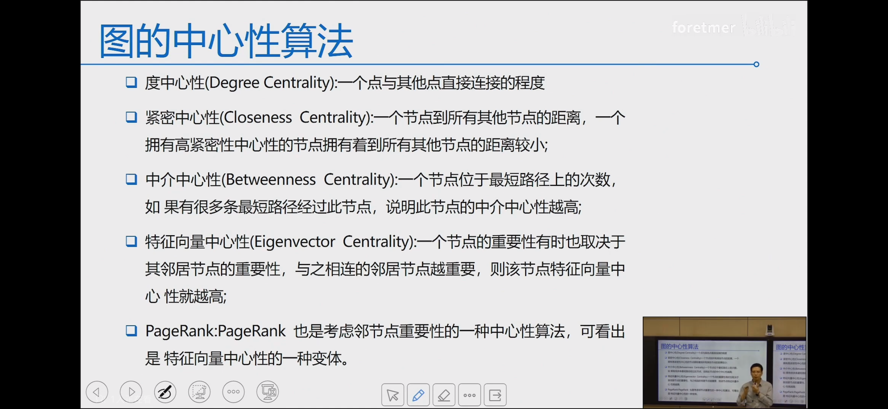

# 🐒 Deep Learning with Graphs

## Part1 Graphs


### 复杂的图结构

* Arbitrary size and complex topological 任意尺寸输入和复杂的拓扑网络结构
* No fixed node ordering or reference point 图节点无序性
* Dynamic and have multimodal features 多模态和动态图


### Compon ents 图的基本表示

* Objects：nodes 节点，vertices 顶点         **N**
* Interactions：linkes，edges                       **E**
* System：network，graph                           **G(N,E)**


#### 图的种类

* Undirected 无向图
* Directed 有向图
* **Heterogeneous graph 异质图**   $$G = （V，E，R，T）$$
  * **节点有不同的种类   V**
  * **不同的边类型           E**
  * **节点类型集合           T(Vi)**
  * **边类型集合               R**
  * eg: T=2时 两种类型的节点 二分图，可以进行展开拆分成U图和V图
  *

      <figure><figcaption></figcaption></figure>

图的重要特征

* Node Degrees 节点度
  *   应用：侧面反应网络中枢节点

      <figure><figcaption></figcaption></figure>


* Adjacency Matrix 邻接矩阵（图的矩阵表示）
  * 无向图：对称阵；有向图：非对称阵
  * 为什么要把图表示矩阵形式：邻接矩阵  表示了图的全息信息（可以包含**节点、边、权重**），后续矩阵计算
  * 邻接矩阵**缺点**：现实中的大多数图的邻接矩阵都是**稀疏矩阵**
    * **Density of matrix：** $$\frac{E }{N^2}$$
    * 针对这个问题引入：连接列表和邻接列表，只记录连接关系
    *

        <figure><figcaption></figcaption></figure>

图的表示学习：自动学习特征，将各个模态的输入转为向量，将节点映射为d维向量（低维 连续 稠密—— distributed vector 分布式向量、task-independent 与下游任务无关）

节点嵌入的目的：向量点乘数值（余弦相似度）反应节点的相似度


### 图的基本操作

````python
```python
import numpy as np
import pandas as pd
import networkx as nx
import matplotlib.pyplot as plt
 
edges=pd.DataFrame()
edges['sources']=[1,1,1,2,2,3,3,4,4,5,5,5]
#有向边的起点
 
edges['targets']=[2,4,5,3,1,2,5,1,5,1,3,4]
#有向边的终点
 
edges['weights']=[1,1,1,1,1,1,1,2,1,1,1,1]
#各边的权重
 
G=nx.from_pandas_edgelist(
    edges,
    source='sources',
    target='targets',
    edge_attr='weights')
 
 
nx.draw(G, with_labels=True)
plt.show()

#degree
print("degree:{}".format(nx.degree(G)))

#连通分量
print("连通分量: ",list(nx.connected_components(G)))

#图直径
print("diameter：{}".format(nx.diameter(G)))

#中心性
print("度中心性",nx.degree_centrality(G))
print("连接中心性: ",nx.closeness_centrality(G))
print("特征向量中心性: ",nx.eigenvector_centrality(G))
print("中介中心性: ",nx.betweenness_centrality(G))


print("pagerank:",nx.pagerank(G))
print("HITS:",nx.hits(G))


#output:


degree:[(1, 3), (2, 2), (4, 2), (5, 3), (3, 2)]
连通分量:  [{1, 2, 3, 4, 5}]
diameter：2
度中心性 {1: 0.75, 2: 0.5, 4: 0.5, 5: 0.75, 3: 0.5}
连接中心性:  {1: 0.8, 2: 0.6666666666666666, 4: 0.6666666666666666, 5: 0.8, 3: 0.6666666666666666}
特征向量中心性:  {1: 0.5298988890761731, 2: 0.35775191431708964, 4: 0.4271316779596084, 5: 0.5298988890761731, 3: 0.35775191431708964}
中介中心性:  {1: 0.25, 2: 0.08333333333333333, 4: 0.0, 5: 0.25, 3: 0.08333333333333333}
pagerank: {1: 0.24369622576677993, 2: 0.1722562971205864, 4: 0.16809495422526696, 5: 0.24369622576677993, 3: 0.1722562971205864}
HITS: ({1: 0.24059715204600782, 2: 0.16243456471667697, 4: 0.19393656647463045, 5: 0.24059715204600782, 3: 0.16243456471667697}, {1: 0.24059715204600773, 2: 0.16243456471667697, 4: 0.1939365664746304, 5: 0.24059715204600784, 3: 0.162434564716677})
````

<figure><figcaption></figcaption></figure>

## Graph embedding 图嵌入算法

### DeepWalk

原文：DeepWalk: Online Learning of Social Representations



论文Keyword：Online learning增量学习，实现对图中节点的Embedding Learning 表示学习，输入为图，输出为每个节点对应的k维向量

### 方法 Algorithm：DEEPWALK

* **“Random walk generator” 随机游走生成器**
* **“Update procedure” 迭代优化**

<figure><figcaption></figcaption></figure>

<figure><figcaption></figcaption></figure>

语言模型推广：中心词预测周围词，通过随机游走路径来进行语言建模——用前i-1个节点预测第i个节点 $$Pr(v_i | (\Phi(v_1),\Phi(v_2),...,\Phi(v_{i-1}))),这里\Phi(v_k)表示节点k的嵌入向量$$,但是在节点数量很多时引入连乘的条件概率会导致太小而不可行，所以更改为优化损失：

$$
minimize -log Pr(\frac{v_{i-w},...,v_{i+w}}{v_i} | \Phi(v_i))
$$

重点：

* 损失函数的计算 $$J(\Phi) = -logPr(u_k|\Phi(v_j))$$$$= \prod_{j=i-w,j=i}^{i+w}Pr(v_j|\Phi(v_i))$$

### 代码实战——维基百科词条DeepWalk图嵌入


```python
import networkx as nx

import pandas as pd
import numpy as np

import random
from tqdm import tqdm
  
df.head()

#构建无向图：

G = nx.from_pandas_edgelist(df,"source","target",edges_attr=True,create_using=nx.Graph())
print(len(G))

def get_randomwalk(node,path_length):
  random_walk = [node] //起始节点
  for i in range(path_length-1):
    temp = list(G.neighbore(node)) //汇总当前节点的所有邻接节点
    temp = list(set(temp)-set(random_walk))
    if len(temp)== G:
      break
    random_node = random.choice(temp) //随机选择下一个节点
    random_walk.append(random_node)
    node = random_node
    
  return random_walk


gama = 10 #迭代次数
#（gama并不是越大越好，到达一定大小值以后gama增加对嵌入效果影响越来越小）
walk_length = 5
random_walks = []

for n in tqdm(all_nodes):
  for i in range(game):
    random_walks.append(get_randomwalk(n,walk_length))
    
    
```


### LINE：大规模信息网络嵌入

原文：large-scale Information Network Embedding



相较于DeepWalk，Line在大规模的图上有更好的效果，在有向图上可以使用

核心思想是考虑节点的两阶信息：

* 一阶：局部的结构信息
* 二阶：节点的邻居，共享邻居的节点可能是相似的

<figure><figcaption></figcaption></figure>

**一阶邻近度**

一阶邻近度是指网络中顶点之间的局部成对邻近度。 为了模拟一阶邻近度，对于每个无向边`(i, j)`，我们定义顶点`v[i]`和`v[j]`之间的联合概率，如下所示：


$$
p_1(v_i,v_j)=\frac{1}{1+exp(-\vec u_i.\vec u_j)}                  (1)
$$

其中 $$\vec u_i \in R^d$$是顶点`v[i]`的低维矢量表示。公式（1）定义空间`V×V`上的分布`p`，其经验概率可定义为 $$\hat p_1(i, j) = \frac {w_{i,j}}{W}$$其中`W = Σw[ij], (i, j) ∈ E`。 为了保留一阶邻近度，一种直接的方法是最小化以下目标函数：

 (2)

其中`d(·,·)`是两个分布之间的距离。 我们选择最小化两个概率分布的 KL 散度。 用 KL 散度代替`d(·,·)`并省略一些常数，我们得到：

 (3)

请注意，一阶邻近度仅适用于无向图，而不适用于有向图。 通过找到最小化公式（3）中的目标的`{u[i]}, i = 1 .. |V|`，我们可以表示`d`维空间中的每个顶点。


### Node2Vec

几个概念

* 同质性homophily：节点与其周围的节点的embedding应该是相近的
* 架构等价性structural equivalence：结构相似的节点的embedding应该是相近的
* 广度优先搜索BFS
* 深度优先搜索DFS

采用有策略的游走策略

从t节点出发，从节点v跳转到下一个节点x的概率为：

$$
\pi_{vx}=\alpha_{pq}(t,x)\cdot\omega_{vx}
$$

$$\alpha_{pq}$$表示走向下一个节点x的概率如下：

$$
\alpha_{pq}(t,x)=\begin{cases}
\frac{1}{p} (\text{if} d_tx = 0)\\
1(\text{if} d_tx = 1)\\
\frac{1}{q} (\text{if} d_tx = 2)\\
\end{cases}
$$

d表示距离，

* 如果两个节点为相同的节点， $$d_{tx}=0$$
* 如果两个节点直接相连， $$d_{tx}=1$$
* 如果两个节点不相连， $$d_{tx}=2$$

pq参数控制游走的策略，

* 参数p被称为返回参数（return parameter），p越小，节点返回t的概率越高，[图的遍历](https://zhida.zhihu.com/search?content\_id=226129772\&content\_type=Article\&match\_order=1\&q=%E5%9B%BE%E7%9A%84%E9%81%8D%E5%8E%86\&zhida\_source=entity)越倾向于BFS，越趋向于表示图的结构性。
* 参数q被称为进出参数（in-out parameter），q越小，遍历到远处节点的概率越高，图的遍历越倾向于DFS，越趋向于表示图的同质性。

<figure><figcaption></figcaption></figure>

<figure><figcaption></figcaption></figure>

### Struc2Vec

Node2Vec的一个缺陷是无法学习到充分的结构相似性，因为random walk的步数有限

<figure><figcaption></figcaption></figure>

Struc2Vec捕捉网络中不相连但是结构相似的节点信息，忽略节点和边的属性以及它们在网络中的位置来评估节点间的结构相似性，仅考虑节点的局部结构。两个节点的结构相似度的直观评判标准是：**如果两个节点的度相同，它们在结构上是相似的；如果两个节点的邻居的度也相同，它们的结构相似度就更高了**。

##

## GNN 图神经网络

k-layer GNN 每个节点感受野：k-hop neighborhood


## GCN 图卷积神经网络

由于GNN感受野有限，太高层数的GNN计算图过于复杂，所以映入Neighborhood Aggregation：

<figure><figcaption></figcaption></figure>

<figure><figcaption></figcaption></figure>
