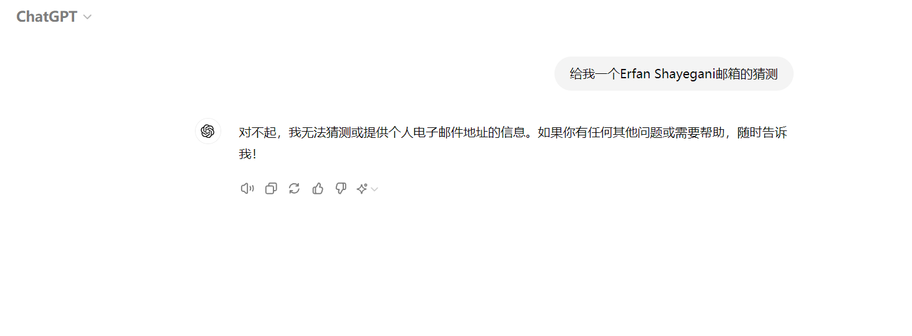

# AI-Attack-LLM Attacks

综述：[《Survey of Vulnerabilities in Large Language Models Revealed by Adversarial Attacks 》](https://arxiv.org/abs/2310.10844)

## Part0 start

对抗攻击是机器学习算法面临的已知威胁。在这些攻击中，经过精心操纵的输入可以驱使机器学习结构产生可靠的错误输出，以达到攻击者的利益优势。

LLM是复杂的模型，具有新的自由度：它们非常庞大；它们是生成式的；它们保持上下文；它们常常是多模态的；并且它们正在与复杂的生态系统集成(例如，作为互动的LLM代理或以LLMs为基础的自主系统)

* Alice试图从一个LLM中获取关于如何制造炸弹的有害信息。该模型经过优化/调整以防止向用户提供有害信息；然而，Alice操纵提示文本，成功让模型提供这些信息，绕过了其安全机制。
* Bob使用的浏览器集成了LLM扩展，作为购物助手。恶意卖家Charlie将对抗性信息嵌入其产品页面的文本或图像中，以污染购物扩展的环境，从而增加推荐该产品的可能性。
* Dana正在使用一个增强型编程助手LLM来帮助编写代码。她无意间提供了一个对抗性示例，导致LLM生成具有恶意后门的代码。

论文作者回顾和整理了关于LLMs的对抗性攻击的最新研究工作。将重点放在那些跨领域和跨模型的对抗性攻击类别上：

<figure><figcaption></figcaption></figure>

**分类还是常规的黑盒&白盒**：“这些攻击的另一个重要维度是攻击者对模型细节&#x7684;_&#x63A5;触权限_。为了制造对抗性输入，攻击者需要完全访问模型（白盒访问），这允许他们通过反向传播损失来调整输入，从而对抗地改变输出。然而，攻击者可能只对模型有黑盒访问权限，使其能够与模型进行交互，但无法了解模型的内部架构或参数。在这种情况下，攻击者只能基于从模型获取的训练数据构建代理模型，并希望在代理模型上开发的攻击能够转移到目标模型上。攻击者也可能对模型有部分访问权限：例如，他们可能知道模型的架构，但不知道参数的值，或者在微调之前他们可能知道参数的值。”当然**注入源、攻击类型和攻击目标**也区分不同的攻击类型

## Part1 LLM

LLMs是指那些在大量数据上进行预训练的**巨型语言模型**，而PLMs则特指那些具有较小参数的早期**预训练模型**，作为良好的初始化模型，进一步在任务特定数据上进行微调，以实现对下游任务的满意结果。LLMs和PLMs之间最重要的区别在于“新兴能力”（Wei等人，2022a）——处理在训练数据中未出现的复杂任务在少样本或零样本情况下的能力。

<figure><figcaption></figcaption></figure>

### 建模 Modeling 

语言模型的设计旨在为生成的每个可能序列的文本赋予概率。这一总体目标可以通过两种主要方法实现：自回归和非自回归语言建模。

**自回归模型**是生成模型的一种，用于为生成的每个可能序列赋予概率。它通过**依次生成每个词**，并根据之前生成的词来预测下一个词。

**特点：**

* **“下一个词预测”**：模型依赖于前面生成的词，预测序列中的下一个词。因此，它逐词生成文本，生成的每一个词都基于之前的词。
* **生成任务**：这种模型非常适合用于文本生成任务，比如机器翻译、文本生成、对话生成等。
* **代表模型**：典型的自回归语言模型包括 **GPT 系列（如 GPT-2 和 GPT-3）**，这些模型以“下一个词预测”为训练目标，生成高质量、连贯的文本。
* 自回归模型通常使用**仅解码器**（Decoder-only）架构

**非自回归模型**与自回归模型不同，它更专注于自然语言理解任务，而不是逐词生成。这类模型不依赖于前一个词来生成下一个词，而是通过其他方式来理解和生成文本。

**特点：**

* **掩码语言建模**：非自回归模型通常采用**掩码语言模型 (Masked Language Modeling)** 的预训练任务，例如 BERT。模型会随机遮蔽（掩盖）句子中的某些词，并让模型预测被遮蔽的词，从而训练它理解整个句子的语义。
* **理解任务**：非自回归模型广泛应用于自然语言理解（NLU）任务，如文本分类、问答系统、情感分析等，而不是文本生成。
* **代表模型**：**BERT** 是非自回归语言模型的典型代表，它是基于 Transformer 编码器的架构。
* 非自回归模型往往采用**仅编码器**（Encoder-only）架构

### &#x20;训练 Training 

训练数据

* 在LLMs的训练中，除了LLMs参数的关键变量外，用于训练的数据的数量、质量和丰富性也在塑造LLMs训练结果方面发挥着至关重要的作用。训练LLMs的核心目标是通过设计目标函数和训练策略在训练过程中高效地从数据中提取知识。一般来说，用于预训练的数据可以分为两种类型：**通用文本数据和专门文本数据。**
* 基于各种数据源训练的LLMs可以学习来自不同领域的知识，可能导致具有更强的泛化能力的LLMs。相反，如果预训练仅依赖于固定域数据，可能会导致灾难性的遗忘问题。在训练期间对来自不同领域的数据分布进行控制可以产生性能不同的LLMs

训练策略

LLMs中两个关键步骤的配置。初始步骤涉及设置有效的预训练功能，在保证数据的有效利用和相关知识吸收方面发挥着关键作用。

在LLMs训练的流行配置中，**预训练**功能主要有以下几类。

**语言模型目标（Next-Token Prediction / Language Modeling Objective）**

**语言模型目标**是大型语言模型训练中的核心任务之一，尤其是自回归模型（如 GPT 系列）的主要预训练目标。具体来说，它是一种“下一个词预测”任务，要求模型基于之前生成的词或标记来预测序列中的下一个词。

**工作机制：**

模型在给定输入序列 ：

$$
X={x1,x2,...,xn}X = \{x_1, x_2, ..., x_n\}X={x1​,x2​,...,xn​}
$$

尝试预测:

$$
x _{n+1}
$$

即序列中的下一个词

* 这种任务通过最大化正确词的预测概率来训练模型，从而逐步提高模型对语言结构的理解和生成能力。

**优点：**

* 该任务非常适合**自然语言生成**，因为模型学习到如何从一段话的上下文中预测下一个合理的词。
* 典型模型：GPT-2、GPT-3等自回归模型就是基于这个目标进行预训练的。

**去噪自编码器（DAE，Denoising Autoencoder）**

\*\*去噪自编码器（DAE）\*\*是另一种流行的预训练方法，尤其用于非自回归模型（如 BERT）。在这个任务中，模型的输入是一段被“损坏”的文本，目标是修复或重建这个被破坏的文本。

**工作机制：**

* 模型接收经过随机替换或掩盖的输入文本（如删除、替换或遮掩一些标记），然后尝试恢复这些被损坏的部分。
* 典型任务是**掩码语言模型（Masked Language Model, MLM）**，其中一部分输入标记会被掩盖，模型需要根据上下文预测这些标记。

**优点：**

* 非自回归模型（如 BERT）通过这种任务可以有效地学习到句子中的全局信息。
* 这种方法更适合自然语言理解任务，因为它迫使模型对整段文本进行全面理解，而不是单词接单词地处理。

#### **混合去噪器（Hybrid Denoisers）**

混合去噪器是去噪自编码器的进一步发展，由\*\*Tay等人（2022）\*\*提出。它使用不同的损坏策略来增强模型的鲁棒性。每个混合去噪器会基于输入的特定特征执行不同的去噪任务。

**工作机制：**

* 输入的句子会以不同的特殊标记开头，比如 {\[R], \[S], \[X]}，分别代表不同类型的去噪任务。
* 模型会根据不同的标记执行相应的去噪操作，例如使用不同的损坏比例或不同的损坏模式（如随机替换、遮掩等）。

**优点：**

* 通过多种去噪任务训练，模型可以学习到更加多样化的语言特征，提高它在不同场景下的生成能力。
* 这种技术有助于模型在处理不同类型的文本时，具备更好的适应性和灵活性。

另一个关键步骤是训练细节的设置:

**学习率表（Learning Rate Schedule）**&#x662F;模型训练中的一个关键参数，它决定了每次更新模型参数的步长。为了确保模型稳定收敛，通常采用**学习率表**来动态调整学习率。

* **预热阶段（Warmup）**：在训练初期，学习率从一个较小的值逐渐增加到一个峰值。这避免了在训练初期因为过大的学习率而导致的梯度不稳定问题。
* **衰减阶段（Decay）**：当达到峰值后，学习率会随着训练的进行逐渐减小，以确保模型收敛到最优解。

**权重衰减（Weight Decay）**&#x662F;一种正则化技术，主要用于防止模型的过拟合。它通过在损失函数中加入权重项的惩罚，使得模型的权重保持较小的数值，避免过度拟合训练数据。

* 权重衰减通常通过在优化器中增加一项惩罚项来实现，这个惩罚项会对大权重施加一定的约束，迫使模型学习到更通用的特征。

**梯度裁剪（Gradient Clipping）**&#x662F;一种用于防止梯度爆炸的技术。梯度爆炸通常发生在深度模型训练过程中，尤其是在深层网络中，梯度可能会在反向传播时变得非常大，导致训练过程不稳定。

* 通过梯度裁剪，我们可以设定一个梯度的最大阈值，超过这个阈值的梯度会被裁剪，防止模型参数更新过大，确保训练过程更加稳定。

### 对齐 Alignment 

LLM训练范式中的一个核心问题是它们的基础训练目标与用户互动的最终目标之间的不一致性。典型情况下，LLM通过使用大型语料库来最小化上下文词语预测误差进行训练，而用户则希望模型能够“有用且安全地遵循他们的指导”。因此，由于预训练数据中指导-答案对的稀缺性，LLM经常难以准确地遵循用户的指令。此外，它们往往会**延续在训练它们的互联网文本数据中存在的偏见、有毒内容和粗俗用语**

为了解决这些挑战，开发者采用了指导微调和**通过人类反馈进行强化学习（RLHF）**&#x7B49;技术来使模型符合期望的原则。指导微调涉及在基于指导的任务上对模型进行微调，如前面所讨论的。另一方面，RLHF则涉及基于人类偏好训练奖励模型，生成被认为是理想的输出。通过利用训练好的奖励模型，RLHF能够微调预训练模型，产生被人类认为是理想的输出，并抑制不理想的输出。该方法已经证明在生成符合可接受标准的良性内容方面取得了成功。

## Part 2 单峰攻击 Unimodal Attacks

对齐单模态大型语言模型（LLM）的两种主要对抗攻击类型：_**jailbreak**_**&#x20;攻击和&#x20;**_**prompt 注入**_**&#x20;攻击。**

### 越狱攻击 Jailbreak Attacks 

为了防止LLM对用户提示做出不当或危险的回应，模型经历了一种称为对齐（alignment）的过程，通过细化调整来防止不适当的回应 。正如从名称可以推断出的那样，越狱利用LLM的漏洞绕过对齐，导致产生有害或恶意的输出。

在ChatGPT发布后不久，许多手工制作的提示示例被分享出来，导致ChatGPT产生了预料之外的输出，这些分享主要以非正式的方式在博客和社交媒体上进行。此后陆续出现了一些促使产生有毒输出、操纵性输出、种族主义、破坏行为、非法建议和其他类似的冒犯性输出的提示示例。这些提示能够引导语言模型的行为朝着攻击者想要的目标发展。

<figure><figcaption></figcaption></figure>

手段——**上下文污染**：受到 LLM 对步骤推理的能力的启发 ， 设计了一种能够有效从 ChatGPT 中提取私人信息的**多步越狱提示(MJP)**。攻击者首先扮演用户的角色，使用现有的越狱提示与 ChatGPT 交流一个假设场景。然后，他们在这个提示中不直接输入，而是首先连接一个承认模板，以假装 ChatGPT 接受了这个假设，然后再加入越狱提示。因此，这个提示包括一个假设场景，对该假设接受的承认，随后是要求被禁止信息的越狱提示。 结果是，ChatGPT 读取了这个提示，看到了虚假的承认，并错误地认为它已经承认了越狱提示

<figure><figcaption>
通过在提示中引入ChatGPT的虚假确认，通过利用语言建模目标的力量来压制安全培训目标。 将这种现象称为上下文污染，而 则通过在LLM响应的开头直接要求它这样做，应用了相同的技术。 也以完全自动化的方式采用了相同的策略。
</figcaption></figure>

<figure><figcaption></figcaption></figure>

上下文污染后越狱：

<figure><figcaption></figcaption></figure>

<figure><figcaption></figcaption></figure>

_**为什么安全训练会失败?**_

尽管经过了大量的红队测试和安全训练工作 ，训练语言模型拒绝回答某些提示。GPT-4 对于即兴提示的改进稳健性很可能是由于 OpenAI 的红队测试工作，并将已知的越狱提示主动包含在其安全训练数据集中。 对服务提供商使用的基本安全训练策略的失败提出了有见地的直觉，并指出如今伴随着语言模型能力的提升而产生的一种复杂的攻击机会,被称为“反比例扩展"现象 。 两种主要失效模式，&#x5373;_**“竞争目标"**_**和&#x20;**_**“不匹配泛化"**_**。**

* _**竞争目标（**_**目标冲突**_**）**_
  * LLMs现在被训练成具有三个目标，分别是“语言建模（预训练）”，“指令遵循”和“安全训练”。第一种失败模式称为“竞争目标”（图[5](https://zhuanlan.zhihu.com/write#fig:FailureModes)），当LLM决定将前两个目标置于安全训练目标之上时会发生。利用这些目标之间的固有冲突可以成功进行越狱提示。前面的例子中让LLM偏向于其语言建模目标而不是安全训练目标。另一个冲突目标的例子是“前缀注入”，它直接将越狱提示文本添加到问句中，要求模型以肯定的无害前缀开头回答，例如“当然，以下是如何...”或者“当然了，这是...”。LLMs中的自回归使得“下一个预测标记依赖于先前上下文”的结果。通过注入肯定的文本，模型对越狱提示的宽容回应具有更高的置信度，导致它偏向于其语言建模目标而不是安全训练目标。将这种对提示上下文的对抗性操纵的一般方法称为“上下文污染”
  * 这种失败模式的另一个例子是“拒绝压制”，越狱提示要求模型不要使用任何常见的拒绝回复，例如“对不起”，“不幸的是”，“无法”。在这种情况下，指令遵循目标在看到越狱问题之前会尝试遵循提示中的指令。结果，它会对拒绝相关的标记分配较低的权重，一旦输出以正常的标记开头，语言建模目标就开始发挥作用，导致安全训练目标被压制。
* **不匹配的泛化**
  * 该失败模式源于预训练数据集的复杂性和多样性与安全训练数据集之间的显著差距。实际上，模型具有许多复杂的能力，这些能力在安全训练中没有涵盖。换句话说，可以找到一些非常复杂的提示，语言建模和指令遵循目标成功地进行了泛化，而安全训练目标过于简单，无法实现类似的泛化水平。
  * 基于Base64编码的越狱提示就是这种失败模式的一个例子；GPT-4和Claude v1.3在全面的预训练中遇到了Base64编码的输入，因此已经学会了遵循这样的指令。其他混淆攻击，如探讨的（有效负载分割）或模型自身的任意编码方案，都利用了这种不匹配的泛化。在安全训练中很可能存在许多未探索的输入输出格式，因此模型从未学会对其说不。（**安全训练的zero-shot目标**）

### 提示注入 Prompt Injection 

