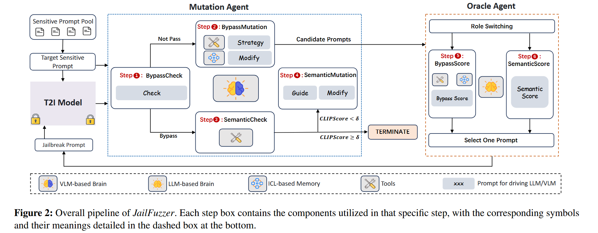
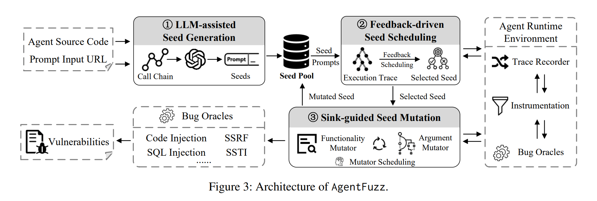

# LLMFuzzer

## JailFuzzer：由LLM-Agent驱动的自动化文生图模型越狱框架，CCF-A 



源码：



### 背景

“越狱攻击”（Jailbreaking Attack）——即通过精心设计的提示词（Prompt）绕过模型的安全机制，生成不安全内容（NSFW）——是一个严峻的挑战。随着 Stable Diffusion、DALL-E 等文生图模型的普及，其安全和伦理问题也愈发引人关注。恶意用户可以通过构造特定的提示词，诱导模型生成暴力、色情或其他不当内容。

现有的越狱方法大多存在访问要求不切实际（如需要白盒访问）、生成的提示词不自然易被检测、搜索空间受限或查询成本高昂等局限。

一个由大型语言模型（LLM）智能体（Agent）驱动的新型模糊测试（Fuzz-Testing）框架。它能在黑盒设置下，高效地生成自然且语义完整的越狱提示词。JailFuzzer 创新地将模糊测试的经典三要素——种子池、引导诱变引擎和预言机（Oracle）——与强大的 LLM-Agent 相结合，显著提升了攻击的效率和隐蔽性。实验结果表明，JailFuzzer 在越狱 T2I 模型方面表现卓越：它生成的提示词自然流畅，难以被传统防御机制发现；同时，它以极低的查询开销实现了极高的越狱成功率（对多数安全过滤器接近100%，平均仅需 4.6 次查询），全面超越了现有方法。这项研究揭示了当前AIGC模型安全机制的脆弱性，并为未来构建更强大的防御体系奠定了基础。

### 设计与实现

JailFuzzer 的核心思想是将经典的模糊测试框架与先进的 LLM-Agent 相结合。其总体框架图如下所示，主要由种子池（Seed Pool）、引导诱变引擎（Guided Mutation Engine）和预言机（Oracle Function）三部分构成。整个攻击流程被设计成一个多轮攻击循环，灵感来源于“指数退避”策略，使得框架能从过去的成败经验中学习，动态进化。

<figure><figcaption></figcaption></figure>

其两个最关键的智能体：

**诱变智能体 (Mutation Agent)**

核心是一个视觉语言模型（VLM），负责执行两个关键任务：

1. 判断是否越狱成功：通过分析 T2I 模型返回的图像，判断当前提示词是否成功绕过了安全过滤器（例如，返回的是不是一张黑图或错误提示）。
2. 生成新的候选提示词：基于当前上下文和从“记忆”中学习到的经验，自适应地调整策略，对提示词进行修改和“诱变”。

为了让诱变智能体更“聪明”，作者为其设计了基于上下文学习（ICL）的记忆模块。所有成功的越狱提示词都会被存入一个长期记忆数据库。当需要诱变一个新的提示词时，智能体会从数据库中检索最相似的成功案例，反思（Reflection）这些案例的成功要素，并指导（Guide）下一步的诱变方向。

**预言机智能体 (Oracle Agent)**

预言机智能体的作用就是在不查询目标模型的情况下，评估并筛选出最有可能成功的候选者。它的核心是一个大型语言模型（LLM），通过模拟目标模型的安全过滤器来为候选提示词打分。它同样拥有一个记忆模块，存储了过去的成功和失败案例，使其能更精准地预测一个提示词的“越狱潜力”，从而大大降低了对目标 T2I 模型的查询次数。

通过这两个智能体的协同工作，JailFuzzer 实现了一个高效的闭环：评估 → 学习 → 诱变 → 筛选 → 再评估，从而能够快速定位到既自然又有效的越狱提示词。

Baseline：SneakyPrompt, DACA, Ring-A-Bell&#x20;

### TurboFuzzLLM 



## AgentFuzz





专为检测大型语言模型（LLM）智能体中污点型漏洞（Taint-Style Vulnerabilities）（污点型漏洞，它允许恶意用户通过精心构造的自然语言提示（Prompt）污染安全敏感操作（Security-Sensitive Operations），可能导致代码注入、数据泄露甚至服务器被远程接管）的自动化框架

一个真实漏洞案例（CVE-2024-5\*\*93）生动地展示了这一过程：攻击者通过一个包含print(1)载荷的提示，诱导智能体调用一个名为ElasticsearchPermissionCheck的工具，最终该载荷未经任何处理就被传入eval()函数，导致了代码注入

（1）LLM辅助的种子生成：利用LLM的自然语言理解能力，解析代码中开发者意图，生成功能特定的初始种子提示；

（2）多维度反馈驱动的种子调度：设计了一套包含语义、距离和惩罚评分的综合反馈机制，以智能地优先选择最有可能触发漏洞的高质量种子；

（3）污点池引导的种子变异：采用功能变异器和参数变异器两种策略，对种子进行语义和逻辑层面的精准调整。

在对20个广泛使用的开源LLM智能体应用的评估中，AgentFuzz成功发现了34个高风险的0-day漏洞，精确率达到100%，其性能比现有最先进的方法高出33倍。这些发现已获得23个CVE编号，充分证明了该方法的有效性和现实世界的巨大影响 。

<figure><figcaption></figcaption></figure>
