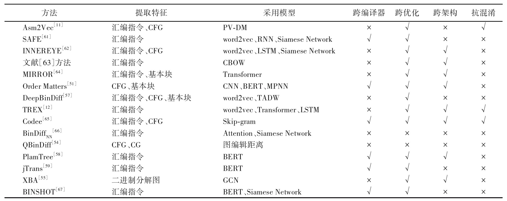

# BCSD0-START

## Part0-什么是BCSD

二进制代码相似性检测（BCSD）用于在缺乏源代码时查找漏洞和抄袭，通过动态和静态分析方法进行。动态分析关注运行时的函数特征，而静态分析则从汇编代码中提取特征，但可能产生误报。跨平台BCSD利用不同架构间的语意相似性，而AST提供语义信息，帮助识别不同体系中相似函数


## Part1-现有方法及针对的问题

<figure><figcaption></figcaption></figure>

* 跨编译器
* 跨优化
* 跨架构 **跨平台（本次课题要关注的核心点）**
* 抗混淆


### 跨架构二进制代码区别

跨架构的二进制代码差异来自于不同的硬件架构和指令集。这些差异直接影响到编译出的机器码，进而影响到程序的运行时表现。以下是一些主要的区别：

#### 1. **指令集架构（ISA）** 每种处理器架构使用不同的指令集，这决定了该架构上可用的机器指令类型和格式。例如：

* **x86 与 x86-64**：这两种架构属于同一家族，但 x86-64 支持 64 位运算，而 x86 仅支持 32 位运算。x86-64 还增加了一些新的寄存器和指令，例如在地址计算上有所不同。
* **ARM 与 ARM64**：ARM32 和 ARM64（也称为 AArch64）都有显著不同的指令集。ARM64 支持更多的寄存器和 64 位操作，而 ARM32 则主要是 32 位操作。
* **MIPS**：MIPS 架构也有自己的指令集，与 x86 或 ARM 完全不同，其中包括 RISC（简化指令集计算机）设计原则。

#### 2. **寄存器集** 不同架构的寄存器数量和用途会有所不同。例如：

* **x86**：有特定用途的寄存器，如 EAX、EBX、ECX、EDX 等等，每个寄存器有其特殊的用途（如累加器、计数器）。
* **x86-64**：在 x86 的基础上增加了更多的寄存器（如 R8-R15）且寄存器的宽度从 32 位扩展到 64 位。
* **ARM**：有 16 个通用寄存器（R0–R15），其中一些是专门的用途寄存器（如 R15 是程序计数器）。
* **ARM64**：扩展到 31 个通用寄存器（X0–X30）。

#### 3. **字节序（Endianness）** 不同的架构可能使用不同的字节序，这影响到数据在内存中的存储顺序。

* **大端序（Big Endian）**：高字节在前，低字节在后。例如，MIPS 默认使用大端序。
* **小端序（Little Endian）**：低字节在前，高字节在后。例如，x86 和 x86-64 架构使用小端序。
* **双字节序**：某些架构（如 ARM 和 PowerPC）支持双字节序，可以在大端序和小端序之间切换。

#### 4. **调用约定（Calling Conventions）** 不同架构有不同的调用约定，这影响函数参数的传递方式、返回值的处理、以及如何管理栈和寄存器。

* **x86**：通常使用 cdecl、stdcall 或 fastcall 等调用约定，每种约定对函数参数和栈管理有不同规定。
* **x86-64**：大多数系统使用统一的 SysV ABI 调用约定，调用者保存寄存器和被调用者保存寄存器的定义更加明确。
* **ARM**：有自己的 ARM EABI（Embedded Application Binary Interface），规定了参数传递和栈布局。

#### 5. **系统调用（Syscalls）及 ABI（Application Binary Interface）** 不同架构和操作系统有不同的系统调用接口和 ABI，这影响到编译输出的二进制代码与操作系统内核的交互方式。

* **Linux x86 与 x86-64**：虽然相似，但 x86-64 使用不同的系统调用号，并且参数传递方式不同（x86 遵循寄存器和栈混合传递，而 x86-64 参数主要通过寄存器传递）。
* **ARM 的 EABI**：定义了类似的系统调用接口，但参数和调用方式有显著不同。


### 实际的例子

以相同的fun函数为例：

```c
int fun(int x) {
    return x * 2;
}
```

x86 架构（32 位）下：

```armasm
fun:
    push    ebp         ; 保存基址指针
    mov     ebp, esp    ; 设置新的基址指针
    mov     eax, [ebp+8]; 将参数 x 载入 eax 寄存器
    add     eax, eax    ; eax = eax + eax，计算 2 * x
    pop     ebp         ; 恢复基址指针
    ret                 ; 返回
```

#### x86-64 架构（64 位）：

```armasm
fun:
    mov     eax, edi    ; 将参数 x 载入 eax（参数在64位系统中通过寄存器传递）
    add     eax, eax    ; eax = eax + eax，计算 2 * x
    ret                 ; 返回
```

arm架构：

```armasm
fun:
    push     {lr}       ; 保存链接寄存器
    add      r0, r0, r0 ; r0 = r0 + r0，计算 2 * x（参数在 r0 寄存器中）
    pop      {lr}       ; 恢复链接寄存器
    bx       lr         ; 分支返回调用者
```

MIPS架构：

```
fun:
    sll     $v0, $a0, 1 ; 将参数 x 左移一个位置，等同于乘以 2
    jr      $ra         ; 返回调用者
    nop                 ; 空操作，确保流水线正确性
```


## Part2-A Survey



> 对比了2019年及之前的BCSD工作（61种方法），筛选方法时：
>
> * 排除了需要访问源代码的方法
> * 排除了对字节码进行操作的方法
> * 我们排除了通过系统调用或OS API调用，仅在程序与其环境的交互上比较相似性的行为方法。&#x20;
> * 排除了将二进制代码视为没有结构的原始字节序列的方法，如文件哈希、模糊哈希和基于签名的方法。需要考虑将原始字节分解为指令的方法。
>
> 关注的方法特征如下：
>
> * Input Comparison：一对一（OO）、一对多（OM）或多对多（MM）
> * Approach Comparison ：相似的（S）、相同的（I）或等效的（E）
> * Input Granularity ：指令（I）、基本块（B）、函数（F）或程序（P）
> * Approach Granularities&#x20;
> * Syntactical similarity&#x20;
> * Semantic similarity&#x20;
> * Structural similarity ：CFG（C）、ICFG（I）、CALLGRAPH（G）和其他自定义图（O）
> * Feature-based&#x20;
> * Machine learning：有监督的（S）或无监督的（U）
> * Locality sensitive hashing&#x20;
> * Cross-architecture&#x20;
> * Static analysis&#x20;
> * Dynamic analysis&#x20;
> * Dataflow analysis&#x20;
> * Normalization
>
> **MARK论文：**
>
> * MULTI-MH：[Cross-Architecture Bug Search in Binary Executable](https://ieeexplore.ieee.org/document/7163056)（第一篇支持跨架构的二进制代码相似检测）2015，CCF-A，技术：位置敏感的哈希（Locality sensitive hashing），CFG分析
> * discovRE: [Efficient Cross-Architecture Identification of Bugs in Binary Code](https://www.ndss-symposium.org/wp-content/uploads/2017/09/discovre-efficient-cross-architecture-identification-bugs-binary-code.pdf)，2016，CCF-A，技术：Feature-based，根据相应控制流图的结构计算函数之间的相似性
> * BinDNN: [Resilient Function Matching Using Deep Learning](https://link.springer.com/chapter/10.1007/978-3-319-59608-2\_29)2016，CCF-C，技术：监督式机器学习，NLP
> * SAFE: [Self-Attentive Function Embeddings for Binary Similarity](https://link.springer.com/chapter/10.1007/978-3-030-22038-9\_15)，2019，CCF-C，技术：无需手工特征提取，NLP，Self-Attention Neural Network
> * GENIUS：[Scalable Graph-based Bug Search for Firmware Images](https://dl.acm.org/doi/10.1145/2976749.2978370)2016，CCF-A，技术：提出CFG图匹配的昂贵开销在IoT领域的缺陷，将CFG进行高维特征向量嵌入，无监督式学习
> * BinGo: Cross-architecture cross-OS Binary Search，2016，CCF-A，技术：“a selective inlining technique to capture the complete function semantics by inlining relevant library and user-defined functions”
> * XMATCH：Extracting Conditional Formulas for Cross-Platform Bug Search，2017，CCF-C，技术：“extract conditional formulas as higher-level semantic features from the raw binary code to conduct the code search”
> * cacompare：Binary Code Clone Detection Across Architectures and Compiling Configurations，2017，CCF-B技术：识别每个二进制函数的参数和间接跳转目标，并模拟这些函数的执行以提取有助于测量函数相似性的语义签名
> * GITZ：[Similarity of Binaries Through Re-optimization](https://dl.acm.org/doi/10.1145/3062341.3062387)，2017，CCF-A，技术：
>   1. 分割程序片段。将程序分解为strand，即基本块的数据流片段，作为相似性比较的基本单元\
>      **strand:A strand is the list of all of the instructions from the basic block that affect the computation of a specific value.**
>   2. 通过重新优化找到等价的代码片段。通过在strands上重新进行编译优化器的优化过程，将代码片段引入新的规范化形式，从而在后续能够**识别语法上不同但语义等价的strands**。
>   3. 建立代码相似性。爬取部分语料库生成一个统计框架，来评估每一个strand在整个程序中的重要程度。
> * αDiff: [Cross-version Binary Code Similarity Detection with DNN](https://dl.acm.org/doi/10.1145/3238147.3238199)，2018，CCF-A，技术：使用DNN直接提取函数内特征（intra-function feature），无需手工特征工程，再进一步分析函数调用图（function call graph），提取功能和模块间特征（inter-function and inter-module features）
> * VulSeeker: [A Semantic Learning Based Vulnerability Seeker for Cross-platform Binary](https://dl.acm.org/doi/10.1145/3238147.3240480)，2018，CCF-A，技术：首先构建标记的语义流图，并提取基本块特征作为两者的数值向量。然后，通过将基本块的数值向量馈送到定制的语义感知DNN模型，生成整个二元函数的嵌入向量。最后，基于余弦距离测量两个二元函数的相似性。
> * A Cross-Architecture Instruction Embedding Model for Natural Language Processing-Inspired Binary Code Analysis，2019
> * INNEREYE：[Neural Machine Translation Inspired Binary Code Similarity Comparison beyond Function Pairs](https://www.ndss-symposium.org/wp-content/uploads/2019/02/ndss2019\_11-4\_Zuo\_paper.pdf)，2019，CCF-A，技术：NLP——将指令视为单词，将基本块视为句子，并提出了一种新颖的跨（汇编）语言深度学习方法


### OVERVIEW

二进制代码编译流程：

source code-----> compiler and optimization -----> linker ------> excutable or library

<figure><figcaption></figcaption></figure>

BCSD方法的三个特征

* 比较的类型：相同、相似、等效 “ identical, similar, equivalent ”
  * identical：they have the same syntax, i.e., the same representation
  * equivalent：have the same semantics, i.e., if they offer exactly the same functionality（mov %eax,$0 and xor %eax,%eax）
  * similar：their syntax, structure, or semantics are similar
* 被比较的二进制代码的粒度（granularity）：指令、基本块、函数  “instructions, basic blocks, functions”
* 正在比较的输入块的数量：一对一、一对多、多对多


