# Crypto and application-1

## CH1 密码技术概述

#### 密码学学科特点&密码学研究的主要内容

是信息的机密性、完整性、鉴别和不可抵赖性等信息安全问题相关的一门学科

<figure>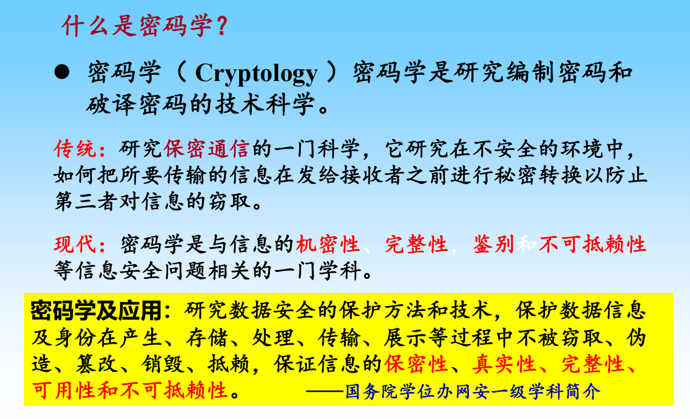<figcaption></figcaption></figure>

<figure><figcaption></figcaption></figure>

#### 密码系统的安全条件

理论不可破译和实际不可破译

Kerckhoffs原则（柯克霍夫斯原则）：一切秘密寓于密钥之中

* **密码体制即使不是理论上不可破译的，也应该是实际不可破译的**
* **密码体制的泄露不应该给保密通信者带来麻烦**

**一个提供机密性服务的密码系统是实际可用的**，必须满足的基本要求：

①系统的保密性不依赖于对加密体制或算法的保密，而仅依赖于密钥的安全性。 “一切秘密寓于密钥之中”是密码系统设计的一个重要原则。

②满足实际安全性，使破译者取得密文后在有效时间和成本范围内，确定密钥或相应明文在计算上是不可行的。

③加密和解密算法应适用于明文空间、密钥空间中的所有元素。

④加密和解密算法能有效地计算，密码系统易于实现和使用。

<figure>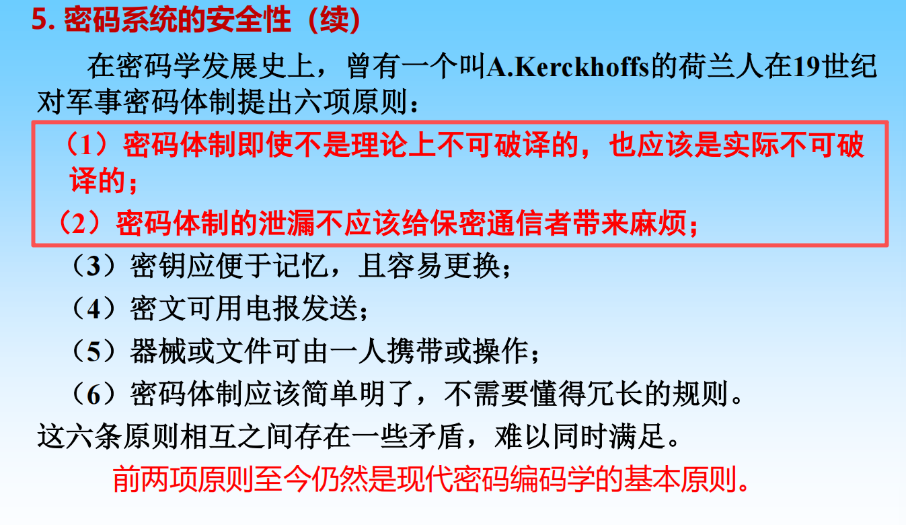<figcaption></figcaption></figure>

<figure>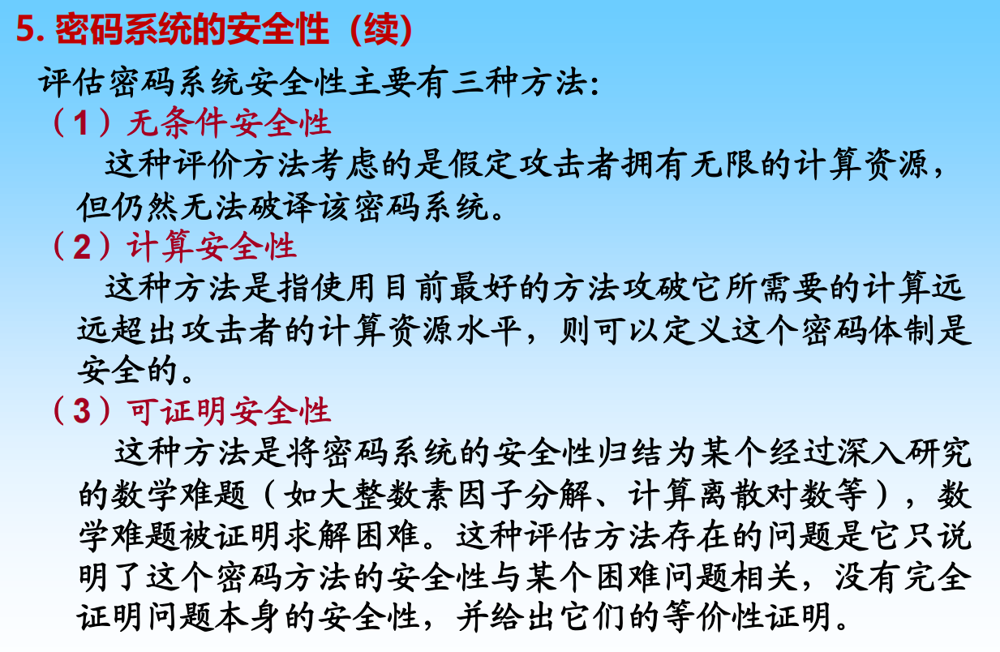<figcaption></figcaption></figure>

<figure>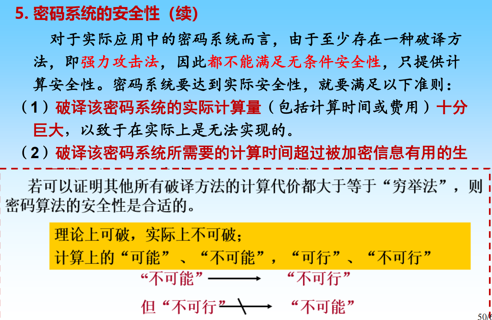<figcaption></figcaption></figure>

#### 两种保密通信模型

<figure>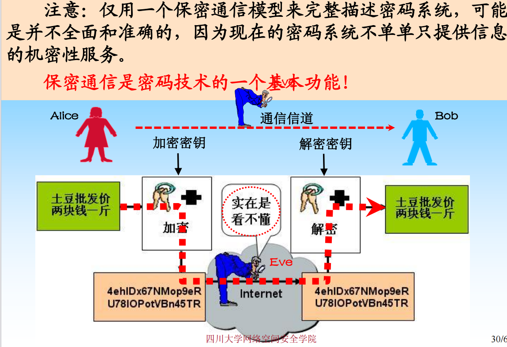<figcaption></figcaption></figure>

<figure>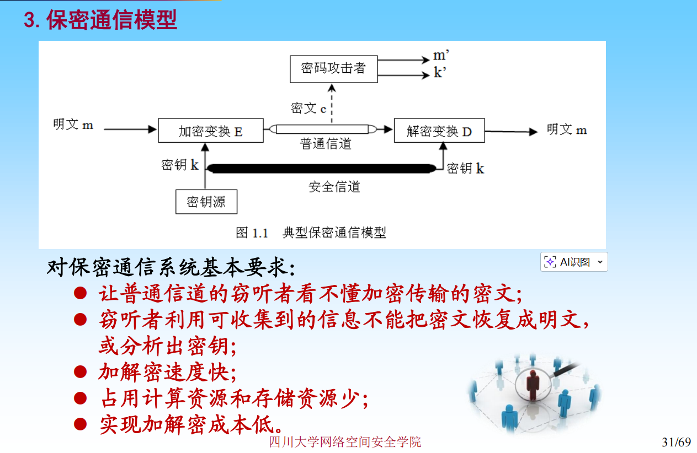<figcaption></figcaption></figure>

<figure>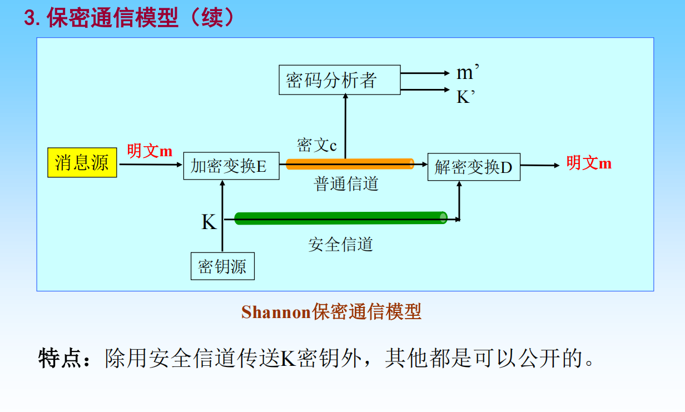<figcaption></figcaption></figure>

<figure>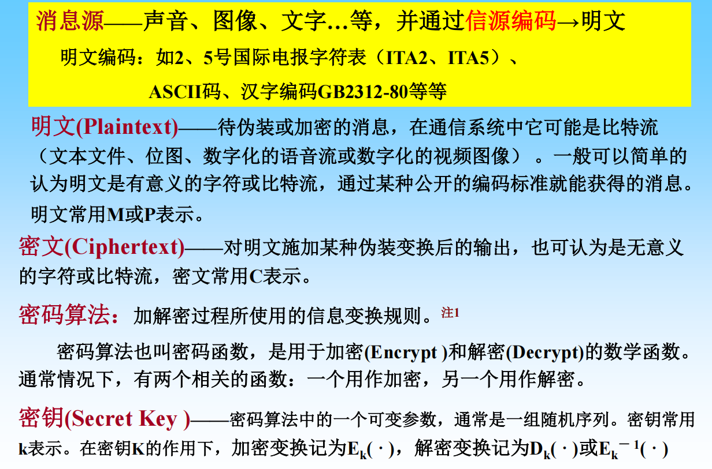<figcaption></figcaption></figure>

#### 对密码系统的两种攻击类型：主动攻击与被动攻击

所谓的被动式攻击意指入侵者（非法）**取得信息资产的存取权限，但是并未对其内容进行窜改**。主要的攻击方式有以下两种：

1. **窃听**（Eavesdropping）：窃听是指入侵者针对档案或通信内容进行监控。最常见的例子是于视频中时常出现的电话监听与网络监听等等。
2. **通信分析**（Traffic Analysis）：流量分析是针对网络通信的流量、内容、以及行为等等进行分析，透过通信内容或者流量的分析可以获得目标网络可观的数据，如：服务器位址、通信模式等等。

所谓的主动式攻击意指入侵者**针对档案或通信内容进行伪造或修改**，可能为以下四种攻击型式之一或是采取混合方式进行：

1. **伪装**（Masquerade）：伪装是指攻击者欺骗认证系统，非法取用系统资源。例如利用社交工程法骗取，或者利用网络窃听的方式取得密码后登入系统。
2. **回放**（Replay）：回放是指攻击者将从网络上截取的某些通信内容（如认证信息）重新发送，以欺骗服务器认证机制。常见的实例如早期Windows网络芳邻采用哈希方式（Hash Function）进行密码的加密，入侵者若能截取获得编码后的密码内容，可以利用重送一次的方式取得系统登入的授权。
3. **信息窜改**（Message Modification）：信息窜改指攻击者针对网络通信的内容进行删增或者更动。通信劫夺（Session Hijacking）利用TCP/ IP网络通信的弱点，抢夺合法使用者的通信频道，进而获得系统的操作权限，这种方式为信息窜改的一个实例。
4. **服务阻绝**（Denial of Service）：服务阻绝大概是大家最耳熟能详的攻击方式，攻击者透过各种可能的方法（ICMP flooding、SYN Flooding、Mail Bomb）等等方式使得使用者与管理者无法取得系统资源及服务。

#### 密码分析攻击的主要类型：

根据密码分析者对明文、密文等数据资源的掌握程度可以分为四类分析攻击：

<figure>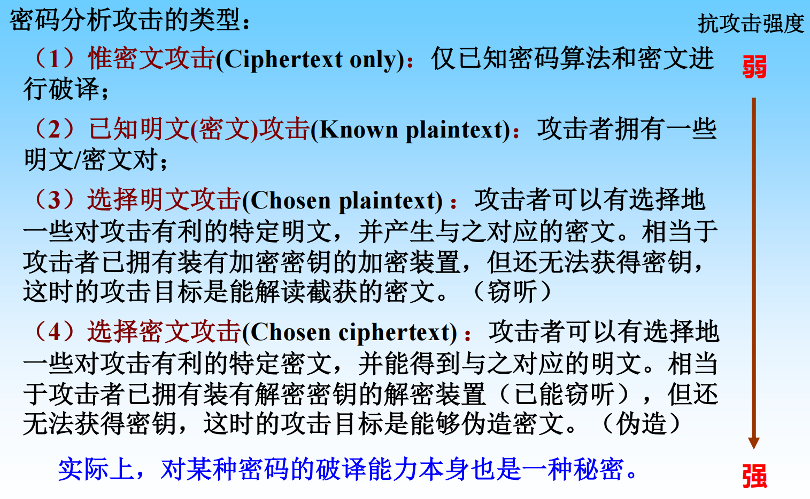<figcaption></figcaption></figure>

<figure>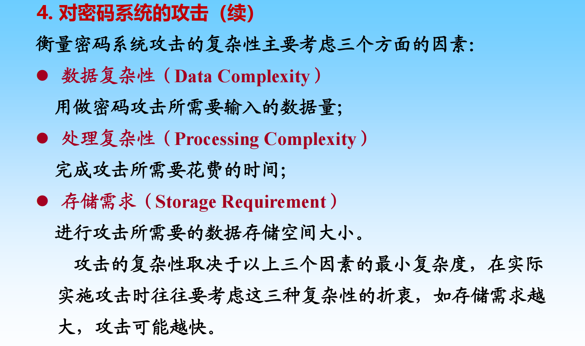<figcaption></figcaption></figure>

#### 密码算法的分类

*

    <figure>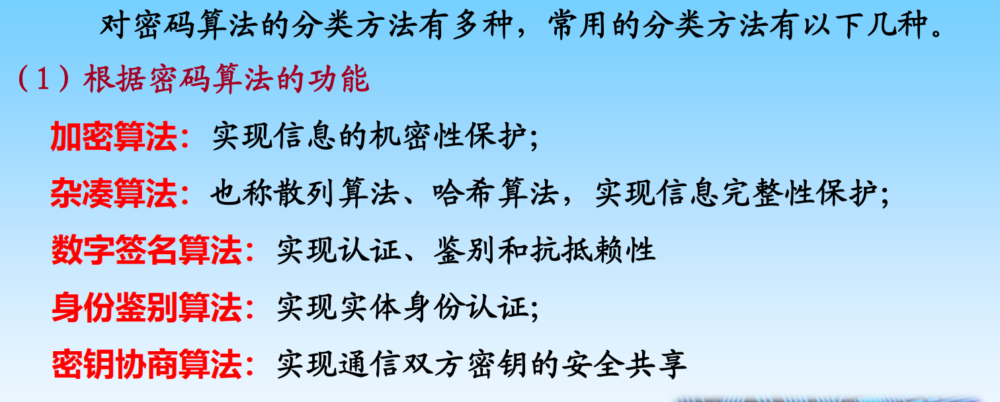<figcaption></figcaption></figure>
*

    <figure>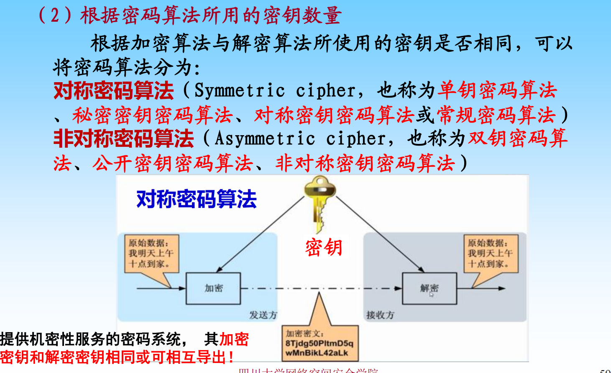<figcaption></figcaption></figure>
*   &#x20;

    
<figure>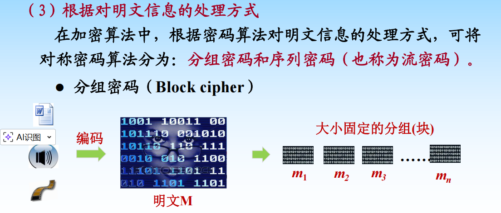<figcaption></figcaption></figure>

    <figure>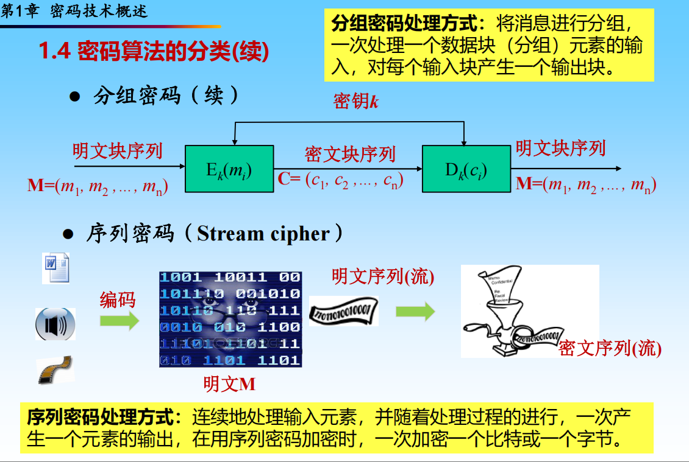<figcaption></figcaption></figure>
*

    <figure><figcaption></figcaption></figure>

#### 确定性和非确定性密码算法

**确定性密码**：在给定**相同的密钥和相同的明文**时，算法每次运行都会产生**完全相同的密文**，整个过程不引入随机因素

C = Enc(K, M)

**（1）无随机性：**&#x7B97;法不使用随机数或随机填充，输出结果完全由输入决定。

**（2）可重复性强：**&#x540C;一输入在任何环境下加密结果一致，便于调试、测试和结果验证。

**（3）结构简单，实现成本低：**&#x65E0;需安全随机数生成器（CSPRNG），实现复杂度相对较低。

**（4）安全性依赖密钥而非随机性：**&#x5728;现代安全模型下，其安全性通常较弱，容易泄露明文模式，

* **明文模式泄露**：相同明文 → 相同密文
* **易受字典攻击、频率分析攻击**
* **通常不满足 IND-CPA（选择明文攻击下的不可区分性）**

例如：（1）古典密码（凯撒密码、维吉尼亚密码）（2）分组密码的 ECB 模式（如 AES-ECB）（3）确定性哈希（在固定输入下输出固定）

非确定性密码算法（**概率密码算法）：概率密码算法**在加密过程中引入**随机性**，即使在使用相同密钥和相同明文的情况下，不同加密过程也可能产生**不同的密文：**

$$
C=Enc(K,M;r)
$$

引入随机性（Nonce / IV / Salt）；安全性更高，但实现更复杂；**满足现代安全定义，**&#x901A;常可满足：IND-CPA，在认证加密中甚至满足 IND-CCA

* 防止重放分析
* 防止字典攻击
* 防止流量模式泄露
* 可抵御大多数已知的被动攻击模型

例如：（1）RSA-OAEP（概率公钥加密）（2）ElGamal 加密（3）AES-CBC（使用随机 IV）（4）带随机 salt 的密码哈希（如 bcrypt、scrypt）

#### 对称密码体制和非对称密码体制

<figure><figcaption></figcaption></figure>

#### 针对不同功能密码算法的攻击目标

<figure><figcaption></figcaption></figure>

| 密码功能      | 核心安全目标    | 攻击目标             |
| --------- | --------- | ---------------- |
| 对称/公钥加密   | 机密性       | 明文恢复 / 密钥恢复 / 区分 |
| MAC       | 完整性       | 伪造合法 MAC         |
| 哈希函数      | 抗碰撞 / 抗原像 | 原像 / 二次原像 / 碰撞   |
| 数字签名      | 不可否认      | 伪造签名             |
| 密钥交换      | 安全建密      | 会话密钥恢复 / MITM    |
| PRG / PRF | 不可区分      | 区分真随机            |

## CH1-2 古典密码

#### 替换密码和置换密码

替换密码：

**（1）单表替换密码（Monoalphabetic）**

* 同一个明文字母始终被替换为同一个密文字母
* 例如：凯撒密码 $$c=(p+k) mod 26$$

**（2）多表替换密码（Polyalphabetic）**

* 同一明文字母在不同位置可能被替换为不同密文字母
* 例如：维吉尼亚密码

<figure>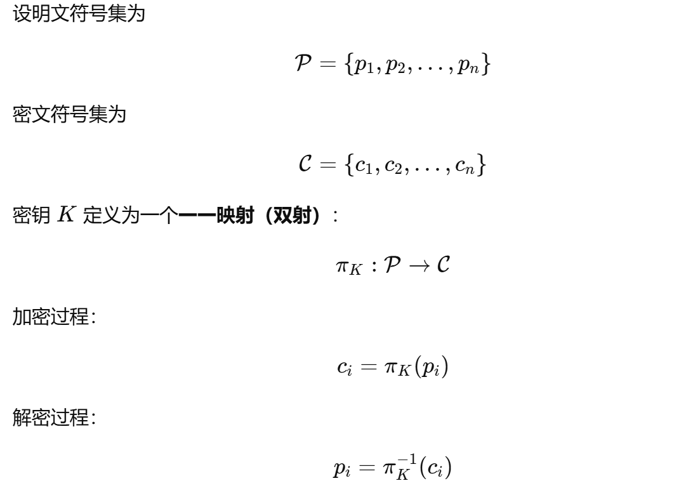<figcaption></figcaption></figure>

<figure><figcaption></figcaption></figure>

置换密码：

* 栅栏密码（Rail Fence Cipher）
* 列置换密码（Columnar Transposition Cipher）

<figure>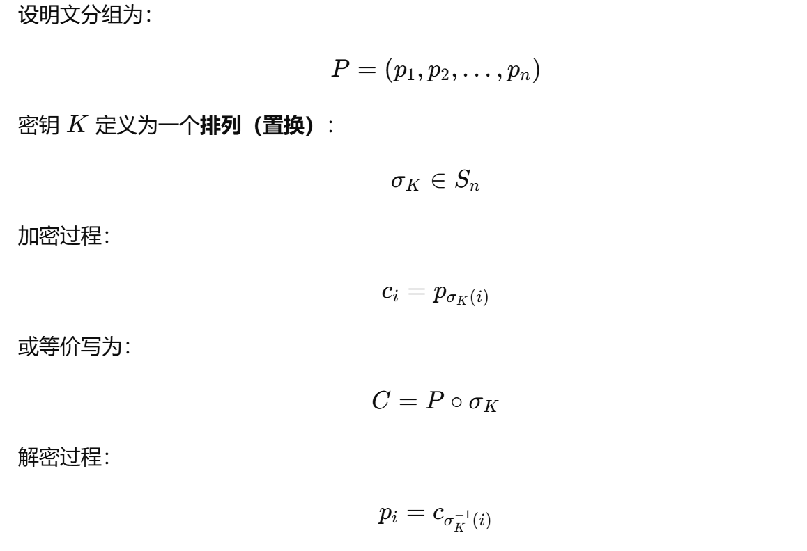<figcaption></figcaption></figure>

<figure>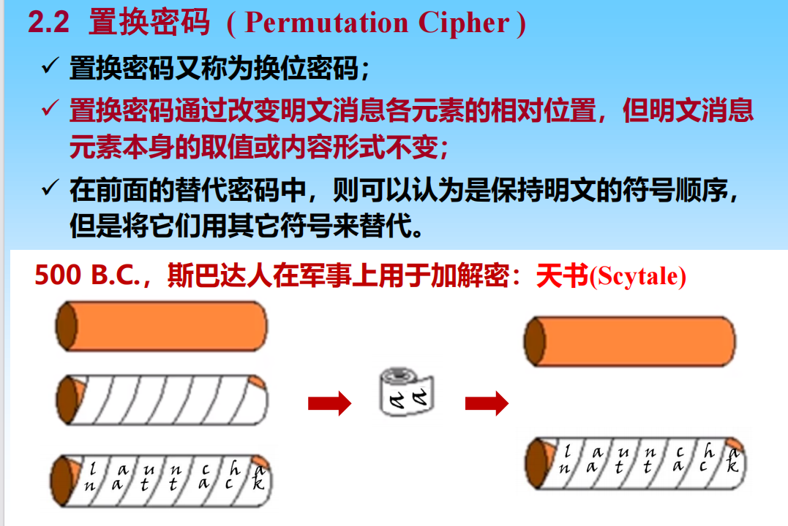<figcaption></figcaption></figure>

| 对比维度    | 替换密码   | 置换密码 |
| ------- | ------ | ---- |
| 操作对象    | 符号     | 位置   |
| 是否改变字符  | 是      | 否    |
| 是否改变顺序  | 否      | 是    |
| 是否保持频率  | 是（单表）  | 是    |
| 抗统计攻击能力 | 弱      | 弱    |
| 密钥本质    | 映射（双射） | 排列   |

现代分组密码并不单独使用其中之一，而是通过**反复组合**：

* **替换（Substitution）** → 提供混淆（Confusion）
* **置换（Permutation）** → 提供扩散（Diffusion）

这正是 **Shannon 提出的“混淆与扩散原则”**，也是 SPN（Substitution–Permutation Network）结构的理论基础。

#### 凯撒密码、仿射密码、单表替换密码、多表替换密码的概念与特点

* 凯撒密码（k=3时的一般单表替代密码）
  * $$\mathrm{E}=\left\{E: Z_{26} \rightarrow Z_{26}, E_{\mathrm{k}}(m)=m+k(\bmod 26) \mid m \in M, k \in K\right\}$$
  * $$\mathrm{D}=\left\{D: Z_{26} \rightarrow Z_{26}, D_{\mathrm{k}}(m)=c-k(\bmod 26) \mid c \in C, k \in K\right\}$$
  * 密钥空间极小（仅 25 种有效密钥）
  * 完全保持明文字母的频率分布
  * 极易被穷举攻击和频率分析破解
  * 仅具教学和历史意义
* 仿射密码（Affine Cipher）
  * $$c= E_ {k}  (m)= k_{1}m+ k_ {2} (mod26)$$
  * $$m=D_k\left(c\right)=k_1^{-1}\left(c\text{一}k_2\right)\left(\mathrm{mod~}26\right)$$
  * 密钥空间（ $$K=\{(k_1,k_2)|k_1,k_2\in Z_{26},\gcd(k_1,26){=}1\}$$）比凯撒密码大，但仍有限
  * 保持明文字母频率分布
  * 易受已知明文攻击与频率分析
  * 线性结构明显，安全性较弱
* 单表替换密码
  * 整个加密过程中使用**同一张固定的替换表**，将每个明文字母替换为唯一的密文字母
  * 密钥空间为 26!，理论上很大
  * 明文字母与密文字母存在固定一一对应关系
  * 严格保持字母频率和统计特征
  * 在自然语言下可被频率分析、模式分析破解
* 多表替换密码
  * 多表替换密码在加密过程中**周期性或非周期性地切换多张替换表**，使同一明文字母在不同位置可能映射为不同密文字母
  * 显著削弱单一字母频率特征
  * 抗频率分析能力强于单表替换密码
  * 安全性依赖密钥长度与使用方式
  * 仍可通过 Kasiski 检验、Friedman 检验等方法破解

#### 维吉利亚(Vigenère)、 Playfair算法计算方法和特性

<figure>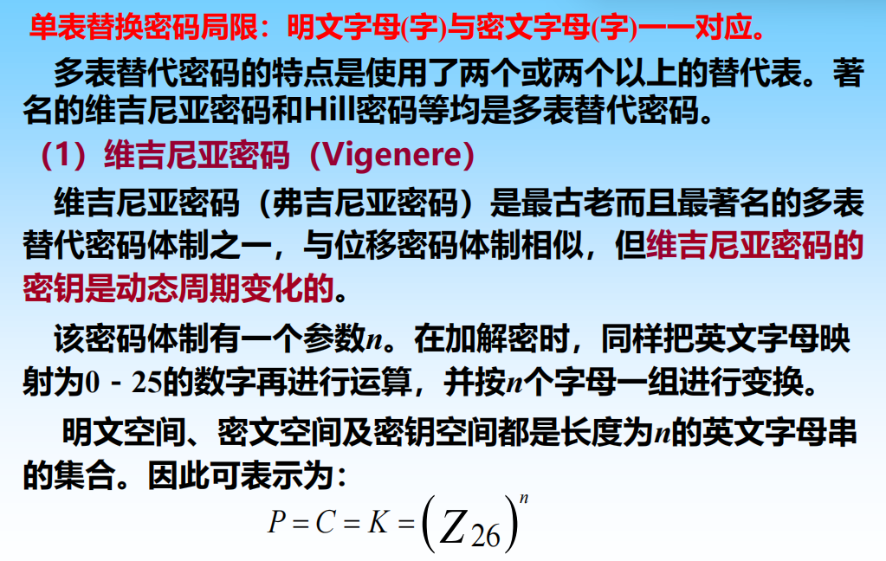<figcaption></figcaption></figure> <figure>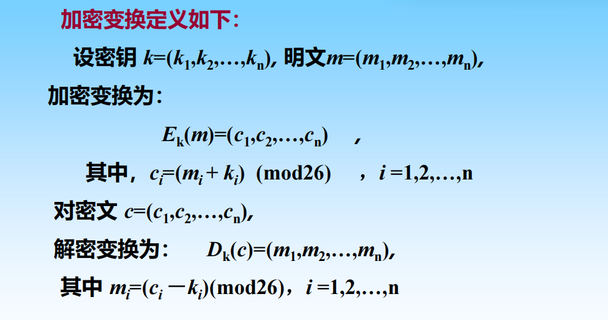<figcaption></figcaption></figure>

<figure>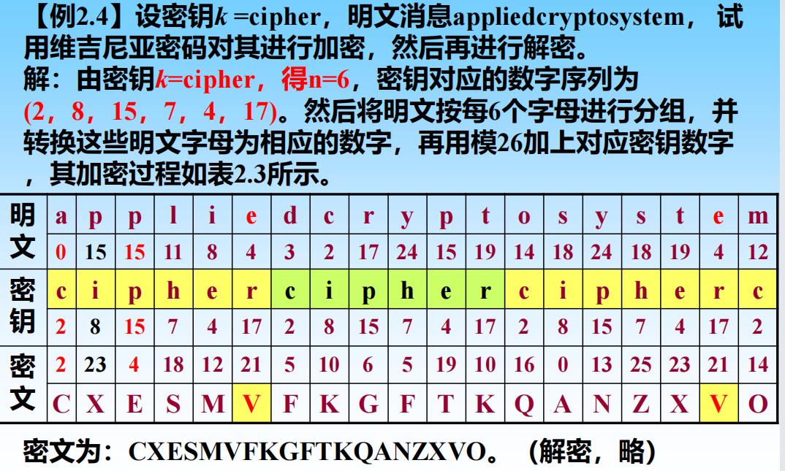<figcaption></figcaption></figure> <figure><figcaption></figcaption></figure>

<figure>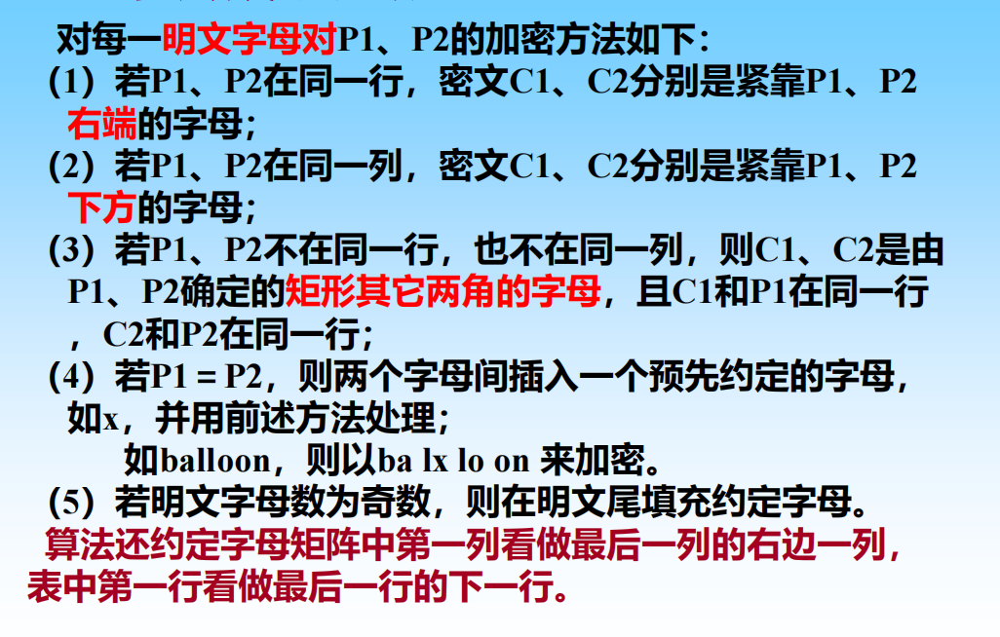<figcaption></figcaption></figure> <figure>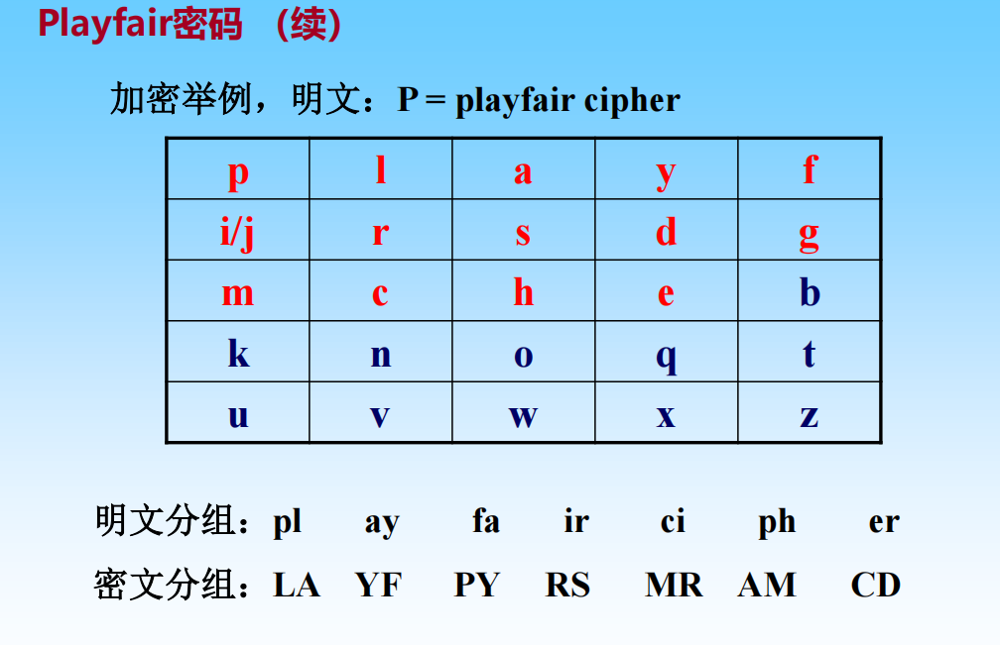<figcaption></figcaption></figure>

<figure>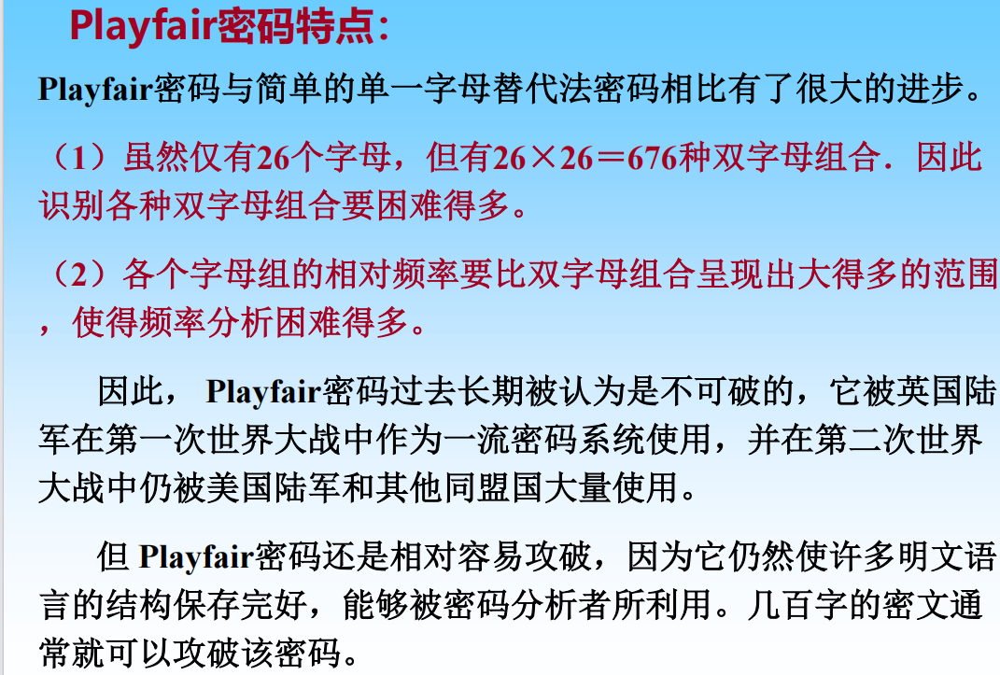<figcaption></figcaption></figure>

#### Hill密码的特性与计算方法

<figure>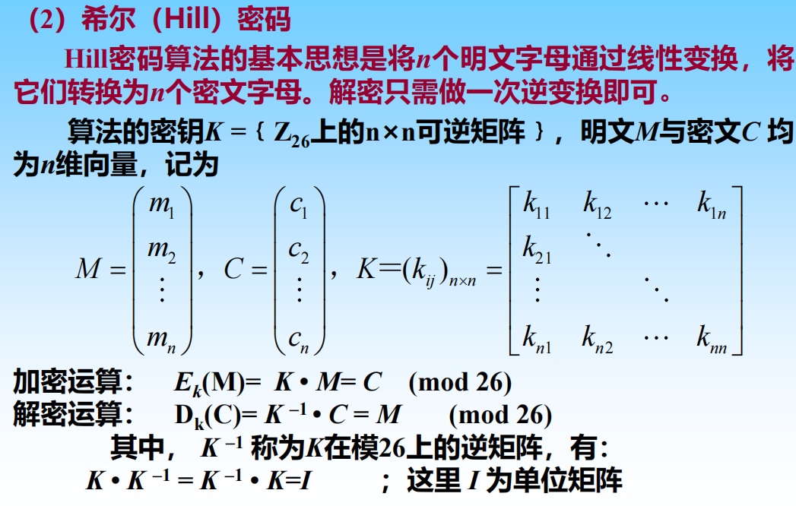<figcaption></figcaption></figure> <figure>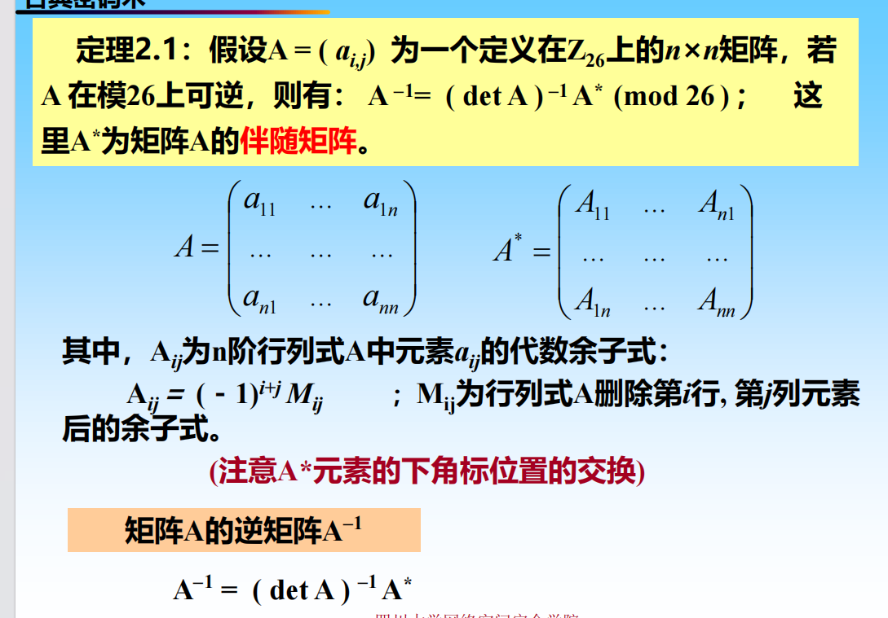<figcaption></figcaption></figure>

<figure>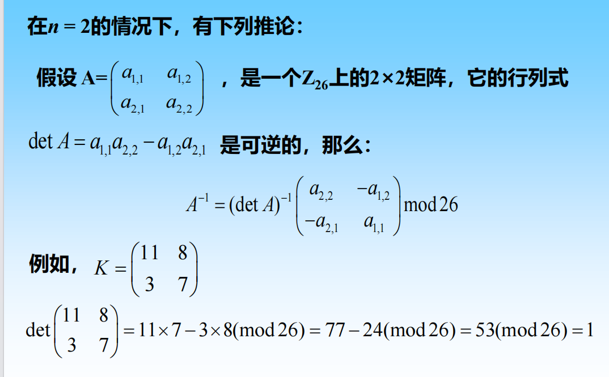<figcaption></figcaption></figure> <figure>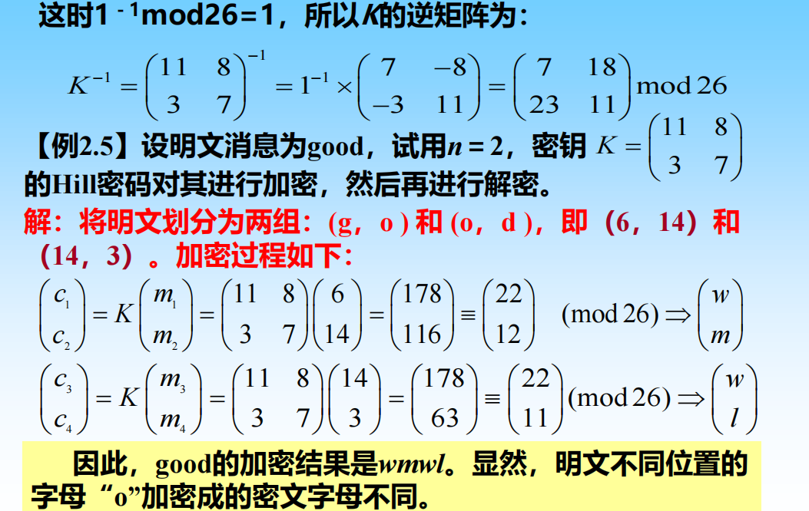<figcaption></figcaption></figure>

<figure>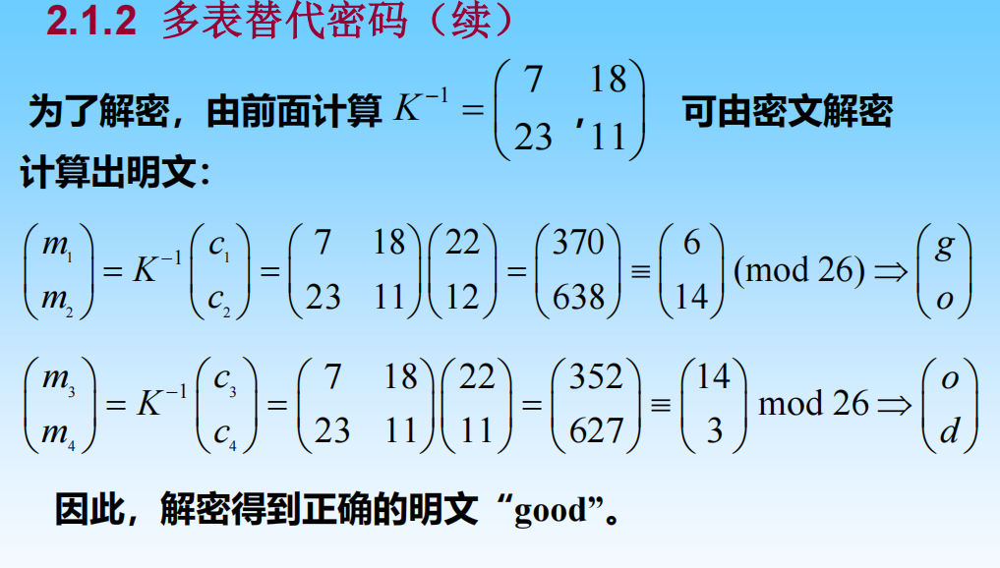<figcaption></figcaption></figure> <figure>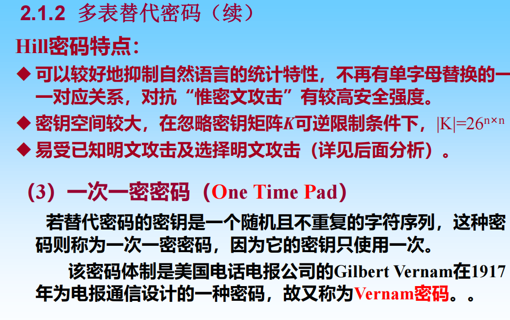<figcaption></figcaption></figure>

#### 转轮机密码、OTP等古典密码算法的原理与特点

**转轮机密码：**&#x8F6C;轮机密码是一类**机电式多表替换密码系统**，其核心思想是通过**多个可旋转的转轮（Rotor）构造一个动态变化的替换表**。

每个转轮本质上是一个固定的单表替换，但随着每次按键操作，转轮发生转动，从而改变整体的替换关系。一个**随时间变化的多表替换密码；**&#x5178;型代表：**Enigma 密码机**。

工作机制

* 明文输入一个字母
* 信号依次通过多个转轮（正向替换）
* 经反射器（Reflector）反射
* 再反向通过转轮
* 输出密文字母
* 每加密一个字符，至少有一个转轮转动

主要特点

* 同一明文字母在不同位置会被映射为不同密文字母
* 具备较强的混淆能力，远强于传统多表替换密码
* 密钥空间较大（转轮选择、初始位置、插线板设置）
* 仍存在结构性弱点（如自反性、不映射为自身等）
* 可被利用操作失误和统计规律进行系统性破译

**一次一密** One-Time Pad, OTP

**基本原理：**&#x4E00;次一密是一种基于**模加或异或运算**的流加密体制，其核心思想是：**使用一段真正随机、与明文等长、且只使用一次的密钥进行加密。**

常见形式（以比特串为例）：

加密： $$c = p \oplus k$$

解密： $$p = c \oplus k$$

**理论安全性：**&#x4F;TP 在严格满足以下条件时，具备**信息论安全性（Perfect Secrecy）**：

1. 密钥完全随机
2. 密钥长度 ≥ 明文长度
3. 密钥只使用一次
4. 密钥绝对保密

这是**唯一被严格证明具有完全保密性的加密方案**（Shannon 定理）。

**主要特点**

* 在理论上不可破解（即使无限计算能力）
* 不泄露任何关于明文的统计信息
* 密钥管理成本极高
* 一旦密钥复用，安全性彻底失效
* 实际系统中难以大规模部署

## CH2 香农保密理论基础

#### 密码体制的数学模型

<figure>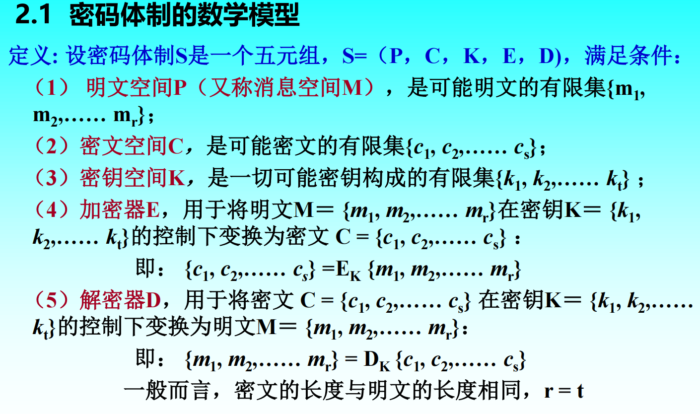<figcaption></figcaption></figure> <figure>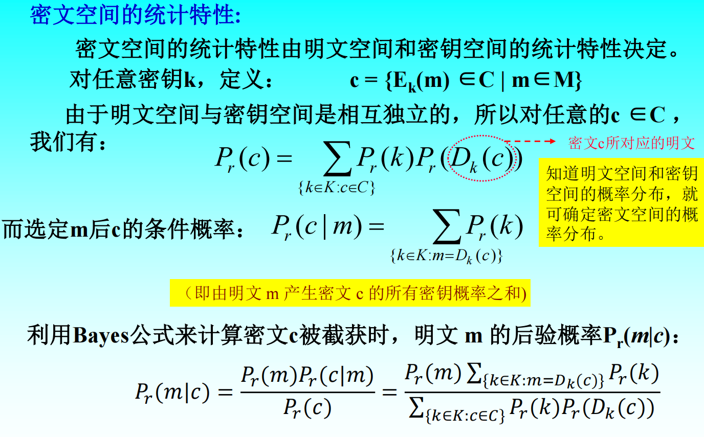<figcaption></figcaption></figure>

