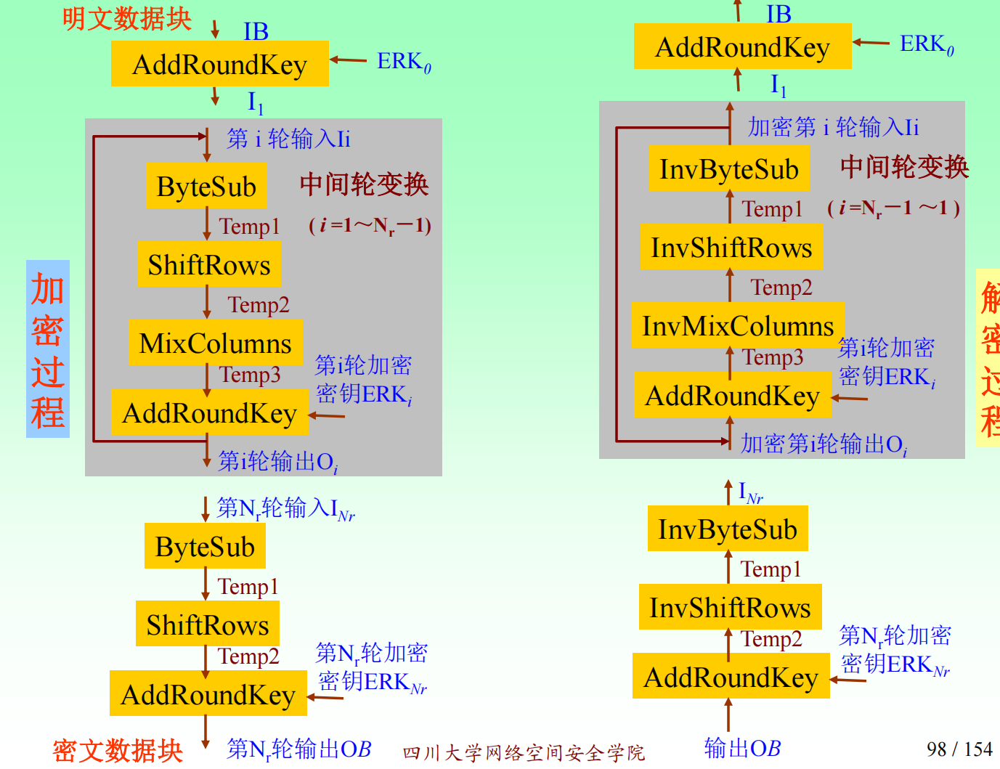
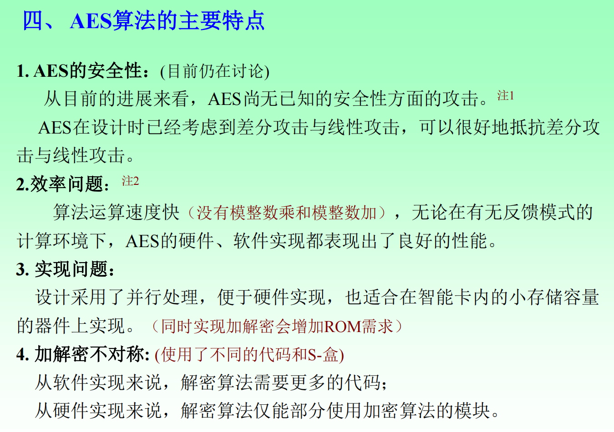
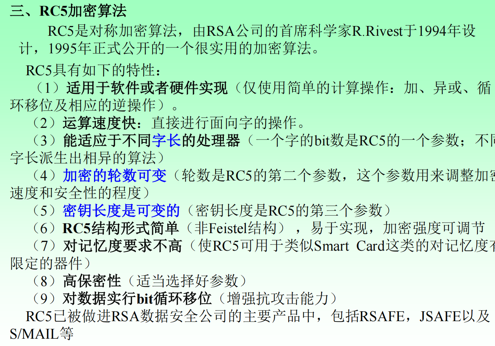
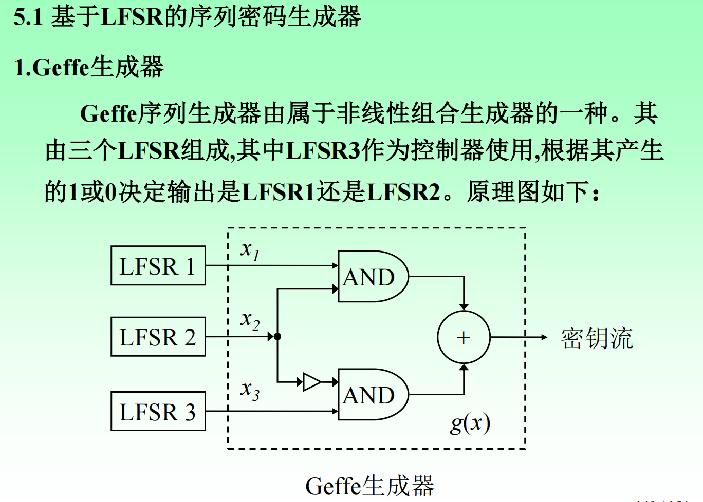
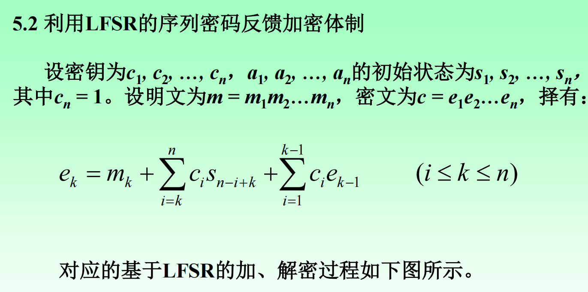
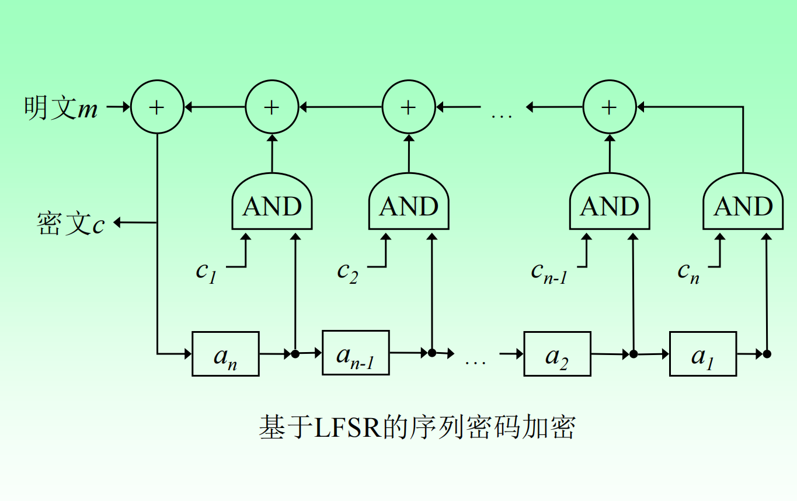
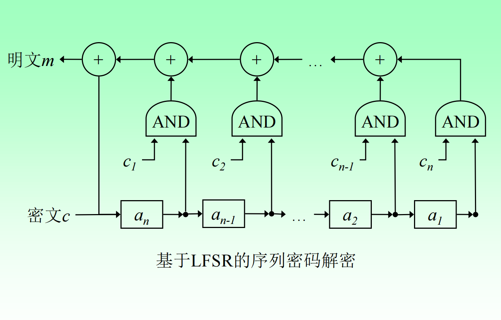

# Crypto and application-2

$$GF(2) 和GF(2^8 )$$ 上的多项式运算(模2加法和乘法 $$\oplus$$ )是AES的基本运算

AES的基本函数:

* 字节替代 ByteSub()：是一个关于字节的非线性变换，如果状态中的一个字节为xy，则S
  \
  盒中第x行第y列的字节就是subBytes( )的输出，subBytes( )运算就是查表运算。
* 行移位变换 ShiftRows()：第i行循环左移i字节（i=0，1，2，3）
* 列混合变换 MixColumns()：在列混合变换中，每一列所表示的多项式将乘以一个固定的多项式a(x)=( 03 01 01 02)，模多项式为 $$x^4 + 1$$，解密时使用逆多项式： $$a (x)^{-1} =\{0b\}x^3 + \{0d\}x^2 + \{09\}x + \{0e\}$$
* 轮密钥加法 AddRoundKey():简单地将输入阵列和一个轮密钥进行简
  单的按位异或（模2加）运算，轮密钥按顺序取自扩展密钥

<figure><figcaption></figcaption></figure>

<figure><figcaption></figcaption></figure>

双密钥三重 DES 在第二步采用解密算法的主要意义在于：

当 **两把密钥取相同值** $$K_1 = K_2 = K$$时： $$C = E_K\bigl(D_K(E_K(M))\bigr) = E_K(M)$$，三重 DES **自动退化为单 DES，**&#x4ECE;而实现与传统 DES 的向后兼容；**同时该设计不降低安全性，便于硬件和系统实现，**

IDEA通过三种基本运算(16bit)实现密码算法的扰乱和扩散特性。(没有位置换)，其中模乘算法是模 $$2^ {16}+1$$的16bit乘法，先进行16bit × 16bit=32bit的运算，然后用 $$2^ {16}+1$$取模
\
求余。的三种基本运算特点：**任意两个运算都不满足分配律和结合律**

IDEA的解密过程和加密过程基本相同，但子密钥（轮密钥）
的选取不同 ，选择加密子密钥的对&#x5E94;**“逆元”**

<figure><figcaption></figcaption></figure>

RC5实际上是由三个参数决定的一组加密算法：

* w：基本字块的bit数大小。RC5加密的基本单位为2个字块 ，取值：16, 32, 64
* r：迭代运算轮数，取值：1, …,255
* b：密钥字节的长度（8-bit bytes)，取值：1, …,255

RC5加密明文块的长度为32，64，128 bits。并且对应同样长
度的密文。密钥长度为从0到2040 bits。
一个特定的RC5表示为：RC5-w/r/b（例如Rivest建议使用的标注RC5为RC5-32/12/16）RC5的加解密算法不完全
相同。在这一点上不同于DES、
IDEA等密码算法

整个加密使用了下述3个基本运算和它们的逆运算：

* 模 $$2 ^w$$加法运算，表示为 $$+$$；
* 逐比特异或运算，表示为 $$\oplus$$；
* 字的循环左移运算：字x循环左移y比特，表示为：
  &#x20;$$x<<<y$$

RC6是RC5的进一步改进。
像RC5那样，RC6实际上是利用数据的循环移位

#### 序列密码的特点

分组密码以一定大小的分组作为每次处理的基本单元，
而序列密码则以一个元素（如一个字母或一个比特）作为基
本的处理单元。

序列密码使用一个随时间变化的加密变换，具有转**换速
度快、低错误传播**的优点，**硬件实现电路更简单**；其缺点是：
**低扩散**（意味着混乱不够）、**插入及修改的不敏感性**。

分组密码使用的是一个不随时间变化的固定变换，具有
扩散性好、插入敏感等优点；其缺点是：加密处理速度慢、
存在错误传播。

同步序列密码的特点：

1. 无错误传播
   ：同步序列密码各符号之间是真正独立的。因此，一个密
   文传播错误只影响一个符号，不会影响到后继的符号。
2. 有同步要求：在同步序列密码中，发送方和接收方必须保持同步，用
   同样的密钥作用在同样的位置上，接收方才能正确的解密。通信中丢失或增加了一个密文字符，则收方将一直错误，直
   到重新同步为止

自同步序列密码的特点：

1. 自同步：自同步的实现依赖于密文被删除或插入，因为解密只取
   决于先前固定数量的密文字符。自同步序列密码在同步丢失
   后能够自动重新建立正确的解密，只有固定数量的明文字符
   不能被恢复
2. 有限的错误传播：自同步序列密码的状态取决于t个已有的密文字符，
   如果一个密文字符在传输过程中被修改，则解密时最多影响
   到后续t个字符的解密恢复，会发生有限的错误传播

#### 反馈移位寄存器的状态变化、输出序列计算方法与过程

设反馈移位寄存器长度为n，其在时刻t的状态可表示为： $$\mathbf{s}(t) = \bigl(s_1(t), s_2(t), \ldots, s_n(t)\bigr)$$

线性反馈移位寄存器（LFSR）的反馈位由寄存器中若干位模 2 加法得到： $$f(t) = c_1 s_1(t) \oplus c_2 s_2(t) \oplus \cdots \oplus c_n s_n(t)$$

在每一个时钟周期：

1. 所有寄存器内容整体移位一位
2. 新输入位由反馈函数生成
3. 末端寄存器的内容作为输出（或指定某一位作为输出）

若采用**左移结构**，则：

$$
\begin{cases} s_1(t+1) = f(t) \\ s_2(t+1) = s_1(t) \\ \vdots \\ s_n(t+1) = s_{n-1}(t) \end{cases}
$$

LFSR 的状态转移可以写成矩阵形式： $$\mathbf{s}(t+1) = \mathbf{s}(t) \cdot \mathbf{A}$$，其中 $$\mathbf{A}$$ 为 n×n 的状态转移矩阵（定义在 GF(2)上）LFSR 输出序列满足线性递推关系： $$z(t+n) = c_1 z(t+n-1) \oplus c_2 z(t+n-2) \oplus \cdots \oplus c_n z(t)$$，这是 LFSR 的核心性质

#### 线性/非线性反馈移位寄存器的结构与特点，M序列概念

**线性反馈移位寄存器（LFSR）**

* 反馈函数为**线性函数**
* 通常采用模 2 加法（异或）： $$f(t) = c_1 s_1(t) \oplus c_2 s_2(t) \oplus \cdots \oplus c_n s_n(t)$$
* 对应一个**特征多项式**： $$p(x) = x^n + c_1 x^{n-1} + \cdots + c_{n-1}x + c_n$$

**非线性反馈移位寄存器（NLFSR）**

* 反馈函数为**非线性布尔函数**
* 包含与、或、非、乘积项等： $$f(t) = g(s_1(t), s_2(t), \ldots, s_n(t))$$，其中 $$g(\cdot)$$ 为非线性函数

<table><thead><tr><th width="138.066650390625">对比维度</th><th>LFSR</th><th>NLFSR</th></tr></thead><tbody><tr><td>反馈函数</td><td>线性（异或）</td><td>非线性布尔函数</td></tr><tr><td>数学模型</td><td>线性递推、多项式</td><td>难以统一建模</td></tr><tr><td>周期分析</td><td>明确、可控</td><td>依赖具体设计</td></tr><tr><td>安全性</td><td>较弱</td><td>较强</td></tr><tr><td>实现复杂度</td><td>低</td><td>较高</td></tr><tr><td>典型应用</td><td>m 序列、扩频</td><td>密码流生成</td></tr></tbody></table>

M 序列（最大长度序列）：由 n **级 LFSR** 在**本原特征多项式**和**非零初始状态**下产生的、周期达到最大值的二进制序列。即周期 $$T=2^n−1$$（这里的-1是说初始不能为全0），周期达到理论最大值，M 序列生成必须满足：

1. 使用 n 级 LFSR
2. 特征多项式为 **GF(2) 上的本原多项式（**&#x5E38;数项为 1 是**本原多项式的必要条件之一）**
3. 初始状态不为全零

M序列特点：

* **平衡性：**&#x5728;一个周期内，1 的个数比 0 多 1
* **游程分布性**：各长度游程数量满足特定统计规律
* **自相关性好**：除零移位外，自相关值接近常数、

不同阶数的本原多项式：
\
（1, 0）（2, 1, 0）（3, 1, 0）（9, 4, 0）(4, 1, 0)（10, 3, 0）
（12, 6, 4, 1, 0）（17, 3, 0）（24, 4, 3, 1, 0）（31, 3, 0）
（32, 7, 5, 3, 2, 1, 0）（38, 6, 5, 1, 0）（50, 4, 3, 2, 0）
（65, 18, 0）（68, 9, 0）（151, 43, 0）（160, 5, 3, 2, 0）
（183, 56, 0）（201, 14, 0）（225, 88, 0）（225, 109, 0）
（231, 34, 0）（322, 67, 0）（378, 107, 0）（607, 105, 0）
（1279, 418, 0）

基于线性反馈移位寄存器（LFSR）的序列密码

<figure><figcaption></figcaption></figure> <figure><figcaption></figcaption></figure>

<figure><figcaption></figcaption></figure> <figure><figcaption></figcaption></figure>

#### RC4与WEP密钥恢复攻击原理和方法

RC4 的密钥恢复攻击利用其密钥调度算法中的统计偏差，通过大量样本分析推断密钥；WEP 在此基础上由于 IV 过短且与密钥直接拼接，使 RC4 的弱点被放大，攻击者可通过被动监听和统计分析高效恢复共享密钥。

RC4 是一种流密码，其安全性依赖于密钥调度算法（KSA）生成的初始状态以及随后伪随机生成算法（PRGA）输出的密钥流。然而 RC4 的 KSA 在初始化阶段存在固有的统计偏差，导致密钥字节与初始密钥流之间并非完全独立。具体而言，在若干位置上，密钥流字节 $$Z_i$$ 与密钥字节 $$K_j$$ 之间存在可观测的概率相关性，使得 $$\Pr(Z_i = f(K_j)) > \frac{1}{256}$$

当攻击者能够收集大量使用同一密钥或相关密钥生成的密钥流样本时，就可以通过统计分析逐步恢复密钥，这构成了 RC4 密钥恢复攻击的基本原理。

WEP 的密钥恢复攻击是在 RC4 弱点基础上的协议级放大。WEP 在加密时将一个仅 24 位的初始化向量 IV与长期共享密钥 K 直接拼接，作为 RC4 的实际密钥： $$K_{\text{RC4}} = IV \,\|\, K$$

由于 $$IV$$ 空间过小，在无线通信中不可避免地大量重复，而且不同数据包之间仅 $$IV$$ 不同、主密钥相同，这正好满足 RC4 相关密钥攻击的条件。Fluhrer–Mantin–Shamir（FMS）攻击表明，在某些“弱 IV”下，RC4 KSA 的中间状态会泄露关于密钥字节的偏差信息，使得首字节密钥流 $$Z_1$$与密钥字节 $$K_i$$ 之间存在近似线性关系。攻击者只需被动收集大量数据包，对满足条件的 $$IV$$ 进行统计投票，即可逐字节恢复 WEP 的共享密钥。后续的改进攻击进一步利用更普遍的统计偏差，大幅降低了所需数据量，使得 WEP 在实际环境中可以被快速、可靠地完全破解。

**Q：CFB是否也要求一次一密方式：CFB（Cipher Feedback Mode）并不要求“一次一密”方式。**

CFB 是一种分组密码工作模式，其安全性建立在固定密钥 + 不可预测的初始向量（IV）之上。同一密钥可以用于多次加密，只要每次加密使用不同且不可预测的 IV，就不会破坏其基本安全性。因此，CFB 并不像一次一密（OTP）那样要求密钥只使用一次、且长度必须与明文等长


碰撞概念：如果两个报文M与M’， $$M≠M’$$ ，但它们的散列值相等，即 $$H(M) ＝ H(M’ )$$，那么，我们就把这种现象称为发生了碰撞。
杂凑函数具有**碰撞不可避免性**。


散列函数的基本性质：

1. H能用于任何大小的数据分组；
2. H产生定长输出；
3. 对任何给定的x，H(x)要相对易于计算，使得硬件和软件实现成为实际可行。
4. 单向性质，
   抗原像攻击：对任何给定的散列码m，寻找x使得 $$H(x)＝m$$在计算上是不可行的。
5.
   弱抗冲突：对任何给定的分组x，寻找不等于x的y，使得 $$H(x)=H(y)$$在计算上是不可行的。 也称为**抗第二原像攻击或抗次原像攻击性**
6. 强抗冲突：寻找任何(x,y)对(x≠y)，使得 $$H(x)＝H(y)$$ 在计算上是不可行的。此特性为**抗碰撞性** (collision resistance),有时也称为**强抗冲突性**(strong collision
   &#x20;resistance)。

关系：**若函数抗碰撞，则必然抗第二原像；反之不必然(但在实际密码学哈希函数中通常同时要求)**

* 原像攻击和第二原像攻击的尝试次数大约为 $$2 ^n$$次散列运算
* 碰撞攻击的尝试次数大约为 $$2 ^{n/2}$$次散列运算

## 特殊签名方案

**不可否认签名（Undeniable Signature）**&#x662F;一类**签名有效性无法被第三方独立验证**的数字签名方案。与传统数字签名“任何人都可验证”不同，不可否认签名要求验证过程必须由签名者参与，通过一个交互式协议来完成。其基本思想是：**签名本身并不直接暴露可公开验证的信息**，只有在签名者配合的情况下，验证者才能确认某一消息–签名对是否有效；同样，签名者也可以通过另一交互协议证明某个签名是伪造的。该类签名的安全性主要体现在三点：

* **不可伪造性**，攻击者无法生成有效签名；
* **不可否认性**，签名者不能否认自己生成过的有效签名；
* **不可转移性**，验证结果不能作为证据转交给第三方，从而避免签名被滥用于法律或仲裁场景。不可否认签名常用于需要强隐私控制或避免签名被公开传播的场合。

典型应用是敏感合同签署、隐私文件定向授权

**盲签名（Blind Signature）**&#x662F;一种在**签名者无法获知被签名消息内容**的前提下完成签名的协议。其核心机制是：消息拥有者在提交签名请求前，先**对消息进行“盲化”处理**，得到一个被随机因子掩盖的消息；签名者对该盲消息进行正常签名；随后消息拥有者再去除盲因子，得到对原始消息的合法签名。以 RSA 盲签名为例，盲化过程可表示为 $$m' = m \cdot r^e \bmod n$$，其中 r 为随机盲因子。盲签名的安全性要求包括：

* **正确性**（去盲后签名可正常验证）、
* **不可伪造性**（攻击者不能生成新签名）
* 最关键的**盲性**，即签名者无法将签名结果与其参与过的具体签名请求对应起来。

盲签名被广泛应用于电子现金、匿名投票等需要“可验证但不可追踪”的场景。

**群签名（Group Signature）**&#x89E3;决的是“**群体成员匿名签名，但可追责**”的问题。在群签名系统中，**群内任一成员都可以代表整个群体对消息进行签名，验证者只能确认签名来自该群，而无法识别具体签名者**；同时，系统中存在一个群管理者，在必要情况下可以打开签名，揭示真实签名者身份。其基本结构包括群公钥、成员私钥以及管理者的开启密钥。群签名的安全性目标较为丰富，主要包括：

* **正确性与不可伪造性**、**匿名性**（外部任何人无法区分不同成员生成的签名）、
* **不可关联性**（无法判断两次签名是否来自同一成员）
* **可追踪性**（管理者可以在合法条件下揭示身份）

群签名在匿名认证、隐私保护审计和区块链隐私机制中具有重要应用价值。

**代理签名（Proxy Signature）**&#x5219;用于解决“**授权他人代为签名**”的问题。其基本思想是：原始签名者（委托人）通过某种授权机制，将部分签名权安全地委托给代理签名者，使其能够代表自己对特定消息或在特定时间范围内进行签名。代理签名的实现通常**结合授权信息与代理人的私钥生成代理私钥**，生成的代理签名**在验证时既能表明签名有效，又能表明其是“代理行为”而非原始签名者直接签名**。其安全性要求包括：

* **代理不可伪造性**（无授权者不能生成代理签名）
* **原始签名者不可否认性**（委托行为不可否认）
* **代理滥用防护**（代理人不能超出授权范围签名）
* **责任可区分性**（能够区分是原始签名还是代理签名）。

该类签名常用于组织机构、分布式系统和自动化业务流程中。
