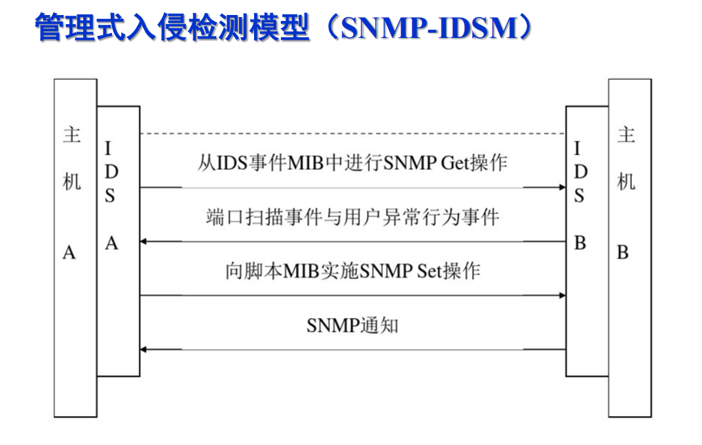
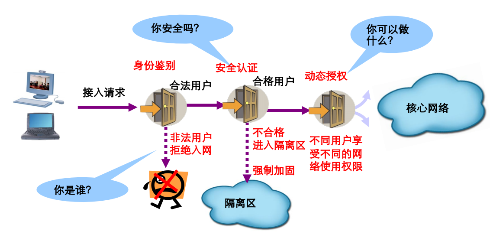

# Cybersecurity Technology Notebook

### 缩写整理

| 缩写        |                                                       | 解释                  |
| --------- | ----------------------------------------------------- | ------------------- |
| CIA       | confidentiality integrity availability                | 机密性 完整性 可用性         |
| **CIIP**  | Critical information infrastructure protection        | 关键信息基础设施保护          |
| PDR       | Protection Detection Response                         | 保护，检测，响应模型          |
| ISS       |                                                       | 美国国际互联网安全公司         |
| PPDR      | **Policy** Protection Detection Response              | PPDR模型              |
| IATF      | Information Assurance Technical Framework             | 信息保障技术框架            |
| FCS       | Frame Check Sequence                                  | 帧校验序列               |
| TTP       | Trusted Third Party                                   | 可信第三方               |
| ACL       | Access Control List                                   | 访问控制列表              |
| CL        | Capabilities List                                     | 访问能力表               |
| DAC       | Discretionary Access Control                          | 自主访问控制              |
| MAC       | Mandatory Access Control                              | 强制访问控制              |
| RD / WU   | Read Down & Write Up                                  | 下读 & 上写——机密性        |
| RU / WD   | Read Up & Write Down                                  | 上读 & 下写——完整性        |
| **RBAC**  | Role-Based Access Control                             | 基于角色的访问控制           |
| **DMZ**   | Demilitarized Zone（Screened Subnet）                   | 被屏蔽子网               |
| NAT       | Network Address Transaction                           | 网络地址转换              |
| WAF       | Web Application Firewall                              | Web应用防火墙            |
| IDS       | Intrusion Detection System                            | 入侵检测系统              |
| NIDS      | Network Intrusion Detection System                    | 网络入侵检测系统            |
| HIDS      | Host Intrusion Detection System                       | 主机入侵检测系统            |
| **CIDF**  | Common Intrusion Detection Framework                  | 通用入侵检测框架            |
| IDM       |                                                       | 层次化入侵检测模型           |
| SNMP-IDSM |                                                       | 管理式入侵检测模型           |
| IPS       | Intrusion Protection System                           | 入侵防御系统              |
| NAC       | Network Admission Control                             | 网络准入控制              |
| SOC       | Security Operations Center                            | 安全管理平台 / 安全运营中心     |
| UTM       | United Threat Management                              | 统一威胁管理系统            |
| VPN       | Virtual Private Network                               | 虚拟专用网络              |
| PPTP      | Point to Point Tunnel Protocol                        | 点对点隧道协议             |
| L2TP      | Layer Two Tunneling Protocol                          | 第二层隧道协议             |
| IPSec     | Internet Protocol Security                            | 因特网协议安全性            |
| ISAKMP    | Internet Security Association Key Management Protocol | Internet安全协商和密钥管理协议 |
| ICV       | integrity check value                                 | 完整性校验值              |
| ESP       | Encapsulation Security Payload                        | 负载安全封装              |

### CH1 网络空间安全概述

#### **信息安全的基本目标**

信息本身的机密性（confidentiality C）、完整性（integrity I）、可用性（availability A）的保持

* 机密性（confidentiality C）：确保信息**没有非授权的泄露**，不被非授权的个人、组织、计算机程序使用
* 完整性（integrity I）：确保信息**没有遭到篡改和破坏**
* 可用性（availability A）：确保拥**有授权的用户和程序可以及时正常使用**信息

#### **网络空间安全的定义（424要素）**

网络空间安全涉及到在网络空间中**四个层面**所存在的安全问题

网络空间安全的**四层次模型**——任何信息系统都会涉及**四个层面**：

* 电磁设备——**设备层**的安全（物理安全、环境安全、设备安全等）
* 电子信息系统——**系统层**的安全（网络安全、软件安全等）
* 运行数据——**数据层**的安全（数据安全、身份安全、隐私保护等）
* 系统应用——**应用层**的安全（内容安全、应用安全）

**两个防止**：**防止、保护**信息通信技术系统及其承载的数据免受攻击；**防止、应对**运用或滥用这些信息通信技术系统而对波及到政治安全、经济安全、文化安全、社会安全和国防安全

**保证四性**：机密性、可鉴别性（包括完整性、真实性、不可依赖性）、可控性、可用性

网络空间安全是CIIP的必要组成部分，同时CIIP也有助于满足基础安全需求（安全性可靠性和可用性），进一步实现网络安全的目标

#### **网络空间安全四大基础模块**

* 信息安全
* 应用安全
* 网络安全
* 因特网安全

### CH2 网络空间安全风险及风险管理

#### 网络空间安全风险术语

**资产 Asset**

**定义**：资产是**任何**对组织**有价值**的东西，是要保护的对象

**分类**：

* **物理的**（计算机设备、网络设备、存储介质）和**逻辑的**（体系结构、通信协议、计算机程序、数据文件）
* **硬件的**（计算机主板、机箱、显示器、鼠标键盘）和**软件的**（OS、数据库管理软件、应用软件、工具软件）
* **有形的**（机房、设备、人员）和**无形的**（品牌、信心、名誉）
* **静态的**（设施和规程）和**动态的**（人员和过程）
* **技术的**（计算机软件、硬件和固件）和**管理的**（业务目标、计划和人员）

**威胁 Threat**

定义：可能导致**信息安全事故**和**组织信息资产损失**的**活动**，威胁源（Threat Agent）利用脆弱性采取恰当的威胁方式才可能引发风险

举例：操作失误、滥用授权、漏洞利用、身份假冒、口令攻击

**脆弱性 Vulnerability**

定义：与信息资产有关的弱点或安全隐患，是造成风险的内因，脆弱性本身并不对资产构成危害

举例：程序系统代码的缺陷、系统设备安全配置错误、维护人员安全意识不足

**控制措施 Countermeasure, Safeguard, Control**

定义：根据安全需求部署、用来弥补脆弱性，防范威胁、降低风险的措施

举例：部署防火墙、入侵检测、审计系统、漏洞修复、测试环节、操作审批环节、应急体系

**可能性 Likelihood, Probability**

定义：威胁源利用脆弱性、采取对应的威胁方式造成不良后果的可能性

举例（填空题？发生不良后果的可能性很大、很小、较小、较大）

**影响 Impact, Loss**

定义：危险源利用脆弱性造成不良后果程度的大小

**风险 Risk**

国标（GB/T 20984）定义：**人为或自然的威胁**利用信息系统及其管理体系中存在的**脆弱性**导致安全事件的发生及其对组织造成的**影响**

风险的五方面——威胁源，威胁行为，脆弱性，资产，影响

**术语之间的关系**

<figure><figcaption></figcaption></figure>

**风险评估**

定义：从风险管理角度，运用科学的方法和手段、系统地分析信息系统所面临的威胁及其存在的脆弱性，评估安全事件一旦发生可能造成的危害程度，提出有针对性的防护对策和整改措施

理解：

* 风险是**动态变化**的，只有动态的风险评估才能发现和跟踪最新的安全风险，所以安全评估是一个**长期持续的工作**
* 风险评估是分析确定风险的**过程**
* 目的是**控制风险**
* 是风险管理的**起点和基础环境**
* 风险管理在倡导**适度安全**

风险处置办法

* 减低：从风险五方面（威胁源，威胁行为，脆弱性，资产，影响）来降低
* 转移：当不能减低风险、且被被转嫁方接受时。外包、上保险
* 规避：不使用面临风险的资产
* 接受：仍需对风险事态变化进行持续监控

#### 资产识别与评估

更重要的是**资产对组织关键业务的顺利开展乃至组织目标实现的重要程度**，多数资产不能以货币形式的价值来衡量，资产评价**很难以定量的方式**来进行，多数情况下只能**以定性的形式**，依据**重要程度的不同划分等级**

评价资产的安全属性：信息资产的**机密性、完整性、可用性、可审计性和不可抵赖性**，可以先分别对资产的以上各方面的重要程度进行评估然后通过一定的方法进行综合

### CH3 信息与网络空间安全保障

#### 基于时间的PDR模型

* Protection 保护：加密，鉴别，访问控制，防火墙，防病毒
* Detection 检测：入侵检测，漏洞检测，网络扫描
* Response 响应：应急响应机制，解决紧急响应和异常处理问题，快速安全响应能力

基于时间的PDR模型是**最早体现主动防御思想**的安全模型

**思想**

承认漏洞，正视威胁，适度防护，加强检测，落实反应，建立威慑

**出发点**

任何防护措施都是基于时间的，可以被攻破

**核心与本质**

给出攻防时间表，固定防守，测试攻击时间；固定攻击手法，测试防守时间

**缺点**

难以适应网络安全环境的快速变化

#### PDR演变：PDRR模型

强调自动故障恢复能力的PDRR模型：Protect保护，Detect检测，React反应，Restore恢复

#### PDR演变：PPDR模型

* Policy策略，是**模型的核心**，**所有的防护、检测、响应都是依据安全策略实施的**，策略包括：访问控制策略，加密通信策略、身份认证策略备份恢复策略等
* Protection防护，传统的静态安全技术和方法来提高网络防护能力，包括访问控制技术（ACL，Firewall）、信息加密技术、身份鉴别技术（一次性口令、X.509数字证书）
* Detection检测，利用检测工具，监视、分析、审计网络活动，使安全防护从被动到主动，是模型**动态性的体现**，主要方法：实施监控、检测、报警
* Response响应，及时响应将系统的安全性调整到风险最低的状态，主要方法包括：关闭服务、跟踪、反击、消除影响

**思想**

在整体的安全策略的控制和指导下，综合运用防护工具（防火墙、身份鉴别、加密等）的同时利用检测工具（漏洞评估、IDS）了解和评估系统的安全状态，通过适当的响应将系统调整到一个**比较安全的状态**

**数学法则**

* 须遵循的数学法则：`Pt > Dt + Rt`，那么安全。否则`Et = (Dt + Rt) - Pt`
* 其中`Pt`是有效防护攻击的时间，`Dt`是发起攻击到检测到的时间，`Rt`是检测到攻击到处理完成的时间。Et是暴露时间

#### IATF 深度防御保障模型

信息保障技术框架 IATF： Information Assurance Technical Framework，由**NSA制定**，IATF = 成功的组织功能 + 信息安全保障 IA(传统Information Assurance) + 深度防御战略

**代表理论 Defence-in-Depth**

深度防御 `Defence-in-Depth`

* **三个核心要素**：强调**people人，Technology技术，Operation操作**三个核心要素
* **四个信息安全保障领域（三保护一支撑）**
  * 保护**本地计算环境**，使用信息保障技术确保数据有保密性完整性和可用性，方法：使用安全的操作系统和安全的应用程序，主机入侵检测，防病毒系统，主机脆弱性扫描，文件完整性保护
  * 保护**区域边界**，区域边界是**区域的网络设备和其它网络设备的接入点**，对进出某区域（物理区域或逻辑区域）的数据流进行有效的控制域监视，方法有：防火墙、入侵检测、远程访问等
  * 保护**网络和基础设施**，防止数据非法泄露，防止受到DOS攻击，防止保护的信息在发送过程中的时延误传或未发送，方法：无线网络安全框架、系统高度互联和虚拟专用网
  * **支撑性基础设施**建设，为安全保障服务提供一套相互关联的活动与基础设施：密钥管理、检测响应
* 实现多层防护

**实现信息保障目标的过程和方法**

系统工程，系统采购，风险管理，鉴别和鉴定，生命周期支持

**信息安全保障 IA**

IA: Information Assurance

在信息系统的**整个生命周期**中，从**技术、管理、工程和人员**等方面提出安全保障要求，确保信息系统的保密性、完整性和可用性，从而保障系统实现**组织机构的使命**

### CH4 网络空间安全技术体系与技术

#### 开放系统互连安全体系结构

**安全服务**

* 鉴别服务
* 访问控制服务
* 数据机密性服务
* 数据完整性服务
* 抗抵赖性服务

**安全机制**

八种基本的安全机制：加密机制、数字签名机制、访问控制机制、数据完整性机制、鉴别交换机制、通信业务流填充机制、路由选择控制机制、公证机制

其他安全机制：可信功能模块、安全标记、事件检测、安全审计跟踪、安全恢复

* **数字签名机制**
  * ISO对数字签名的定义：附加在数据单元上的一些数据或是对数据单元所做的密码变换，允许数据单元的接收者用以确认数据单元的**来源**和数据单元的**完整性**，并防止数据被他人**伪造**
  * 不可伪造性、抗抵赖性、保证消息的完整性
  *   基于RSA的数字签名

      <figure><figcaption></figcaption></figure>
* **数据完整性机制**
  * **防止**非法实体对交换数据的修改、插入、替换和删除，或者如果被修改、插入、替换和删除时**可以被检测**
  * 实现手段维度：密码学、上下文、探测和确认、阻止
  *   基于错误检测码（FCS）与对称密钥加密的完整性验证机制

      <figure><figcaption></figcaption></figure>
* **抗抵赖机制**
  * 保证数据不被接收双方自身欺骗和抵赖
  * **行为抵赖**和**内容抵赖**
  * 抗抵赖面临的威胁
    * **密钥泄露**：实体生成密钥泄露、TTP（可信第三方）生成密钥泄露、替换实体验证密钥、替换TTP验证密钥
    * **泄露证据**：证据的未授权修改和破坏、破坏证据或使之无效
    * **伪造证据**：外部人员伪造证据、证据的虚假验证、TTP伪造证据
* **鉴别机制（详见第五章）**

#### 网络空间安全体系框架

**总需求**

物理安全、网络安全、信息内容安全、应用系统安全和安全管理的总和

**最终目标**

确保信息的**机密性、完整性、可用性、可控性和抗抵赖性**，以及信息系统主体对信息资源的控制

完整的网络空间安全体系框架由**技术体系、组织机构体系和管理体系**共同构建

**管理体系**

倡导管理和技术并重（三分技术、七分管理是过时的）

### CH5 鉴别机制与技术

鉴别是**最重要的安全服务之一**，提供关于实体身份的保证，其他安全服务依赖于此。可以对抗假冒攻击。

**目的**：使别的成员（验证者）获得对声称者所声称的事实的信任

**需求**：某一成员（声称者）提交一个主体的身份并声称它是那个主体

#### **与其他机制的关系**

* 访问控制：访问控制服务的一种必要支持
* 数据完整性：作为提供数据起源鉴别的一种可能方法
* 审计机制：作为对责任原则的一种直接支持

双向 / 单向鉴别协议 mutual/one-way authentication protocol

#### **要求**

* 验证者正确识别合法申请者的概率极大化，攻击者伪装成申请者欺骗验证者成功的概率极小化
* 不具有可传递性
* 计算有效性
* 通信有效性
* 秘密参数能安全存储

#### 途径

* 设计依据：安全水平、系统通过率、用户可接受性、成本
* 基于所知what you know：知识、口令、密码
* 基于所有what you have：身份证、信用卡、钥匙、智能卡、令牌
* 基于个人/生物特征what you are：指纹、笔记、声音、手型、脸型、视网膜、虹膜
* 双因素、多因素认证

#### 四级鉴别

* 1级：抗泄露
* 2级：抗泄露&对不同验证者重放的保护
* 3级：抗泄露&对同一验证者重放的保护
* 4级：抗泄露&对相同/不同验证者重放的保护
  * 惟一数机制
  *   质询机制 Challenge / Response

      <figure><figcaption></figcaption></figure>
  * 专用加密质询机制
  * 计算响应机制

#### 鉴别技术分类

按照机制的配置分类：

**涉及可信第三方的模型**

* 阶段模型
* 使用初始化信息知识的模型

**介入鉴别的可信第三方之间的关系**

* 联机可信第三方
* 脱机可信第三方

#### 对抗重放攻击

**常见的重放攻击：**

* 简单重放：简单复制并在后续重新发送
* 可被日志记录的复制品：在一个合法有效的时间窗内重放带时间戳的消息
* 不能被检测到的复制品：原始信息被拦截。只有被重放的信息到达目的地
* 反向重放：不做修改，向消息发送者重放，当采用传统对称加密时这种攻击可以实现，因为发送者不能简单识别发送的消息和收到的消息在内容上的区别
  * 针对同一验证者的重放保护：使用非重复值
  * 针对不同验证者的重放保护：使用验证者的标识符

**对抗重放：非重复值的使用**

* 序列号
* 时间戳
* 验证者发送随机值

**对抗线路窃听的措施**

*   使用保护口令机制：引入单向函数（hash函数）

    <figure><figcaption></figcaption></figure>
*   加盐（Salt）机制

    <figure><figcaption></figcaption></figure>
* 一次性口令机制（OTP）

<figure><figcaption></figcaption></figure>

<figure><figcaption></figcaption></figure>

* 抗声称者的重放攻击
* 附加复杂协议，无法与传统简单口令结合使用
* 安全性取决于散列函数
* 不用于非连接性的应用，否则会有握手的额外开销
* 单向鉴别，可能存在验证者的假冒和重放攻击；通过双向鉴别 / 时间戳 解决

### CH6 访问控制机制与技术

#### 未授权访问

包括未经授权的使用、泄露、修改、销毁信息以及颁发指令等

* 非法用户对系统资源的使用
* 合法用户对系统资源的非法使用

#### 作用

保护信息的**机密性、完整性和可用性**

#### 分类

<figure><figcaption></figcaption></figure>

**自主访问控制（DAC）**

DAC: Discretionary Access Control

允许客体的**创建者决定主体对该客体的访问权限**

* 灵活地调整安全策略
* 有较好的易用性和可扩展新
* 常用于商业系统
* 安全性不高

DAC是一种**分布式授权管理的模式**

实现方式：ACL或CL （优缺点；举例：Windows安全模型）

**访问控制表（ACL）**

ACL: Access Control List

* 把客体作为索引，规定能够访问它的主题和权限
* 主体数量一般比客体少的多而且容易分组，**授权管理相对简单**
* 得到一个客体所有的访问权限，容易
* 浏览一个主体的所有访问权限，困难

**访问能力表（CL）**

CL: Capabilities List

* 把**主体作为索引**，规定主体能访问的客体和权限
* 由于客体相当多、分类复杂、**不便于授权管理**
* 表示形式
  * 授权证书、属性证书
  * 用户profile
* 浏览一个客体所有的访问权限，困难
* 得到一个主体的所有访问权限，容易

**访问控制矩阵**

`M = S x O --> 2A`

矩阵的两个维度正好分别是ACL和CL。

**强制访问控制（MAC）**

MAC: Mandatory Access Control

主体对客体的所有访问请求按照**强制访问控制策略**进行控制，客体的**属主无权控制**客体的访问权限，以防止对信息的非法和越权访问

* 主体和客体分配有一个安全属性
* 应用于军事等安全要求较高的系统
* 可与DAC结合使用

**下读/上写**

* 向下读RD（Read Down）
  * 主体高于客体时允许读
  * 低级别的用户不能读取高敏感度的信息
* 向上写WU（Write Up）
  * 主体低于客体时允许写
  * 不允许高敏感度的信息写入低敏感度的区域
* 应用：防火墙

信息流只能从低级别流向高级别，从而保证数据机密性

<figure><figcaption></figcaption></figure>

**上读/下写**

* 向上读RU（Read Up）
  * 主体低于客体时允许读
  * 低级别的用户能读取高敏感度的信息
* 向上写WD（Write Down）
  * 主体高于客体时允许写
  * 允许高敏感度的信息写入低敏感度的区域
* 应用：Web服务器

信息流从高级别流向低级别，实现数据完整性

<figure><figcaption></figcaption></figure>

**“写”代表了信息的流向**

**基于角色访问控制模型（RBAC）**

RBAC: Role-Based Access Control

**基本思想**

根据用户所担任的角色来决定用户在系统中的访问权限

一个用户必须扮演某种角色，而且还必须激活这个角色才能对一个对象进行访问或执行某种操作

<figure><figcaption></figcaption></figure>

<figure><figcaption></figcaption></figure>

**用户、角色、许可的关系**

* 用户、角色多对多
* 角色、许可多对多
* 许可 = 操作 + 客体
* 操作、客体多对多

**特点**

* 便于授权管理：如系统管理员需要修改系统设置时，需要有不同角色的用户到场，增加安全性
* 便于处理工作分级：如文件资源分级管理
* 利用安全约束：容易实现各种安全策略（最小特权、职责分离）
* 便于任务分担：不同角色完成不同任务

### CH7 防火墙技术及其发展

#### 防火墙定义

**置于不同的网络安全域之间**，通过相关的**安全策略来控制**（允许、拒绝、监视、记录）进出网络的访问行为

#### 技术分类

技术发展阶段上依次是：

**包过滤**

`Packet Filtering`

* **网络层**
* 只对数据包的IP地址、TCP/UDP协议和端口进行分析，简单快速、易于配置、对用户透明
* 无法识别更高层（如应用层）协议或维持连接，安全性薄弱，静态策略可能成为漏洞

**应用代理**

`Application Proxy`

* **应用层**
* 实现对应用层数据的检测和分析

**状态检测**

`Stateful Inspection`

* **2数据链路层\~4运输层**
* 通过规则表和连接状态表综合判断是否允许数据包通过

**完全内容检测**

`Complete Content Inspection`

* **2数据链路层\~7应用层**
* 除了数据包和状态，还对应用层协议进行还原和内容分析，防范混合型安全威胁

#### 被屏蔽子网（DMZ）

在内部网络和外部网络之间建立一个被隔离的子网，用两台过滤路由器分别与内部网卡和外部网络连接，中间通过堡垒主机进行数据转发

#### 功能

**地址转换（NAT）**

* 隐藏了内部网络的结构
* 内部网络可以使用私有IP地址
* 公开地址不足的网络可以使用这种方式提供IP复用功能

**MAP 地址/端口映射**

* 公开服务器可以使用私有地址
* 隐藏内部网络的结构

**与入侵检测系统IDS的联动**

**IP与MAC(用户)绑定**

企业防火墙的典型部署

利用防火墙将网络分为**三个安全区域**

1. 企业内部网络
2. 外部网络
3. 服务器专区（DMZ区）

#### 防火墙的工作接入方式

* 路由接入
* 透明接入
* 混合接入

#### 衡量性能的五大指标

* 吞吐量：直接影响网络的新能
* 时延 ：入口处输入帧最后一个比特到达 至 出口处输入帧的第一个比特输出 所用的时间间隔
* 丢包率：稳态负载下，应由网络设备传输但由于资源缺乏而被丢弃的帧的百分比
* 背靠背：从空闲状态开始，以达到传输介质最小合法间隔界限的传输速率发送相当数量的固定长度的合法帧，当出现第一个帧丢失时发送的帧数
* 并发连接数：穿越防火墙的主机之间或主机与防火墙之间能同时建立的最大连接数

#### WAF技术

WAF: Web Application Firewall

WAF的功能:对web特有的入侵方式的加强防护，如DDOS防护、SQL注入防护、XML注入防护、XSS攻击防护，**重点是防SQL注入**

由于时应用层而非网络层的入侵，从技术角度应该称为Web IPS，而不是Web防火墙

### CH8 入侵检测

#### 基本概念

**入侵**

在**非法或未经授权**的情况下，试图存取或处理系统或网络中的信息，或破坏系统或网络的正常运行

**入侵检测**

Intrusion Detection

对入侵行为的发觉，采集计算机网络或计算机系统的关键点的信息并进行分析，从中发现网络或系统中是否有违反安全策略的行为和被攻击的迹象

**入侵检测系统（IDS）**

IDS： Intrusion Detection System

是指**实现入侵检测功能的软件和硬件的集合**

#### IDS的功能

* 自动检测入侵行为
* 监视网络流量和主机中的操作（Network IDS和Host IDS）
* 分析入侵行为
  * 基于特征
  * 基于异常
* 按预定的规则做出相应
  * 阻止指定的行为

#### 入侵检测模型

**通用入侵检测模型（Denning模型）**

假设：异常使用系统的入侵行为可以通过检查一个系统的审计记录来识别

可检测的异常行为：

* 黑客入侵
* 未授权操作或越权操作
* 其他

实际上是一个**基于规则的模式匹配系统**，最大缺陷是未包含已知系统漏洞或攻击方法方面的知识

**层次化入侵检测模型（IDM）**

<figure><figcaption></figcaption></figure>

**管理式入侵检测模型（SNMP-IDSM）**

<figure><figcaption></figcaption></figure>

#### CIDF架构

通用入侵检测框架（Common Intrusion Detection Framework）

#### 主机入侵检测系统HIDS

以**代理软件**的形式安装在每台主机或服务器上，检测主机上的各种活动，由代理软件向统一的管理/策略服务器发送日志和告警信息

按照检测对象不同可分为：

* 网络连接检测
* 主机文件检测

优点

* 长期监控谁访问什么
* 可以将问题映射到一个具体的用户ID
* 系统可以跟踪滥用行为的变化
* 适用于加密环境
* 可以运行在交换环境只能
* 监测分布在多台主机上的负载，只将有关数据上报中央控制台

缺点

* 无法监测本机之外的网络活动
* 审计机制增加了系统负载
* 审计记录占用存储空间
* OS的漏洞可能破坏代理软件的有效性
* 不同的OS需要不同的代理软件
* 升级时每台及其都要升级
* 更高的部署和维护成本

#### 网络入侵检测系统 NIDS

以**混杂模式**接入网络，感应器可部署在**网络的关键位置**，将日志/告警信息发送至位于企业防火墙内部的服务器，检测对象是**原始的网络分组数据包**

实现方式：利用一个网络适配器来实施监视和分析所有通过网络进行传输的通信

优点

* 不需要重新配置或重定向日志机制即可快速获取信息
* 部署不影响现有的网络架构或数据源
* 实时监视与检测网络攻击或误用
* 与OS无关
* 不会增加系统开销

缺点

* 无法分析加密的数据
* 从网络流量可推断发生了什么，但不能判断结构
* 对全交换的网络需要配置交换机端口镜像
* 对的带宽的要求较高

#### IDS的典型部署

以旁路的方式接入到网络中，且部署在需要的关键位置

<figure><figcaption></figcaption></figure>

#### IDS的两个指标

漏报率（false negative）和误报率（false alarm rate）

### CH9 其他网络安全技术及设备

#### 入侵防御系统（IPS）

**概念**

IPS是一种集入侵检测和防御于一体的安全产品，IPS使得IDS和防火墙走向统一，可简单理解为`IPS= IDS+防火墙`，但为了避免误报，IPS对未知攻击的防御能力几乎没有

**主要功能**

* 识别对网络和主机的恶意攻击
* 向管理控制台发送日志信息
* 集成病毒过滤、带宽管理和URL过滤等功能

**解决的安全问题**

* **阻拦已知攻击**
* 为已知漏洞**提供虚拟补丁**
* 速率或流量控制
* 行为管理

**IDS和IPS对比**

技术同源。但部署方式和设计出发点有不同

<figure><figcaption></figcaption></figure>

#### 网闸

**概念**

网闸即安全隔离与信息交换系统，是**在两个不同的安全域之间**，通过协议转换的手段，以信息摆渡的方式实现数据交换

* 只有被系统明确要求传输的信息才可以通过。其信息流一般为通用应用服务
* 内外网/上下游从未发生过物理连接，**通过策略控制连接发生**，“网闸产品”至少要有两套主机和一个物理隔离部件才可完成物理隔离任务
* 主要用于两个物理隔离程度高的网络之间的**安全数据交换**

<figure><figcaption></figcaption></figure>

**组成**

安全隔离网闸由**内端机、外端机、隔离系统（数据迁移控制单元）**&#x4E09;部分组成

**原理**

* 切断网络之间的通用协议连接
* 将数据包分解或重组为静态数据
* 对静态数据进行安全审查（网络协议检查、代码扫描等）
* 确认后安全的数据流入内部单元

**国家保密局限定的网闸使用环境**

1. 不同的涉密网络之间
2. 某涉密网络的不同安全域
3. 某与Internet物理隔离的内网与秘密级涉密网络之间
4. 未与涉密网络连接的网络与Internet之间

<figure><figcaption></figcaption></figure>

#### 安全管理平台 / 安全运营中心 （SOC）

**概念**

对客户网络进行集中化、全方位的监控、分析与响应，实现体系化的网络运行维护

#### 统一威胁管理系统 （UTM）

**概念**

由硬件、软件和网络技术组成的具有专门用途的设备，它将多种安全特性集成于一个硬设备里，构成一个标准的统一安全平台

**功能**

传统的防火墙；入侵防御IPS；防病毒；端到端的IPSec VPN；动态路由；内容过滤

#### 网络准入控制（NAC）

**概念**

NAC: Network Access Control

使用网络准入安全策略，**确保进入网络的设备符合策略**

**网络安全 + 设备安全 + 身份鉴别** ，筛选进入网络的设备

**功能需求**

<figure><figcaption></figcaption></figure>

**主要功能**

1. 认证与授权
2. 扫描与评估
3. 隔离与实施
4. 更新与修复

### CH10 虚拟专用网技术

VPN: Virtual Private Network

#### 基本功能

* 加密数据
* 信息认证和身份认证
* 访问控制

#### 类型

按照被封装在哪种数据包中的区别分类

*   PPTP

    Point to Point Tunnel Protocol 点对点隧道协议
*   L2TP

    Layer Two Tunneling Protocol 第二层隧道协议
*   **IPSec**

    **Internet Protocol Security 因特网协议安全性**

    * IPSec其实是一个协议包，由**三个**主要的协议组成
      * 密钥管理协议
      * AH协议（权威鉴别头Authentication Header）
        * 在IP数据包中插入鉴别头AH来提供安全服务
        * **无连接完整性**：消息鉴别码产生的校验值（完整性校验值ICV）
        * **数据起源鉴别**：包含一个将要被验证的共享秘密或密钥
        * **抗重放攻击**：序列号
        * 传输模式和隧道模式两种工作模式
      *   ESP协议（负载安全封装 Encapsulation Security Payload）

          * 将整个IP分组或上层协议部分封装到ESP载荷中
          * ESP只鉴别ESP头之后的信息，**比AH鉴别的范围窄**，AH还要鉴别外部IP头的各部分
          * ESP具备AH的所有功能之外还确保数据包的**机密性**，需要定义两套算法
            * 负责保护机密性的**加密算法**
            * 负责进行身份验证的**鉴别算法**

          
    * Internet安全协商和密钥管理协议（ISAKMP）是IPSec的另一个主要组件

    <figure><figcaption></figcaption></figure>

#### VPN通道建立方式

Host对Host

* 主机要支持IPSec，VPN网关不需支持

Host对VPN网关

* 均需支持IPSec

VPN对VPN网关

* 主机不需支持IPSec，VPN网关需支持

Remote User对VPN网关

* 均需支持IPSec
