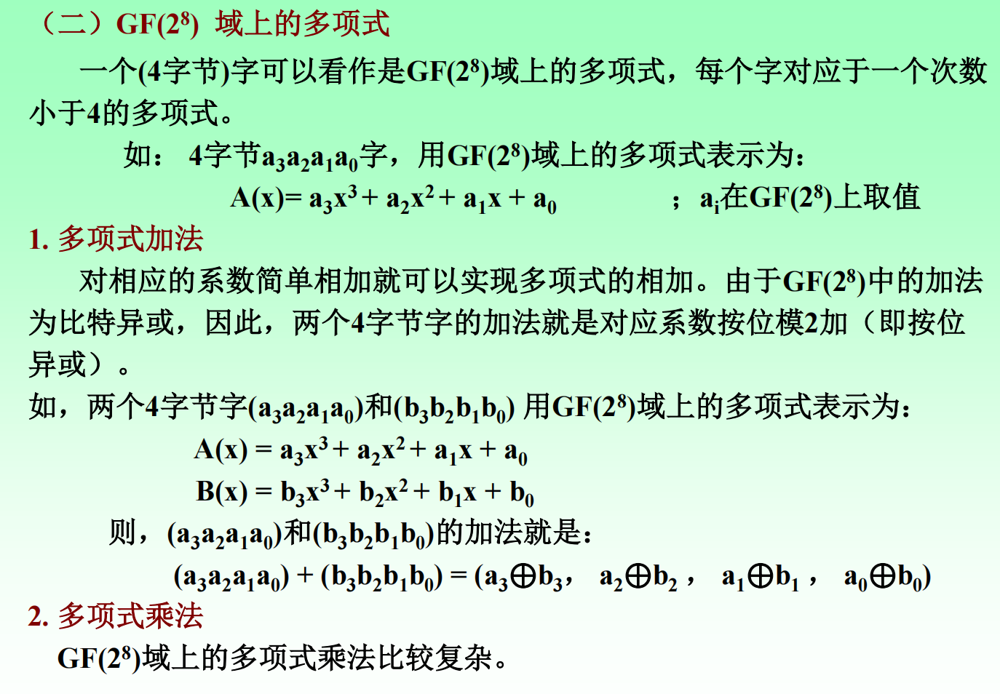
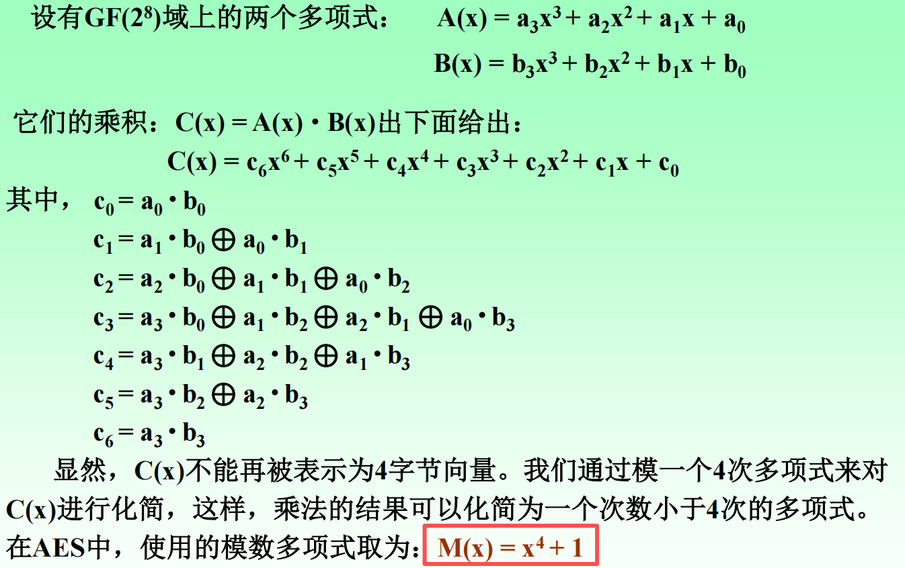
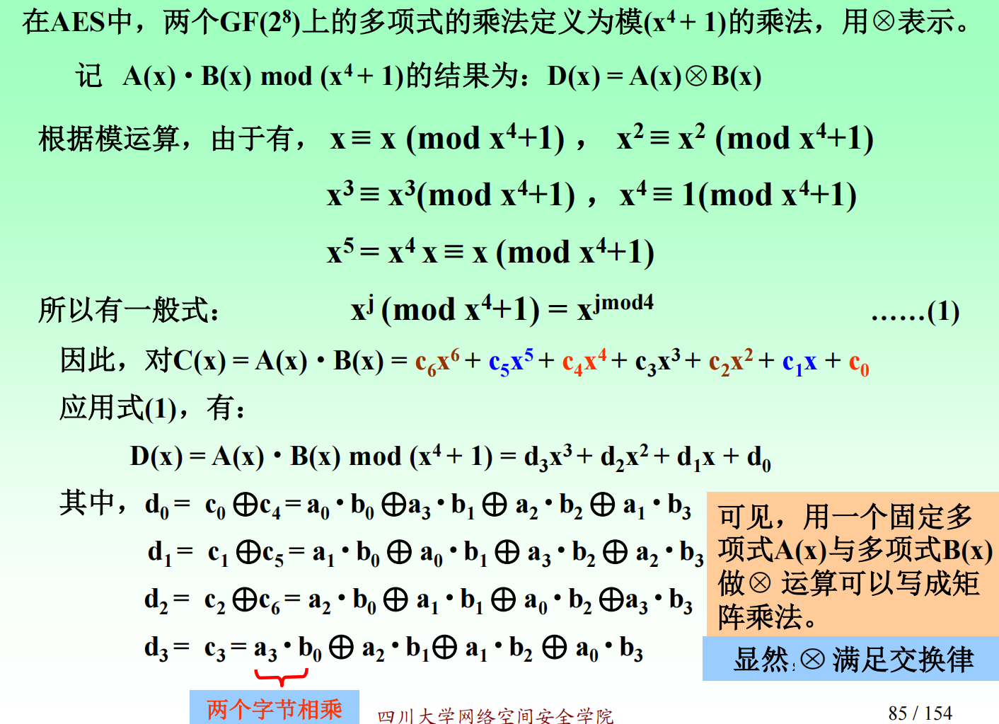
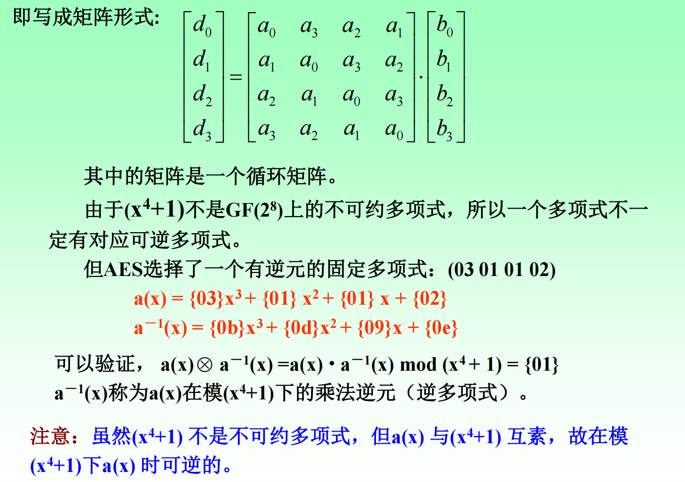
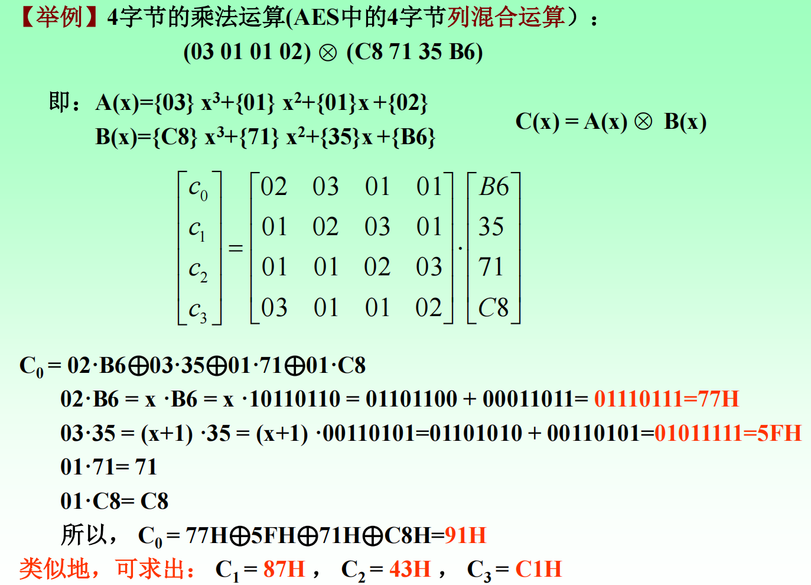

# 密码学中的数学

> 覆盖内容：模运算与性质、求逆（扩展 Euclid）、欧拉函数 φ(n)、快速幂、解同余方程组（CRT）、GF(2) 多项式运算、AES 字节运算（XOR、乘法、xtime）、素域 Z\_p\* 的本原元/生成元、集合结论示例、ElGamal 加密原理与计算。

## 求逆运算（扩展 Euclid 算法）

### 逆元存在条件

在模 $$n$$ 下 $$a$$ 的逆元 $$a^{-1}$$ 存在当且仅当 $$\gcd(a,n)=1$$

### 扩展 Euclid 结论

扩展 Euclid 可求出整数 $$x,y$$ 使 $$ax+ny=\gcd(a,n)$$ 若 $$\gcd(a,n)=1$$，则 $$ax+ny=1\Rightarrow ax\equiv 1\pmod n$$ 因此 $$x\bmod n$$ 即为 $$a^{-1}\pmod n$$。

#### 例：计算 $$7^{-1}\bmod 26$$

1. 辗转相除:

&#x20;$$\begin{aligned} 26 &= 3\cdot 7 + 5 \\ 7 &= 1\cdot 5 + 2 \\ 5 &= 2\cdot 2 + 1 \end{aligned}$$

因此 $$\gcd(7,26)=1$$，模逆存在

2. 合并回代（**单一线性组合**）

从最后一行开始一次性代回并合并： $$\begin{aligned} 1 &= 5 - 2\cdot 2 \\ &= 5 - (7 - 1\cdot 5)\cdot 2 \\ &= 3\cdot 5 - 2\cdot 7 \\ &= 3\cdot (26 - 3\cdot 7) - 2\cdot 7 \\ &= 3\cdot 26 - 11\cdot 7 \end{aligned}$$

***

## 欧拉函数 $$\varphi(n)$$&#x20;

### 定义

$$\varphi(n)$$ 表示1到中与n互素的正整数个数。

### 计算公式

* 若 $$n=p$$ 为素数： $$\varphi(p)=p-1$$
* 若 $$n=p^k$$： $$\varphi(p^k)=p^k-p^{k-1}=p^k(1-\frac1p)$$
* 若 $$n=\prod p_i^{k_i}$$：\
  $$\varphi(n)=n\prod_i\left(1-\frac1{p_i}\right)$$

#### 例：计算 $$\varphi(36)$$

$$36=2^2\cdot 3^2$$，因此 $$\varphi(36)=36\left(1-\frac12\right)\left(1-\frac13\right) =36\cdot \frac12\cdot \frac23 =12$$

***

## 方幂运算（快速幂）

### 目标

高效计算 $$a^e\bmod n$$，避免直接乘 $$e$$ 次。

### 二进制快速幂

将指数 $$e$$ 写成二进制，循环执行「平方取模」，在对应位为 1 时将当前底数乘入结果并取模。

#### 计算 $$7^{13}\bmod33$$

将指数写成二进制： $$13 = (1101)_2$$

初始化： $$\text{result} = 1$$,逐位处理指数的二进制位：

| 二进制位 | 操作     | 计算             | result          |
| ---- | ------ | -------------- | --------------- |
| 1    | 平方 → 乘 | $$1^2\cdot 7$$ | $$7 \bmod 33$$  |
| 1    | 平方 → 乘 | $$7^2\cdot 7$$ | $$13 \bmod 33$$ |
| 0    | 平方     | $$13^2$$       | $$4 \bmod 33$$  |
| 1    | 平方 → 乘 | $$4^2\cdot 7$$ | $$13 \bmod 33$$ |

***

## 解同余方程组（中国剩余定理 CRT）

### 适用条件

模数两两互素： $$x\equiv a_i\pmod{m_i},\quad \gcd(m_i,m_j)=1$$ 令 $$M=\prod m_i$$，则解在模 $$M$$ 意义下唯一。

### 构造法

对每个方程：

* $$M_i=M/m_i$$
* 求 $$t_i=M_i^{-1}\bmod m_i$$
* 合成： $$x\equiv \sum a_iM_it_i \pmod M$$

#### 例：求解同余方程组：

$$
\begin{cases} x \equiv 2 \pmod 3,\\ x \equiv 3 \pmod 5,\\ x \equiv 2 \pmod 7. \end{cases}
$$

$$
M=3\cdot5\cdot7=105
$$

* $$m_1=3$$：
  * &#x20;$$M_1=35$$， $$35\bmod 3=2$$
  * &#x20;$$2^{-1}\bmod 3=2$$， $$t_1=2$$
* $$m_2=5$$：
  * $$M_2=21$$， $$21\bmod 5=1$$
  * $$1^{-1}\bmod 5=1$$， $$t_2=1$$
* $$m_3=7$$：
  * $$M_3=15$$， $$15\bmod 7=1$$，
  * &#x20;$$1^{-1}\bmod 7=1$$， $$t_3=1$$

合成：

  \begin{aligned} x  &#x26;\equiv \sum a_i M_i t_i \pmod M \\ &#x26;\equiv 2\cdot 35\cdot 2 + 3\cdot 21\cdot 1 + 2\cdot 15\cdot 1 \\ &#x26;= 140 + 63 + 30 \\ &#x26;= 233 \\ &#x26;\equiv 23 \pmod{105} \end{aligned}  

## 利用中国剩余定理快速实现RSA运算

#### 原理

在 RSA 中，解密或签名本质上是一次大整数模幂运算： $$M \equiv C^d \pmod{n}, \quad n = pq$$

其中 $$p,q$$ 为大素数。由于模 n 的指数运算代价很高，实际实现中利用**中国剩余定理**将一次模n运算**分解为两次更小模数下的运算**

利用 CRT 的基本思想是：因为 ppp 与 qqq 互素，模 n=pqn=pqn=pq 的同余问题可以等价地转化为同时满足： $$M_p \equiv C^d \pmod{p}, \qquad M_q \equiv C^d \pmod{q}$$ 的两个子问题。在 RSA 中，先预先计算

 d_p = d \bmod (p-1), \qquad d_q = d \bmod (q-1)

再分别进行指数运算，随后利用中国剩余定理将结果合成为模 n 下的唯一解：

$$
M_p \equiv C^{d_p} \pmod{p}, \qquad M_q \equiv C^{d_q} \pmod{q}
$$

这两次模幂运算的复杂度远低于直接在模n下计算，整体速度通常可提升约 3–4 倍。

#### 限制

CRT 加速 RSA 的前提与限制主要体现在实现安全性与适用场景上。首先，**CRT 仅适用于私钥运算（解密与签名）**，因为其依赖于素因子 p,q，而公钥运算不具备这些信息。其次，**CRT 实现对故障与侧信道攻击更为敏感**：若在计算 $$M_p$$​ 或 $$M_q$$ 时发生单点错误，攻击者可通过比较错误结果与正确结果，利用 $$\gcd(M - M', n)$$直接恢复 p或q，这就是著名的 **Bellcore 故障攻击**。因此，实际系统中必须配合**结果一致性校验或重复计算**等防护措施。最后，CRT 需要额外存储 $$p,q,d_p,d_q,q^{-1}$$ 等参数，增加了密钥管理复杂度，并要求实现严格保证中间结果不被泄露。

***

## 有限域 $$GF(2)$$ 多项式表示与运算

### 表示

GF(2) 元素只有 0 与 1。比特串可视为多项式系数，例如字节 $$1011,0010_2$$ 表示 $$x^7+x^5+x^4+x^1$$

### 加法（异或）

GF(2) 下加法等同**按位 XOR**，因为 (1+1=0)。

例： $$0x57\oplus 0x83=0xD4$$

### 乘法（多项式乘）

先按多项式相乘（系数 mod 2），若在 $$GF(2^8)$$ 中则需再对不可约多项式取模。

***

## AES 基本运算

### 字节加法

AES 字节加法即 XOR。\
例： $$0x3C\oplus 0xA7=0x9B$$

<figure><figcaption></figcaption></figure>

### xtime 运算（乘以 2）

xtime 表示在 $$GF(2^8)$$ 中乘以 $$x$$（也就是乘以 2）。规则：

* 左移一&#x4F4D;**（注意不是循环左移！！）**
* 若原最高位为 1，则再 $$\oplus 0x1B$$

例 1： $$xtime(0x57)$$\
$$0x57=0101,0111$$，最高位 0\
左移得 $$1010,1110=0xAE$$，所以 $$xtime(0x57)=0xAE$$。

例 2： $$xtime(0x83)$$\
$$0x83=1000,0011$$，最高位 1\
左移得 $$0x06$$，再 $$\oplus 0x1B$$ 得 $$0x1D$$，所以 $$xtime(0x83)=0x1D$$。

### AES 乘法示例

AES 常用不可约多项式： $$m(x)=x^8+x^4+x^3+x+1$$对应常数 $$0x11B$$。

#### 例：在 $$GF(2^8)$$下计算 $$0x57\cdot 0x83$$

&#x20;$$0x83=1000,0011_2=x^7+x+1$$，因此 $$0x57\cdot 0x83=(0x57\cdot x^7)\oplus(0x57\cdot x)\oplus(0x57)$$

通过连续 xtime 得到 $$0x57\cdot x^k$$：

* $$k=0:\ 0x57$$
* $$k=1:\ 0xAE$$
* $$k=2:\ xtime(0xAE)=0x47$$
* $$k=3:\ xtime(0x47)=0x8E$$
* $$k=4:\ xtime(0x8E)=0x07$$
* $$k=5:\ xtime(0x07)=0x0E$$
* $$k=6:\ xtime(0x0E)=0x1C$$
* $$k=7:\ xtime(0x1C)=0x38$$

取 $$k=7,1,0$$ 三项异或：  $$0x38\oplus 0xAE\oplus 0x57$$  \
结论： $$0x57\cdot 0x83=0xC1$$

<figure><figcaption></figcaption></figure> <figure><figcaption></figcaption></figure>

<figure><figcaption></figcaption></figure> <figure><figcaption></figcaption></figure>

***

## 素域 $$\mathbb{Z}_p^*$$ 的本原元

### 群结构

当 $$p$$为素数时， $$\mathbb{Z}_p^*={1,2,\dots,p-1}$$在乘法模 $$p$$ 下构成循环群，群阶为 $$p-1$$。

### 本原元定义

元素 $$a\in\mathbb{Z}_p^*$$ 若满足 $${a^1,a^2,\dots,a^{p-1}}\equiv {1,2,\dots,p-1}\pmod p$$ 则称 $$a$$ 为本原元（生成元）。a的阶为 $$p-1$$

### 快速判定

若 $$p-1$$ 的不同素因子为 $$q_1,\dots,q_t$$，则 $$a$$是本原元当且仅当对所有 $$q_i$$： $$a^{(p-1)/q_i}\not\equiv 1\pmod p$$


给定 $$A={a,a^2,\dots,a^{p-1}},\quad B={1,2,\dots,p-1}$$，若 $$p$$为素数且 $$a$$ 为本原元，则 $$A=B$$


例 p=11

$$p-1=10$$，素因子为 2 与 5。只需检验： $$a^5\not\equiv 1\pmod{11},\quad a^2\not\equiv 1\pmod{11}$$

检查 $$a=2$$是本原元

* $$2^2=4\not\equiv 1\pmod{11}$$
* $$2^5=32\equiv 10\not\equiv 1\pmod{11}$$

故 2 为本原元

列出2的幂（取模 11）： $$\{2,4,8,5,10,9,7,3,6,1\} = \{1,2,3,4,5,6,7,8,9,10\}=B$$&#x20;

本原元 $$p=11$$： $$a=2,6,7,8,9$$

***

## ElGamal 加密原理与计算

#### 基本思想

ElGamal 基于离散对数困难问题。其核心是：在循环群中，用一次性随机数 _**k**_ 生成会话密钥，并通过公钥隐藏明文。常用在素域乘法群 $$\mathbb{Z}_p^*$$（也可推广到椭圆曲线群）。

#### 参数与密钥

* 公开参数：大素数 p，生成元 g（通常为本原元）
* 私钥：随机选 $$x\in{1,\dots,p-2}$$
* 公钥：计算 $$y=g^x\bmod p$$，公钥为 $$(p,g,y)$$

#### 加密（步骤）



选随机一次性密钥 $$k\in{1,\dots,p-2}$$（每次必须不同且保密）。



计算 c1 与共享密钥 s： $$c_1=g^k\bmod p,\qquad s=y^k\bmod p$$



计算 c2： $$c_2=m\cdot s\bmod p$$



#### 解密

接收方用私钥 $$x$$ 计算共享密钥： $$s'=c_1^x=(g^k)^x=g^{kx}\equiv y^k=s\pmod p$$ 然后求逆： $$m=c_2\cdot (s')^{-1}\bmod p$$ 其中 $$(s')^{-1}$$用扩展 Euclid 或费马小定理求。

#### 例子

小素数演示（真实应用必须用大素数）：

* 选 $$p=11$$，取生成元 $$g=2$$（本原元）
* 私钥 $$x=8$$
* 公钥 $$y=g^x\bmod p=2^8\bmod 11$$

先算 $$y=2^8 \equiv 3\bmod 11$$（可以用快速幂算法）

**加密**

待加密明文 $$m=7$$，随机取 $$k=3$$\
$$c_1=g^k=2^3=8\bmod 11$$&#x20;

&#x20;$$s=y^k=3^3=27\equiv 5\pmod{11}$$&#x20;

$$c_2=m\cdot s=7\cdot 5=35\equiv 2\pmod{11}$$&#x20;

密文 ： $$(c_1,c_2)=(8,2)$$

**解密**

&#x20;$$s'=c_1^x=8^8 \equiv 5\bmod 11$$ （同样利用快速幂算法）

求逆 $$5^{-1}\bmod 11$$因为： $$5\cdot 9=45\equiv 1\pmod{11}$$，所以 $$5^{-1}\equiv 9$$

恢复明文： $$m=c_2\cdot (s')^{-1}=2\cdot 9=18\equiv 7\pmod{11}$$

### 常见注意点

* $$k$$ 必须每次加密都随机且保密，重复使用会泄露私钥
* 明文需映射到群元素（在 $$\mathbb{Z}_p^*$$中就是非零模 $$p$$）
* 真实系统使用大素数与安全随机数生成器

## 生日悖论（Birthday Paradox）**的概率分析**

设哈希函数 $$H:\{0,1\}^\* \rightarrow \{0,1\}^n$$，其输出空间大小为 $$N=2n$$，假设理想哈希函数模型，即每个输出在 $$\{0,1\}^n$$上均匀、独立分布。在进行碰撞攻击时，攻击者并不指定目标哈希值，而是不断随机选取不同输入 $$x_1,x_2,\dots,x_k$$​，计算对应的哈希值 $$H(x_i)$$，只要存在 $$H(x_i)=H(x_j),\quad i\neq j$$ ，就得到一次碰撞。

考虑前 k 次哈希均**不发生碰撞**的概率。第一次必然不碰撞；第二次不碰撞的概率是 $$1-\frac{1}{N}$$，第三次不碰撞的概率是 $$1-\frac{2}{N}$$，以此类推，第 kkk 次仍不发生碰撞的概率为 $$1-\frac{k-1}{N}$$

前 $$k$$ 次都没有碰撞的概率为：

$$
P_{\text{no-coll}}=\prod_{i=0}^{k-1}\left(1-\frac{i}{N}\right)
$$

当 $$N$$ 很大且 $$k \ll N$$ 时，可以用指数近似 $$\ln P_{\text{no-coll}} \approx -\sum_{i=0}^{k-1}\frac{i}{N} = -\frac{k(k-1)}{2N} \approx -\frac{k^2}{2N}.$$

于是 $$P_{\text{no-coll}} \approx e^{-k^2/(2N)}$$，碰撞至少发生一次的概率为 $$P_{\text{coll}} = 1 - P_{\text{no-coll}} \approx 1 - e^{-k^2/(2N)}$$

当碰撞概率达到一个“显著值”（例如约 1/2）时，有 $$e^{-k^2/(2N)} \approx \frac{1}{2}$$

即 $$\frac{k^2}{2N} \approx \ln 2$$ ， $$k \approx \sqrt{2N\ln 2} \approx 1.17\sqrt{N} =1.17 \cdot 2^{n/2}$$

因此，在理想哈希函数模型下，**进行约** $$2^{n/2}$$ **次散列运算，就可以以较高概率找到一对碰撞**
