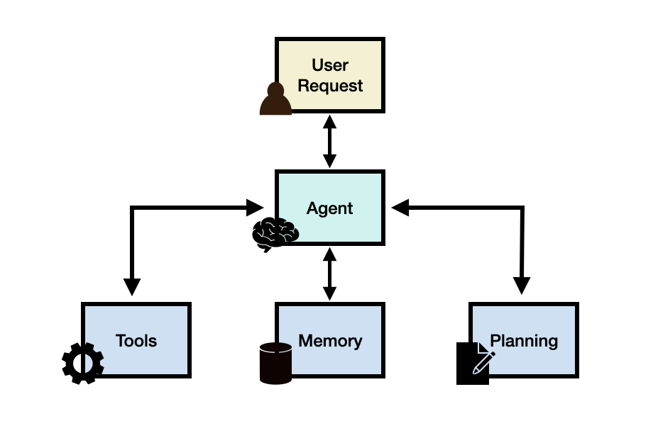

# LLM Agent

## Agent

Agent = LLM (大脑) + Planning (规划) + Tool use (执行) + Memory (记忆)

<figure><figcaption></figcaption></figure>

Agent简易代码实现

```python
# 伪代码示例：简易天气穿衣助手Agent
import requests

class WeatherAgent:
    def __init__(self):
        self.memory = []  # 简单的记忆存储
        self.tools = {
            'get_weather': self.get_weather_api,
            'give_advice': self.generate_advice
        }

    # 工具1: 调用天气API
    def get_weather_api(self, city):
        """调用外部天气API获取数据"""
        # 这里模拟一个API调用
        print(f"[Agent 行动] 正在查询{city}的天气...")
        # 假设返回的数据
        mock_data = {'city': city, 'temp': 22, 'condition': '晴朗', 'wind': '3级'}
        return mock_data

    # 工具2: 根据天气生成建议
    def generate_advice(self, weather_data):
        """根据天气数据生成穿衣建议"""
        temp = weather_data['temp']
        condition = weather_data['condition']
        advice = f"当前{weather_data['city']}气温{temp}℃，天气{condition}。"
        if temp > 25:
            advice += "建议穿短袖、短裤。"
        elif temp > 15:
            advice += "建议穿长袖T恤、薄外套。"
        else:
            advice += "建议穿毛衣、厚外套。"
        return advice

    # 规划与执行核心
    def run(self, user_input):
        """解析用户目标并执行任务"""
        print(f"[用户指令] {user_input}")
        
        # 步骤1: 规划 - 从指令中提取关键信息（城市）
        # 这里简化处理，实际会用更复杂的NLP模型
        if "天气" in user_input and "北京" in user_input:
            city = "北京"
        else:
            return "请告诉我您想查询哪个城市的天气？"
        
        # 步骤2: 行动 - 调用工具获取天气
        weather_info = self.tools['get_weather'](city)
        self.memory.append({'step': 'fetched_weather', 'data': weather_info})  # 存入记忆
        
        # 步骤3: 行动 - 调用工具生成建议
        final_advice = self.tools['give_advice'](weather_info)
        self.memory.append({'step': 'generated_advice', 'data': final_advice})  # 存入记忆
        
        # 步骤4: 输出结果
        return final_advice

# 使用Agent
agent = WeatherAgent()
result = agent.run("我想知道北京的天气，该怎么穿衣服？")
print(f"[Agent 回复] {result}")

# 输出示例：
# [用户指令] 我想知道北京的天气，该怎么穿衣服？
# [Agent 行动] 正在查询北京的天气...
# [Agent 回复] 当前北京气温22℃，天气晴朗。建议穿长袖T恤、薄外套。
```



### ReAct（Reasoning and Acting）



ReAct = Reason + Act

核心工作流程：

1. **思考（Reasoning）**：分析当前状态和目标
2. **行动（Acting）**：执行具体操作
3. **观察（Observation）**：获取行动结果
4. **循环迭代**：基于观察结果继续思考和行动

示例执行轨迹：

```
Thought: 我需要搜索这个问题
Action: search("xxx")
Observation: 搜索结果
Thought: 根据结果可以回答
Final Answer: ...
```

ReAct的典型Prompt模板：

```python
REACT_PROMPT = """Answer the following questions as best you can. You have access to the following tools:

{tools}

Use the following format:

Thought: you should always think about what to do
Action: the action to take, should be one of [{tool_names}]
Action Input: the input to the action
Observation: the result of the action
... (this Thought/Action/Action Input/Observation can repeat N times)
Thought: I now know the final answer
Final Answer: the final answer to the original input question

Question: {input}
Thought: {agent_scratchpad}"""

```

### Plan-and-Execute&#x20;

Plan-and-Execute 模式采用"先规划后执行"的策略，将任务分为两个明确的阶段：

1. **规划阶段（Planning）**：
   * 分析任务目标
   * 拆分子任务
   * 制定执行计划
2. **执行阶段（Execution）**：
   * 按计划顺序执行子任务
   * 处理执行结果
   * 调整执行计划（如需要）

Plan-and-Execute 的典型 Prompt 模板：

```python
PLANNER_PROMPT = """You are a task planning assistant. Given a task, create a detailed plan.

Task: {input}

Create a plan with the following format:
1. First step
2. Second step
...

Plan:"""

EXECUTOR_PROMPT = """You are a task executor. Follow the plan and execute each step using available tools:

{tools}

Plan:
{plan}

Current step: {current_step}
Previous results: {previous_results}

Use the following format:
Thought: think about the current step
Action: the action to take
Action Input: the input for the action"""

```

### 两种模式性能与成本分析 <a href="#id-3-xing-neng-yu-cheng-ben-fen-xi" id="id-3-xing-neng-yu-cheng-ben-fen-xi"></a>

#### 性能对比 <a href="#id-31-xing-neng-dui-bi" id="id-31-xing-neng-dui-bi"></a>

| 指标       | ReAct | Plan-and-Execute |
| -------- | ----- | ---------------- |
| 响应时间     | 较快    | 较慢               |
| Token 消耗 | 中等    | 较高               |
| 任务完成准确率  | 85%   | 92%              |
| 复杂任务处理能力 | 中等    | 较强               |

#### 成本分析 <a href="#id-32-cheng-ben-fen-xi" id="id-32-cheng-ben-fen-xi"></a>

以 GPT-4 模型为例，处理同样的复杂任务：

| 成本项         | ReAct      | Plan-and-Execute |
| ----------- | ---------- | ---------------- |
| 平均 Token 消耗 | 2000-3000  | 3000-4500        |
| API 调用次数    | 3-5 次      | 5-8 次            |
| 每次任务成本      | $0.06-0.09 | $0.09-0.14       |


