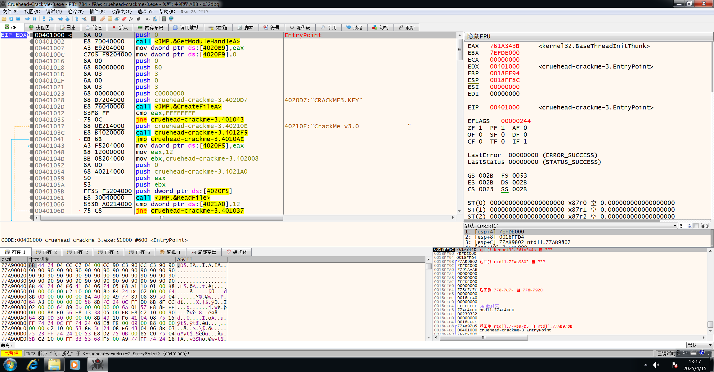
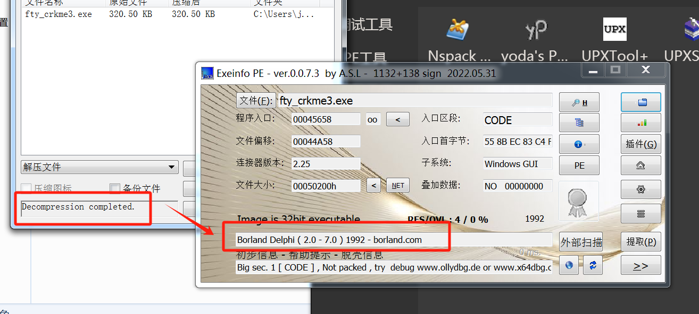

# BabyReverse-CrackMe160

## 003-Cruehead-CrackMe3

先使用PEiD分析程序：“MASM32 / TASM32 \[Overlay]”和“TASM MASM”提示程序使用了MASM/TASM编译，并包含overlay数据，是一个32位程序，没有检测到程序是什么壳

<figure><figcaption></figcaption></figure>

运行一下程序看看，没有发现输入，在窗口最上面显示了v3.0 Uncrack（这里截图没有显示全）

<figure><figcaption></figcaption></figure>

尝试直接使用x32dbg（刚刚知道是32位程序）进行分析，运行到入口点：

<figure><figcaption></figcaption></figure>

查看一下主模块的函数，结合刚刚运行的界面，并且符号表中有导入很多文件操作相关的系统函数，推断大致是一个文件题目：

<figure><figcaption></figcaption></figure>

看一下字符串，看到了比较关键的两个"CRACKME3.KEY"和"Good work cracker!"，一个应该是关键的key文件名，一个是逆向成功crack以后的位置，也就是从entrypoint分析到"Good work cracker!"是需要分析的部分（可以从"Good work cracker!"往上分析或者entrypoint往下分析）

<figure><figcaption></figcaption></figure>

接下来开始正式逆向，从entrypoint往下看到首先程序调用[CreateFileA](windowsapi.md#id-8.-createfilea)函数，根据函数返回的EAX值（是否有CRACKME3.KEY这个文件）进行跳转（`004010 | jne cruehead-crackme-3.401043 |`），如果没有跳转到0x401043，则会继续执行后面push和call两行，输出Uncrack的结果，接下来使用[ReadFile](windowsapi.md#id-10.-readfile)读取文件内容：

<figure><figcaption></figcaption></figure>

那么先创建一个要求验证的密钥文件的并输入一些文字进行测试：`echo 12345> CRACKME3.KEY`
\


<figure><figcaption></figcaption></figure>

然后重新在x32dbg中装载程序（在Call ReadFileA以后下个断点），运行，可以看到ReadFile将12345读取到了EBX中，注意ReadFile的参数`004010 | push cruehead-crackme-3.4021A0 |`，根据ReadFIle函数的define，第二个参数：`push    lpNumberOfBytesRead; 实际读取字节数存储地址`这个地址应该存放读取的字节数，然后call以后下一行`004010 | cmp dword ptr ds:[4021A0],12 |`将`[4021A0]` 和`0x12（18）` 进行比较，在内存中查看这个地址，是0x5（刚刚在key文件中写入的12345正好是5字节），如果`[4021A0]` 不为18，那么会跳转到0x401037：

```
00401037 | push cruehead-crackme-3.40210 | 40210E:"CrackMe v3.0 "
0040103C | call cruehead-crackme-3.4012F | 输出Uncrack的结果
```

<figure><figcaption></figcaption></figure>

<figure><figcaption></figcaption></figure>

那么我们要把Key文件里面的输入改为18字节（需要重新装载程序），成功通过字节数验证，执行后续代码：

<figure><figcaption></figcaption></figure>

然后传递地址`[0x402008] 刚刚读取的文件内容`作为参数，call函数以后对我们输入的字符串进行变换，最后结果将值存放在原地址：`"pppppppppzz~~z5678"`&#x20;

```
0040106F | push cruehead-crackme-3.402008 | 402008:"pppppppppzz~~z5678"
00401074 | call cruehead-crackme-3.401311 |
```

接下来我们分析cruehead-crackme-3.401311这个函数在干什么，下断点在0x00401074以后步进函数，结束条件：循环14次 0x4F-41 = 14，结果\[0x4020F9] `sum += input[i] ^ (0x41+i)`

```wasm
#实现对传入字符串的逐字节“解密”操作
#其核心思路是使用一个初始值 0x41 对字符串的每个字符进行异或运算

00401311  | xor ecx,ecx                      |
00401313  | xor eax,eax                      |
00401315  | mov esi,dword ptr ss:[esp+4]     | [esp+4]:"123456789012345678"
00401319  | mov bl,41                        | 41:'A' 初始值 0x41 
0040131B  | mov al,byte ptr ds:[esi]         | 逐字节，读取一个字节的值
0040131D  | xor al,bl                        | 对读取的字符进行异或运算
0040131F  | mov byte ptr ds:[esi],al         | 将异或后的结果写回原内存地址 [ESI]，覆盖原字符
00401321  | inc esi                          | 将 ESI 自增，指向下一个字符
00401322  | inc bl                           | 将 BL 自增，作为下一个字符的异或键
00401324  | add dword ptr ds:[4020F9],eax    | 将 AL 加到地址 0x4020F9 处的全局变量上
0040132A  | cmp al,0                         | 判断异或后的字符是否为 0（字符串结束标志）
0040132C  | je cruehead-crackme-3.401335     | 是则退出循环，不是就继续
0040132E  | inc cl                           | cl计数器自增
00401330  | cmp bl,4F                        | 4F:'O' 如果 BL 达到 0x4F 
00401333  | jne cruehead-crackme-3.40131B    | 退出循环
00401335  | mov dword ptr ds:[402149],ecx    | 地址 0x4020F9 处的全局变量赋值到ecx
0040133B  | ret                              | 
```

然后调用cruehead-crackme-3.40133C，参数也是402008:"pppppppppzz\~\~z5678"

```
00401086 | push cruehead-crackme-3.402008 | 402008:"pppppppppzz~~z5678"
0040108B | call cruehead-crackme-3.40133C | 取[0x402008]最后4位倒序5678到EAX：38 37 36 00
```

<figure><figcaption></figcaption></figure>

将文件内容后4位倒序与sum值对比：

```
00401090  | add esp,4                        |
00401093  | cmp eax,dword ptr ds:[4020F9]    | #将文件内容后4位倒序与sum值对比
00401099  | sete al                          |
0040109C  | push eax                         |
0040109D  | test al,al                       |
0040109F  | je cruehead-crackme-3.401037     |
004010A1  | push cruehead-crackme-3.40210E   | 40210E:"CrackMe v3.0             "
004010A6  | call cruehead-crackme-3.401346   |
```

所以我们只需要将最后4字节设置为地址里面的值就可以通过校验了：

<figure><figcaption></figcaption></figure>

<figure><figcaption></figcaption></figure>

<figure><figcaption></figcaption></figure>

这样子就完成了crack，显示的用户名是刚刚12345678901234逐字节运算以后的结果，根据解密算法使用的异或具有可逆性，如果想要指定的用户名，可以编写注册机：

```cpp
#include <stdio.h>
#include <string.h>

int main() {
	char user[15] = {20}; user[14] = 0; 
	char code[19] = {0};
	int i, len;
	printf("Username: ");
	fgets(user, sizeof(user), stdin);
	len = strlen(user) - 1;
	if(len > 14){
		printf("too long\n");
		return 0; 
	}
	int sum = 0;
	for(i=0; i<14; i++){
		sum += user[i];
	}
	for(i=0x41; i<0x4F; i++){
		code[i-0x41] = user[i-0x41] ^ i;
	}
	sum = sum ^ 0x12345678;
	code[14] = sum & 0xFF; sum = sum >> 8;
	code[15] = sum & 0xFF; sum = sum >> 8;
	code[16] = sum & 0xFF; sum = sum >> 8;
	code[17] = sum & 0xFF;
    FILE *file = fopen("CRACKME3.KEY", "w");
    if (file == NULL) {
        printf("Error: Unable to create file.\n");
        return 1;
    }
    fwrite(code, 1, 18, file); // 写入序列号，长度为18字节
    fclose(file);

    printf("Key saved to CRACKME3.KEY\n");
    getchar();
    return 0;
}

```

运行，成功crack并显示我们需要的用户名

<figure><figcaption></figcaption></figure>

<figure><figcaption></figcaption></figure>


## 012-ACG-crcme1 <a href="#articlecontentid" id="articlecontentid"></a>

常规PEiD检测一下，32位，未知加壳，运行，对话框可以输入name和serial

在x32dbg中分析，首先看到Createfile操作，然后检测文件内容长度（0xC通过校验），然后readfile，IDA中分析一下：

<figure><figcaption></figcaption></figure>

<figure><figcaption></figcaption></figure>

可以看到通过校验以后输出对话框`Key File OK teraz tylko Name/Serial!`所以根据判断条件`result = ((byte[lpBuffer] ^ 0x1b) * 4)` 编写代码反推key内容：

```python
F:\Mycode\crackme\012-ACG-crcme1>python
>>> res = [0x168,0x160,0x170,0xEC,0x13C,0x1CC,0x1F8,0xEC,0x164,0x1F8,0x1A0,0x1BC]
>>> key = ''
>>> for i in range(len(res)):
...     key += chr((res[i] // 4) ^ 0x1b)
...
>>> print(key)
ACG The Best
```

<figure><figcaption></figcaption></figure>

然后点击以后进行name和serial的输入，下断点以后进行测试（name=aaaaa，serial=bbbbb）

<figure><figcaption></figcaption></figure>

可以看到有一个循环，`cmp bl,20`是循环出口（每次取name的一个字符，直至为结束字符0x20时退出）

```wasm
00401286    | mov bl,byte ptr ds:[edi]        | edi:"aaaaa"
00401288    | cmp bl,20                       | 20:' '
0040128B    | jb crcme1.401326                |
00401291    | add eax,ebx                     |
00401293    | inc edi                         | edi:"aaaaa"
00401294    | cmp byte ptr ds:[edi],0         | edi:"aaaaa"
00401297    | jne crcme1.401286               |
```

最终实现的时将所有字符加和到eax，然后执行下面的代码：

```
00401299    | rol eax,3
0040129C    | xor eax,515A5 
004012A1    | push eax
```

push eax以后读取输入的序列号，可以看到一开始的判断保证序列号必须是数字，接下来进行一个循环运算，最终跳出循环以后验证eax+ebx的值是否是0x797E7，根据这个逻辑可以编写注册机：

<pre><code><strong>004012A8    | mov esi,crcme1.40212E           | esi:"bbbbbb", 40212E:"bbbbbb"
</strong>004012AD    | mov eax,A                       | A:'\n'
004012B2    | mov bl,byte ptr ds:[esi]        | esi:"bbbbbb" 读取serial
004012B4    | test ebx,ebx                    |
004012B6    | je crcme1.4012CD                |
004012B8    | cmp bl,30                       | 30:'0'
004012BB    | jb crcme1.401326                | 第一位大于等于0x30跳出
004012BD    | cmp bl,39                       | 39:'9' 
004012C0    | jg crcme1.401326                | 第一位小于等于0x39（‘9’）跳出
004012C2    | sub ebx,30                      | 获取数值
004012C5    | imul edi,eax                    | 乘10进位
004012C8    | add edi,ebx                     | 
004012CA    | inc esi                         |
004012CB    | jmp crcme1.4012AD               | 继续循环
004012CD    | xor edi,87CA                    |
004012D3    | mov ebx,edi                     | 
004012D5    | pop eax                         | 刚刚name运算的结果
004012D6    | add eax,ebx                     | 条件：
004012D8    | xor eax,797E7                   | ( name_key + (serial_value ^ 0x87CA) ) == 0x797E7

004012DD    | test eax,eax                    | serial_value = name_key ^ 0x87CA
004012DF    | jne crcme1.401326               
</code></pre>

```cpp
#include <stdio.h>
#include <stdint.h>
#include <string.h>
#include <stdlib.h>

/* 32 位循环左移 */
static uint32_t rol32(uint32_t v, unsigned int n) {
    return (v << n) | (v >> (32 - n));
}

int main(void) {
    char name[256];
    printf("Enter name: ");
    if (!fgets(name, sizeof(name), stdin)) {
        return 1;
    }
    /* 去掉末尾换行 */
    size_t len = strlen(name);
    if (len > 0 && name[len-1] == '\n') {
        name[--len] = '\0';
    }

    /* 1. 计算 name_key */
    uint32_t eax = 0;
    for (size_t i = 0; i < len; i++) {
        unsigned char c = name[i];
        if (c < 0x20) {
            fprintf(stderr, "Error: invalid character 0x%02X in name\n", c);
            return 1;
        }
        eax += c;
    }
    eax = rol32(eax, 3);
    uint32_t name_key = eax ^ 0x515A5;

    /* 2. 计算 serial_value */
    uint32_t temp = 0x797E7 - name_key;
    uint32_t serial_value = temp ^ 0x87CA;

    /* 3. 输出十进制序列号 */
    printf("Generated serial: %u\n", serial_value);
    return 0;
}

```

<figure><figcaption></figcaption></figure>


## 016-fty-crkme3

压缩包里面含三个文件，两个exe和一个nfo文件（NFO文件是“Information”的缩写，扩展名为`.nfo`，主要用于存储与数字媒体相关的元数据。常见于电影、音乐、游戏或软件发布包中，记录如版本号、文件大小、制作团队、版权声明等信息）

尝试运行一下：

<figure><figcaption></figcaption></figure>

根据提示，需要输入正确的calc计算结果（根据文件名猜另外一个unpacked.exe应该是没有加壳的版本，运行以后是一样的输入界面和结果）使用工具查一下壳，可以看到是UPX 0.89壳：

<figure><figcaption></figcaption></figure>

使用工具脱壳：

<figure><figcaption></figcaption></figure>

使用IDA进行一下静态分析，查找字符串并定位到交叉引用的地方：

<figure><figcaption></figcaption></figure>

<figure><figcaption></figcaption></figure>

可以看到成功的校验逻辑分支是

```
        if ( v72 != sub_444B20(v98, 9) + v96 )
        {
LABEL_23:
          Dialogs::ShowMessage((Dialogs *)&str_Nope__Your_calc[1], v3); //失败弹窗
          goto LABEL_25;
        }
      }
    }
    Dialogs::ShowMessage((Dialogs *)&str_Good_boy__Now_f[1], v3);//成功弹窗
    goto LABEL_25;
```

所以目标是让`v72 = sub_444B20(v98, 9) + v96` ，需要继续看v72、v98、v96这几个变量是怎么从输入计算得到的和`sub_444B20函数` 是什么功能

从函数一开始的输入开始分析，要求用户输入字符串长度为 9，且第3位和第7位是 ‘-’，其余部分是数字形如AA-BBB-CC（ascii码要求除了45就要再0x30-0x39），

<figure><figcaption></figcaption></figure>

然后接下来的代码依次提取了input\[1]、input\[3]、input\[4]....input\[8],也就是除去了要求的 ‘-’：

```

    setstr(v137, &v138);
    v136 = input[1];
    v135 = 1;
    LOBYTE(v6) = 2;
    System::__linkproc__ PStrNCat(v137, &v135, v6);
    setstr(v134, v137);
    v136 = input[3];
    v135 = 1;
    LOBYTE(v7) = 3;
    System::__linkproc__ PStrNCat(v134, &v135, v7);
    setstr(v133, v134);
    v136 = input[4];
    v135 = 1;
    LOBYTE(v8) = 4;
    System::__linkproc__ PStrNCat(v133, &v135, v8);
    setstr(v132, v133);
    v136 = input[5];
    v135 = 1;
    LOBYTE(v9) = 5;
    System::__linkproc__ PStrNCat(v132, &v135, v9);
    setstr(v131, v132);
    v136 = input[7];
    v135 = 1;
    LOBYTE(v10) = 6;
    System::__linkproc__ PStrNCat(v131, &v135, v10);
    setstr(v130, v131);
    v136 = input[8];
    v135 = 1;
    LOBYTE(v11) = 7;
    System::__linkproc__ PStrNCat(v130, &v135, v11);

```

取值操作，将取到的数字拼接到变量v136得到一个输入的7位数，这里在动态调试里面进行验证，定位字符串并下断点（尝试输入12-345-67）：

<figure><figcaption></figcaption></figure>

<figure><figcaption></figcaption></figure>

<figure><figcaption></figcaption></figure>

根据IDA定位到0x444CE0处.看到此时EAX+1处值为123456：

<figure><figcaption></figcaption></figure>

接下来看这一段，这一段取了我们刚刚处理得到后的值的每一位进行运算，关键的运算函数是sub\_444B20(num,8)，并将结果累加：

```c
  v5 = 8;                                                                              
  v41 = input;                                                                         
  LOBYTE(v41) = *input;                                                                
  LStrFromPCharLen(&v120, v41);                                                        
  v42 = Sysutils::StrToInt(v120);                                                      
  v43 = sub_444B20(v42, 8);                                                            
  v44 = input;                                                                         
  LOBYTE(v44) = input[1];                                                              
  LStrFromPCharLen(&v119, v44);                                                        
  v45 = Sysutils::StrToInt(v119);                                                      
  v46 = sub_444B20(v45, 8) + v43;                                                      
  v47 = input;                                                                         
  LOBYTE(v47) = input[3];                                                              
  LStrFromPCharLen(&v118, v47);                                                        
  v48 = Sysutils::StrToInt(v118);                                                      
  v49 = sub_444B20(v48, 8) + v46;                                                      
  v50 = input;                                                                         
  LOBYTE(v50) = input[4];                                                              
  LStrFromPCharLen(&v117, v50);                                                        
  v51 = Sysutils::StrToInt(v117);                                                      
  v52 = sub_444B20(v51, 8) + v49;                                                      
  v53 = input;                                                                         
  LOBYTE(v53) = input[5];                                                              
  LStrFromPCharLen(&v116, v53);                                                        
  v54 = Sysutils::StrToInt(v116);                                                      
  v55 = sub_444B20(v54, 8) + v52;                                                      
  v56 = input;                                                                         
  LOBYTE(v56) = input[7];                                                              
  LStrFromPCharLen(&v115, v56);                                                        
  v57 = Sysutils::StrToInt(v115);                                                      
  v58 = sub_444B20(v57, 8) + v55;                                                      
  v59 = input;                                                                         
  LOBYTE(v59) = input[8];                                                              
  LStrFromPCharLen(&v114, v59);                                                        
  v60 = Sysutils::StrToInt(v114);                                                      
  v61 = sub_444B20(v60, 8) + v58;                                                      
  v62 = input;                                                                         
  LOBYTE(v62) = input[9];                                                              
  LStrFromPCharLen(&v113, v62);                                                        
```

分析一下sub\_444B20函数，发现是一个简单的幂函数，计算数字arg\[1]的（arg\[2]-1）次方

```c
int __fastcall sub_444B20(int result, int a2)
{
  int v2; // ecx
  bool v3; // cc
  int v4; // edx
  int v5; // edx
  //a2=8
  v2 = result;//记录原始乘方底数
  v3 = a2 < 2; //v3 = false
  v4 = a2 - 2; // v4 = 6
  if ( !v3 )
  {
    v5 = v4 + 1; //v5 = 7
    do
    {
      result *= v2; //乘方
      --v5;
    }
    while ( v5 );
  }
  return result;
}
```

if条件要求最后累加以后的值是自己本身（经典水仙花数），

* **输入格式**：形如 `"12-345-67"`
*   **规则**：将所有 `-` 去除，得到一个长度为7的字符串 `D`，只要： $$\text{int}(D[0])^7 + \text{int}(D[1])^7 + \cdots + \text{int}(D[6])^7 = \text{int}(D)$$


那么编写注册机遍历寻找满足的值：

```python
def is_valid_serial(num_str):
    """判断一个7字符数字字符串是否是有效序列号：每位数字的7次方之和等于其整数值"""
    total = sum(int(d) ** 7 for d in num_str)
    return total == int(num_str)

def find_valid_serials():
    """查找所有满足条件的7位（包含前导0）合法序列号"""
    valid_serials = []
    for i in range(0, 10**7):  # 遍历0000000 到 9999999
        num_str = f"{i:07d}"  # 保证保留前导0，长度为7
        if is_valid_serial(num_str):
            valid_serials.append(num_str)
    return valid_serials

def format_serial(serial):
    """格式化为 xx-xxx-xx 的序列号"""
    return f"{serial[:2]}-{serial[2:5]}-{serial[5:]}"

if __name__ == "__main__":
    serials = find_valid_serials()
    for s in serials:
        print(format_serial(s))

```

<figure><figcaption></figcaption></figure>

验证，所有的序列号都输入正确：

<figure><figcaption></figcaption></figure>

<figure><figcaption></figcaption></figure>


<figure><figcaption></figcaption></figure>


<figure><figcaption></figcaption></figure>
