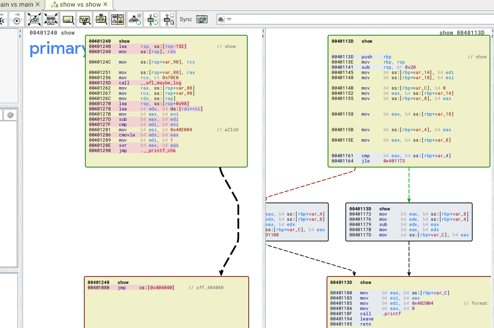
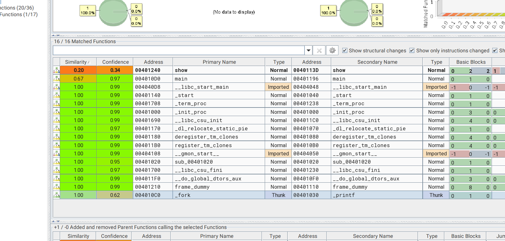
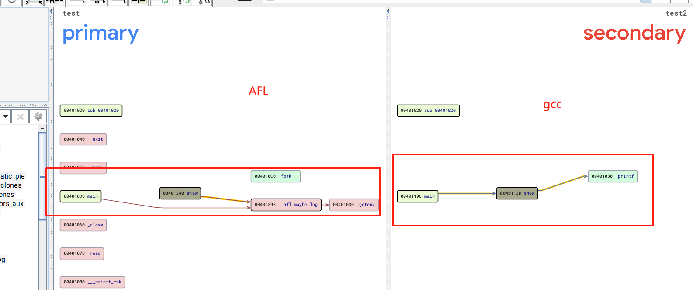

# AFL-Source-Code-Reading

### AFL代码设计框架

**插桩部分**

1. 普通插桩，针对源码的插桩：[afl-gcc.c](afl-source-code-reading.md#afl-gcc.c), [afl-as.c](afl-source-code-reading.md#afl-as.c), [afl-as.h](afl-source-code-reading.md#afl-as.h)。可用编译器有 clang 和 gcc。
2. llvm插桩，针对源码的插桩

**fuzzer 模块**

1. [afl-fuzz.c](afl-source-code-reading.md#afl-fuzz.c)：实现 fuzzer 的核心代码，是 AFL 的主体

## 汇编知识回顾


MyGitBook


## AFL-gcc.c

首先从程序的入口点**`main(int argc, char** argv)`**开始分析：在main中AFL 会初始化，开始其模糊测试流程。所有的输入参数都会在这里被处理，整个程序的执行流程从这里开始。

```cpp
int main(int argc, char** argv) {

  if (isatty(2) && !getenv("AFL_QUIET")) {

    SAYF(cCYA "afl-cc " cBRI VERSION cRST " by <lcamtuf@google.com>\n");

  } else be_quiet = 1;

  if (argc < 2) {

    SAYF("\n"
         "This is a helper application for afl-fuzz. It serves as a drop-in replacement\n"
         "for gcc or clang, letting you recompile third-party code with the required\n"
         "runtime instrumentation. A common use pattern would be one of the following:\n\n"

         "  CC=%s/afl-gcc ./configure\n"
         "  CXX=%s/afl-g++ ./configure\n\n"

         "You can specify custom next-stage toolchain via AFL_CC, AFL_CXX, and AFL_AS.\n"
         "Setting AFL_HARDEN enables hardening optimizations in the compiled code.\n\n",
         BIN_PATH, BIN_PATH);

    exit(1);

  }
  //从这里开始AFL-Fuzz的流程：

  find_as(argv[0]); //获取使用的汇编器

  edit_params(argc, argv); //对编译选项进行编辑

  execvp(cc_params[0], (char**)cc_params); //进行编译

  FATAL("Oops, failed to execute '%s' - check your PATH", cc_params[0]);

  return 0;

}
```

先调用`find_as(argv[0])`获取使用的汇编器，再调用`edit_params(argc, argv)`对编译选项进行编辑，再通过`execvp`去进行编译

接下来就按照流程分析这三个函数

### find\_as(argv\[0])

总结来说这个函数是用来寻找`afl-as`的位置，变量`afl-as`标识使用的汇编器，完整代码分析：

```cpp
static void find_as(u8* argv0) {

  u8 *afl_path = getenv("AFL_PATH");
  //检查是否存在AFL_PATH这个环境变量
  //如果存在就赋值给afl_path
  u8 *slash, *tmp;
  //slash和tmp指针用于后续检索afl_path/as文件和命令行参数
  
  
  if (afl_path) {
    tmp = alloc_printf("%s/as", afl_path);
    if (!access(tmp, X_OK)) {//检查afl_path/as这个文件是否可以访问
    //如果afl_path/as可以访问，就将afl_path设置为as_path
      as_path = afl_path;
      ck_free(tmp);
      return;
    }
    ck_free(tmp);
  }

  slash = strrchr(argv0, '/')//初始化slash指针指向argv[0]中第一个‘/’的位置
  
  //检查argv0
  if (slash) {//如果参数中有'/'

    u8 *dir;
    //找到最后一个’/‘所在的位置
    *slash = 0;
    dir = ck_strdup(argv0);//取其前面的字符串作为dir
    *slash = '/';

    tmp = alloc_printf("%s/afl-as", dir);
    //检查dir/afl-as这个文件是否可以访问，如果可以访问，就将dir设置为as_path
    if (!access(tmp, X_OK)) {
      as_path = dir;
      ck_free(tmp);
      return;
    }
    ck_free(tmp);
    ck_free(dir);

  }
  //如果上述两种方式都失败，则抛出异常
  if (!access(AFL_PATH "/as", X_OK)) {
    as_path = AFL_PATH;
    return;
  }

  FATAL("Unable to find AFL wrapper binary for 'as'. Please set AFL_PATH");
 
}
```

### edit\_params(u32argc,char\*\* argv)

总结来说这个函数是将argv拷贝到`u8 **cc_params`中，并做必要的编辑。

u8 \*\*cc\_params变量是一个全局变量，声明如下：

```cpp
static u8** cc_params;              /* Parameters passed to the real CC  */
```

<pre class="language-cpp"><code class="lang-cpp">static void edit_params(u32 argc, char** argv) {

  u8 fortify_set = 0, asan_set = 0;
  u8 *name;

#if defined(__FreeBSD__) &#x26;&#x26; defined(__x86_64__)
  u8 m32_set = 0;
#endif
  //通过ck_alloc来为cc_params分配内存，长度为(argc+128)*8,是一个比较大的空间
  cc_params = ck_alloc((argc + 128) * sizeof(u8*));
  
  //检查argv[0]里有没有’/‘，如果没有就赋值’argv[0]’到name，
  name = strrchr(argv[0], '/');
  //找到最后一个’/‘所在的位置，name的值为最后一个'/'后面字符串的值
  if (!name) name = argv[0]; else name++;
  
  //将name和afl-clang比较
  if (!strncmp(name, "afl-clang", 9)) {
  //这里strcmp第三个参数为9，即比较前9个字符，如果name="afl-clang++"这样也会进入这个
    clang_mode = 1;//设置环境变量CLANG_ENV_VAR为1
    setenv(CLANG_ENV_VAR, "1", 1);
    if (!strcmp(name, "afl-clang++")) {//afl-clang++的情况
      u8* alt_cxx = getenv("AFL_CXX");//获取环境变量AFL_CXX的值
      //如果该值存在，则将cc_params[0]设置为该值
      //如果不存在，就设置为clang++
      cc_params[0] = alt_cxx ? alt_cxx : (u8*)"clang++";
    } else {//afl-clang的情况同理
      u8* alt_cc = getenv("AFL_CC");
      cc_params[0] = alt_cc ? alt_cc : (u8*)"clang";
    }
  } else {

    /* With GCJ and Eclipse installed, you can actually compile Java! The
       instrumentation will work (amazingly). Alas, unhandled exceptions do
       not call abort(), so afl-fuzz would need to be modified to equate
       non-zero exit codes with crash conditions when working with Java
       binaries. Meh. */
       
//MacOS的情况
#ifdef __APPLE__
    if (!strcmp(name, "afl-g++")) cc_params[0] = getenv("AFL_CXX");
    else if (!strcmp(name, "afl-gcj")) cc_params[0] = getenv("AFL_GCJ");
    else cc_params[0] = getenv("AFL_CC");
    if (!cc_params[0]) {
      SAYF("\n" cLRD "[-] " cRST
           "On Apple systems, 'gcc' is usually just a wrapper for clang. Please use the\n"
           "    'afl-clang' utility instead of 'afl-gcc'. If you really have GCC installed,\n"
           "    set AFL_CC or AFL_CXX to specify the correct path to that compiler.\n");
      FATAL("AFL_CC or AFL_CXX required on MacOS X");
    }
//非MacOS的情况
#else
    //将name和afl-g++比较
    if (!strcmp(name, "afl-g++")) {
    //如果相同，则获取环境变量AFL_CXX的值，
    //如果该值存在，则将cc_params[0]设置为该值，如果不存在，就设置为g++
      u8* alt_cxx = getenv("AFL_CXX");
      cc_params[0] = alt_cxx ? alt_cxx : (u8*)"g++";
    } else if (!strcmp(name, "afl-gcj")) {
      u8* alt_cc = getenv("AFL_GCJ");
      cc_params[0] = alt_cc ? alt_cc : (u8*)"gcj";
    } else {
      u8* alt_cc = getenv("AFL_CC");
      cc_params[0] = alt_cc ? alt_cc : (u8*)"gcc";
    }
#endif /* __APPLE__ */
  }
  //从argv[1]开始遍历编译选项，
  while (--argc) {
<strong>    u8* cur = *(++argv); 
</strong>  //跳过-B -integrated-as -pipe这三个选项，因为edit_params会自动添加这三个编译选项
    if (!strncmp(cur, "-B", 2)) {
      if (!be_quiet) WARNF("-B is already set, overriding");
      if (!cur[2] &#x26;&#x26; argc > 1) { argc--; argv++; }
      continue;
    }
    if (!strcmp(cur, "-integrated-as")) continue;
    if (!strcmp(cur, "-pipe")) continue;

//根据参数设置相关的cc_params参数
#if defined(__FreeBSD__) &#x26;&#x26; defined(__x86_64__)
    if (!strcmp(cur, "-m32")) m32_set = 1;
#endif
    if (!strcmp(cur, "-fsanitize=address") ||
        !strcmp(cur, "-fsanitize=memory")) asan_set = 1;
    if (strstr(cur, "FORTIFY_SOURCE")) fortify_set = 1;
    cc_params[cc_par_cnt++] = cur;
  }

  cc_params[cc_par_cnt++] = "-B";
  cc_params[cc_par_cnt++] = as_path;

  if (clang_mode)
    cc_params[cc_par_cnt++] = "-no-integrated-as";

  if (getenv("AFL_HARDEN")) {

    cc_params[cc_par_cnt++] = "-fstack-protector-all";

    if (!fortify_set)
      cc_params[cc_par_cnt++] = "-D_FORTIFY_SOURCE=2";

  }

  if (asan_set) {

    /* Pass this on to afl-as to adjust map density. */

    setenv("AFL_USE_ASAN", "1", 1);

  } else if (getenv("AFL_USE_ASAN")) {

    if (getenv("AFL_USE_MSAN"))
      FATAL("ASAN and MSAN are mutually exclusive");

    if (getenv("AFL_HARDEN"))
      FATAL("ASAN and AFL_HARDEN are mutually exclusive");

    cc_params[cc_par_cnt++] = "-U_FORTIFY_SOURCE";
    cc_params[cc_par_cnt++] = "-fsanitize=address";

  } else if (getenv("AFL_USE_MSAN")) {

    if (getenv("AFL_USE_ASAN"))
      FATAL("ASAN and MSAN are mutually exclusive");

    if (getenv("AFL_HARDEN"))
      FATAL("MSAN and AFL_HARDEN are mutually exclusive");

    cc_params[cc_par_cnt++] = "-U_FORTIFY_SOURCE";
    cc_params[cc_par_cnt++] = "-fsanitize=memory";
  }

  if (!getenv("AFL_DONT_OPTIMIZE")) {

#if defined(__FreeBSD__) &#x26;&#x26; defined(__x86_64__)

    /* On 64-bit FreeBSD systems, clang -g -m32 is broken, but -m32 itself
       works OK. This has nothing to do with us, but let's avoid triggering
       that bug. */

    if (!clang_mode || !m32_set)
      cc_params[cc_par_cnt++] = "-g";

#else

      cc_params[cc_par_cnt++] = "-g";

#endif

    cc_params[cc_par_cnt++] = "-O3";
    cc_params[cc_par_cnt++] = "-funroll-loops";

    /* Two indicators that you're building for fuzzing; one of them is
       AFL-specific, the other is shared with libfuzzer. */

    cc_params[cc_par_cnt++] = "-D__AFL_COMPILER=1";
    cc_params[cc_par_cnt++] = "-DFUZZING_BUILD_MODE_UNSAFE_FOR_PRODUCTION=1";

  }

  if (getenv("AFL_NO_BUILTIN")) {

    cc_params[cc_par_cnt++] = "-fno-builtin-strcmp";
    cc_params[cc_par_cnt++] = "-fno-builtin-strncmp";
    cc_params[cc_par_cnt++] = "-fno-builtin-strcasecmp";
    cc_params[cc_par_cnt++] = "-fno-builtin-strncasecmp";
    cc_params[cc_par_cnt++] = "-fno-builtin-memcmp";
    cc_params[cc_par_cnt++] = "-fno-builtin-strstr";
    cc_params[cc_par_cnt++] = "-fno-builtin-strcasestr";

  }

  cc_params[cc_par_cnt] = NULL;

}
</code></pre>

### execvp(cc\_params\[0], (char \*\*) cc\_params)

将处理好的命令行参数传给execvp进行编译，execvp()会从环境变量所指的目录中查找符合参数 file 的文件名, 找到后执行该文件, 然后将第二个参数argv 传给该执行的文件。

总的来说`alf-gcc.c`是处理基本的输入参数，对`gcc或clang`进行包装。其中`-B as_path`实际上是给其指定汇编器，也就是下面要分析的`afl-as`。实际的插桩也就是在`afl-as`里进行插桩的

## AFL-as.c

还是一样的从程序入口点**`int main(int argc, char** argv)`**开始分析，这里只摘取关键的部分进行分析：

```cpp
int main(int argc, char** argv) {

  ......
  
  u8* inst_ratio_str = getenv("AFL_INST_RATIO");           // 获取环境变量 AFL_INST_RATIO
  
  ......
  
  //通过当前时间和进程号来获取并设置srandom的随机种子
  gettimeofday(&tv, &tz);
  rand_seed = tv.tv_sec ^ tv.tv_usec ^ getpid();
  srandom(rand_seed);
  
  //调用edit_params，用于处理和修改 AFL 工具的命令行参数
  edit_params(argc, argv);

  if (inst_ratio_str) {// 检测 inst_ratio_str 是否合法
    if (sscanf(inst_ratio_str, "%u", &inst_ratio) != 1 || inst_ratio > 100) 
      FATAL("Bad value of AFL_INST_RATIO (must be between 0 and 100)");
  }

  // 获取并设置环境变量 AS_LOOP_ENV_VAR
  if (getenv(AS_LOOP_ENV_VAR))
    FATAL("Endless loop when calling 'as' (remove '.' from your PATH)");
  setenv(AS_LOOP_ENV_VAR, "1", 1);

  if (getenv("AFL_USE_ASAN") || getenv("AFL_USE_MSAN")) {
  //环境变量AFL_USE_ASAN和AFL_USE_MSAN如果有一个存在就设置 sanitizer = 1，inst_ratio /= 3
    sanitizer = 1;
    inst_ratio /= 3;  
  }  
  //参考了博客，这是因为在进行ASAN的编译时，AFL无法识别出ASAN特定的分支
  //导致插入很多无意义的桩代码，所以直接暴力地将插桩概率/3
  //这里我是第一次接触Asan，参考了一篇文章：https://blog.csdn.net/lhl_blog/article/details/12942143
  //Asan是Google专门为C/C++开发的内存错误探测工具,包括编译器指令模块和运行时库两部分组成
  //编译器插桩模块:在程序编译时加入控制指令，用于监测程序的所有内存使用行为
  //运行时库:替换glibc库的malloc/free函数
  //实现内存的分配和释放操作,
  //malloc执行完后，已分配内存的前后（称为“红区”）会被标记为“中毒”状态
  //而释放的内存则会被隔离起来（暂时不会分配出去）且也会被标记为“中毒”状态
  
  if (!just_version) add_instrumentation();// 调用关键插装函数

  if (!(pid = fork())) {
  // fork 出一个子进程，执行 execvp(as_params[0], (char**)as_params);
    execvp(as_params[0], (char**)as_params); 
    FATAL("Oops, failed to execute '%s' - check your PATH", as_params[0]);
  }
  if (waitpid(pid, &status, 0) <= 0) PFATAL("waitpid() failed"); // 等待子进程结束

  if (!getenv("AFL_KEEP_ASSEMBLY")) unlink(modified_file);//读取环境变量AFL_KEEP_ASSEMBLY的值，
  //如果没有设置这个环境变量，就unlink掉modified_file
  ......
}

```

这里注意到main中是fork了一个子进程来执行 `execvp(as_params[0]，(char**)as_params)`的，为什么要进行fork？这其实是因为execvp执行的时候，会用`as_params[0]`来完全替换掉当前进程空间中的程序，如果不通过子进程来执行实际的as，那么后续就无法在执行完实际的as之后，还能unlink掉modified\_file

### edit\_params(argc, argv)

总结来说是获取编辑汇编器所用到的参数，这一部分代码不是关键所以没有仔细阅读，如果后续有必要再进行补充阅读

### add\_instrumentation()

这个函数是插装的关键函数，处理输入文件，生成modified\_file，将instrumentation插入所有适当的位置。

**afl的插桩相当简单粗暴：通过`汇编的前导命令`来判断这是否是一个分支或者函数，然后插入instrumentation trampoline。**

接下来是对这个函数的详细分析阅读：


```cpp
/* Process input file, generate modified_file. Insert instrumentation in all
   the appropriate places. */

static void add_instrumentation(void) {
//*************************************************************************
//对输入文件的处理部分，不是很重要，略读
  static u8 line[MAX_LINE];
  FILE* inf;
  FILE* outf;
  s32 outfd;
  u32 ins_lines = 0;
  u8  instr_ok = 0, skip_csect = 0, skip_next_label = 0,
      skip_intel = 0, skip_app = 0, instrument_next = 0;
#ifdef __APPLE__
  u8* colon_pos;
#endif /* __APPLE__ */
  if (input_file) {       // 判断文件是否存在并可读
    inf = fopen(input_file, "r");
    if (!inf) PFATAL("Unable to read '%s'", input_file);
  } else inf = stdin; // 文件不存在，则标准输入作为 input_file
  outfd = open(modified_file, O_WRONLY | O_EXCL | O_CREAT, 0600); 
  //打开modified_file对应的临时文件,获取其句柄outfd
  if (outfd < 0) PFATAL("Unable to write to '%s'", modified_file);
  //根据句柄通过fdopen函数拿到FILE*指针outf
  outf = fdopen(outfd, "w");
  if (!outf) PFATAL("fdopen() failed");  
//*************************************************************************

  while (fgets(line, MAX_LINE, inf)) {  //逐行从inf读取文件到line数组里
    /* In some cases, we want to defer writing the instrumentation trampoline
       until after all the labels, macros, comments, etc. If we're in this
       mode, and if the line starts with a tab followed by a character, dump
       the trampoline now. */
    // 判断是否满足插桩条件
    if (!pass_thru && !skip_intel && !skip_app && !skip_csect && instr_ok && 
        instrument_next && line[0] == '\t' && isalpha(line[1])) {
      //根据use_64bit插入相应的插桩代码
      fprintf(outf, use_64bit ? trampoline_fmt_64 : trampoline_fmt_32, R(MAP_SIZE));
      instrument_next = 0;
      ins_lines++;
    }

    /* Output the actual line, call it a day in pass-thru mode. */
    fputs(line, outf);   // 把 line 写到 modified_file 里

    if (pass_thru) continue;
    //只对.text进行插桩
    /* All right, this is where the actual fun begins. For one, we only want to  
       instrument the .text section. So, let's keep track of that in processed 
       files - and let's set instr_ok accordingly. */

    if (line[0] == '\t' && line[1] == '.') {
  
      /* OpenBSD puts jump tables directly inline with the code, which is
         a bit annoying. They use a specific format of p2align directives
         around them, so we use that as a signal. */

      if (!clang_mode && instr_ok && !strncmp(line + 2, "p2align ", 8) &&
          isdigit(line[10]) && line[11] == '\n') skip_next_label = 1;

      if (!strncmp(line + 2, "text\n", 5) || // 如果 line 的值为 \t.text\n
          !strncmp(line + 2, "section\t.text", 13) ||  // 或 \t.section\t.text
          !strncmp(line + 2, "section\t__TEXT,__text", 21) || // 或 \t.section\t__TEXT,__text
          !strncmp(line + 2, "section __TEXT,__text", 21)) { // 或 \t.section __TEXT,__text
        instr_ok = 1;    // 标记在.text 段
        // 设置 instr_ok = 1，并跳转到开头读取下一行内容
        continue; 
      }

      if (!strncmp(line + 2, "section\t", 8) || // 如果 line 的值为 \t.section\t
          !strncmp(line + 2, "section ", 8) ||  // 或 \t.section
          !strncmp(line + 2, "bss\n", 4) || // 或 \tbss\n
          !strncmp(line + 2, "data\n", 5)) {  // 或 \tdata\n
        instr_ok = 0;  // 设置 instr_ok = 0，不在.text段，跳转到开头读取下一行内容
        continue;
      }

    }
    // 接下来设置一些其他的标志
    // 跳过与设置架构不同的架构的汇编，跳过Intel汇编，跳过内联汇编的插桩。
    /* Detect off-flavor assembly (rare, happens in gdb). When this is
       encountered, we set skip_csect until the opposite directive is
       seen, and we do not instrument. */

    if (strstr(line, ".code")) {  // 判断 off-flavor
      if (strstr(line, ".code32")) skip_csect = use_64bit;
      if (strstr(line, ".code64")) skip_csect = !use_64bit;
    }

    /* Detect syntax changes, as could happen with hand-written assembly.
       Skip Intel blocks, resume instrumentation when back to AT&T. */

    if (strstr(line, ".intel_syntax")) skip_intel = 1; // 跳过 Intel汇编的插桩
    if (strstr(line, ".att_syntax")) skip_intel = 0;

    /* Detect and skip ad-hoc __asm__ blocks, likewise skipping them. */

    if (line[0] == '#' || line[1] == '#') { // 跳过 ad-hoc __asm__(内联汇编) 的插桩

      if (strstr(line, "#APP")) skip_app = 1;
      if (strstr(line, "#NO_APP")) skip_app = 0;

    }

    /* If we're in the right mood for instrumenting, check for function
       names or conditional labels. This is a bit messy, but in essence,
       we want to catch:

         ^main:      - function entry point (always instrumented)
         ^.L0:       - GCC branch label
         ^.LBB0_0:   - clang branch label (but only in clang mode)
         ^\tjnz foo  - conditional branches

       ...but not:

         ^# BB#0:    - clang comments
         ^ # BB#0:   - ditto
         ^.Ltmp0:    - clang non-branch labels
         ^.LC0       - GCC non-branch labels
         ^.LBB0_0:   - ditto (when in GCC mode)
         ^\tjmp foo  - non-conditional jumps

       Additionally, clang and GCC on MacOS X follow a different convention
       with no leading dots on labels, hence the weird maze of #ifdefs
       later on.

     */

    if (skip_intel || skip_app || skip_csect || !instr_ok ||
        line[0] == '#' || line[0] == ' ') continue;

    /* Conditional branch instruction (jnz, etc). We append the instrumentation
       right after the branch (to instrument the not-taken path) and at the
       branch destination label (handled later on). */

    if (line[0] == '\t') {
      if (line[1] == 'j' && line[2] != 'm' && R(100) < inst_ratio) {
        fprintf(outf, use_64bit ? trampoline_fmt_64 : trampoline_fmt_32,          
        // 通过 use_64bit，判断写入trampoline_fmt_64还是trampoline_fmt_32
                R(MAP_SIZE));
        ins_lines++;
      }
      continue;
    }

    /* Label of some sort. This may be a branch destination, but we need to
       tread carefully and account for several different formatting
       conventions. */

#ifdef __APPLE__

    /* Apple: L<whatever><digit>: */

    if ((colon_pos = strstr(line, ":"))) {

      if (line[0] == 'L' && isdigit(*(colon_pos - 1))) {

#else

    /* Everybody else: .L<whatever>: */

    if (strstr(line, ":")) {  // 检查 line 里是否有 :

      if (line[0] == '.') { // 判断 line 是否以 . 开始

#endif /* __APPLE__ */

        /* .L0: or LBB0_0: style jump destination */

#ifdef __APPLE__

        /* Apple: L<num> / LBB<num> */

        if ((isdigit(line[1]) || (clang_mode && !strncmp(line, "LBB", 3)))
            && R(100) < inst_ratio) {

#else

        /* Apple: .L<num> / .LBB<num> */

        if ((isdigit(line[2]) || (clang_mode && !strncmp(line + 1, "LBB", 3)))   
        // 如果 line[2] 是数字，或者在 clang 模式下，line = .LBB
            && R(100) < inst_ratio) {

#endif /* __APPLE__ */

          /* An optimization is possible here by adding the code only if the
             label is mentioned in the code in contexts other than call / jmp.
             That said, this complicates the code by requiring two-pass
             processing (messy with stdin), and results in a speed gain
             typically under 10%, because compilers are generally pretty good
             about not generating spurious intra-function jumps.

             We use deferred output chiefly to avoid disrupting
             .Lfunc_begin0-style exception handling calculations (a problem on
             MacOS X). */

          if (!skip_next_label) instrument_next = 1; else skip_next_label = 0; // 如果 skip_next_label == 0

        }

      } else { // 否则就是函数(function)，给 function 直接设置 instrument_next = 1

        /* Function label (always instrumented, deferred mode). */

        instrument_next = 1;
    
      }

    }

  }

  if (ins_lines)
    fputs(use_64bit ? main_payload_64 : main_payload_32, outf);
    // 通过 use_64bit判断，向 outf 里写入 main_payload_64 还是 main_payload_32

  if (input_file) fclose(inf);
  fclose(outf);

  if (!be_quiet) {

    if (!ins_lines) WARNF("No instrumentation targets found%s.",
                          pass_thru ? " (pass-thru mode)" : "");
    else OKF("Instrumented %u locations (%s-bit, %s mode, ratio %u%%).",
             ins_lines, use_64bit ? "64" : "32",
             getenv("AFL_HARDEN") ? "hardened" : 
             (sanitizer ? "ASAN/MSAN" : "non-hardened"),
             inst_ratio);
 
  }

}c
```


在这个函数中核心的部分是检查 `!pass_thru && !skip_intel && !skip_app && !skip_csect && instr_ok &&instrument_next && line[0] == '\t' && isalpha(line[1])`，上述条件都满足的情况，将桩代码（在afl\_as.h）插入到所有的label、macros、comments之后，此时直接使用 `fprintf` 将桩代码 `trampoline_fmt_*` 写入到 `outf` 中，并设置 `instrument_next = 0`，插桩计数器 `ins_lines++`，在 AFL 源码中，关于重点插桩的内容有`^main`, `^.L0`, `^.LBB0_0`, `^\tjnz foo`（\_main函数， gcc和clang下的分支标记，条件跳转分支标记）

* `^main`：\_main函数
  * 在源码中，这对应于检测行是否为函数标签的逻辑。如果行以 `.` 或特定的标签（如 `main:`）开始，AFL 会设置 `instrument_next` 标志，以在下一行插入监测代码。
* `^.L0`：gcc下的分支标记
* `^.LBB0_0`：clang下的分支标记
* `^\tjnz foo`：条件跳转分支标记

## 结合示例理解afl-as插桩

工具准备：bindiff工具，下载地址&安装教程


下载地址



安装教程


编写测试程序example.c


```c
#include <stdio.h>

void show(int a, int b){

	int  x, y, z= 0;
	x = a;
	y = b;
	if( x > y){
	  z = x + y;
	}else{
	  z = y - x;
	}
	printf("[+] Z is %d", z);
}

int main(){

  show(1,3);
  show(7,2);
  return 0;
}
```


使用AFL对其进行编译，保留生成的.s汇编文件：


```armasm
	.file	"example.c"
	.text
.Ltext0:
	.file 0 "/home/v4ler1an/Documents/AFL_debug/AFL/cmake-build-debug/tmp" "example.c"
	.section	.rodata.str1.1,"aMS",@progbits,1
.LC0:
	.string	"[+] Z is %d"
	.text
	.p2align 4
	.globl	show
	.type	show, @function
show:
.LVL0:
.LFB23:
	.file 1 "example.c"
	.loc 1 3 24 view -0
	.cfi_startproc
	.loc 1 3 24 is_stmt 0 view .LVU1

/* --- AFL TRAMPOLINE (64-BIT) --- */

.align 4

leaq -(128+24)(%rsp), %rsp
movq %rdx,  0(%rsp)
movq %rcx,  8(%rsp)
movq %rax, 16(%rsp)
movq $0x00001fa9, %rcx
call __afl_maybe_log
movq 16(%rsp), %rax
movq  8(%rsp), %rcx
movq  0(%rsp), %rdx
leaq (128+24)(%rsp), %rsp

/* --- END --- */

	endbr64
	.loc 1 5 2 is_stmt 1 view .LVU2
.LVL1:
	.loc 1 6 2 view .LVU3
	.loc 1 7 2 view .LVU4
	.loc 1 8 2 view .LVU5
	.loc 1 9 6 is_stmt 0 view .LVU6
	movl	%esi, %edx
	leal	(%rdi,%rsi), %eax
	subl	%edi, %edx
	cmpl	%esi, %edi
.LBB12:

```


使用IDA反汇编刚刚的main函数：


```c
.text:00000000004010D0 ; __unwind {
.text:00000000004010D0                 lea     rsp, [rsp-98h]
.text:00000000004010D8                 mov     [rsp+98h+var_98], rdx
.text:00000000004010DC                 mov     [rsp+98h+var_90], rcx
.text:00000000004010E1                 mov     [rsp+98h+var_88], rax
.text:00000000004010E6                 mov     rcx, 7115h
.text:00000000004010ED                 call    __afl_maybe_log
.text:00000000004010F2                 mov     rax, [rsp+98h+var_88]
.text:00000000004010F7                 mov     rcx, [rsp+98h+var_90]
.text:00000000004010FC                 mov     rdx, [rsp+98h+var_98]
.text:0000000000401100                 lea     rsp, [rsp+98h]
.text:0000000000401108                 sub     rsp, 8
.text:000000000040110C                 mov     edx, 2
.text:0000000000401111                 mov     esi, offset aZIsD ; "[+] Z is %d"
.text:0000000000401116                 mov     edi, 1
.text:000000000040111B                 xor     eax, eax
.text:000000000040111D                 call    ___printf_chk
.text:0000000000401122                 mov     edx, 9
.text:0000000000401127                 mov     esi, offset aZIsD ; "[+] Z is %d"
.text:000000000040112C                 mov     edi, 1
.text:0000000000401131                 xor     eax, eax
.text:0000000000401133                 call    ___printf_chk
.text:0000000000401138                 xor     eax, eax
.text:000000000040113A                 add     rsp, 8
.text:000000000040113E                 retn
.text:000000000040113E ; } // starts at 4010D0
.text:000000000040113E main            endp

#反汇编：
int __cdecl main(int argc, const char **argv, const char **envp)
{
  _afl_maybe_log(argc, argv, envp, 28949LL);
  __printf_chk(1LL, "[+] Z is %d", 2LL);
  __printf_chk(1LL, "[+] Z is %d", 9LL);
  return 0;
}

```


查看show函数：

<pre class="language-c" data-full-width="true"><code class="lang-c">.text:0000000000401240 ; __unwind {
.text:0000000000401240                 lea     rsp, [rsp-98h]
.text:0000000000401248                 mov     [rsp+98h+var_98], rdx
.text:000000000040124C                 mov     [rsp+98h+var_90], rcx
.text:0000000000401251                 mov     [rsp+98h+var_88], rax
.text:0000000000401256                 mov     rcx, 70E0h
.text:000000000040125D                 call    __afl_maybe_log
.text:0000000000401262                 mov     rax, [rsp+98h+var_88]
.text:0000000000401267                 mov     rcx, [rsp+98h+var_90]
.text:000000000040126C                 mov     rdx, [rsp+98h+var_98]
.text:0000000000401270                 lea     rsp, [rsp+98h]
.text:0000000000401278                 lea     edx, [x+y]
.text:000000000040127B                 mov     eax, esi
.text:000000000040127D                 sub     eax, edi
.text:000000000040127F                 cmp     edi, esi
.text:0000000000401281                 mov     esi, offset aZIsD ; "[+] Z is %d"
.text:0000000000401286                 cmovle  edx, eax
.text:0000000000401289 z = rdx                                 ; int
.text:0000000000401289                 mov     edi, 1
.text:000000000040128E                 xor     eax, eax
.text:0000000000401290                 jmp     ___printf_chk
.text:0000000000401290 ; } // starts at 401240
.text:0000000000401290 show            endp
<strong>
</strong><strong>#反汇编：
</strong><strong>void __fastcall show(int a, int b)
</strong>{
  __int64 v2; // rdx
  __int64 v3; // rcx
  __int64 v4; // rdx
  __int64 v5; // [rsp+8h] [rbp-90h]

  v5 = v3;
  _afl_maybe_log(a, b, v2);
  v4 = (unsigned int)(a + b);
  if ( a &#x3C;= b )
    v4 = (unsigned int)(b - a);
  __printf_chk(1LL, "[+] Z is %d", v4, v5);
}
</code></pre>

总结发现：AFL插入的桩代码即`_afl_maybe_log()` ，源码只在show函数中设置了一个if语句，所以AFL只在main函数和show函数中各进行了一次插桩

BinDiff对比：

<figure><figcaption></figcaption></figure>

<figure><figcaption></figcaption></figure>

<figure><figcaption></figcaption></figure>

## AFL-as.h

这个头文件负责生成要插入的桩代码 **instrumentation trampoline**，根据适当的场景插入到待fuzz程序中。桩代码会以经过异或的数据对的格式保存当前执行分支的标识和前一个分支的标识，表示起来就是 `shm_trace_map[cur_loc ^ prev_loc]++`。

桩代码包含32位和64位，除了Apple平台之外，其他平台理论上都可以成功插桩。

作者也在这个头文件中给出了一些优化的思路：“

* 真正值得优化的只有trampoline\_fmt和非设置的\_\_afl\_maybe\_log代码路径；setup / fork 服务器相对重要性较小，应保持大部分可读性。
* 有趣的是，如果我们存储一个变量指针到设置，记录或返回例程，然后在trampoline\_fmt中进行寄存器调用，对于被插装的执行并不会变得更快。然而，这确实可以大大加速非插装的执行，因为该路径只会变成push-call-ret-pop。
* 通过在固定地址处做SHM附加，而不是检索\_\_afl\_area\_ptr，实际上并不能获得很大的收益。尽管它允许我们为条件跳转和跳转标签插入更短的日志例程（从而获得大约10%的性能提升），但存在冒犯程序或ASAN等工具创建的其他分配的风险。
* popf非常慢，这就是我们正在做lahf / sahf + 溢出测试技巧的原因。遗憾的是，这强迫我们污染eax /rax，但是这种依赖于一种常用寄存器的情况仍然比使用pushf / popf的选择更好。一个可能的优化是通过使用一个循环缓冲区来避免触摸标志，该缓冲区仅存储当前位置的序列，XOR操作在离线时进行。

```assembly
.AFL_VARS:

  .lcomm   __afl_area_ptr, 8						->	共享内存地址
  .lcomm   __afl_prev_loc, 8						->	上一个插桩位置（R(MAP_SIZE)随机数的值）
  .lcomm   __afl_fork_pid, 4						->  fork生成的子进程id
  .lcomm   __afl_temp, 4								->	buffer
  .lcomm   __afl_setup_failure, 1				->	判定setup是否成功的标志位，置位表示失败，直接退出
  .comm    __afl_global_area_ptr, 8, 8	->	全局指针
```

## AFL-fast-clang.c

`afl-clang-fast.c`是针对**llvm pass**的插桩，`afl-clang-fast.c`其实是clang的一层wrapper，和之前的`afl-gcc`一样，定义了一些宏，和传递了一些参数给真正的clang，所以这部分代码简略阅读

关于 llvm 和 **llvm pass** 的内容学习，见我的另一篇笔记


[llvm-notebook.md](llvm-notebook.md)


1. `find_obj(u8* argv0)` 函数：寻找必要的 AFL 运行时库文件`afl-llvm-rt.o`。首先尝试在环境变量"AFL\_PATH"指定的地方寻找，如果没有找到，再尝试在执行程序的同一目录下寻找。如果还是找不到，就会报错退出。
2. `edit_params(u32 argc, char** argv)` 函数：修改编译参数，添加 AFL 所需的参数，例如启用 sanitizer coverage轨迹回溯功能。同时，通过环境变量可以控制开启堆栈保护、使用ASAN/MSAN等额外硬化和检查功能，增加编译的参数。
3. 在 main 函数里，首先调用 `find_obj` 找到运行时库，然后调用 `edit_params` 修改编译参数，最后调用 `execvp` 执行 clang，进行编译

## afl-llvm-pass.so.cc

首先使用llvm命名空间`using namespace llvm;` ，llvm命名空间告诉编译器，如果它在接下来的代码中遇到一个它不认识的类型、函数或变量，它应该去llvm命名空间中查找

然后在匿名命名空间中定义了一个继承自`ModulePass`的类`AFLCoverage`。在LLVM框架中，`ModulePass`是用来在整个模块层面进行某种代码分析或代码转换的抽象基类。它有一个虚函数`runOnModule`，子类应该重写这个函数来实现具体的功能

在`runOnModule`函数中`LLVMContext &C = M.getContext();`LLVMContext保存了整个程序里分配的类型和常量信息

## afl-llvm-rt.o.c <a href="#afl-llvm-rtoc" id="afl-llvm-rtoc"></a>


## afl-fuzz.c

在阅读分析完所有插桩编译的部分，现在终于来到了整个 AFL 的核心部分afl-fuzz.c，总结来说可以分为3部：

1. 初始设置：进行 fuzz 环境配置相关工作
2. fuzz 执行阶段：fuzz 的主要执行过程
3. 变异策略：测试用例的变异过程和方法

接下来是详细的分析：

源代码很长，还是从main函数入手看看main函数首先定义初始化一些需要的变量

```c

  s32 opt;
  u64 prev_queued = 0;
  u32 sync_interval_cnt = 0, seek_to;
  u8  *extras_dir = 0;
  u8  mem_limit_given = 0;
  u8  exit_1 = !!getenv("AFL_BENCH_JUST_ONE");
  char** use_argv;

  struct timeval tv;
  struct timezone tz;

  SAYF(cCYA "afl-fuzz " cBRI VERSION cRST " by <lcamtuf@google.com>\n");

  doc_path = access(DOC_PATH, F_OK) ? "docs" : DOC_PATH;

  gettimeofday(&tv, &tz);
  srandom(tv.tv_sec ^ tv.tv_usec ^ getpid());

```

接下来进行一个while循环：

```c
while ((opt = getopt(argc, argv, "+i:o:f:m:b:t:T:dnCB:S:M:x:QV")) > 0)
//通过 getopt 函数获取命令行输入的参数选项
//根据不同的参数选项，在不同的 case 中进行不同的处理
    switch (opt) 
```

```c
case 'i': /* input dir *///设置种子文件输入路径
case 'o': /* output dir *///设置种子文件输出路径
case 'M':  /* master sync ID */
case 'S':
case 'f': /* target file *///设置目标文件
case 'x': /* dictionary *///设置路径
case 't': { /* timeout */
case 'm': { /* mem limit *///设置内存限制
case 'b': { /* bind CPU core *///设置内核
case 'd': /* skip deterministic *///启用跳过确定性阶段
//确定性阶段中AFL使用一组预定义的，可重复的策略，
//如每次改动一个位、翻转两个位、替换字节、插入字节和删除字节等，生成新的测试输入。
//这个阶段的目标是找出尽可能多的新的覆盖路径
case 'B': /* load bitmap */
//加载位图
//在常规模糊测试过程中发现有趣的测试用例后，能够对其进行突变，
//而无需重新发现在早期运行期间已经找到的任何测试用例
case 'C': /* crash mode */
//只处理导致目标程序崩溃的输入测例
//并试图找到新的、可靠的崩溃触发条件。任何不会导致程序崩溃的测例都会被忽视
case 'n': /* dumb mode */
//不会尝试插桩或拦截目标二进制并收集覆盖率信息，
//而是简单地生成一些随机的或基于给定测试集的突变来模糊测试
//通常在目标程序无法插桩或无法正确连接AFL进行插桩时会使用此模式
case 'T': /* banner */
case 'Q': /* QEMU mode */
//利用QEMU用户空间模拟器来收集程序运行时的覆盖率信息。这允许AFL fuzz 无法或难以插桩的二进制程序
case 'V': /* Show version number */

```

然后main函数调用`setup_signal_handlers()`函数，这是信号处理函数，设置各种信号句柄：

```c
EXP_ST void setup_signal_handlers(void) {

  struct sigaction sa;
  sa.sa_handler   = NULL;//和signal的参数handler相同，代表捕获普通信号并对齐做处理的函数
  sa.sa_flags     = SA_RESTART; //与sa_handler也一样是函数指针，但它用于对实时信号的捕获
  sa.sa_sigaction = NULL;//用来设置信号处理的其他相关操作，下列的数值可用
      //SA RESETHAND：当调用信号处理函数时，将信号的处理函数重置为缺省值
      //SIG DFLSA RESTART：如果信号中断了进程的某个系统调用，则系统自动启动该系统调用
      //SA NODEFER：当信号处理函数运行时，内核将阻塞该给定信号。
          //但是如果设置了 SA NODEFER标记， 那么在该信号处理函数运行时，内核将不会阻塞该信号
  sigemptyset(&sa.sa_mask);//用来设置在处理该信号时暂时将sa_mask 指定的信号集搁置

  /* Various ways of saying "stop". */
  //SIGHUP/SIGINT/SIGTERM	处理各种“stop”情况
  sa.sa_handler = handle_stop_sig;
  sigaction(SIGHUP, &sa, NULL);
  sigaction(SIGINT, &sa, NULL);
  sigaction(SIGTERM, &sa, NULL);

  /* Exec timeout notifications. */
  //SIGALRM	处理超时的情况
  sa.sa_handler = handle_timeout;
  sigaction(SIGALRM, &sa, NULL);

  /* Window resize */
        //SIGWINCH	处理窗口大小
  sa.sa_handler = handle_resize;
  sigaction(SIGWINCH, &sa, NULL);

  /* SIGUSR1: skip entry */
        //SIGUSER 跳过入口
  sa.sa_handler = handle_skipreq;
  sigaction(SIGUSR1, &sa, NULL);
        
  /* Things we don't care about. */
  sa.sa_handler = SIG_IGN;
  sigaction(SIGTSTP, &sa, NULL);
  sigaction(SIGPIPE, &sa, NULL);

}
```

接下来main函数调用`check_asan_opts()`，读取环境变量 ASAN\_OPTIONS 和 MSAN\_OPTIONS

然后main调用`fix_up_sync()`，对`-M`或者`-S`指定了 `sync_id`更新 `out_dir` 和 `sync_dir` 的值

读取环境变量，然后赋值给对应的变量

调用`save_cmdline()`，申请一片内存保存copy 一份当前的 cmdline 参数数据

调用`fix_up_banner()`,只显示最重要、最相关的信息，而不会显示过长的、可能混淆阅读的横幅

调用`check_if_tty()，`检查是否在终端或控制台窗口上运行，以决定是否需要调整UI和输出方式

接下来调用三个CPU相关的函数

1. get\_core\_count(): 通过 `sysctl` 函数来获取 CPU 核数
2. check\_crash\_handling(): 确保核心转储不会进入程序，这里也就是运行 AFL 是需要修改 `/proc/sys/kernel/core_pattern` 的检查位置，将该文件内容设置为 core 主要是为了避免计算机把 crash 误认成超时。
3. check\_cpu\_governor(): 该函数主要检查 CPU governor 相关内容，在 fuzz 过程中基本不太常遇见

调用**`setup_shm()`**设置共享内存

```c
EXP_ST void setup_shm(void) {

  u8* shm_str;

  if (!in_bitmap) memset(virgin_bits, 255, MAP_SIZE);

  memset(virgin_tmout, 255, MAP_SIZE);
  memset(virgin_crash, 255, MAP_SIZE);

  shm_id = shmget(IPC_PRIVATE, MAP_SIZE, IPC_CREAT | IPC_EXCL | 0600);
  //开辟一段共享内存,shmget函数原型如下：
  //int shmget(key_t key, size_t size, int shmflg);
//第一个参数，程序需要提供一个参数key（非0整数），它有效地为共享内存段命名，shmget()函数成功时返回一个与key相关的共享内存标识符（非负整数），用于后续的共享内存函数。调用失败返回-1.
//这里shm_id取值是IPC_PRIVATE，所以函数shmget()将创建一块新的共享内存
//第二个参数，size以字节为单位指定需要共享的内存容量,这里取值为MAP_SIZE
//第三个参数，shmflg是权限标志，421分别表示，读写执行3种权限，
//0600第一位是表示八进制,第二位表示拥有者的权限为读写，第三位表示同组无权限，第四位表示他人无权限。
  if (shm_id < 0) PFATAL("shmget() failed");

  atexit(remove_shm);

  shm_str = alloc_printf("%d", shm_id);

  /* If somebody is asking us to fuzz instrumented binaries in dumb mode,
     we don't want them to detect instrumentation, since we won't be sending
     fork server commands. This should be replaced with better auto-detection
     later on, perhaps? */

  if (!dumb_mode) setenv(SHM_ENV_VAR, shm_str, 1);

  ck_free(shm_str);

  trace_bits = shmat(shm_id, NULL, 0);
  
  if (trace_bits == (void *)-1) PFATAL("shmat() failed");

}

```

完成了初始的配置以后，进入fuzz执行主流程，fuzz主流程是一个while循环

```c
while (1) {

    u8 skipped_fuzz;

    cull_queue();//精简队列cull_queue

    if (!queue_cur) {

      queue_cycle++;
      current_entry     = 0;
      cur_skipped_paths = 0;
      queue_cur         = queue;

      while (seek_to) {
        current_entry++;
        seek_to--;
        queue_cur = queue_cur->next;
      }

      show_stats();

      if (not_on_tty) {
        ACTF("Entering queue cycle %llu.", queue_cycle);
        fflush(stdout);
      }

      /* If we had a full queue cycle with no new finds, try
         recombination strategies next. */

      if (queued_paths == prev_queued) {

        if (use_splicing) cycles_wo_finds++; else use_splicing = 1;

      } else cycles_wo_finds = 0;

      prev_queued = queued_paths;

      if (sync_id && queue_cycle == 1 && getenv("AFL_IMPORT_FIRST"))
        sync_fuzzers(use_argv);

    }

    skipped_fuzz = fuzz_one(use_argv);

    if (!stop_soon && sync_id && !skipped_fuzz) {
      
      if (!(sync_interval_cnt++ % SYNC_INTERVAL))
        sync_fuzzers(use_argv);

    }

    if (!stop_soon && exit_1) stop_soon = 2;

    if (stop_soon) break;

    queue_cur = queue_cur->next;
    current_entry++;

  }


```


（没写完待完善）


## 关于AFL的crashes分析

对crashes的分类包括调试分析Fuzz程序发现的每个crash以确定碰撞是否值得进一步分析（对安全研究人员而言，这通常意味着确定crash是否可能是由漏洞造成的），如果是，则确定crash的根本原因。详细地人工分析每一个crash都非常耗时耗力，尤其当Fuzzer已经识别出几十次或上百次crash时

幸运的是现在已有许多可用于帮助分类或分析crash的技术和工具。虽然crashes的分类仍然可能是一个痛苦的过程，但下述的工具可以帮助减轻一些乏味的工作，至少也能大概确定最有可能触发安全相关问题的crash优先级。

这一块一直困扰我很久，这里看到一篇不错的文章记录一下





## 参考文章

感谢各位大佬和前辈的文章

[sakuraのAFL源码全注释](https://eternalsakura13.com/2020/08/23/afl/)

[AFL源码分析系列](https://www.iotsec-zone.com/article/191)




