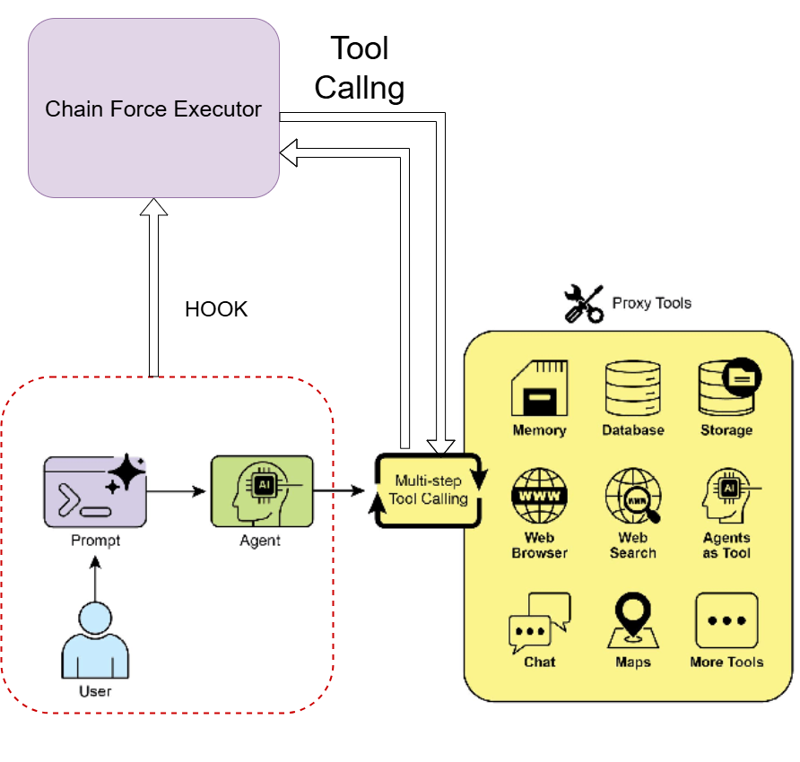
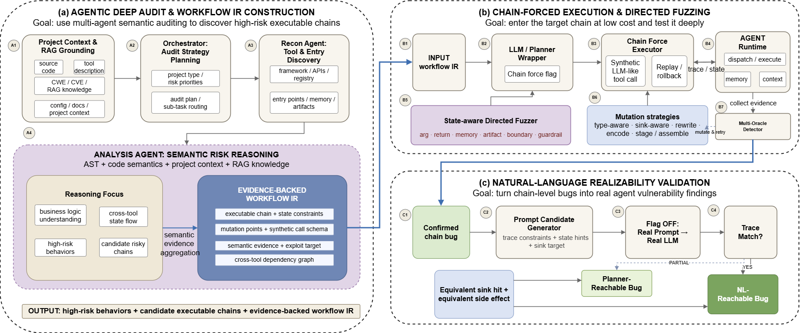

# AgentProbe: Sink-Guided Tool-Chain Fuzzing for Multi-Tool Agents

**思路灵感是论文AgentFuzz+论文ChainFuzzer+Github项目DeepAudit**，想解决的目前的问题主要是

对Agent直接进行自然语言的模糊测试，而变异自然语言知道让其走目标的tool调用链十分**耗费Token**，且**对自然语言Prompt进行变异操作是困难的**

很多系统一上来就问：“**自然语言能不能打出BUG来？**”\
但从测试工程角度，这其实把两个问题混在了一起：

* **链本身有没有 bug**
* **这个 bug 能不能被自然语言驱动的 planner 走到**&#x20;

ChainFuzzer已经把这个问题暴露得很明显：它先抽出 candidate tool chains以后需要用 TPS 合成稳定 prompt 去提高链可达率；论文里 TPS 将 chain reachability 从 27.05% 提高到 95.45%，也侧面说明“让 LLM 稳定走到目标链”本身就是一个昂贵且独立的难题。

由此现在的想法是这样的：

1. 进行模糊测试时直接**HOOK Agent**，也就是说工具调用实际不由大模型经过自然语言prompt思考以后再给出tool调用，而是**直接发送目标工具的调用请求，直接一步走到我想fuzz的tool chain**，然后再去模糊测试这个链上有没有bug
2. 如果确实**证明这个chain有bug，再去寻找触发这个链的自然语言poc**，能不能在加入LLM以后确实触发这个bug
3. 类似DeepAudit的agent设计对源码进行Sink静态审计，更有效的挖掘可能的Sink调用链

<figure><figcaption></figcaption></figure>

自然语言变异最大的问题，是一旦改写 prompt，很容易连任务本身都变了。表面上只是替换了几个词、插入了一段上下文，但对 LLM 来说，可能已经不再是“同一个请求”，于是后续工具选择、参数生成、推理路径都会一起漂移。结果就是，测到最后很难分清：到底是漏洞没触发，还是 prompt 已经把任务语义改掉了。

而 tool 调用层输入不一样。wrapper 之后，输入已经被结构化成：

* 调哪个工具
* 传哪些参数
* 参数是什么类型
* 哪些字段来自上一步输出
* 哪些字段会流向 sink

这时再做变异，目标还是同一个调用动作，只是在字段、状态和约束上做变化。也就是说，**任务意图基本不变，只有执行条件在变**。这会让 fuzzing 更稳定。

## 详细设计图

<figure><figcaption></figcaption></figure>

## 模块一：静态审计模块

**目标：高效找到值得测试的高价值 Tool Chain，并生成可直接驱动强制执行的链表示。**

这一模块仍然负责“找链”，但在新的设计下，静态分析结果不再只是候选调用链，而是要直接服务于 **Chain Force Executor**。因此输出必须能够被 Wrapper 分支直接消费。

### M1：Agent Adapter & Instrumentation Layer

**作用：** 适配不同开源 Agent 框架，在 LLM/Planner 决策层插入统一 Wrapper，并提供运行时抽象接口。

**核心位置：**

* LLM / planner 输出工具决策处
* tool dispatcher / router
* tool executor 边界
* memory/store 读写位置
* side-effect sink（文件、shell、HTTP、DB、消息发送）

**新的核心职责：**

* 在工具决策层增加 `Chain Force Flag`
* 正常模式下透传真实 LLM 决策
* 强制模式下将控制权切换给 Chain Force Executor
* 统一不同 Agent 的 tool call 对象格式和执行入口
* 为后续 replay、state rollback、trace 对齐提供基础支持

**输出：**

* Tool registry
* Unified tool-call schema
* LLM / Planner Wrapper API
* Runtime trace
* Tool call interception API
* State snapshot / rollback API

### M2：Static Sink Audit & Chain Extraction

**作用：** 面向源码识别高风险 sink，恢复可执行的候选 tool chain，并生成 Workflow IR。

由三个子模块组成（DeepAudit editor）

* **Scouter Agent**：识别项目结构、框架、工具注册点、入口点、memory/store、artifact 和外部 side-effect 接口
* **Static Chain Generator**：基于 AST、数据流和跨工具依赖生成 candidate sink chains
* **Analysis Agent**：结合 RAG、局部 AST 片段和项目上下文，对 candidate chains 做语义筛选、风险解释和优先级排序
* **输出**：top-k candidate executable sink chains + evidence-backed workflow IR

## 模块二：模糊测试模块

**目标：绕过高成本 prompt 路径搜索，在执行层直接进入目标链，并围绕链上关键状态进行定向 fuzzing。**

这一模块是系统核心。新的实现方式不是直接“调工具函数”，而是通过 Wrapper 在 planner 层拦截，并逐步生成**模仿 LLM 输出格式的 tool call**，让下游 dispatcher / executor 尽可能复用原始 Agent 的执行路径。

### M3：Chain Force Executor

**作用：** 在 `Chain Force Flag` 开启时，接管工具决策逻辑，根据 Workflow IR 逐步生成 synthetic tool call。

**执行方式：**

* 读取目标 Sink Chain / Workflow IR
* 恢复前置状态
* 按步骤生成符合原框架格式的 tool call
* 将 tool call 送入原始 dispatcher / router
* 接收真实工具返回值
* 根据返回值和当前状态决定下一步 synthetic tool call
* 必要时同步更新 assistant trace、memory、context

**新增子能力：**

* **Tool Call Emitter**：把链步骤转换为目标 Agent 原生的 tool-call 格式
* **State Sync Layer**：同步工具返回、memory/store、assistant 轨迹
* **Mode Switch**：支持 normal / full-force / partial-force
* **Replay & Rollback**：支持链级重放和状态恢复

**输出：**

* Synthetic tool-call sequence
* Forced execution trace
* Intermediate state snapshots

### M4：State-aware Directed Fuzzer

**作用：** 围绕目标链中的关键状态位点做定向 fuzzing。

**变异对象：**

* tool arguments
* synthetic tool-call 参数
* 上一步真实工具返回值
* memory slot 内容
* 外部 artifact / 文档内容
* schema 边界值
* 条件分支位点
* guardrail 敏感字段

**变异策略：**

* 类型感知变异
* sink 感知 payload 变异
* 数据流约束下的字段联动变异
* 状态机导向变异
* 距离目标 sink 的反馈导向变异

**输出：**

* Mutated chain inputs
* Mutated state snapshots
* Directed fuzzing candidates

### M5：Multi-oracle Vulnerability Detector

**作用：** 对执行结果进行多维漏洞判定，提高结果可信度。

**Oracle 类型：**

* **Crash oracle**：异常、超时、死循环
* **Sink-hit oracle**：危险 API 是否被命中
* **Policy-violation oracle**：不该发生的工具调用是否发生
* **State-corruption oracle**：memory/store 是否被污染
* **Side-effect oracle**：文件、数据库、HTTP、邮件、消息等外部影响
* **Data-leak oracle**：敏感内容是否越界流向外部 sink

**模块亮点：**

* 适配多工具 Agent “不一定崩溃但会产生危险副作用”的漏洞特点
* 支持对链级漏洞进行证据化判定
* 为后续自然语言验证提供明确的漏洞目标和判定标准

## 模块三：自然语言触发验证模块

**对应创新点：将链级 bug 转化为真实 Agent 漏洞结论**

该模块的目标不是再去做漏洞发现，而是在已经确认链级 bug 的前提下，反向求解自然语言触发条件，验证该漏洞是否能由真实 Agent 通过自然语言入口复现。

### M6：NL Realizability Validator

**作用：** 对已确认存在 bug 的链，反向求解自然语言触发条件。

**输入：**

* 目标链
* 真实工具调用轨迹
* 触发 bug 的中间状态
* 关键参数约束

**输出：**

* prompt 候选
* prompt 执行 trace
* 是否达到相同链
* 是否触发相同 bug

**核心职责：**

* 根据链级漏洞的真实执行轨迹反推可能的 prompt
* 在真实 Agent 执行环境下验证链是否可由自然语言入口到达
* 判断链级 bug 是否可升级为真实可利用的 Agent 漏洞

**模块亮点：**

* 将漏洞发现与自然语言可达性验证解耦
* 仅对已确认漏洞的链开展 prompt 求解，降低总体成本
* 可将结果进一步区分为链级可执行漏洞、规划可达漏洞和自然语言可达漏洞
