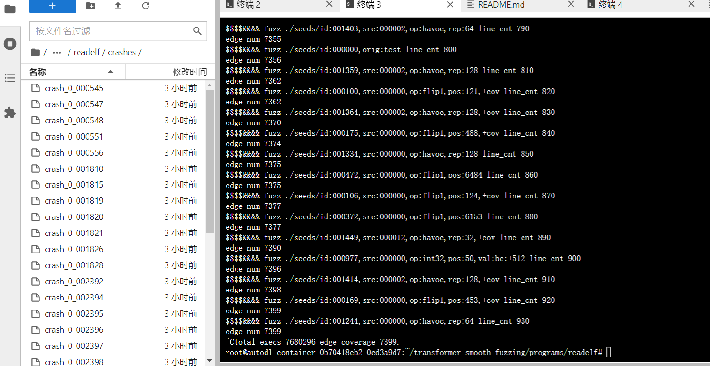

# AI with Fuzzing

在深度学习中，梯度被用来度量一个变量在改变量时，输出函数值的变化率。换言之，对于神经网络，梯度可以理解为每个输入变量对于预测结果的贡献。

如果一个输入变量的梯度很大，那说明这个变量对于预测结果的影响很大，改变它会使结果产生显著的变化。 在模糊测试的场景中，神经网络的输入是种子文件的一个向量表示，每个元素对应文件的一个字节，输出是所有边被覆盖的概率。

神经网络会根据训练从输入向量中学习出对结果影响显著的因素。 通过计算每个输入元素对输出（这里是特定边的覆盖概率）的梯度，可以得到输入的哪些部分（在这里是种子文件的哪些字节）对于覆盖这条边的影响最大。

这样，在选择进行模糊测试变异，我们就可以首要考虑那些对应的梯度值较大的输入元素，也就是说，在进行模糊输入时，优先对这些部分进行修改。 这种基于梯度的方法使得我们可以更聪明地进行模糊测试，而不是简单地随机或者穷举所有可能的输入。可以更有效地利用有限的计算资源，提高发现软件错误的效率。


## NEUZZ

Paper：NEUZZ: Efficient Fuzzing with Neural Program Smoothing

D. She, K. Pei, D. Epstein, J. Yang, B. Ray and S. Jana, "NEUZZ: Efficient Fuzzing with Neural Program Smoothing," _2019 IEEE Symposium on Security and Privacy (SP)_, San Francisco, CA, USA, 2019, pp. 803-817, doi: 10.1109/SP.2019.00052.



### 总结

以前的模糊测试，输入会被**随机地变异**生成不同的测试用例，或者是以AFL等模糊测试工具为代表的基于覆盖率引导的变异。这种随机变异的方法在测试效率和测试覆盖率上存在一定的局限性。一般来说，程序中的bug是**非常稀有且不规律的分布在程序代码之中**。大部分的fuzzer目标就是**提高输入的代码覆盖率**，去增加找到安全漏洞的几率。大部分现代的fuzzer使用进化算法去解决一个基础优化问题——生成新的输入使得其代码覆盖率最大化。进化算法从一堆种子输入开始，随机突变这些种子来生成新的测试输入，用这些新的测试数据来输入到目标程序中，并且只留下那些能发现未覆盖代码的测试数据。但是，当输入的语料库变大的同时，进化的过程变慢（指的是覆盖到新的代码区域），对应的一种解决思路是**符号执行**这样子的平滑技术，但是由于**路径爆炸**，不完全的环境模拟，符号建模**占用大量内存**等问题，符号执行并**不能扩展到大型程序**。由此，NEUZZ引入神经网络来解决：

* NEUZZ使用一个基于RNN（循环神经网络）的神经网络来对程序进行学习和平滑处理。通过**将输入样本和对应的代码路径作为训练数据**，NEUZZ**学习到输入样本在不同代码路径上的执行特征**，并生成平滑的输入样本，从而提高测试用例的质量和多样性
* NEUZZ在生成的平滑输入样本的基础上，采用了一种基于贪心策略的搜索算法（即**梯度引导优化**）来引导模糊测试的生成过程。这种策略会根据神经网络生成的平滑输入样本的特征，优先选择那些能够导致不同代码路径执行的测试用例。这样可以有效地提高测试用例的覆盖率和测试效率
  * 在NN的在线微调环节中，NEUZZ根据神经网络输出的梯度信息，平滑处理当前的种子输入以生成新的输入样本。这一梯度信息能明确指出哪些部分在当前输入样本中对提高覆盖率具有更大的影响力，因而优选出梯度较大的部分进行平滑操作。这个流程确保了新生成的输入样本更可能引领模糊测试走向尚待探索的、更高覆盖率的路径。

NEUZZ基于神经网络的模糊测试方法的步骤：

* 初始种子生成：从程序的输入空间中随机生成一组初始种子输入作为模糊测试的起点。
* 程序执行与覆盖率收集：使用初始种子输入运行目标程序，并通过动态分析收集执行路径和代码覆盖率信息。
* 样本生成与筛选：根据收集到的执行路径和覆盖率信息，采用贪心搜索策略生成新的模糊测试样本。贪心搜索策略根据当前种子输入的覆盖率信息，对输入进行变异、交叉、替换等操作，生成新的输入样本。然后通过目标程序的执行，计算每个新生成样本的覆盖率，并将高覆盖率的样本筛选出来，作为下一轮迭代的种子输入。
* 神经网络训练：将筛选出的高覆盖率样本输入到神经网络中进行训练。神经网络通过学习输入样本和对应的覆盖率之间的关系，从而学习到输入样本的表示。
* 输入样本平滑：利用训练好的神经网络对新的输入样本进行平滑操作，即对输入样本进行一系列微小的变化，以生成平滑的输入样本。
* 生成新的种子输入：将平滑后的输入样本作为新的种子输入，重复步骤2到步骤5的过程，形成循环迭代的过程。&#x20;

### NEUZZ核心思路

<figure><figcaption></figcaption></figure>

NEUZZ巧妙地将模糊测试中的路径探索任务变为一项优化问题。它利用神经网络模式来揭示输入样本与覆盖率的内在联系，并通过对输入样本的平滑操作来产生新的种子输入。这种平滑操作可以视作在输入空间中进行搜索，旨在找出导致目标程序中出现更高覆盖率的输入变化。因此，NEUZZ实际上是**将路径探索任务转变为了在输入空间寻找高覆盖率输入的优化问题**。

### 训练NN

NEUZZ采用两阶段的神经网络训练方法——**离线预训练** & **在线微调**

* **离线预训练：**利用生成的初始种子输入和对应的覆盖率信息进行离线预训练。 将输入样本和对应的覆盖率信息作为训练数据，输入到神经网络中进行训练，使得神经网络能够初步学习到输入样本的特征和模式。&#x20;
* **在线微调：**由于训练NN model的初始数据可能只覆盖到程序空间的一小部分，所以需要进一步通过增量训练来训练模型，NEUZZ使用**进化式fuzzer生成的语料库**来训练神经网络（原文：“_**Incremental learning**_”——增量训练），在fuzzing的过程中，新的程序行为可以被观察到。在增量训练中，主要面对的难题是，在训练新的数据的过程中，模型有可能完全忘记从旧数据中学习的规则。为了避免这个问题，NEUZZ设计了一种新的基于覆盖的过滤方案，这种方案会**生成旧数据和新数据的简练的总结**，使得NN model能高效地在其上面训练。

### 效果和评估

<figure><figcaption></figcaption></figure>

<figure><figcaption></figcaption></figure>

#### NEUZZ可以找到比现有模糊器更多的错误吗?

NEUZZ在6个不同的程序中找到了31个以前其他模糊器找不到的未知的错误。NEUZZ在寻找LAVA-M和CGC漏洞方面也优于最先进的模糊器

#### NEUZZ能否实现比现有模糊器更高的边缘覆盖?

与其他灰盒式模糊器相比，NEUZZ可以实现更高的边缘覆盖率（比AFL高4倍，比24小时运行的第二好的高出2.5倍）

#### NEUZZ能否比现有的基于RNN的模糊器表现更好?

NEUZZ，一个基于简单前馈网络的模糊器，通过在不同项目中实现3.7倍到8.4倍的边缘覆盖率，明显优于基于RNN的模糊器&#x20;

## NEUZZ源码阅读



### 程序结构

NEUZZ的主要工作机制是一个C程序和一个py程序交互的工作过程

### neuzz.c

#### main()

按惯例，从main()入手，首先是对一些命令行参数的解析处理：

```c
void main(int argc, char*argv[]){
    int opt;
    while ((opt = getopt(argc, argv, "+i:o:l:")) > 0)

    switch (opt) {
      case 'i':... /* input dir */
      case 'o':... /* output dir */
      case 'l':... /* file len */
        /* change num_index and havoc_blk_* according to file len */
    default:
        printf("no manual...");
    }
    
```

然后是一些函数的执行：

```c
    setup_signal_handlers(); //设置信号处理程序
    check_cpu_governor(); //检查cpu的调速器
    get_core_count(); //获取可用内核数量
    bind_to_free_cpu();//将进程绑定到空闲的CPU内核
    setup_shm();//注册共享内存和virgin_bits数组
    init_count_class16();
    setup_dirs_fds();
    if (!out_file) setup_stdio_file();
    detect_file_args(argv + optind + 1);
    setup_targetpath(argv[optind]);
    
    copy_seeds(in_dir, out_dir); //将在neuzz_in文件夹中准备的seeds复制到seeds/文件夹下
    init_forkserver(argv+optind);
   
```

然后开始fuzz：

```c
    start_fuzz(len);   
```

#### start\_fuzz()

```c
void start_fuzz(int f_len){
    //通过socket通信与python程序建立通信连接
    /* connect to python module */    
    struct sockaddr_in address;
    int sock = 0;
    struct sockaddr_in serv_addr;
    if ((sock = socket(AF_INET, SOCK_STREAM, 0)) < 0){// AF_INET表示使用IPV4协议
        perror("Socket creation error");
        exit(0);
    }
    memset(&serv_addr, '0', sizeof(serv_addr));
    serv_addr.sin_family = AF_INET;
    serv_addr.sin_port = htons(PORT);
    //#define PORT    12012
    if(inet_pton(AF_INET, "127.0.0.1", &serv_addr.sin_addr)<=0){
        perror("Invalid address/ Address not supported");
        exit(0);
    }
    if (connect(sock, (struct sockaddr *)&serv_addr, sizeof(serv_addr)) < 0){
        perror("Connection Failed");
        exit(0);
    }
    
    /* set up buffer */
    ...
    
    len = f_len;
    /* dry run seeds*/
    dry_run(out_dir, 2);//stage = 2 , 计算平均执行时间
```

注意到此时调用了dry\_run()函数，接下来对这个函数进行分析：

#### dry\_run()

```c
//在stage = 1时，在dir处运行种子，然后将有用的种子保存到out_dir中
//当stage = 2时，计算平均执行时间

/* 
    dry run the seeds at dir, when stage == 1, save interesting seeds to out_dir; 
    when stage == 2, compute the average exec time 
*/
void dry_run(char* dir, int stage){
    ...
    while((entry = readdir(dp)) != NULL) { 
        if(stat(entry->d_name,&statbuf) == -1)
            continue;
        if(S_ISREG(statbuf.st_mode)) {
            char * tmp = NULL;
            tmp = strstr(entry->d_name,".");
            if(tmp != entry->d_name){
                int fd_tmp = open(entry->d_name, O_RDONLY);//打开种子文件
                ...
                memset(out_buf1, 0, len);
                ck_read(fd_tmp, out_buf1,file_len, entry->d_name);
                
                start_us = get_cur_time_us();
                write_to_testcase(out_buf1, file_len);//将修改后的数据写入文件进行测试。
                //如果设置了 out_file，将会删除旧文件并创建新文件。否则，将倒回并截断 out_fd
                //static int out_fd,   /* Persistent fd for out_file       */
                int fault = run_target(exec_tmout); 
                if (fault != 0){//发现CRASH
                    if(fault == FAULT_CRASH){
                        char* mut_fn = alloc_printf("%s/crash_%d_%06d", "./crashes",round_cnt, mut_cnt);
                        int mut_fd = open(mut_fn, O_WRONLY | O_CREAT | O_EXCL, 0600);
                        ck_write(mut_fd, out_buf1, file_len, mut_fn);//保存出错的信息
                        free(mut_fn);
                        close(mut_fd);
                        mut_cnt = mut_cnt + 1;
                    }
                    else if(fault = FAULT_TMOUT){
                        fault = run_target(1000); 
                        if(fault == FAULT_CRASH){
                            char* mut_fn = alloc_printf("%s/crash_%d_%06d", "./crashes",round_cnt, mut_cnt);
                            int mut_fd = open(mut_fn, O_WRONLY | O_CREAT | O_EXCL, 0600);
                            ck_write(mut_fd, out_buf1, file_len, mut_fn);
                            free(mut_fn);
                            close(mut_fd);
                            mut_cnt = mut_cnt + 1;
                        } 
                    }
                }
                
                int ret = has_new_bits(virgin_bits);//检查运行结果是否产生新的覆盖。
                //如果函数发现特定元组的击中计数（hit-count）发生了变化，那么返回1。
                //即如果当前执行路径让某个特定的输入（元组）产生了更多的击中，那么函数就返回1
                //如果函数观察到了新的元组，那么返回2。
                //即如果当前的执行路径产生了新的、以前未见过的输入（元组），那么函数就返回2。
                if (ret!=0){
                    if(stage == 1){//将有用的种子保存到out_dir中
                        char* mut_fn = alloc_printf("../%s/id_%d_%06d", out_dir,round_cnt, mut_cnt);
                        int mut_fd = open(mut_fn, O_WRONLY | O_CREAT | O_EXCL, 0600);
                        ck_write(mut_fd, out_buf1, len, mut_fn);
                        free(mut_fn);
                        close(mut_fd);
                        mut_cnt = mut_cnt + 1;
                    }
                }
                
                stop_us = get_cur_time_us();
                total_cal_us = total_cal_us - start_us + stop_us;
                cnt = cnt + 1;
                close(fd_tmp);
            }
        }
    }
    ...
    /* estimate the average exec time at the beginning*/
    if(stage ==2 ){
        u64 avg_us = (u64)(total_cal_us / cnt);
        if (avg_us > 50000) exec_tmout = avg_us * 2 / 1000;
        else if (avg_us > 10000) exec_tmout = avg_us * 3 / 1000;
        else exec_tmout = avg_us * 5 / 1000;

        exec_tmout = (exec_tmout + 20) / 20 * 20;
        exec_tmout =  exec_tmout;
        printf("avg %d time out %d cnt %d sum %lld \n.",(int)avg_us, exec_tmout, cnt,total_cal_us);
    }

    printf("dry run %ld edge coverage %d.\n", total_execs,count_non_255_bytes(virgin_bits));
    return;
}
```

可以看到在这个函数中会执行input文件夹下的预先准备的所有testcase（perform\_dry\_run），生成初始化的queue和bitmap。这只对初始输入执行一次，所以叫：dry run。也就是将所有测试样例都跑一遍，保证没有问题。

但是如果一开始的样例就能产生崩溃，程序就不会运行。一般会有以下问题，需要针对性修改testcase。

接下来回到start\_fuzz中，在第一次执行完以后，开始真正的NN梯度信息指导的模糊测试：

```c
    /* start fuzz */
    char buf[16];
    while(1){
        if(read(sock , buf, 5)== -1)
            perror("received failed\n");
        fuzz_lop("gradient_info", sock);
        printf("receive\n");
    }
```

可以看到，相关的内容在fuzz\_lop()函数中实现，接下来分析这个函数

#### **fuzz\_lop()**

```c
void fuzz_lop(char * grad_file, int sock){
    dry_run("./splice_seeds/", 1); 
    //将splice_seeds中有用的seeds保存到输出文件夹中
    //splice_seeds文件夹存放的是Python程序计算梯度时将两个seeds按某种拼接策略拼接成的新seeds
    //splice_seeds在后面的循环中文件数维持在1000
    //每单数轮就覆盖上一次单数轮的文件，双数轮就覆盖
    
    //splice是AFL的变异手段之一
    //AFL在seed文件队列中随机选取一个，与当前的seed文件做对比。
    //如果两者差别不大，就再重新随机选一个；
    //如果两者相差比较明显，那么就随机选取一个位置，将两者都分割为头部和尾部。
    //最后，将当前文件的头部与随机文件的尾部拼接起来，就得到了新的文件。
    copy_file("gradient_info_p", grad_file);
    //将python程序计算得到的记录梯度信息的文件拷贝一份为"gradient_info"
    FILE *stream = fopen(grad_file, "r");
    ...
    int line_cnt=0;
    
    //设置重新训练阈值
    int retrain_interval = 1000;
    if(round_cnt == 0)
        retrain_interval = 750;
    //当处于第一轮训练时，程序处理完750行梯度文件后重新训练；
    //此后的重新训练阈值为1000行
    //while循环处理梯度文件
    while ((nread = getline(&line, &llen, stream)) != -1) {   
    //每次读取一行，将这一行中的三部分信息提取出来     
        line_cnt = line_cnt+1;
        /* send message to python module */
        if(line_cnt == retrain_interval){//检查 line_cnt 是否等于重新训练阈值 
            round_cnt++;
            now = count_non_255_bytes(virgin_bits);
            edge_gain = now - old;
            old = now;
            if((edge_gain > 30) || (fast == 0)){
            //满足可以快速学习的要求，并标记当前阶段为快速阶段（覆盖数达标或者fast==0）
            //通知python程序进行重新训练
                send(sock,"train", 5,0);
                fast = 1;
                printf("fast stage\n");
            }
            else{
            //表示慢速学习，并标记当前阶段为慢速阶段
                send(sock,"sloww",5,0);
                fast = 0;
                printf("slow stage\n");
            }
        }
         
        /* parse gradient info */
        //处理梯度信息
        char* loc_str = strtok(line,"|");
        char* sign_str = strtok(NULL,"|");
        char* fn = strtok(strtok(NULL,"|"),"\n"); 
        parse_array(loc_str,loc);
        parse_array(sign_str,sign);
        //调用parse_array这个函数，解析一行“梯度字符串”，并将其转化为数组
        ///* parse one line of gradient string into array */
        //void parse_array(char * str, int * array){
        
        
        //两个相关的变量定义：
        //int loc[10000];/* Array to store critical bytes locations*/
        //用于存储关键字节位置的数组，即样例对应的BITMAP
        
        //int sign[10000]; /* Array to store sign of critical bytes  */
        //数组来存储关键字节的符号，也就是我们的测试样例
        //char virgin_bits[MAP_SIZE];  /* Regions yet untouched by fuzzing */
        //尚未被模糊影响的区域(未覆盖的路径)
        /* print edge coverage per 10 files*/
        //输出前十个文件的覆盖率
        if((line_cnt % 10) == 0){ 
            printf("$$$$&&&& fuzz %s line_cnt %d\n",fn, line_cnt);
            printf("edge num %d\n",count_non_255_bytes(virgin_bits));
            fflush(stdout);
        }

        /* read seed into mem */
        //将种子文件读取到内存中
        ...
        
        /* generate mutation */
        if(stage_num == 1)
            gen_mutate();
        else
            gen_mutate_slow();
        close(fn_fd);
    }
    stage_num = fast;
    free(line);
    fclose(stream);
}
```

总结来说，这个函数处理了梯度文件中的信息，然后根据梯度信息指导后续的突变，这一部分的相关代码在gen\_mutate()和gen\_mutate\_slow()中实现

#### **gen\_mutate()**

&#x20; _**重头戏来咯**！_

```c
/* gradient guided mutation */
void gen_mutate(){
    int tmout_cnt = 0;//超时计数器
    
    /* flip interesting locations within 14 iterations */
    //第一种变异操作就是flip
    //在14次迭代中翻转有趣的位置
    for(int iter=0 ;iter<13; iter=iter+1){
        memcpy(out_buf1, out_buf, len);        
        memcpy(out_buf2, out_buf, len);        
        
        /* find mutation range for every iteration */
        //设置最低变异位置和最高变异位置
        int low_index = num_index[iter];
        int up_index = num_index[iter+1];
        //int num_index[14] = {0,2,4,8,16,32,64,128,256,512,1024,2048,4096,8192};
        //初始化变异步长，变异步长决定将要变异的比特位数
        u8 up_step = 0;
        u8 low_step = 0;

        
```

接下来的部分是NEUZZ**梯度指引核心思想的关键代码**，重点来咯

```c
     for(int index=low_index; index<up_index; index=index+1){
    //找到每个迭代变异步长，决定上步 (up_step) 和下步 (low_step)
    //通过比较原始数据和当前数据，计算向上或向下变化的步数
            int cur_up_step = 0;
            int cur_low_step = 0;
            //定义、初始化了目前现在的cur_up_step与cur_low_step游标的值
            if(sign[index] == 1){
            //sign中存放获得的梯度信息
            //模型的最后一层采用的是sigmoid激活函数输出范围(0,1)
            //num_classes = MAX_BITMAP_SIZE，最后的分类情况是根据MAX_BITMAP_SIZE来分类的，
            //所以这个sign[index]表示某个BITMAP的重要性
            //sign[index] == 1，则根据模型判定变异这个位置的重要性特别大
                cur_up_step = (255 - (u8)out_buf[loc[index]]);//变异的具体操作
                if(cur_up_step > up_step)
                    up_step = cur_up_step;
                cur_low_step = (u8)(out_buf[loc[index]]);
                if(cur_low_step > low_step)
                    low_step = cur_low_step;
            }
            else{
            //模型输出梯度信息告诉这个位置变异的重要性不大
                cur_up_step = (u8)out_buf[loc[index]];
                if(cur_up_step > up_step)
                    up_step = cur_up_step;
                cur_low_step = (255 - (u8)out_buf[loc[index]]);
                if(cur_low_step > low_step)
                    low_step = cur_low_step;
            }
        }
        
```

上面的代码实现了梯度指导的bitflip变异，在bitflip变异全部进行完成后，接下来的代码思路也差不多了，只是对种子进行了**不同方式的变异操作**：

<pre class="language-c"><code class="lang-c"><strong>        /* up direction mutation(up to 255) */
</strong><strong>        //arithmetic变异阶段：整数加算术运算
</strong>        for(int step=0;step&#x3C;up_step;step=step+1){
            int mut_val;
            
            for(int index=low_index; index&#x3C;up_index; index=index+1){
                mut_val = ((u8)out_buf1[loc[index]] + sign[index]);
                //仍然是sign[index]梯度指导的
                if(mut_val &#x3C; 0)
                    out_buf1[loc[index]] = 0;
                else if (mut_val > 255)
                    out_buf1[loc[index]] = 255;
                else
                    out_buf1[loc[index]] = mut_val;
            }
            
            //将产生的新种子写入待测样例中
            write_to_testcase(out_buf1, len);    
            int fault = run_target(exec_tmout); 
            //产生一个子进程去以该seed为输入执行被测程序
            if (fault != 0){
                if(fault == FAULT_CRASH){
                    ...
                }
                else if((fault = FAULT_TMOUT) &#x26;&#x26; (tmout_cnt &#x3C; 20)){
                    ...
                    } 
                }
            }
            
            /* save mutations that find new edges. */
            //将能够产生新Crash和提高边缘覆盖率的测试样例保存下来
            int ret = has_new_bits(virgin_bits);
            if(ret == 2){
            //产生了新的Crash的种子
                ...
            }
            if(ret == 1){
            //提高边缘覆盖率的种子
                ...
            }
            
        }
        
        /* low direction mutation(up to 255) */
        //arithmetic变异阶段：整数减算术运算
        for(int step=0;step&#x3C;low_step;step=step+1){
            for(int index=low_index; index&#x3C;up_index;index=index+1){
                int mut_val = ((u8)out_buf2[loc[index]] - sign[index]);
                //仍然是sign[index]梯度指导的
                if(mut_val &#x3C; 0)
                    out_buf2[loc[index]] = 0;
                else if (mut_val > 255)
                    out_buf2[loc[index]] = 255;
                else
                    out_buf2[loc[index]] = mut_val;
            }
            
            write_to_testcase(out_buf2, len);    
            int fault = run_target(exec_tmout); 
            if (fault != 0){
                ...
            }
            
            /* save mutations that find new edges. */
            //重复的操作，保留有用的种子
            ...
            
        }
    }
    
    /* random insertion/deletion */
    //interest变异阶段，随机的插入或删除一些interest byte
    //这一阶段和梯度无关
    int cut_len = 0;
    int del_loc = 0;
    int rand_loc = 0;
    for(int del_count=0; del_count &#x3C; 1024;del_count= del_count+1){
        del_loc = loc[del_count];
        if ((len- del_loc) &#x3C;= 2)
            continue;
        cut_len = choose_block_len(len-1-del_loc);
        
        //删除：
        /* random deletion at a critical offset */
        memcpy(out_buf1, out_buf,del_loc);
        memcpy(out_buf1+del_loc, out_buf+del_loc+cut_len, len-del_loc-cut_len);
        
        write_to_testcase(out_buf1, len-cut_len);    
        
        int fault = run_target(exec_tmout); 
        if (fault != 0){
            ...
        }
                 
        /* save mutations that find new edges. */
        int ret = has_new_bits(virgin_bits);
        if(ret==2){
            ...
        }
        else if(ret==1){
            ...
        }

        cut_len = choose_block_len(len-1);
        rand_loc = (random()%cut_len);
        
        //插入：
        /* random insertion at a critical offset */
        memcpy(out_buf3, out_buf, del_loc);
        memcpy(out_buf3+del_loc, out_buf+rand_loc, cut_len);
        memcpy(out_buf3+del_loc+cut_len, out_buf+del_loc, len-del_loc);
        
        write_to_testcase(out_buf3, len+cut_len);    
        
        ...
        /* save mutations that find new edges. */
        ...
    }
</code></pre>


### nn.py

#### main()

调用setup\_server()

#### setup\_server()

开启socket通信，作为服务端，监听信息，一旦收到客户端信息之后，执行`gen_grad()`，socket执行sendall函数，发送TCP数据通知客户端已生成梯度信息文件

进入一个while循环，反复执行之前和c程序通信的步骤；while结束条件是未收到客户端的通信信息

```python
def setup_server():
    #开启socket通信
    sock = socket.socket(socket.AF_INET, socket.SOCK_STREAM)
    sock.bind((HOST, PORT))
    #监听信息
    sock.listen(1)
    
    conn, addr = sock.accept()#收到客户端信息
    print('connected by neuzz execution moduel ' + str(addr))
    gen_grad(b"train")#训练模型
    conn.sendall(b"start")
    while True:
        data = conn.recv(1024)
        if not data:
            break
        else:
            gen_grad(data)
            conn.sendall(b"start")#发送TCP数据通知客户端已生成梯度信息文件
    conn.close()
```

**gen\_grad(data)**

```python
def gen_grad(data):
    global round_cnt
    t0 = time.time()
    process_data()# 对通过afl收集的seeds进行预处理。
    model = build_model()# 在建立神经网络模型时，
    #利用gen_grad()中获取的MAX_BITMAP_SIZE作为神经网络的输出层神经元个数
    train(model)#建立模型之后，对模型进行训练
    # model.load_weights('hard_label.h5')
    #将训练完成的模型权重保存到文件hard_label.h5中
    gen_mutate2(model, 500, data[:5] == b"train")#生成梯度信息去指导未来的mutation
    #实参500是表达在输出层挑选多少个output_neuron
    round_cnt = round_cnt + 1#给标记训练次数的round_cnt变量加一
    print(time.time() - t0)
```

#### process\_data()

* 随机置乱训练数据：

```python
    # shuffle training samples
    seed_list = glob.glob('./seeds/*') #获取训练用的seed list
    seed_list.sort() #排序
    SPLIT_RATIO = len(seed_list)
    rand_index = np.arange(SPLIT_RATIO) 
    np.random.shuffle(seed_list) #随机置乱
    new_seeds = glob.glob('./seeds/id_*') #

    call = subprocess.check_output
```

* 获取当前输出文件夹中最大的文件大小值赋值给MAX\_BITMAP\_SIZE，用于后面矩阵列的初始化。

```python
    # get MAX_FILE_SIZE
    cwd = os.getcwd()
    max_file_name = call(['ls', '-S', cwd + '/seeds/']).decode('utf8').split('\n')[0].rstrip('\n')
    MAX_FILE_SIZE = os.path.getsize(cwd + '/seeds/' + max_file_name)

```

* 利用afl-showmap获取每一个seeds的输出路径。

```python
    # obtain raw bitmaps
    raw_bitmap = {}
    tmp_cnt = []
    out = ''
    for f in seed_list:
        tmp_list = []
        try:
            # append "-o tmp_file" to strip's arguments to avoid tampering tested binary.
            if argvv[0] == './strip':
                out = call(['./afl-showmap', '-q', '-e', '-o', '/dev/stdout', '-m', '512', '-t', '500'] + argvv + [f] + ['-o', 'tmp_file'])
            else:
                out = call(['./afl-showmap', '-q', '-e', '-o', '/dev/stdout', '-m', '512', '-t', '500'] + argvv + [f])
        except subprocess.CalledProcessError:
            print("find a crash")
        for line in out.splitlines():
            edge = line.split(b':')[0]
            tmp_cnt.append(edge)
            tmp_list.append(edge)
        raw_bitmap[f] = tmp_list
    counter = Counter(tmp_cnt).most_common()
```

* 将所有seeds的输出路径生成一个01矩阵

```python
    # save bitmaps to individual numpy label
    label = [int(f[0]) for f in counter]
    bitmap = np.zeros((len(seed_list), len(label)))
    for idx, i in enumerate(seed_list):
        tmp = raw_bitmap[i]
        for j in tmp:
            if int(j) in label:
                bitmap[idx][label.index((int(j)))] = 1

```

* 经过去重处理后，用新矩阵中的列的数量更新MAX\_BITMAP\_SIZE以及将矩阵的每一行储存到bitmaps/文件夹下对应的seeds名文件中

```python
    # label dimension reduction
    fit_bitmap = np.unique(bitmap, axis=1)
    print("data dimension" + str(fit_bitmap.shape))

    # save training data
    MAX_BITMAP_SIZE = fit_bitmap.shape[1]
    for idx, i in enumerate(seed_list):
        file_name = "./bitmaps/" + i.split('/')[-1]
        np.save(file_name, fit_bitmap[idx])
```


#### build\_model()

该神经网络的输入层是seed文件的向量化的结果，输出层表示该seed经过程序各edge的可能性。所以整个输出层就是该程序中的“所有”edge。

```python
def build_model():
    batch_size = 32
    num_classes = MAX_BITMAP_SIZE
    epochs = 50

    model = Sequential()
    model.add(Dense(4096, input_dim=MAX_FILE_SIZE))
    model.add(Activation('relu'))
    model.add(Dense(num_classes))
    model.add(Activation('sigmoid'))

    opt = keras.optimizers.adam(lr=0.0001)

    model.compile(loss='binary_crossentropy', optimizer=opt, metrics=[accur_1])
    model.summary()

    return model
```


#### **gen\_mutate2(model, edge\_num, sign)**

1.  从seed\_list中随机抽取500个（其值也就是edge\_num的值）seeds将其对应的文件名存放在数组rand\_seed2中；seed\_list中元素的数量小于edge\_num时，有放回的抽取；否则，无放回的抽取。（np.random.choice)

    `seed_list = glob.glob(’./seeds/*’)`
2.  从new\_seeds中随机抽取500个（其值也就是edge\_num的值）seeds将其对应的文件名存放在数组rand\_seed1中；抽取规则同上。（np.random.choice)

    `new_seeds = glob.glob(’./seeds/id_*’)；`
3. interested\_indice = np.random.choice(MAX\_BITMAP\_SIZE, edge\_num)；挑选输出层用于计算梯度的output\_neuron；
4.  执行`adv_list = fn(index, fl, model, layer_list, idxx, 1)`，对于给定的输入计算梯度信息。

    `fn = gen_adv2if sign else gen_adv3`\
    index就是依次从interested\_indice中读取的值，也就是用于计算梯度的输出层神经元下标\
    `fl = [rand_seed1[idxx], rand_seed2[idxx]]`\
    idxx就是从1到500的递增变量
5. 将返回的adv\_list中的每个元素所包含的三部分提取出来，存入文件gradient\_info\_p中。

### 复现

使用NEUZZ来fuzz程序readelf，安装配置好相应的环境：

````


1. The tested binaries are compiled into 32bit format (to compare with Vuzzer). NEUZZ can actually run on any 64bit binaries. Install some required libraies for 32bit binaries.
```sh
    sudo dpkg --add-architecture i386
    sudo apt-get update
    sudo apt-get install libc6:i386 libncurses5:i386 libstdc++6:i386 lib32z1
```

2. Set CPU scaling algorithm and core dump notification with root. 
```sh
    cd /sys/devices/system/cpu
    echo performance | tee cpu*/cpufreq/scaling_governor
    echo core >/proc/sys/kernel/core_pattern
```

3. Copy neuzz, nn.py, afl-showmap to this directory.
```
cp /path_to_neuzz/neuzz /path_to_neuzz/programs/readelf
cp /path_to_neuzz/nn.py /path_to_neuzz/programs/readelf
cp /path_to_neuzz/alf-showmap /path_to_neuzz/programs/readelf
```

4. Create output directory
```sh  
    mkdir seeds
```

5. Open a terminal to start NN module.
```sh  
    python nn.py ./readelf -a  
```

6. Open another terminal to start NEUZZ module.
```sh
    # -l, file len is obtained by maximum file lens in the neuzz_in ( ls -lS neuzz_in|head )
    ./neuzz -i neuzz_in -o seeds -l 7507 ./readelf -a @@
```

````

先开启python程序，再运行c程序，即可实现neuzz，这里选择对readelf进行fuzz，运行一段时间后代码覆盖率和发现的crash如下

<figure><figcaption></figcaption></figure>

<figure><figcaption></figcaption></figure>

## MTFuzz

paper

SHE D, KRISHNA R, YAN L, 等. MTFuzz: fuzzing with a multi-task neural network\[C/OL]//Proceedings of the 28th ACM Joint Meeting on European Software Engineering Conference and Symposium on the Foundations of Software Engineering. New York, NY, USA: Association for Computing Machinery, 2020: 737-749\[2024-05-24]. [https://dl.acm.org/doi/10.1145/3368089.3409723](https://dl.acm.org/doi/10.1145/3368089.3409723). DOI:[10.1145/3368089.3409723](https://doi.org/10.1145/3368089.3409723).



MTFuzz通过采用多任务学习技术和动态分析模块来增强其突变策略，从而区别于Neuzz。除了广泛使用的边覆盖率外，MTFuzz还采用了两个额外的任务——接近敏感的边覆盖率，即离触发未探索边的距离有多远，以及上下文敏感的边覆盖率，即已探索边的上下文，以构建多任务神经网络模型以平滑程序并进一步指导模糊测试。此外，MTFuzz采用了一个独立的模块，即其实现中的Crack，它使用动态程序分析来探索没有梯度信息的新边。具体地，Crack迭代种子输入的每一个字节并突变它，以观察是否与未探索分支相关联的变量也可以被改变。如果可以，这样的字节被识别为“有希望”的字节，被突变255次。


## RESuzz

paper：

WU M, JIANG L, XIANG J, 等. Evaluating and improving neural program-smoothing-based fuzzing\[C/OL]//Proceedings of the 44th International Conference on Software Engineering. Pittsburgh Pennsylvania: ACM, 2022: 847-858\[2024-05-24]. [https://dl.acm.org/doi/10.1145/3510003.3510089](https://dl.acm.org/doi/10.1145/3510003.3510089). DOI:[10.1145/3510003.3510089](https://doi.org/10.1145/3510003.3510089).



之前的Neuzz和MTFuzz都是**基于神经网络程序平滑的模糊测试技术**，首先使用了一个神经网络模型，这个模型可以接受一个种子的字节序列作为输入，然后输出一个代表它的程序分支行为的向量。然后，模型计算这个向量的梯度，通过梯度来指导变异来生成新的种子，以此作为测试用例。

具体来说，为了制定模糊测试的优化问题，程序分支行为被定义为函数 𝐹 (𝑥)，其中 𝑥 表示字节序列的种子输入，解是表示其相关分支行为的向量。 例如，解向量 \[1, 0, 1, ...] 指示第一条和第三条边已被访问/探索，而第二条尚未访问/探索。 由于 𝐹 (𝑥) 通常是离散的，因此平滑程序，即使 𝐹 (𝑥) 可微，对于处理梯度的使用至关重要。

需要注意的是，程序执行路径，也就是，一系列的边，可以由种子输入的字节序列决定。因此，当一个边的对应字节满足其访问条件时，就可以访问／探索这个边。否则，可以替代地访问其“兄弟”边（也就是，在一个共享的前缀边下的边）。例如，在图中，当 𝑠𝑒𝑒𝑑 \[𝑖] 的值满足 𝑒0 的访问条件时，也就是 𝑠𝑒𝑒𝑑 \[𝑖] < 1时，可以访问 𝑒0。因此，改变这个 𝑠𝑒𝑒𝑑 \[𝑖] 可以导致探索一个新的分支行为，也就是，访问 𝑒0 的“兄弟”边 𝑒1 而不是 𝑒0。

<figure><figcaption><p>An example of neural program-smoothing rationale</p></figcaption></figure>

Neuzz和MTFuzz采用了一个迭代的训练和突变过程。在每次迭代中，它们使用实时收集到的“有趣”的种子输入（见下图中的“种子语料库”）来训练神经网络模型。注意下图也显示了Neuzz和MTFuzz采用了不同的神经网络模型。

<figure><figcaption></figcaption></figure>

Neuzz和MTFuzz随机选择一定数量的“有趣”的种子和已探索过的边界。对于每个选定的种子，它们计算**选定边向量关于所有字节的梯度**。此外，所有这些字节都根据其对应的梯度排名进行排序，然后**汇总为一个向量以供进一步突变**。特别地，Neuzz和MTFuzz划分每个选定的种子，使得前段的字节的梯度大于后段的字节，且前段包含的字节数量少于后段。因此，“有希望”的字节预计会位于前段。对于任何段𝑠𝑒𝑔，所有的字节同时进行255次突变。结果，Neuzz和MTFuzz可以探索比后段更多的前段突变空间，也就是，更积极地突变更“有希望”的字节，以探索新的分支行为。最后，经过迭代训练和突变过程后产生的所有种子都用作模糊测试的测试用例。


### Neuzz和MTFuzz评估实验

<figure><figcaption><p>Edge coverage results of all the studied approaches</p></figcaption></figure>

皮尔逊相关系数分析Pearson Correlation Coefficient analysis

> Jacob Benesty, Jingdong Chen, Yiteng Huang, and Israel Cohen. 2009. Pearson correlation coefficient. In Noise reduction in speech processing. Springer, 1–4.

皮尔逊相关系数分析是一种统计方法，用于量化两个连续变量之间的线性关系。

皮尔逊相关系数的范围从-1到1。一个值接近1表示强正相关，即一个变量的增加会导致另一个变量增加；接近-1表示强负相关，即一个变量的增加会导致另一个变量减少；接近0表示两个变量之间没有线性关系。&#x20;

皮尔逊相关系数是一种非常有用的工具，它可以用于各种统计和数据分析中。例如，在研究中，我们可以用它来确定两个变量（比如，在这个例子中，是**模糊器的边覆盖优势和项目的大小**）是否有相关性，以及这种相关性的强弱。通过量化这种相关性，我们可以更好地理解变量之间的关系，并据此做出更好的预测和决策。

横轴表示每个项目的LoC（Lines of Code），纵轴表示每个研究方法的边缘覆盖结果除以AFL的边缘覆盖结果的比率

<figure><figcaption></figcaption></figure>

可以观察到，总体上，相关性相当强（在显著性水平为0.05的情况下），即Neuzz和MTFuzz都可以在大型项目上比小型项目获得更大的边缘覆盖改进，得出结论**程序的大小可以对基于神经程序平滑的模糊器的边覆盖性能产生显著影响**。


实验结果上，Neuzz 的性能比 AFL 好 35.3%（2,219 条对 1,640 条探索边），比 MTFuzz 好 1.8%（2,219 条对 2,180 条探索边）


此外，实验还考虑到了Neuzz和MTFuzz仅利用确定性突变策略，即不采用随机性来选择可以引导突变的字节而是根据其相应的梯度来确定性地进行突变，考虑如AFL havoc这样子的随机性突变策略，实验对比Neuzz，Mtfuzz，AFL，AFL𝐷𝑒𝑡𝑒𝑟𝑚𝑖𝑛𝑖𝑠𝑡𝑖𝑐和AFL𝐻𝑎𝑣𝑜𝑐的边探索率（EDR）中，观察到，总体而言，Neuzz和Mtfuzz的表现分别可以胜过10.2％和8.5％。 有趣的是，AFL𝐻𝑎𝑣𝑜𝑐 实现了最高的 EDR，比 AFL𝐷𝑒𝑡𝑒𝑟𝑚𝑖𝑛𝑖𝑠𝑡𝑖𝑐 大 21.8 倍，比 Neuzz 大 7.7 倍，比 MTFuzz 平均大 7.8 倍符合所有基准。 因此，可以得出 AFL𝐻𝑎𝑣𝑜𝑐 可以显着增强边缘探索，即它可以根据 AFL𝐷𝑒𝑡𝑒𝑟𝑚𝑖𝑛𝑖𝑠𝑡𝑖𝑐 提供的有限种子输入迅速探索边缘。 这样的结果具有启发性，将随机字节选择机制应用于神经程序平滑模糊器可以潜在地促进边缘探索。

<figure><figcaption><p>AFL𝐻𝑎𝑣𝑜𝑐在边缘探索的效率上占主导地位，这表明它有望通过采用随机字节选择机制来增强边缘探索。</p></figcaption></figure>


一个有趣的发现：


实验测试了将Neuzz的NN model替换为不同的模型（CNN、RNN、Bi-LSTM）并进行了测试，结果发现使用不同的NN model对边覆盖探索的影响并不大

（仍然参考表2）具体而言，Neuzz 略优于 MTFuzz𝑂𝑓𝑓  8.5% (22,395 vs 20,648 边覆盖), 略逊色于 Neuzz𝐶𝑁𝑁  1.2% (22,395 vs. 22,665 边覆盖), Neuzz𝑅𝑁𝑁 3.3% (22,395 vs. 23,130 边覆盖) 、 Neuzz𝐵𝑅𝑁𝑁  2.2% (22,395 vs. 22,883 边覆盖)


**论文中对于这一现象提出的解释是：**

人们可能会误解Neuzz和MTFuzz试图使用神经网络模型来预测与未探索的边缘相对应的字节。相反，事实上，Neuzz和MTFuzz利用神经网络模型来计算梯度，以**反映已探索的边缘和种子输入之间的关系**，即，在一个共享的前缀边缘下，**变异与较大梯度相对应的字节更有可能探索一条新的边缘，而不是现有的边缘**。因此，只要能够成功地传递梯度以反映这种探索的边缘-种子输入关系，即，在这种情况下，**其泛化或预测能力如何并不重要，那么任何神经网络模型都可以应用**

因此，只要能够成功传递梯度以反映这种探索的边缘-种子输入关系，NN model泛化或预测能力如何并不重要，那么**任何神经网络模型都可以应用**。因此，一个简单的模型（例如Neuzz采用的前馈网络模型 feed-forwarded network model）很可能与细粒度模型（例如MTFuzz采用的多任务学习模型multi-task learning model和所研究的Neuzz变体采用的RNN模型）具有相似的性能。



实验数据中的另一个值得注意的点：对于一些程序，梯度指导的模糊测试效果并不理想（如base64），其表现不如AFL


论文中对于此的解释是：

尽管 Neuzz 和 MTFuzz 启用梯度引导机制来探索新的边缘，但它们通过在开始时随机选择边缘和种子的迭代训练和变异策略仍然可以选择除未探索的边缘之外的现有边缘来计算梯度，即它们**仍然允许低效的突变**

特别是对于**较小程序**，Neuzz和MTFuzz不能优于AFL，由于边的数量有限，它们的**边探索比较大程序收敛得更快**，即它们有更高的机会选择其“兄弟”边已经被其他种子探索用于梯度计算的现有边。因此，很难变异其“有希望”的字节来探索新的边缘


### 改进： **PreFuzz（基于概率资源高效程序平滑的模糊测试）**


PreFuzz 首先通过应用所有现有种子作为训练集来训练神经网络模型。 接下来，PreFuzz 采用资源高效的边缘选择机制来选择边缘进行梯度计算。 然后，利用梯度信息生成用于模糊测试的突变体。 请注意，探索新边缘的突变体可以用作进一步边缘探索的种子。 同时，PreFuzz采用概率字节选择机制（图中的PBS）来促进突变。

<figure><figcaption></figcaption></figure>

接下来分析论文中提到的资源高效的边缘选择算法。

&#x20;首先，获取运行时边缘探索状态非常重要，例如给定边缘的“兄弟”边缘数量以及已探索的边缘数量（第 2 行到第 3 行）。 为此，我们反编译汇编级程序，通过 AFL 特定的工具将它们解析为指令，并通过静态分析解析的指令来构造边缘探索状态。 接下来，给定一条边，我们得出其探索的“兄弟”边数与其总“兄弟”边数的比率（第 5 行到第 9 行）。 如果这个比率低于预设阈值，我们保留给定的边缘并将其存储在候选边缘集中，稍后我们随机选择这些边缘进行进一步的梯度计算（第 10 到 12 行）

<figure><figcaption></figcaption></figure>

例如：资源高效边缘选择机制可以在计算 𝑒0 的梯度之前收集 𝑒0 的“兄弟”边缘（即 𝑒1）的探索信息。 如果它发现𝑒1已经被探索过，它就不会首先选择𝑒0进行梯度计算，以节省计算资源。

<figure><figcaption></figcaption></figure>

新增概率字节选择机制：向神经程序平滑模糊器注入一个额外的非确定性阶段。设计 概率字节选择机制并将其附加到 Neuzz 中以扩展边缘探索。&#x20;

概率字节选择机制**利用资源高效边缘选择机制生成的梯度信息**，并在**从 Neuzz 继承的突变阶段后被激活**。 此阶段包含三个步骤：(1) 将每个种子输入划分为段，(2) 通过基于梯度的概率分布选择段，以及 (3) 从所选段中随机选择字节以通过 AFL𝐻𝑎𝑣𝑜𝑐 变异器进行变异。


### Prefuzz源码阅读-fuzz.c

基本代码流程和Neuzz一模一样，在上面进行了改动和新增

<pre><code><strong>原Neuzz：
</strong>int havoc_blk_small = 2048;
int havoc_blk_medium = 4096;
int havoc_blk_large = 8192;
#define HAVOC_BLK_SMALL     2048
#define HAVOC_BLK_MEDIUM    4096
#define HAVOC_BLK_LARGE     7402

Prefuzz：
int havoc_blk_small = 2048;
int havoc_blk_medium = 4096;
int havoc_blk_large = 8192;
#define HAVOC_BLK_XL        32768
</code></pre>

关于函数

<table><thead><tr><th width="155">函数</th><th width="65">Prefuzz</th><th width="67">Neuzz</th><th>功能</th></tr></thead><tbody><tr><td>setup_stidio_file</td><td><strong>✓</strong></td><td><strong>✓</strong></td><td>启动 fork 服务器</td></tr><tr><td>count_bytes</td><td><strong>✓</strong></td><td></td><td>统计位图中设置为非0字节的数量（未覆盖路径）</td></tr><tr><td>count_non_2555_bytes</td><td><strong>✓</strong></td><td><strong>✓</strong></td><td>统计位图中设置为非255字节的数量（覆盖路径）</td></tr><tr><td>handle_stop_sig</td><td><strong>✓</strong></td><td><strong>✓</strong></td><td>处理停止信号（Ctrl-C 等）</td></tr><tr><td>has_new_bits</td><td><strong>✓</strong></td><td><strong>✓</strong></td><td>检查当前执行路径是否给表带来了任何新内容</td></tr><tr><td>handle_timeout</td><td><strong>✓</strong></td><td><strong>✓</strong></td><td>处理超时</td></tr><tr><td>setup_signal_handlers</td><td><strong>✓</strong></td><td><strong>✓</strong></td><td>设置信号处理程序</td></tr><tr><td>init_forkserver</td><td><strong>✓</strong></td><td><strong>✓</strong></td><td>初始化forkserver</td></tr><tr><td>remove_shm/setup_shm</td><td><strong>✓</strong></td><td><strong>✓</strong></td><td>清除/初始化共享内存</td></tr><tr><td>setup_dirs_fds/setup_targetpath</td><td><strong>✓</strong></td><td><strong>✓</strong></td><td>设置输出目录/测试目标目录</td></tr><tr><td>detect_file_args</td><td><strong>✓</strong></td><td><strong>✓</strong></td><td>检测参数中的@@</td></tr><tr><td>parse_array</td><td><strong>✓</strong></td><td><strong>✓</strong></td><td>将一行梯度字符串解析为数组</td></tr><tr><td><strong>parse_grads_havoc</strong></td><td><strong>✓</strong></td><td></td><td>将 havoc 梯度解析为数组</td></tr><tr><td>UR</td><td><strong>✓</strong></td><td></td><td>生成一个在从 0 到 limit - 1之间的随机数</td></tr><tr><td>choose_block_len</td><td><strong>✓</strong></td><td><strong>✓</strong></td><td>帮助程序为 fuzz_one() 中的块操作选择随机块长度。</td></tr><tr><td>save_if_interesting</td><td><strong>✓</strong></td><td></td><td>出现有意义结果时保存相关的测试用例，对neuzz代码的封装</td></tr><tr><td>gen_mutate</td><td><strong>✓</strong></td><td><strong>✓</strong></td><td>梯度引导变异</td></tr><tr><td><strong>rand_frag_idx</strong></td><td><strong>✓</strong></td><td></td><td>获取随机havoc的索引</td></tr><tr><td><strong>afl_grad_havoc_stage</strong></td><td><strong>✓</strong></td><td></td><td><strong>梯度引导破坏阶段</strong></td></tr><tr><td>dry_run</td><td><strong>✓</strong></td><td><strong>✓</strong></td><td>将所有测试样例seed都跑一遍，保证初始种子没有问题</td></tr><tr><td><strong>fuzz_lop</strong></td><td><strong>✓</strong></td><td><strong>✓</strong></td><td><strong>prefuzz新增havoc阶段</strong></td></tr></tbody></table>

#### count\_bytes(u8\* mem)&#x20;

```c
static u32 count_bytes(u8* mem) {

    u32* ptr = (u32*)mem;
    u32  i   = (MAP_SIZE >> 2);
    u32  ret = 0;

    while (i--) {

        u32 v = *(ptr++);

        if (!v) continue;
        if (v & FF(0)) ret++;
        if (v & FF(1)) ret++;
        if (v & FF(2)) ret++;
        if (v & FF(3)) ret++;

    }

    return ret;

}
```

**parse\_grads\_havoc(char \* str, double \* array, int lenn)**

```c
/* parse havoc gradient into array */
//将 havoc 梯度解析为数组
void parse_grads_havoc(char * str, double * array, int lenn) {
    int i=0;
    char * token = strtok(str, ",");

    while(token != NULL && i < lenn) {
        array[i] = atof(token);
        i++;
        token = strtok(NULL, ",");
    }
    return;
}
```

**UR(u32 limit)**

这里不是很懂为什么要定义这个函数，在neuzz中`choose_block_len(u32 limit)`函数直接`switch ((random()%3))`，而Prefuzz中`switch (UR(3))`，可能是增加代码封装性

```c
/* Generate a random number (from 0 to limit - 1). This may
   have slight bias. */
  //使用random() % limit来生成一个在0到limit-1之间的随机数。
  //理想情况下，每个数在这个范围内出现的几率应该是相同的，即均匀分布。
  //然而，random()函数和模数运算符（%）的交互可能会出现稍微的偏离，
  //导致一些数字比其他数字更可能被选中。
static inline u32 UR(u32 limit) {
    if (unlikely(!rand_cnt--)) {
        u32 seed[2];
        ck_read(dev_urandom_fd, &seed, sizeof(seed), "/dev/urandom");
        srandom(seed[0]);
        rand_cnt = (RESEED_RNG / 2) + (seed[1] % RESEED_RNG);
    }
    return random() % limit;
}

```

#### save\_if\_interesting

在Neuzz中这一部分没有封装为一个函数，阅读Neuzz源码时觉得这一部分代码确实冗余，实际逻辑是相同的

```c
void save_if_interesting(char* out_buf, size_t length, char* out_dir) {
    /* run target and check interesting */
    write_to_testcase(out_buf, length);
    int fault = run_target(exec_tmout);

    if (fault != 0 && fault == FAULT_CRASH) {
        char *mut_fn = alloc_printf("%s/crash_%d_%06d", "./crashes", round_cnt, mut_cnt++);
        int mut_fd = open(mut_fn, O_WRONLY | O_CREAT | O_EXCL, 0600);
        ck_write(mut_fd, out_buf, length, mut_fn);
        free(mut_fn);
        close(mut_fd);
    }
    /* save mutations that find new edges. */
    int ret = has_new_bits(virgin_bits);
    if (ret == 2) {
        char *mut_fn = alloc_printf("%s/id_%d_%06d_cov", out_dir, round_cnt, mut_cnt++);
        int mut_fd = open(mut_fn, O_WRONLY | O_CREAT | O_EXCL, 0600);
        ck_write(mut_fd, out_buf, length, mut_fn);
        free(mut_fn);
        close(mut_fd);
    }
    else if (ret == 1) {
        char *mut_fn = alloc_printf("%s/id_%d_%06d", out_dir, round_cnt, mut_cnt++);
        int mut_fd = open(mut_fn, O_WRONLY | O_CREAT | O_EXCL, 0600);
        ck_write(mut_fd, out_buf, length, mut_fn);
        free(mut_fn);
        close(mut_fd);
    }
}
```


接下来就是Prefuzz的重头戏之一，梯度指导的havoc阶段相关代码

```c
//获取随机havoc的索引
static u32 rand_frag_idx(u32* grads_avg) {
    u32 grads_sum;
    for (int i = 0; i < FRAGMENT_NUM; i++)
        grads_sum += grads_avg[i];
    //计算grads_avg梯度和

    if (grads_sum == 0)
        return UR(FRAGMENT_NUM);
        //grads_sum为0则直接返回一个随机索引

    u32 rand_grad = UR(grads_sum);
    //获取一个介于0-grads_sum之间的随机梯度值
    u32 idx;

    for (idx = 0; idx < FRAGMENT_NUM; idx++) {
        if (rand_grad <= grads_avg[idx])
            break;
            //找到梯度值大于rand_grad的第一个索引
        rand_grad -= grads_avg[idx];
        //没有找到则减去grads_avg[idx]
    }

    if (idx == FRAGMENT_NUM)
        idx = FRAGMENT_NUM - 1;//防止索引越界

    return idx;
}


/* gradient guided havoc stage */
void afl_grad_havoc_stage(char* seed_name) {
    //加载种子文件
    /* load the seed entry */
    ...

    //计算梯度平均值grads_avg[idx]
    /* calculate the average gradients */
    u32 grads_avg[FRAGMENT_NUM];
    u32 frag_lenn = seed_length / FRAGMENT_NUM;

    if (frag_lenn == 0)
        return;

    u32 idx, frag_idx, grad_temp_sum;
    int* grad_ptr = grad;

    for (idx = 0; idx < FRAGMENT_NUM; idx++) {
        grad_temp_sum = 0;
        frag_idx = 0;

        while (++frag_idx < frag_lenn) {
            grad_temp_sum += *grad_ptr;
            grad_ptr++;
        }
        grads_avg[idx] = grad_temp_sum / frag_lenn;
    }


    //开始havoc
    s32 stage_cur, temp_len;
    s32 stage_max = 16 + UR(STAGE_MAX);

    for (stage_cur = 0; stage_cur < stage_max; stage_cur++) {
        u8* havoc_out_buf = malloc(seed_length);
        memcpy(havoc_out_buf, havoc_in_buf, seed_length);
        temp_len = seed_length;

        u32 idx, use_stacking;
        u32 frag_cur, buf_len, offset, mutate_len;
        use_stacking = 1 << (2 + UR(HAVOC_STACK_POW2));

        for (idx = 0; idx < use_stacking; idx++) {
            frag_cur   = rand_frag_idx(grads_avg);//获取随机havoc索引
            offset     = frag_cur * temp_len / FRAGMENT_NUM;
            mutate_len = temp_len / FRAGMENT_NUM;
            buf_len    = temp_len - offset;

            if (mutate_len == 0)
                mutate_len = buf_len;
            
            //随机选择一种变异策略进行havoc
            switch (UR(15)) {
                case 0:
                    //位翻转
                    FLIP_BIT(havoc_out_buf + offset, UR(mutate_len << 3));
                    break;

                case 1:
                    //插入interesting number（8bit）
                    havoc_out_buf[offset + UR(mutate_len)] = interesting_8[UR(sizeof(interesting_8))];
                    break;

                case 2:
                    if (mutate_len < 2) break;
                    //插入interesting number（16bit）
                    if (UR(2)) {
                        *(u16*)(havoc_out_buf + offset + UR(mutate_len - 1)) =
                                interesting_16[UR(sizeof(interesting_16) >> 1)];
                    } else {
                        *(u16*)(havoc_out_buf + offset + UR(mutate_len - 1)) = SWAP16(
                                interesting_16[UR(sizeof(interesting_16) >> 1)]);
                    }
                    break;

                case 3:
                    if (mutate_len < 4) break;
                    //插入interesting number（32bit）
                    if (UR(2)) {
                        *(u32*)(havoc_out_buf + offset + UR(mutate_len - 3)) =
                                interesting_32[UR(sizeof(interesting_32) >> 2)];
                    } else {
                        *(u32*)(havoc_out_buf + offset + UR(mutate_len - 3)) = SWAP32(
                                interesting_32[UR(sizeof(interesting_32) >> 2)]);
                    }
                    break;

                case 4:
                    //算术减法
                    havoc_out_buf[offset + UR(mutate_len)] -= 1 + UR(ARITH_MAX);
                    break;

                case 5:
                    //算术加法
                    havoc_out_buf[offset + UR(mutate_len)] += 1 + UR(ARITH_MAX);
                    break;
                    
                //...
                //...
                //处理剩下的case
                //不同的havoc策略，省略，和AFL中的Havoc一致
                //...
                //...

            }
        }

        /* run target program */
         //完成havoc以后运行程序测试变异后的种子效果
        write_to_testcase(havoc_out_buf, temp_len);
        int fault = run_target(exec_tmout);
        int ret = has_new_bits(virgin_bits);

        if (fault != 0) {
            if(fault == FAULT_CRASH) {//触发crash
                char* mut_fn = alloc_printf("%s/crash_%d_%06d_havoc", "./crashes", round_cnt, havoc_cnt++);
                int mut_fd = open(mut_fn, O_WRONLY | O_CREAT | O_EXCL, 0600);
                ck_write(mut_fd, havoc_out_buf, len, mut_fn);
                close(mut_fd);
                free(mut_fn);
            }
        }
        if (ret) {//触发新路径或改变边执行次数
            u8* m_fn;
            if (temp_len > len)
                m_fn = alloc_printf("%s/id_%d_%06d_havoc_grad", "./havoc_seeds", round_cnt, havoc_cnt++);
            else
                m_fn = alloc_printf("%s/id_%d_%06d_havoc_grad", out_dir, round_cnt, havoc_cnt++);

            int m_fd = open(m_fn, O_WRONLY | O_CREAT | O_EXCL, 0600);
            ck_write(m_fd, havoc_out_buf, temp_len, m_fn);
            close(m_fd);
            free(m_fn);
        }
        free(havoc_out_buf);
    }
    free(havoc_in_buf);
}

```


**fuzz\_lop(int sock)**

```c
void fuzz_lop(int sock) {
    copy_file("gradient_info_p", "gradient_info");
    FILE *stream = fopen("gradient_info", "r");
    char *line = NULL;
    size_t llen = 0;
    ssize_t nread;
    if (stream == NULL) {
        perror("fopen");
        exit(EXIT_FAILURE);
    }

    time_t tt1 = time(NULL);
    log("currect cnt: %d, gen_mutate start\n", queue_cycle);
    
    //这里和neuzz不同，直接发送给python进程训练的信号，也不区分快速阶段和慢速阶段
    send(sock, "train", 5, 0);
    
    /* parse the gradient to guide fuzzing */
    int line_cnt = 0;
    while ((nread = getline(&line, &llen, stream)) != -1) {
        /* parse gradient info */
        char *loc_str = strtok(line, "|");
        char *sign_str = strtok(NULL, "|");
        char *fn = strtok(strtok(NULL, "|"), "\n");
        parse_array(loc_str, loc);
        parse_array(sign_str, sign);

        /* print edge coverage per 10 files*/
        if ((++line_cnt % 10) == 0) {
            log("gradient fuzzing state: line_cnt %d and edge num %d\n", line_cnt,
                count_non_255_bytes(virgin_bits));
            fflush(stdout);
        }

        /* read seed into mem */
        int fn_fd = open(fn, O_RDONLY);
        if (fn_fd == -1) {
            perror("open failed");
            exit(0);
        }
        struct stat st;
        int ret = fstat(fn_fd, &st);
        int file_len = st.st_size;
        memset(out_buf,  0, len);
        memset(out_buf1, 0, len);
        memset(out_buf2, 0, len);
        memset(out_buf3, 0, 20000);
        ck_read(fn_fd, out_buf, file_len, fn);

        /* generate mutation */
        gen_mutate();
        close(fn_fd);
    }

    time_t tt2 = time(NULL);
    log("current cnt: %d, gen_mutate finished, starting havoc stage\n", queue_cycle);
    log("gen_mutate use time %fs\n", difftime(tt2, tt1));
    //在梯度指导的变异完成以后开启havoc阶段
    /* afl havoc stage */
    copy_file("gradient_info_havoc_p", "gradient_info_havoc");
    stream = fopen("gradient_info_havoc", "r");
    line = NULL;

    if (stream == NULL) {
        perror("fopen");
        exit(EXIT_FAILURE);
    }

    line_cnt = 0;
    while ((nread = getline(&line, &llen, stream)) != -1) {
        /* parse gradient info */
        char *grad_str = strtok(line, "|");
        char *fn = strtok(strtok(NULL, "|"), "\n");
        parse_array(grad_str, grad);
        afl_grad_havoc_stage(fn);

        if ((++line_cnt % 100) == 0) {
            log("havoc fuzzing state: line_cnt %d and edge num %d\n", line_cnt,
                count_non_255_bytes(virgin_bits));
            fflush(stdout);
        }
    }

    time_t tt3 = time(NULL);
    log("current cnt: %d, havoc finished\n", queue_cycle);
    log("havoc use time %fs\n", difftime(tt3, tt2));
    free(line);
    fclose(stream);
}
```

### Prefuzz源码阅读-nn.py

```
bitmap_ec存储种子文件到边覆盖的映射；
label_index存储边到位图索引的映射；
correspond_dict存储边到对应边的映射；
Class FuzzDataSet 
这个类提取位图样本。
位图样本来自种子文件，并使用其覆盖的边缘信息

Class FuzzNet: 
使用 PyTorch 库构建的神经网络模型。
包含两个线性层，中间有一个ReLU激活函数，输出通过一个Sigmoid函数来得到结果

construct_bitmap
这个函数用于构造位图。起初，它会获得种子文件的边缘覆盖信息，用于构造原始位图，
然后完成标签缩减，删除重复列，并更新标签索引

vectorize_file: 
这个函数将文件转化成一个数值向量。
这个向量代表了文件中字节的值，字节的值被缩放到0到1的范围内。
```

根据论文中的描述，在Prefuzz中使用了“资源高效的边选择机制”，旨在识别值得探索的边，以便稍后选择和改变其相应的字节。具体地说，一个边已经探索的“兄弟”边越多，通过给定边的梯度计算探索新的“兄弟”边的可能性就越小。

> PreFuzz first trains a neural network model by applying all the existing seeds as the training set. Next, PreFuzz adopts a resource-efficient edge selection mechanism to select edges for gradient computation. Then, the gradient information is utilized to generate mutants for fuzzing

```python
#在Neuzz 的nn.py中,对于边选择机制采用完全随机的算法：
def select_edges(fuzzData, edge_num):
    # random selection mechanism
    alter_seeds = list()
    alter_edges = np.random.choice(fuzzData.edge_size, edge_num)
    
    for edge in alter_edges:
        idx_list = np.where(fuzzData.bitmap[:,edge] == 1)[0]
        alter_seeds.append(np.random.choice(idx_list, 1, replace=False)[0])
    
    interested_indice = zip(alter_edges.tolist(), alter_seeds)
    return interested_indice

#而在PreFuzz中，0.1的概率使用随机算法，其余0.9使用资源高效的边选择机制：
def select_edges(fuzzData, edge_num):
    # candidate edges
    if np.random.rand() < 0.1:
    #0.1概率使用随机选择算法
        # random selection mechanism
        alter_edges = np.random.choice(fuzzData.edge_size, edge_num)
    else:
        candidate_set = set()
        for edge in label_index.keys():
            if check_select_edge(edge):
            #由算法进行选择更加值得继续探索的边
                candidate_set.add(label_index[edge])
        replace_flag = True if len(candidate_set) < edge_num else False
        alter_edges = np.random.choice(list(candidate_set), edge_num, replace=replace_flag)

    alter_seeds = list()
    for edge in alter_edges:
        idx_list = np.where(fuzzData.bitmap[:,edge] == 1)[0]
        alter_seeds.append(random.choice(idx_list))
    
    interested_indice = zip(alter_edges.tolist(), alter_seeds)
    return interested_indice

```

接下来就看看资源有效的边选择机制实现代码:

1. 检查给定的边（edge）是否在`correspond_dict`中。如果不在，说明这个边没有与之关联的其他边（“兄弟边”），那么就返回`True`，选择这个边。
2. 如果给定的边在`correspond_dict`中，那么就获取这个边所有的对应边作为`correspond_set`。如果这个集合是空的，同样返回`True`，选择这个边。
3. 如果`correspond_set`不为空，那么就遍历这个集合，统计其中已经被探索过的边的数量（`cover_cnt`）。这里的已探索是指这个边在`label_index`中。
4. 计算已探索的边的数量与所有对应边的总数量的比值。如果这个比值高于预设的`SELECT_RATIO`，则返回`False`，表示不选择这个边；否则返回`True`，选择这个边。

```python
def check_select_edge(edge_id):
    #检查给定的边（edge）是否在correspond_dict中。如果不在，说明这个边没有与之关联的其他边（“兄弟边”），那么就返回True，选择这个边
    if edge_id not in correspond_dict.keys():
        return True
        #为什么这种情况返回True：
        #如果一个边在 correspond_dict 字典中没有键，
        #那就意味着它没有对应的“兄弟”边
        #那么可能这个边是在控制流图中的一条单独的路径或者是一个条件判断的分支里只有一条路径
        #对此的理解：
        #没有“兄弟”边，也就没有别的边可以和它争夺覆盖资源，
        #也就避免了过度测试某一特定路径的问题。此外，如果一条边没有任何“兄弟”边，那么意味着它在代码结构中是相对独立的，
        #探索这样的边更可能找出程序中的新行为和潜在错误，因此值得优先探索。
   
    #如果给定的边在correspond_dict中，那么就获取这个边所有的对应边作为correspond_set。如果这个集合是空的，同样返回True，选择这个边。
    correspond_set = correspond_dict[edge_id]
    if len(correspond_set) == 0:
        return True

    #如果correspond_set不为空，那么就遍历这个集合，统计其中已经被探索过的边的数量（cover_cnt）。这里的已探索是指这个边在label_index中  
    cover_cnt = 0
    for ce in correspond_set:
        if ce in label_index.keys():
            cover_cnt += 1
    #计算已探索的边的数量与所有对应边的总数量的比值。如果这个比值高于预设的SELECT_RATIO，则返回False，表示不选择这个边；否则返回True，选择这个边
    if cover_cnt / len(correspond_set) > SELECT_RATIO:
        return False
    return True
```

这里对`correspond_dict`再次进行理解：对于在代码结构中形如if, switch等具有多个分支的结构，我们可以把这些分支视为彼此的"兄弟"，它们对应于QC（Quantity of Controllability，可控制数量）空间中的不同半径（Radius）。\
例如，在基于控制流图（CFG, Control Flow Graph）的测试用例生成中，对于这些多分支结构，我们通常会记录下每个分支对应的边（Edge），并将它们视为同一组的，用来记录和参考它们在测试用例生成过程中的覆盖状态。\
在这个`correspond_dict`字典中，每个键（key）是一个边的标识符，对应的值（value）是一个集合，包含了所有与此边是“兄弟”关系的其他边。


对于的构造如下，可以看到是FlowBuilder(program\_path)中实现的，这个后续在[flow.py](ai-with-fuzzing.md#prefuzz-yuan-ma-yue-du-flow.py)中分析：

```python
def init_env(program_path):
    global correspond_dict
    os.path.isdir("./vari_seeds/")  or  os.makedirs("./vari_seeds")
    os.path.isdir("./havoc_seeds/") or  os.makedirs("./havoc_seeds")
    os.path.isdir("./crashes/")     or  os.makedirs("./crashes")

    # construct edge corresponding dict
    logger.info(f'Construct the control-flow')
    flow = FlowBuilder(program_path)
    with open(flow.correspond_target, 'r') as fopen:
        correspond_dict = eval(fopen.readline())
    # initial gradients
    nn_lop(50, 100)
```

最后还有一些输出梯度信息的函数：

```python
def gen_adv(fuzzNet, fuzzData, edge_idx, seed_name):
    #生成一条边对应的梯度
    x = vectorize_file(seed_name, fuzzData.seed_size).to(device)#将种子文件向量化
    x = Variable(x, requires_grad=True)#把向量x包装为一个PyTorch Variable对象，并设置其可以进行梯度计算
    
    y = x
    for layer in list(fuzzNet.layers)[:-1]:
        y = layer(y)

    grads = torch.autograd.grad(y[edge_idx], x)[0]  #在得到网络输出y后，计算出网络输出中的第edge_idx项关于输入x的梯度
    grads = grads.cpu().numpy()
    # sort byte indix desc to the gradients
    #把梯度从设备上转回CPU，并转换为numpy格式的数据，对梯度取绝对值grads_abs，将梯度的序号进行排序并返回索引idx，以及梯度的符号sign
    grads_abs = np.absolute(grads)
    idx = np.argsort(-grads_abs)
    sign = np.sign(grads)[idx]

    return idx, sign, grads_abs


def gen_grads(fuzzNet, fuzzData, grads_num):
    #通过select_edges选出需要探索的边。然后，对这些边调用gen_adv方法生成其关于种子输入的梯度。最后，把梯度的序号、符号和对应的种子名称写入文件
    # edge select strategy
    interested_indice = select_edges(fuzzData, grads_num)
    #写入梯度信息到gradient_info_p文件中
    fopen = open('gradient_info_p', 'w')
    cnt, total = 0, grads_num
    for edge_idx, seed_idx in interested_indice:
        seed_name = fuzzData.seed_list[seed_idx]
        idx, sign, _ = gen_adv(fuzzNet, fuzzData, edge_idx, seed_name)
        idx = [str(ele) for ele in idx]
        sign = [str(int(ele)) for ele in sign]
        fopen.write(','.join(idx) + '|' + ','.join(sign) + '|' + seed_name + '\n')

        if cnt % 10 == 0:
            print(f'generate gradients {str(round(cnt / total, 5) * 100)[:5]}%', end='\r')
        cnt += 1

    logger.info('Gradients number:' + str(grads_num))
    fopen.close()


def gen_grads_havoc(fuzzNet, fuzzData, grads_num):
    # edge select strategy
    interested_indice = select_edges(fuzzData, grads_num)

    fopen = open('gradient_info_havoc_p', 'w')
    cnt, total = 0, grads_num
    for edge_idx, seed_idx in interested_indice:
        seed_name = fuzzData.seed_list[seed_idx]
        _, _, grads = gen_adv(fuzzNet, fuzzData, edge_idx, seed_name)
        grads = [str(int(ele * 10000)) for ele in grads]
        fopen.write(','.join(grads) + '|' + seed_name + '\n')

        if cnt % 10 == 0:
            print(f'generate gradients for havoc {str(round(cnt / total, 5) * 100)[:5]}%', end='\r')
        cnt += 1

    logger.info('Gradients number for havoc:' + str(grads_num))
    fopen.close()
```

### Prefuzz源码阅读-flow.py

