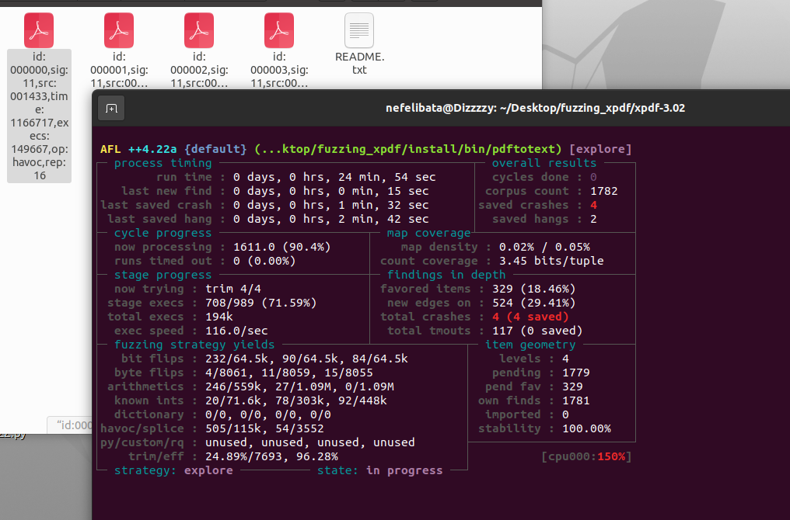
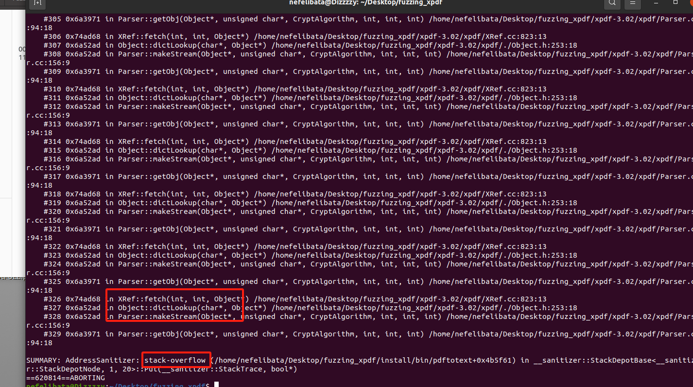
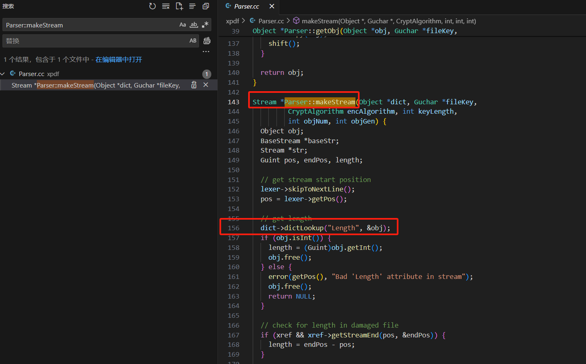
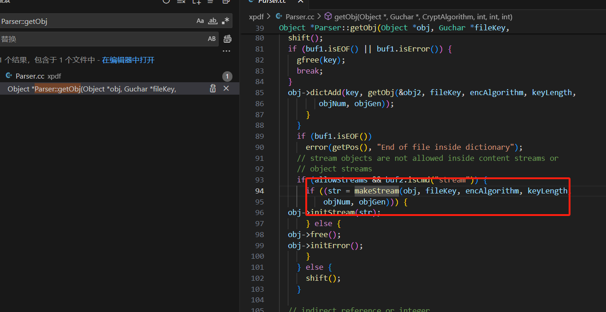
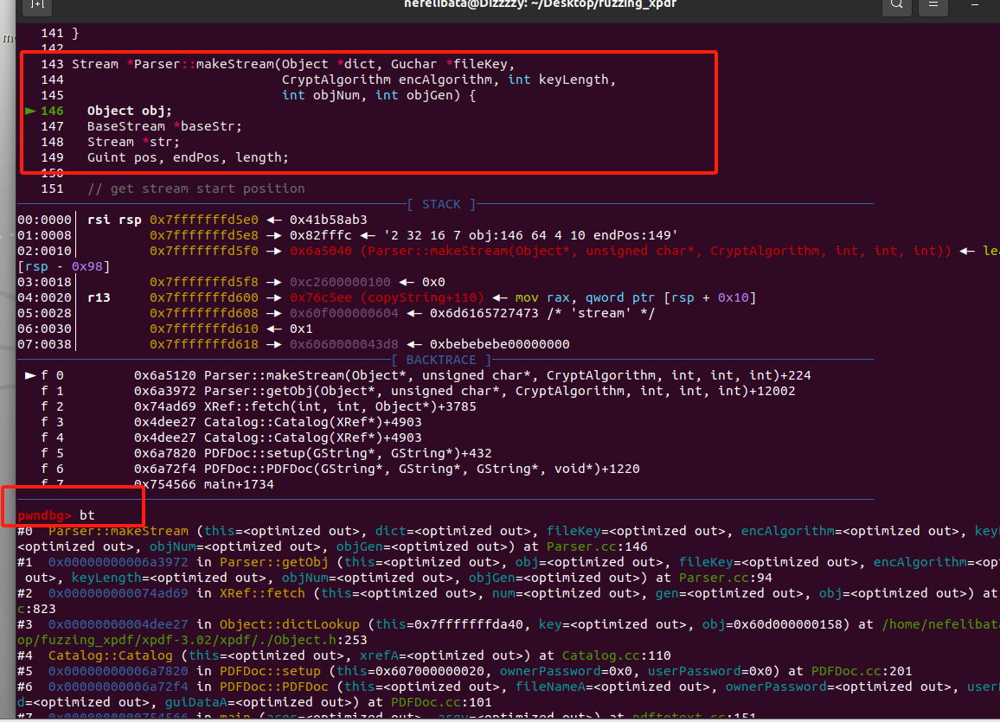
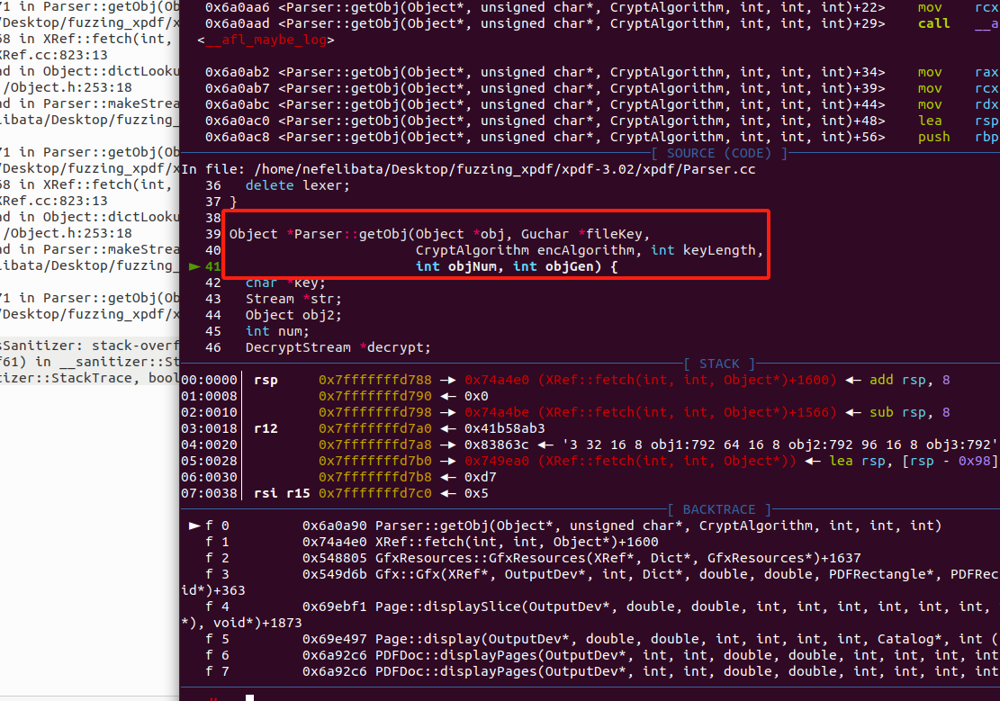
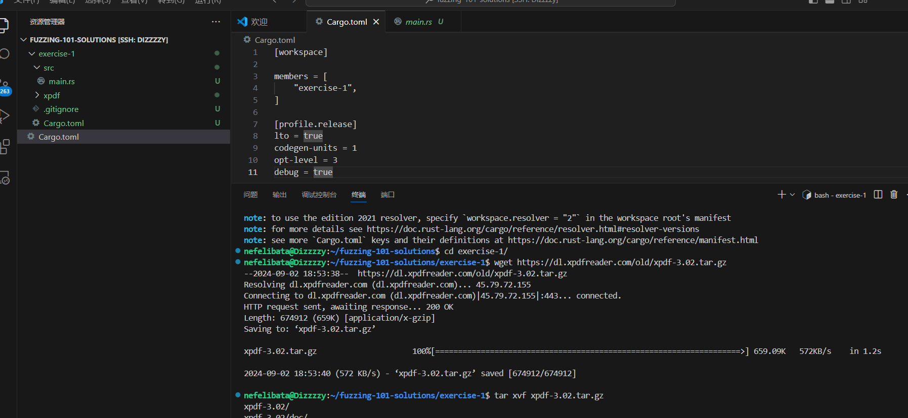
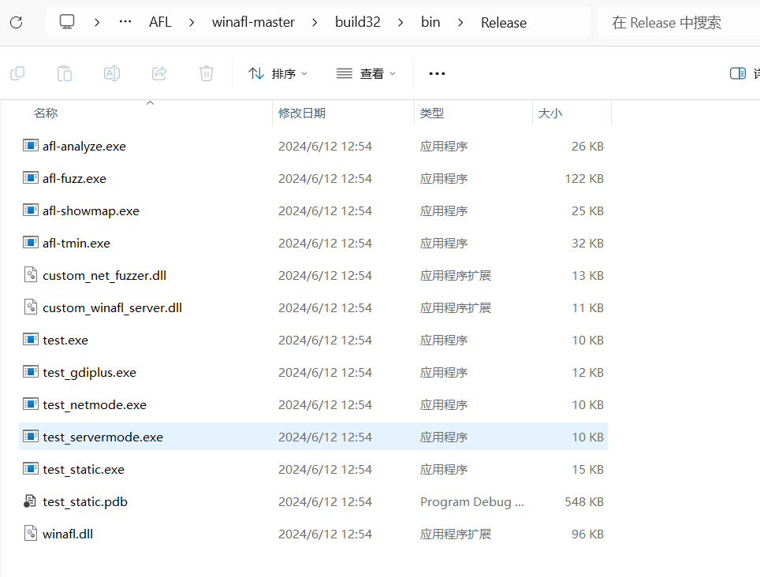
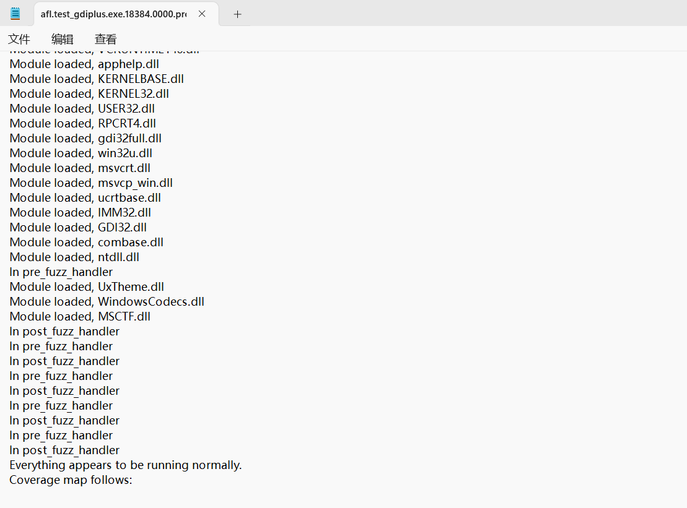
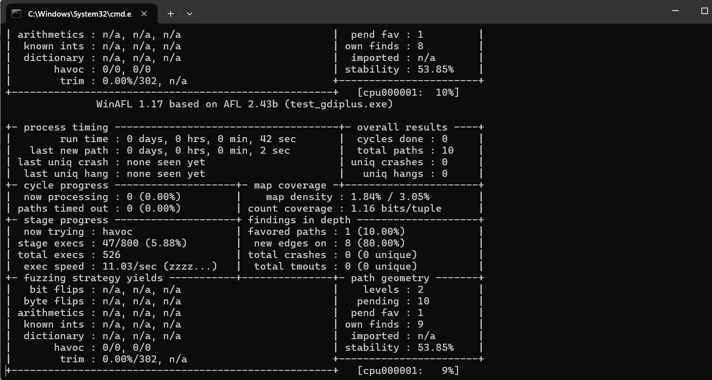

# Fuzzing 101

## xercise 1 - Xpdf

{% embed url="https://github.com/antonio-morales/Fuzzing101/tree/main/Exercise%201" %}

详细的过程在Fuzzing101的readme文档中有详细介绍这里就带过

```
mkdir fuzzing_xpdf && cd fuzzing_xpdf/
wget https://dl.xpdfreader.com/old/xpdf-3.02.tar.gz
tar -xvzf xpdf-3.02.tar.gz

#构建Xpdf并进行测试：
cd xpdf-3.02
sudo apt update && sudo apt install -y build-essential gcc
./configure --prefix="$HOME/fuzzing_xpdf/install/"
make
make install
```

AFL++安装

```
sudo apt-get update
sudo apt-get install -y build-essential python3-dev automake git flex bison libglib2.0-dev libpixman-1-dev python3-setuptools
sudo apt-get install -y lld-11 llvm-11 llvm-11-dev clang-11 || sudo apt-get install -y lld llvm llvm-dev clang 
sudo add-apt-repository ppa:ubuntu-toolchain-r/test
sudo apt-get install -y gcc-$(gcc --version|head -n1|sed 's/.* //'|sed 's/\..*//')-plugin-dev libstdc++-$(gcc --version|head -n1|sed 's/.* //'|sed 's/\..*//')-dev


#这里我进行了gcc版本的更新，更新以后要修改优先级：
sudo update-alternatives --install /usr/bin/gcc gcc /usr/bin/gcc-4.8 1 
sudo update-alternatives --install /usr/bin/gcc gcc /usr/bin/gcc-11 10

cd $HOME
git clone https://github.com/AFLplusplus/AFLplusplus && cd AFLplusplus
export LLVM_CONFIG="llvm-config-11"
make distrib
sudo make install
```

```
export LLVM_CONFIG="llvm-config-11"
CC=$HOME/AFLplusplus/afl-clang-fast CXX=$HOME/AFLplusplus/afl-clang-fast++ ./configure --prefix="$HOME/Desktop/fuzzing_xpdf/install/"
AFL_USE_ASAN=1 make
AFL_USE_ASAN=1 make install
```


开始fuzz，由于我开启了ASAN，所以这里使用-m none取消内存限制：

```
afl-fuzz -m none -i $HOME/Desktop/fuzzing_xpdf/pdf_examples/ -o $HOME/Desktop/fuzzing_xpdf/out/ -s 123 -- $HOME/Desktop/fuzzing_xpdf/install/bin/pdftotext @@ $HOME/Desktop/fuzzing_xpdf/output
```

<figure><figcaption></figcaption></figure>

30分钟触发了四个crashes：

<figure><figcaption></figcaption></figure>

### Crash分析

因为在AFL进行模糊测试时开启了ASAN，所以复现时很方便，第一个crash复现如下，是一个栈溢出漏洞，根据栈回溯可以看到，由于一直循环的调用Parse::getObj----XRef::fetch----Object::dictLookup----Parser::makeStream这三个函数导致最后栈溢出，定位源码以后看到是由于程序员编写递归时没有设置好递归深度上限，而样本导致了无限的递归。


<figure><figcaption></figcaption></figure>

#### GDB调试

调试的思路就是找循环的最后一个函数，看是为什么会跳转会一开始的函数，先看看源码其实已经很明显了：

<figure><figcaption></figcaption></figure>

<figure><figcaption></figcaption></figure>

在Parser::makeStream下断点

```
gdb --args ./install/bin/pdftotext ./out/default/crashes/crash1

pwndbg> b Parser::makeStream    //下断点
Breakpoint 1 at 0x6a5120: file Parser.cc, line 146.
pwndbg> r    //运行
pwndbg> bt //栈回溯
pwndbg> b *Parser::getObj    //下断点
Breakpoint 2 at 0x6a0a90: file Parser.cc, line 41.
pwndbg>c
```

<figure><figcaption></figcaption></figure>

<figure><figcaption></figcaption></figure>

## Exercise 1 - Xpdf  USE LibAFL

> 感谢Epi052师傅的[教程](https://epi052.gitlab.io/)



先配置好环境，创建rust项目：

<figure><figcaption></figcaption></figure>

创建项目以后，编写第一个rust文件——build.rs:

<pre class="language-toml"><code class="lang-toml">```cargo.toml

[package]
name = "exercise-one-solution"
version = "0.1.0"
edition = "2021"
build = "build.rs"

[dependencies]
<strong>libafl = "0.13.2"
</strong>
```
</code></pre>

````rust
```rust build.rs
fn main() {
    //使用Rust调用afl-clang-fast进行编译Xpdf
    println!("Build script running.....");
    
    let cwd = env::current_dir().unwrap().to_string_lossy().to_string();
    let xpdf_dir = format!("{}/xpdf", cwd);


    //export LLVM_CONFIG="llvm-config-11"
    env::set_var("LLVM_CONFIG", "llvm-config-11");

    //CC=$HOME/AFLplusplus/afl-clang-fast CXX=$HOME/AFLplusplus/afl-clang-fast++ ./configure --prefix="$HOME/fuzzing-101-solutions/exercise-1/xpdf/install/"
    Command::new("./configure")
        .arg(&format!("--prefix={}/install", xpdf_dir))
        .env("CC", "$HOME/AFLplusplus/afl-clang-fast")
        .env("CXX", "$HOME/AFLplusplus/afl-clang-fast++")
        .current_dir(xpdf_dir.clone())
        .status()
        .expect("Couldn't configure xpdf to build using afl-clang-fast");
    
    //AFL_USE_ASAN=1 make
    Command::new("make")
        .env("AFL_USE_ASAN", "1")
        .current_dir(xpdf_dir.clone())
        .status()
        .expect("Couldn't build xpdf with afl-clang-fast and ASAN");
    
    //AFL_USE_ASAN=1 make install
    Command::new("make")
        .arg("install")
        .env("AFL_USE_ASAN", "1")
        .current_dir(xpdf_dir.clone())
        .status()
        .expect("Couldn't install xpdf with afl-clang-fast and ASAN");

    println!("finish XPDF compiler");
    
}
```
````

<figure><figcaption></figcaption></figure>

执行`cargo build`完成对xpdf的插桩编译，生成的二进制文件在`xpdf/install`目录下~~这里注意libafl的版本不要太低(libafl = "0.13.2"我一开始是写的0.7.0)，不然会报错TypeID类型为u128不符合u64，无法编译libafl库（卡我一个小时啊啊）~~

接下来开始构建我们的libafl-fuzzer，搭积木啦

<figure><figcaption></figcaption></figure>

fuzzer写在main.rs中作为主程序，接下来从一个一个组件开始进行模糊测试器的构建

### Components: Corpus + Input <a href="#components-corpus-input" id="components-corpus-input"></a>

> 第一个组件：语料库+输入，语料库是存储测试用例的地方。测试用例定义为输入和一组相关元数据（例如执行时间）。
>
> 语料库可以以不同的方式存储测试用例，例如在磁盘上、在内存中，或者实现缓存以加速磁盘存储。

这里我们使用一个放在内存中的输入语料库，定义语料库的`Input type`为`BytesInput`，并设置一个放在磁盘上的输出语料库。输入语料库中导致超时的测试用例被视为“solution”，任何导致程序挂起的文件都将存储在输出语料库中。libafl官方文档中对于语料库类型的介绍如下

* [cached](https://docs.rs/libafl/0.10.1/libafl/corpus/cached/index.html) ：The [`CachedOnDiskCorpus`](https://docs.rs/libafl/0.10.1/libafl/corpus/cached/struct.CachedOnDiskCorpus.html) stores [`Testcase`](https://docs.rs/libafl/0.10.1/libafl/corpus/testcase/struct.Testcase.html)s to disk, keeping a subset of them in memory/cache, evicting in a FIFO manner.
* [inmemory](https://docs.rs/libafl/0.10.1/libafl/corpus/inmemory/index.html) ：In-memory corpus, keeps all test cases in memory at all times
* [inmemory\_ondisk](https://docs.rs/libafl/0.10.1/libafl/corpus/inmemory\_ondisk/index.html) ：The [`InMemoryOnDiskCorpus`](https://docs.rs/libafl/0.10.1/libafl/corpus/inmemory\_ondisk/struct.InMemoryOnDiskCorpus.html) stores [`Testcase`](https://docs.rs/libafl/0.10.1/libafl/corpus/testcase/struct.Testcase.html)s to disk. Additionally, _all_ of them are kept in memory. For a lower memory footprint, consider using [`crate::corpus::CachedOnDiskCorpus`](https://docs.rs/libafl/0.10.1/libafl/corpus/cached/struct.CachedOnDiskCorpus.html) which only stores a certain number of [`Testcase`](https://docs.rs/libafl/0.10.1/libafl/corpus/testcase/struct.Testcase.html)s and removes additional ones in a FIFO manner.
* [ondisk](https://docs.rs/libafl/0.10.1/libafl/corpus/ondisk/index.html)The ondisk corpus stores all [`Testcase`](https://docs.rs/libafl/0.10.1/libafl/corpus/testcase/struct.Testcase.html)s to disk. It never keeps any of them in memory. This is a good solution for solutions that are never reused, and for very memory-constraint environments. For any other occasions, consider using [`crate::corpus::CachedOnDiskCorpus`](https://docs.rs/libafl/0.10.1/libafl/corpus/cached/struct.CachedOnDiskCorpus.html) which stores a certain number of testcases in memory and removes additional ones in a FIFO manner.

```rust

use libafl::corpus::{
    Corpus, InMemoryCorpus, IndexesLenTimeMinimizerCorpusScheduler, OnDiskCorpus,
    QueueCorpusScheduler,
};
fn main{
    ...
    let corpus_dirs = vec![PathBuf::from("./corpus")];
    
    //组件：语料库与输入
    let input_corpus = InMemoryCorpus::<BytesInput>::new();
    let timeouts_corpus = OnDiskCorpus::new(PathBuf::from("./timeouts")).expect("Could not create timeouts corpus");
    ...
}
```

### Component: Observer <a href="#component-observer" id="component-observer"></a>

> 下一个组件：观察者是向模糊测试器提供被测程序执行期间观察到的信息的实体。
>
> 观察者 (Observer) 中包含的信息不会在执行期间保留，但如果Input被认为是intesting的，则可以将其序列化并传递到其他组件，并将input添加到`Corpus`。
>
> 例如，观察者记录覆盖路径图以报告模糊器（AFL为例的fuzzer），也可以设置`Observer`收集执行运行所花费的时间、程序输出或更高级的观察结果，例如运行时的最大堆栈深度。此信息是对程序动态属性的观察。

这里为我们的模糊器搭一块路径命中次数的观察者积木和一块运行时间观察者积木：

```rust
//rust mian.rs -- fn main:
const MAP_SIZE: usize = 65536;
    //组件：观察者
    //

    // A Shared Memory Provider which uses `shmget`/`shmat`/`shmctl` to provide shared
    // memory mappings. The provider is used to ... provide ... a coverage map that is then
    // shared between the Observer and the Executor
    //分配一块共享内存来记录覆盖路径
    let mut shmem = StdShMemProvider::new().unwrap().new_map(MAP_SIZE).unwrap();

    // save the shared memory id to the environment, so that the forkserver knows about it; the
    // ShMemId is populated as part of the implementor of the ShMem trait
    shmem
        .write_to_env("__AFL_SHM_ID")
        .expect("couldn't write shared memory ID");

    // this is the actual shared map, as a &mut [u8]
    let mut shmem_map = shmem.map_mut();

    //设置一个执行路径命中次数的观察者
    // HitcountsMapObserver 需要一个基础对象作为其构造函数的一部分传入。
    //我们使用的基础对象是 ConstMapObserver。
    //ConstMapObserver 是 MapObserver 上的一层优化。
    //通过在编译时已知的映射大小来决定一个测试用例是否“有趣”，能够在性能上带来一些提升
    let edges_observer = HitcountsMapObserver::new(ConstMapObserver::<_, MAP_SIZE>::new(
        "shared_mem",
        &mut shmem_map,
    ));
    //let edges_observer = unsafe { HitcountsMapObserver::new(StdMapObserver::new("shared_mem", shmem_buf)) };
    
    //设置一个执行时间的观察者
    let time_observer = TimeObserver::new("time");
```

### Component: Feedback <a href="#component-feedback" id="component-feedback"></a>

> 下一个组件：反馈器，反馈器将测试程序执行结果分类为有趣或不有趣。通常，如果执行有趣，则将用于馈送目标程序的相应输入添加到语料库中。
>
> 大多数时候，反馈的概念与观察者有着深刻的联系（所以我们看到设置反馈器时会把观察者引用传递进行实例创建：
>
> ```rust
> MapFeedbackState::with_observer(&edges_observer);
> ```
>
> ），但它们是不同的概念。
>
> 在大多数情况下，反馈会处理一个或多个观察者报告的信息，以决定执行是否有趣。“有趣性”的概念很抽象，但通常与新颖性搜索有关（即，有趣的输入是那些到达控制流图中以前未见过的边缘的输入）。

实现代码如下，具体的解释放在代码的注释中：

````rust
```rust main.rs fn main...
    // Component: Feedback
    let feedback_state = MapFeedbackState::with_observer(&edges_observer);//将刚刚创建的观察者传递给反馈器
    let feedback = feedback_or!(
        // New maximization map feedback (attempts to maximize the map contents) linked to the
        // edges observer and the feedback state. This one will track indexes, but will not track
        // novelties, i.e. new_tracking(... true, false).
        MaxMapFeedback::new_tracking(&feedback_state, &edges_observer, true, false),
        //MaxMapFeedback 是一种尝试最大化映射内容的反馈机制，用来跟踪边缘覆盖率。
        //new_tracking表示这个反馈器将跟踪索引变化，但不追踪新奇性（novelties）
        //也就是说，它会关注哪些路径命中计数（hitcounts）发生了变化，而不管是否是全新的路径。
        //虽然 TimeFeedback 不会判断输入是否“有趣”（即不直接返回 is_interesting 为 true）
        //但它会记录执行时间，帮助分析执行时间的变化
        TimeFeedback::new_with_observer(&time_observer)
    );
    //通过 feedback_or! 宏，测试输入只要满足任意一个反馈机制的条件，就会被认为是“有趣”的，进而被保留。
    
    //  创建了一个新的映射反馈状态，用于存储与超时（timeout）相关的边缘覆盖信息。
    //这个状态使用了 MAP_SIZE 大小的历史映射，用于追踪哪些超时导致了新的覆盖。
    let objective_state = MapFeedbackState::new("timeout_edges", MAP_SIZE);

    // A feedback is used to choose if an input should be added to the corpus or not. In the case
    // below, we're saying that in order for a testcase's input to be added to the corpus, it must:
    //   1: be a timeout
    //        AND
    //   2: have created new coverage of the binary under test
    //
    // The goal is to do similar deduplication to what AFL does
    let objective = feedback_and_fast!(
        //CrashFeedback这个反馈机制会在程序崩溃时报告输入为“有趣”。
        //它是用于检测崩溃情况的关键组件，当一个输入导致被测程序崩溃时，反馈将返回 true，表示这个输入应该被保留。
        CrashFeedback::new(),
        // A TimeoutFeedback reports as "interesting" if the exits via a Timeout
        // 类似的我们也可以设置超时为有趣：即创建TimeoutFeedback::new(),
        
        // Combined with the requirement for new coverage over timeouts
        MaxMapFeedback::new(&objective_state, &edges_observer)
        //专门为追踪与超时相关的新覆盖率而设计的
        //只有当一个输入既导致崩溃又在超时时创建了新覆盖时，才会被认为是“有趣”的
    );

```
````

### Component: State <a href="#component-state" id="component-state"></a>

> State是对从语料库收到的单个输入进行操作的实体。
>
> 例如，给定语料库的输入，突变阶段会应用突变器并执行生成的输入一次或多次。可以安排执行此操作的次数，例如，AFL 使用输入的性能分数来选择应调用 havoc 突变器的次数。这也可能取决于其他参数，例如，仅仅应用bit flip或insert 固定值

<pre class="language-rust"><code class="lang-rust">```rust
    // Component: State
    // Creates a new State, taking ownership of all of the individual components during fuzzing
    let mut state = StdState::new(
        // random number generator with a time-based seed
        StdRand::with_seed(current_nanos()),
        input_corpus,
        timeouts_corpus,
        // States of the feedbacks that store the data related to the feedbacks that should be
        // persisted in the State.
        tuple_list!(feedback_state, objective_state),
    );
    //也可以这么写：
    //   let mut state = StdState::new(
<strong>    //        StdRand::with_seed(current_nanos()),
</strong>    //        input_corpus,
    //        timeouts_corpus,
    //        &#x26;mut feedback_state,
    //        &#x26;mut objective_state,
    );
```
</code></pre>

### Component: Stats & EventManager <a href="#component-state" id="component-state"></a>

> `Stats` 和 `EventManager` 组件用于管理和报告模糊测试过程中的统计信息和事件。这些组件提供了对模糊测试器状态的可视化和管理，帮助用户监控测试进程和效果。

相关代码如下，这里在进行一个简答println输出：

````rust
```rust
    // Component: Stats
    // call println with SimpleStats::display as input to report to the terminal. introspection
    // feature flag can be added for additional stats
    let stats = SimpleStats::new(|s| println!("{}", s));

    // Component: EventManager
    // The event manager handles the various events generated during the fuzzing loop
    // such as the notification of the addition of a new testcase to the corpus
    let mut mgr = SimpleEventManager::new(stats);
```
````

### Component: Scheduler <a href="#component-scheduler" id="component-scheduler"></a>

> `Scheduler` 组件负责从语料库中选择测试用例，并决定哪些测试用例应该被执行。它可以根据各种策略来优化测试用例的选择，通常包括最小化和优先级调度。

* **`IndexesLenTimeMinimizerCorpusScheduler`**:
  * **功能**：
    * `IndexesLenTimeMinimizerCorpusScheduler` 是一个结合了最小化和优先级调度的调度器。
    * 这个调度器会优先选择那些较小且执行速度较快的测试用例，这些测试用例能够有效地覆盖所有注册的 `MapIndexesMetadata` 条目。
    * 其中的 `LenTimeMulFavFactor` 是一个用于评估和排序测试用例的因素，考虑了测试用例的长度、执行时间和受欢迎程度。
  * **适用场景**：
    * 当需要选择小而快速的测试用例来高效地覆盖所有路径或代码区域时，使用这种调度器。
    * 适用于希望通过最小化和优先级调度来优化测试用例选择的场景。
* **`QueueCorpusScheduler`**:
  * **功能**：
    * `QueueCorpusScheduler` 按照队列的方式遍历语料库中的测试用例。
    * 它以先进先出的方式（FIFO）处理测试用例，即最早添加到队列中的测试用例会最先被执行。

````rust
```rust
 // Component: Scheduler
    // A minimization + queue policy to get test cases from the corpus
    //
    // IndexesLenTimeMinimizerCorpusScheduler is a MinimizerCorpusScheduler with a
    // LenTimeMulFavFactor that prioritizes quick and small Testcases that exercise all the
    // entries registered in the MapIndexesMetadata
    //
    // a QueueCorpusScheduler walks the corpus in a queue-like fashion
    let scheduler = IndexesLenTimeMinimizerCorpusScheduler::new(QueueCorpusScheduler::new());
```
````

### Component: Fuzzer <a href="#component-fuzzer" id="component-fuzzer"></a>

> Fuzzer负责将输入数据传递给目标程序，并根据反馈和目标来指导测试进程。`Fuzzer` 组件将反馈机制、目标条件和调度器结合起来，驱动模糊测试的整个过程。

````rust
```rust
// A fuzzer with feedback, objectives, and a corpus scheduler
    let fuzzer =  StdFuzzer::new(scheduler, feedback, objective);
```
````

### Component: Executor <a href="#component-executor" id="component-executor"></a>


`ForkserverExecutor` 是一个基于 forkserver 机制的执行器，用于在隔离的子进程中执行测试用例。这种机制类似于 AFL 的实现，通过 fork 子进程来执行目标程序。

* **参数**：
  * **路径**：目标程序的路径，这里是 `pdftotext` 可执行文件。
  * **参数**：传递给目标程序的命令行参数。`@@` 通常用作占位符，用于替换测试用例文件路径。
  * **use\_shmem\_testcase**：决定是否通过共享内存传递测试用例数据。这里设置为 `true` 表示测试用例是通过磁盘文件传递的，而不是共享内存。
  * **Observers**：`tuple_list!` 包含了需要在执行期间收集数据的观察者（如 `edges_observer`, `time_observer`），这些观察者监控程序的行为，并提供反馈数据。

**TimeoutForkserverExecutor**

* `TimeoutForkserverExecutor` 是 `ForkserverExecutor` 的一个包装器，增加了超时控制功能。它在每次执行测试用例时设置一个超时时间，以防止目标程序长时间挂起。
* **超时设置**：在代码中，超时时间被设置为 5000 毫秒（5 秒）。如果目标程序在规定时间内没有完成，将会被终止，避免测试过程被卡住。

**load\_initial\_inputs**

* 在第一次运行时，`Executor` 会从磁盘加载初始的测试用例语料库到内存中，以便后续的模糊测试使用。
* **状态管理**：通过检查语料库的大小，如果语料库为空，则会从指定的目录加载初始输入。

````rust
```rust
    // Component: Executor
    // 创建基于 forkserver 机制的执行器Executor，在隔离的子进程中执行测试用例
    let fork_server = ForkserverExecutor::new(
        "$HOME/fuzzing-101-solutions/exercise-1/xpdf/install/bin/pdftotext".to_string(),
        // &[String::from("@@")],
        &[],
        // we're passing testcases via on-disk file; set to use_shmem_testcase to false
        true,
        tuple_list!(edges_observer, time_observer),
    ).unwrap();

    let timeout = Duration::from_millis(5000);//设置超时时间

    // ./pdftotext @@
    let mut executor = TimeoutForkserverExecutor::new(fork_server, timeout)
        .unwrap();
    //对fork_server进行一个包装，运行超时时中止测试
    
    // 初次测试时将语料库加载到内存中
    if state.corpus().count() < 1 {
        state
            .load_initial_inputs(&mut fuzzer, &mut executor, &mut mgr, &corpus_dirs)
            .unwrap_or_else(|err| {
                panic!(
                    "Failed to load initial corpus at {:?}: {:?}",
                    &corpus_dirs, err
                )
            });
        println!("imported {} inputs from disk.", state.corpus().count());
    }
    
```
````

### Components: Mutator <a href="#components-mutator-stage" id="components-mutator-stage"></a>

这里创建了一个havoc的变异器，详细的变异器可以看这个API文档：



```rust
    // Component: Mutator
    //

    // Setup a mutational stage with a basic bytes mutator
    let mutator = StdScheduledMutator::new(havoc_mutations());
```

### Components: Stage <a href="#components-mutator-stage" id="components-mutator-stage"></a>

```rust
    // Component: Stage
    //
    
    let mut stages = tuple_list!(StdMutationalStage::new(mutator));
```

### start fuzzing

```rust
    fuzzer
        .fuzz_loop(&mut stages, &mut executor, &mut state, &mut mgr)
        .expect("Error in the fuzzing loop");
```

## Exercise 9 - 7-Zip

{% embed url="https://github.com/antonio-morales/Fuzzing101/tree/main/Exercise%209" %}

WinAFL

`winafl` 是 `afl` 在 `windows` 的移植版， `winafl` 使用 `dynamorio` 来统计代码覆盖率，并且使用共享内存的方式让 `fuzzer` 知道每个测试样本的覆盖率信息。

### 环境配置

#### DynamoRIO安装

DynamoRIO 是一款运行时代码操纵系统，其独特之处在于能在程序执行过程中对任意部分的代码实施变换。它提供了一个接口，让构建动态工具变得轻松，这些工具适用于多种用途，包括但不限于程序分析与理解、性能剖析、代码插入、优化以及编译翻译等等。与其他动态工具系统相比，DynamoRIO 的能力不仅限于调用插桩(trampoline)，更允许开发者借助强大的 IA-32/AMD64/ARM/AArch64 指令操作库，直接修改应用程序指令。

DynamoRIO 确保了在标准操作系统（如 Windows、Linux 或 Android）和主流硬件平台上高效透明地进行代码操控，支持 IA-32、AMD64、ARM 和 AArch64 架构

这里我选择直接下载的releases版本，注意解压后的cmake目录，我的cmake目录为：`F:\DynamoRIO-Windows-10.0.0\cmake` ，后续安装WinAFL时会用到这个目录



#### WinAFL安装：



使用Developer Command Prompt for VS 2022对WinAFL源码进行编译

```bash
F:\AFL\winafl-master>mkdir build32
F:\AFL\winafl-master>cd build32
#下面的-DDynamoRIO_DIR填写更改安装的DynamoRIO cmake路径
F:\AFL\winafl-master\build32>cmake -G"Visual Studio 17 2022" -A Win32 .. -DDynamoRIO_DIR=F:\DynamoRIO-Windows-10.0.0\cmake
F:\AFL\winafl-master\build32>cmake --build . --config Release
```

安装完成以后的WinAFL release如下：

<figure><figcaption></figcaption></figure>

进行测试，这里尝试对test\_gdiplus.exe进行插桩并fuzz：

```
-i //存放样本的目录
-o //保存输出数据,包括 crash文件、测试用例等
-D //DynamoRIO的路径 (drrun, drconfig)
-t msec //每一次样本执行的超时时间
第一个"--"分割符	//后面跟的是插桩的参数
第二个"--"分割符	//后面跟的是目标程序的参数
@@ //引用 -i 参数的中的测试用例
```

```bash
F:\AFL\winafl-master\build32\bin\Release>F:\DynamoRIO-Windows-10.0.0\bin32\drrun.exe -c winafl.dll -debug -target_module test_gdiplus.exe -target_offset 0x10b0  -fuzz_iterations 5 -nargs 2  -- test_gdiplus.exe not_kitty.bmp
#创建in和out目录，存放输入种子in和输出out，in文件夹中要存放一个测试初始用例，这里用的testcase里面的bmp
F:\AFL\winafl-master\build32\bin\Release>.\afl-fuzz.exe  -debug  -i  in -o out -D F:\DynamoRIO-Windows-10.0.0\bin32 -t 20000  -- -coverage_module  test_gdiplus.dll   -coverage_module WindowsCodecs.dll -fuzz_iterations 5 -target_module test_gdiplus.exe -target_offset 0x10b0 -nargs 2  -- test_gdiplus.exe @@
```

结果：成功插桩，成功fuzz：

<figure><figcaption></figcaption></figure>

<figure><figcaption></figcaption></figure>

```
WinAFL监控参数说明：
Process timing		//Fuzzer运行时长、以及距离最近发现的路径、崩溃和挂起经过了多长时间
Overall results		//Fuzzer当前状态的概述
Cycle progress		//当前Fuzz的进展
Map coverage		//目标二进制文件中的插桩代码所观察到覆盖范围的细节
Stage progress		//Fuzzer现在正在执行的文件变异策略、执行次数和执行速度
Findings in depth	//有关我们找到的执行路径，异常和挂起数量的信息
Fuzzing strategy yields	//关于突变策略产生的最新行为和结果的详细信息
Path geometry		//有关Fuzzer找到的执行路径的信息
CPU load			//CPU利用率
```

注意，根据其他师傅博客中的提示“ 第一次对目标程序进行Fuzz时需要加上debug，方便出错时进行错误的排查，确认无误后**记得取消debug参数，否则会极大影响运行效率**”

ok，至此WinAFL(32)环境搭建完成

### Fuzzing 7-Zip

下载源码（这里我选择最新的 7-Zip 23.01（2023-06-20） 7-Zip 源代码 ）：



