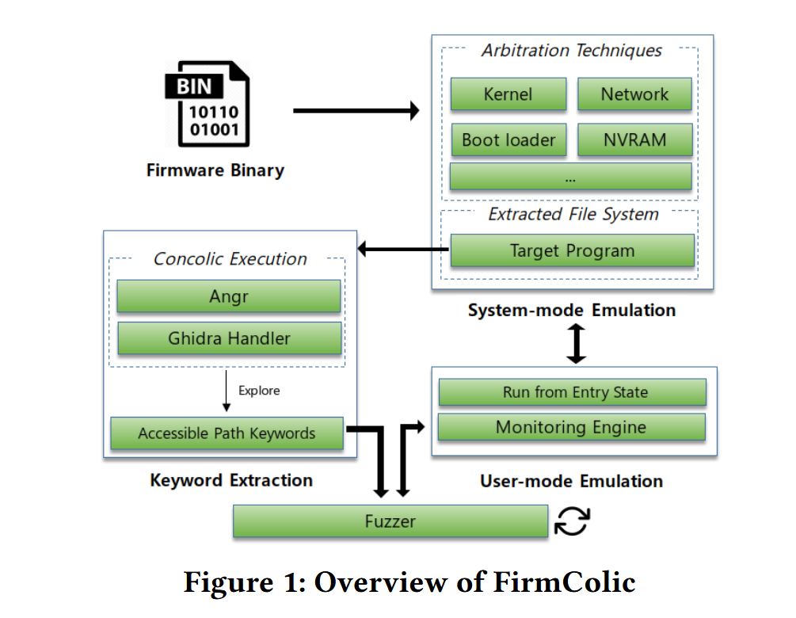
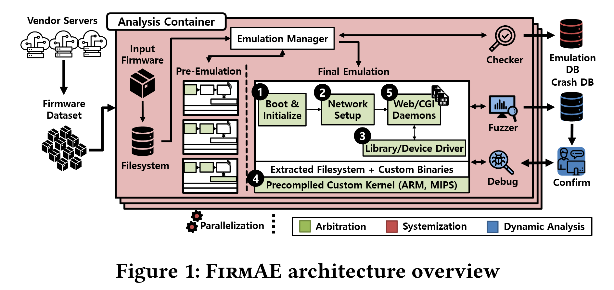

---
layout:
  width: wide
  title:
    visible: true
  description:
    visible: true
  tableOfContents:
    visible: true
  outline:
    visible: true
  pagination:
    visible: true
  metadata:
    visible: true
---

# iot Fuzz

## 背景

### （1）协议模糊测试

协议测试的核心挑战源于其 “状态依赖性” 与 “语法语义约束”

* **状态机模型导致深层路径难以覆盖**：协议服务端通常具备严格的状态机逻辑（如 5G NGAP 协议的会话建立、数据传输、释放流程），客户端需发送符合状态转换规则的请求序列才能推进服务端状态。若仅通过随机输入（如通用工具的字节级变异），输入会因不符合当前状态要求被早期丢弃，无法探测协议栈深层路径（如 IoT 协议的认证后操作、工控协议的配置下发流程）
* **语法语义规则导致无效用例泛滥**：协议存在固定的格式规范（如二进制协议的字段长度、ASCII 协议的终结符）与语义约束（如校验和有效性、字段取值范围）。通用工具的字节级变异（如随机修改字节、插入乱码）会破坏协议结构，生成大量被服务端直接拒绝的无效用例

**基于生成的模糊测试**

如Peach (Eddington 2025 ) 和 BooFuzz (Jtpereyda 2025 )，依赖于手动构建的测试模型来生成测试用例

**基于变异的模糊测试器**

如 AFLNet（Pham 等人，2020），测试用例是通过随机变异现有输入生成的。这种方法不需要预先了解协议规范或消息格式，因此易于实现。由于缺乏格式指导，盲目变异的数据包通常会被结构严格的协议实现直接拒绝，从而降低测试效率

* **AFLNet**：灰盒协议模糊测试， “基于响应的状态建模”。将消息序列作为种子，解析服务端响应以提取状态变化，将种子拆分为 “状态推进序列（M1）- 当前测试序列（M2）- 后续序列（M3）”，每次仅针对服务端当前状态测试 M2，显著提升深层路径覆盖率。此外，AFLNet 在字节级变异基础上新增 “消息级变异”（如插入 / 删除完整消息、重排消息顺序），适配协议的序列特性



### （2）固件模糊测试

**挑战：**&#x9ED1;盒性 + 环境依赖性 + 异构性

现有工具（如 Firm-AFL 基于的 QEMU）仅支持少数架构与固件类型，无法应对 IoT 固件的多样性。研究指出，固件仿真失败主要源于五大问题：**启动流程不兼容、网络模块适配差、NVRAM（非易失性内存）配置错误、内核版本不匹配、其他硬件依赖缺失**。

## LipFuzzer

LIPFuzzer 的核心创新是**将 LLM 的协议理解能力与传统变异式模糊测试结合**，通过 LLM 自动识别协议关键字段、提供针对性变异策略。



<figure><figcaption></figcaption></figure>

#### 1. 报文预处理与协议文档投喂

* **报文预处理**：
  1. 用 Wireshark 捕获真实 IoT 协议通信流量（如 Modbus-TCP 设备交互报文）；
  2. 将捕获的报文导出为 C 文件（每个数组存储 1 个十六进制格式的完整报文）；
  3. 通过正则表达式提取报文、清理冗余字符（如 “0x”、空格），并剥离传输层 / 网络层头部（如 TCP 头、IP 头），仅保留应用层的 IoT 协议 payload，生成机器可读的报文序列。
* **协议文档投喂**：将 IoT 协议的技术文档（如 RFC 规范、接口定义）转换为纯文本，按 LLM 上下文窗口限制分割后，通过 API 上传至 LLM（如 GPT-4、DeepSeek-R1），为 LLM 理解协议提供基础。

#### 2. LLM 辅助的类型字段识别与报文聚类

* **类型字段识别**：类型字段是协议报文的 “功能标识”（如 Modbus-TCP 的 “功能码”），决定报文结构与用途。通过设计**Prompt 模板 1**（示例：“以下是 Modbus-TCP 报文的十六进制格式：\[报文]，哪几个字节代表操作码 / 功能码？”），重复查询 LLM 20 次，取出现频率最高的结果作为类型字段位置（如 Modbus-TCP 的类型字段为第 8-9 字节）。
* **报文聚类**：根据识别出的类型字段，将预处理后的报文按 “结构相似性” 分组（如 Modbus-TCP 的 “读线圈”“写寄存器” 报文分为不同类别），为后续 “分类变异” 奠定基础。

#### 3. LLM 辅助的推荐变异字段提取

变异字段的选择直接影响用例质量。LIPFuzzer 通过**Prompt 模板 2**，结合 IoT 协议特性（如控制类协议不建议变异数据字段、传输类协议不建议变异操作类型字段），让 LLM 识别 “高价值变异字段”：

* Prompt 示例：“以下是 Modbus-TCP 报文：\[报文]，根据 IoT 协议特性，推荐哪些字节进行变异？（控制类协议不建议变异数据字段）”；
* 重复查询 LLM 10 次（每组报文随机选 10 个样本），取高频结果作为 “推荐变异字段”，剩余字段为 “非推荐变异字段”，并存储结果避免后续重复调用 LLM，节省资源。

#### 4. 针对性变异策略设计

LIPFuzzer 根据字段类型（推荐 / 非推荐）设计差异化变异策略，兼顾用例有效性与多样性：

| 字段类型    | 细分类型       | 变异策略                                |
| ------- | ---------- | ----------------------------------- |
| 推荐变异字段  | 长字段（>2 字节） | 随机增减数值（如数据块长度）、替换为 null 值           |
| 推荐变异字段  | 短字段（≤2 字节） | 字节级修改、删除、重复（如控制标志位）                 |
| 非推荐变异字段 | -          | 极低概率（1%）用边界值替换（如 “00”“FF”），避免大量无效用例 |

* 此外，采用 “渐进式随机变异”：测试初期仅变异 1 个推荐字段，每 2 小时增加 1 个变异字段（不超过推荐字段总数），逐步扩大变异范围，提升漏洞触发概率。

#### 5. 测试执行与漏洞检测

每次模糊测试迭代中，LIPFuzzer 从 “聚类后的报文池” 随机选择 1 个报文，按上述策略变异生成新用例，通过 Socket 发送至目标协议实现（如 Modbus-TCP 的 MOD\_RSSIM、MQTT 的 Mosquitto），监控目标是否出现崩溃、超时等异常，定位漏洞。

## FirmColic



<figure><figcaption></figcaption></figure>

#### 符号执行驱动的关键词提取：替代人工分析

FirmColic 通过符号执行（Concolic Execution）自动提取 “能覆盖深层路径的关键词”，解决传统方案依赖人工的问题，具体流程如下：

**（1）符号执行工具与架构适配**

* 选用 Angr 作为符号执行工具，但其对 MIPS/ARM（IoT 固件主流架构）支持有限；为此，FirmColic 集成 Ghidra（逆向工程框架）与 Angr：Ghidra 已支持绝大多数 MIPS/ARM 架构的寄存器分析、内存映射，可补充 Angr 的架构支持缺陷，实现对目标程序的完整路径分析；
* 符号执行目标：固件中的 Web 应用二进制文件（如 httpd、hnap 进程），通过分析所有程序路径，提取 “能触发路径跳转的关键字符串”（如 HTTP 头中的 “cookie: uid-”“GET /admin/”）。

**（2）关键词提取逻辑**

符号执行通过求解程序路径约束（如 “若输入包含‘Authorization: Basic’，则进入认证后路径”），自动收集能覆盖新路径的关键词；例如，在分析路由器 Web 接口时，提取出 “uid-”“Authorization: Basic ZsAqkdQNce090=” 等关键词，这些关键词可直接指导模糊测试器生成符合格式的用例，减少无效输入。

## Snipuzz



## 固件仿真基础知识

固件仿真分为**用户级（User-level）** 和**系统级（System-level）**，二者在仿真范围、能力与适用场景上差异显著，具体对比如下：

<table><thead><tr><th width="132.33331298828125">维度</th><th>用户级仿真（User-level Emulation）</th><th>系统级仿真（System-level Emulation）</th></tr></thead><tbody><tr><td><strong>仿真范围</strong></td><td>仅仿真固件中的<strong>单个目标程序</strong>（如 Web 服务、CGI 程序）</td><td>完整仿真客户系统，包括<strong>内核、硬件外设、文件系统</strong>等全组件</td></tr><tr><td><strong>资源依赖</strong></td><td>依赖主机系统的内核、库和资源（如用主机的网络栈、文件系统）</td><td>不依赖主机组件，独立模拟客户系统的硬件交互（如 MMIO、中断）</td></tr><tr><td><strong>典型场景</strong></td><td>分析单一服务（如 Web 界面、特定功能模块）</td><td>全固件行为分析（如开机流程、外设驱动交互、内核漏洞检测）</td></tr><tr><td><strong>优势</strong></td><td>轻量、性能高（接近原生），无需模拟复杂硬件</td><td>保真度高，可覆盖固件与硬件交互的全流程（如 NVRAM 访问、外设控制）</td></tr><tr><td><strong>局限</strong></td><td>无法处理依赖定制库、设备驱动的动态内容（如 CGI 程序崩溃）</td><td>复杂度高，需解决硬件多样性问题（如不同厂商的外设差异）</td></tr><tr><td><strong>代表工具</strong></td><td>QEMU User-space（如<code>qemu-i386</code>模拟 x86 程序）</td><td>QEMU System-mode、Firmadyne、FirmAE</td></tr></tbody></table>

#### 核心工具对比

<table><thead><tr><th width="133">工具</th><th width="145.66668701171875">类型</th><th>核心能力</th><th>适用场景</th></tr></thead><tbody><tr><td>QEMU</td><td>通用模拟器</td><td>同时支持用户级与系统级仿真，可模拟多架构（ARM、MIPS 等），支持硬件加速（如 Intel VT-x）</td><td>快速验证单一程序或构建基础仿真环境</td></tr><tr><td>Firmadyne</td><td>系统级框架</td><td>自动化固件提取、仿真与分析，支持 NVRAM 模拟，针对 Linux-based 物联网固件</td><td>大规模固件批量仿真（如路由器、摄像头）</td></tr><tr><td>FirmAE</td><td>系统级框架</td><td>基于 Firmadyne 优化，新增 “仲裁仿真”（解决环境差异），支持自动化与并行化</td><td>高成功率的大规模固件动态分析</td></tr><tr><td>Avatar2</td><td>混合仿真工具</td><td>结合仿真与硬件调试（如 JTAG），将外设访问转发给真实硬件，提升保真度</td><td>需高精度硬件交互的固件分析</td></tr><tr><td>HALucinator</td><td>高级仿真工具</td><td>基于 HAL（硬件抽象层）拦截函数，无需模拟底层 MMIO，支持跨设备扩展（如 NXP 不同系列芯片）</td><td>ARM Cortex-M 等微控制器固件仿真</td></tr></tbody></table>

## FirmAE





之前的工具Firmadyne存在模拟成功率低等问题， 其将原本Firmadyne的成功率16.28%提高到79.36%，底层使用QEMU。FirmAE 从固件的启动、网络、NVRAM、内核和其它五个方面 ，总结了导致固件仿真失败的原因及通用解决方法

<table><thead><tr><th width="151.66668701171875">失败类别</th><th width="176.6666259765625">具体问题</th><th>仲裁策略</th></tr></thead><tbody><tr><td>启动相关</td><td>自定义初始化路径</td><td>从固件内核命令行提取初始化程序路径（如<code>init=/etc/preinit</code>），无信息时从文件系统搜索<code>preinit</code>等关键词</td></tr><tr><td></td><td>文件系统缺失</td><td>提取可执行文件中的路径字符串（如<code>/var</code>、<code>/etc</code>），预创建对应目录结构</td></tr><tr><td>网络相关</td><td>IP 别名冲突</td><td>忽略多 IP 路由规则，利用主机默认路由实现网络通信</td></tr><tr><td></td><td>DHCP 配置缺失</td><td>强制设置默认网络（如<code>eth0</code>为 192.168.0.1，桥接<code>br0</code>）</td></tr><tr><td></td><td>VLAN 设置不足</td><td>配置主机 TAP 接口与 guest 的 VLAN ID 一致</td></tr><tr><td></td><td>防火墙拦截</td><td>清空 guest 的<code>iptables</code>规则，默认接受所有入站流量</td></tr><tr><td>NVRAM 相关</td><td>自定义配置文件</td><td>预仿真阶段记录 NVRAM 键值对，从文件系统搜索含这些键的文件并提取配置</td></tr><tr><td></td><td>空值崩溃</td><td><code>nvram_get()</code>返回空字符串而非 NULL，避免空指针引用错误</td></tr><tr><td>内核相关</td><td>模块支持不足</td><td>拦截模块调用（如<code>acos_nat</code>），返回预定义值而非真实硬件交互结果</td></tr><tr><td></td><td>版本不兼容</td><td>升级内核至 4.1.17，开启<code>CONFIG_COMPAT_BRK</code>选项兼容旧版<code>libc</code></td></tr><tr><td>其他</td><td>Web 服务器未启动</td><td>搜索文件系统中的 Web 服务程序（<code>httpd</code>、<code>lighttpd</code>等），强制执行</td></tr><tr><td></td><td>超时过短</td><td>延长超时至 240 秒</td></tr><tr><td></td><td>工具缺失</td><td>向固件文件系统添加<code>busybox</code>（含<code>mount</code>、<code>ln</code>等工具）</td></tr></tbody></table>

#### Arbitrated Emulation

论文提出一种技术——仲裁模拟，这个技术的核心是不严格遵循固件原始执行流程，核心思路是 “保证高层行为可用” 即可开展动态分析，无需定位和修复仿真失败的精确根源。**核心概念：仲裁点（Arbitration Point），**&#x662F; “**仿真流程中易发生失败、需注入干预操作的关键节点**”，需通过分析失败案例归纳得出

<figure><figcaption></figcaption></figure>
