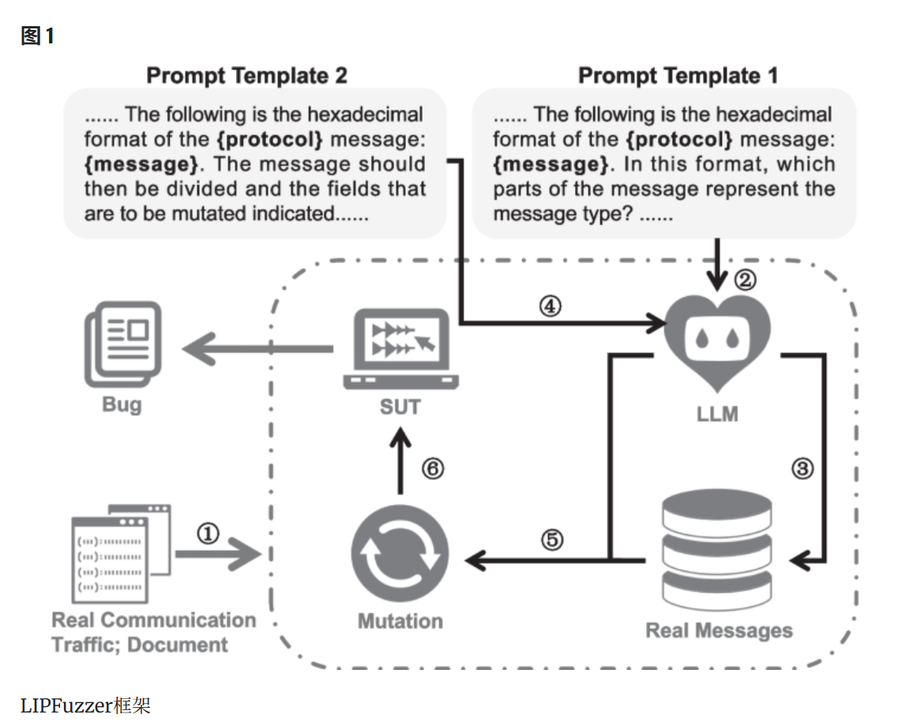

---
layout:
  width: wide
  title:
    visible: true
  description:
    visible: true
  tableOfContents:
    visible: true
  outline:
    visible: true
  pagination:
    visible: true
  metadata:
    visible: true
---

# iotFuzz-1

## 背景

### 协议模糊测试

协议测试的核心挑战源于其 “状态依赖性” 与 “语法语义约束”

* **状态机模型导致深层路径难以覆盖**：协议服务端通常具备严格的状态机逻辑（如 5G NGAP 协议的会话建立、数据传输、释放流程），客户端需发送符合状态转换规则的请求序列才能推进服务端状态。若仅通过随机输入（如通用工具的字节级变异），输入会因不符合当前状态要求被早期丢弃，无法探测协议栈深层路径（如 IoT 协议的认证后操作、工控协议的配置下发流程）
* **语法语义规则导致无效用例泛滥**：协议存在固定的格式规范（如二进制协议的字段长度、ASCII 协议的终结符）与语义约束（如校验和有效性、字段取值范围）。通用工具的字节级变异（如随机修改字节、插入乱码）会破坏协议结构，生成大量被服务端直接拒绝的无效用例

**基于生成的模糊测试**

如Peach (Eddington 2025 ) 和 BooFuzz (Jtpereyda 2025 )，依赖于手动构建的测试模型来生成测试用例

**基于变异的模糊测试器**

如 AFLNet（Pham 等人，2020），测试用例是通过随机变异现有输入生成的。这种方法不需要预先了解协议规范或消息格式，因此易于实现。由于缺乏格式指导，盲目变异的数据包通常会被结构严格的协议实现直接拒绝，从而降低测试效率

* **AFLNet**：灰盒协议模糊测试， “基于响应的状态建模”。将消息序列作为种子，解析服务端响应以提取状态变化，将种子拆分为 “状态推进序列（M1）- 当前测试序列（M2）- 后续序列（M3）”，每次仅针对服务端当前状态测试 M2，显著提升深层路径覆盖率。此外，AFLNet 在字节级变异基础上新增 “消息级变异”（如插入 / 删除完整消息、重排消息顺序），适配协议的序列特性



### 固件模糊测试

**挑战：**&#x9ED1;盒性 + 环境依赖性 + 异构性

现有工具（如 Firm-AFL 基于的 QEMU）仅支持少数架构与固件类型，无法应对 IoT 固件的多样性。研究指出，固件仿真失败主要源于五大问题：**启动流程不兼容、网络模块适配差、NVRAM（非易失性内存）配置错误、内核版本不匹配、其他硬件依赖缺失**。


## LipFuzzer

LIPFuzzer 的核心创新是**将 LLM 的协议理解能力与传统变异式模糊测试结合**，通过 LLM 自动识别协议关键字段、提供针对性变异策略。



<figure><figcaption></figcaption></figure>

#### 1. 报文预处理与协议文档投喂

* **报文预处理**：
  1. 用 Wireshark 捕获真实 IoT 协议通信流量（如 Modbus-TCP 设备交互报文）；
  2. 将捕获的报文导出为 C 文件（每个数组存储 1 个十六进制格式的完整报文）；
  3. 通过正则表达式提取报文、清理冗余字符（如 “0x”、空格），并剥离传输层 / 网络层头部（如 TCP 头、IP 头），仅保留应用层的 IoT 协议 payload，生成机器可读的报文序列。
* **协议文档投喂**：将 IoT 协议的技术文档（如 RFC 规范、接口定义）转换为纯文本，按 LLM 上下文窗口限制分割后，通过 API 上传至 LLM（如 GPT-4、DeepSeek-R1），为 LLM 理解协议提供基础。

#### 2. LLM 辅助的类型字段识别与报文聚类

* **类型字段识别**：类型字段是协议报文的 “功能标识”（如 Modbus-TCP 的 “功能码”），决定报文结构与用途。通过设计**Prompt 模板 1**（示例：“以下是 Modbus-TCP 报文的十六进制格式：\[报文]，哪几个字节代表操作码 / 功能码？”），重复查询 LLM 20 次，取出现频率最高的结果作为类型字段位置（如 Modbus-TCP 的类型字段为第 8-9 字节）。
* **报文聚类**：根据识别出的类型字段，将预处理后的报文按 “结构相似性” 分组（如 Modbus-TCP 的 “读线圈”“写寄存器” 报文分为不同类别），为后续 “分类变异” 奠定基础。

#### 3. LLM 辅助的推荐变异字段提取

变异字段的选择直接影响用例质量。LIPFuzzer 通过**Prompt 模板 2**，结合 IoT 协议特性（如控制类协议不建议变异数据字段、传输类协议不建议变异操作类型字段），让 LLM 识别 “高价值变异字段”：

* Prompt 示例：“以下是 Modbus-TCP 报文：\[报文]，根据 IoT 协议特性，推荐哪些字节进行变异？（控制类协议不建议变异数据字段）”；
* 重复查询 LLM 10 次（每组报文随机选 10 个样本），取高频结果作为 “推荐变异字段”，剩余字段为 “非推荐变异字段”，并存储结果避免后续重复调用 LLM，节省资源。

#### 4. 针对性变异策略设计

LIPFuzzer 根据字段类型（推荐 / 非推荐）设计差异化变异策略，兼顾用例有效性与多样性：

| 字段类型    | 细分类型       | 变异策略                                |
| ------- | ---------- | ----------------------------------- |
| 推荐变异字段  | 长字段（>2 字节） | 随机增减数值（如数据块长度）、替换为 null 值           |
| 推荐变异字段  | 短字段（≤2 字节） | 字节级修改、删除、重复（如控制标志位）                 |
| 非推荐变异字段 | -          | 极低概率（1%）用边界值替换（如 “00”“FF”），避免大量无效用例 |

* 此外，采用 “渐进式随机变异”：测试初期仅变异 1 个推荐字段，每 2 小时增加 1 个变异字段（不超过推荐字段总数），逐步扩大变异范围，提升漏洞触发概率。

#### 5. 测试执行与漏洞检测

每次模糊测试迭代中，LIPFuzzer 从 “聚类后的报文池” 随机选择 1 个报文，按上述策略变异生成新用例，通过 Socket 发送至目标协议实现（如 Modbus-TCP 的 MOD\_RSSIM、MQTT 的 Mosquitto），监控目标是否出现崩溃、超时等异常，定位漏洞。


## FirmColic



<figure><figcaption></figcaption></figure>

#### 符号执行驱动的关键词提取：替代人工分析

FirmColic 通过符号执行（Concolic Execution）自动提取 “能覆盖深层路径的关键词”，解决传统方案依赖人工的问题，具体流程如下：

**（1）符号执行工具与架构适配**

* 选用 Angr 作为符号执行工具，但其对 MIPS/ARM（IoT 固件主流架构）支持有限；为此，FirmColic 集成 Ghidra（逆向工程框架）与 Angr：Ghidra 已支持绝大多数 MIPS/ARM 架构的寄存器分析、内存映射，可补充 Angr 的架构支持缺陷，实现对目标程序的完整路径分析；
* 符号执行目标：固件中的 Web 应用二进制文件（如 httpd、hnap 进程），通过分析所有程序路径，提取 “能触发路径跳转的关键字符串”（如 HTTP 头中的 “cookie: uid-”“GET /admin/”）。

**（2）关键词提取逻辑**

符号执行通过求解程序路径约束（如 “若输入包含‘Authorization: Basic’，则进入认证后路径”），自动收集能覆盖新路径的关键词；例如，在分析路由器 Web 接口时，提取出 “uid-”“Authorization: Basic ZsAqkdQNce090=” 等关键词，这些关键词可直接指导模糊测试器生成符合格式的用例，减少无效输入。


## Snipuzz




## 固件仿真基础知识

固件仿真分为**用户级（User-level）** 和**系统级（System-level）**，二者在仿真范围、能力与适用场景上差异显著，具体对比如下：

<table><thead><tr><th width="132.33331298828125">维度</th><th>用户级仿真（User-level Emulation）</th><th>系统级仿真（System-level Emulation）</th></tr></thead><tbody><tr><td><strong>仿真范围</strong></td><td>仅仿真固件中的<strong>单个目标程序</strong>（如 Web 服务、CGI 程序）</td><td>完整仿真客户系统，包括<strong>内核、硬件外设、文件系统</strong>等全组件</td></tr><tr><td><strong>资源依赖</strong></td><td>依赖主机系统的内核、库和资源（如用主机的网络栈、文件系统）</td><td>不依赖主机组件，独立模拟客户系统的硬件交互（如 MMIO、中断）</td></tr><tr><td><strong>典型场景</strong></td><td>分析单一服务（如 Web 界面、特定功能模块）</td><td>全固件行为分析（如开机流程、外设驱动交互、内核漏洞检测）</td></tr><tr><td><strong>优势</strong></td><td>轻量、性能高（接近原生），无需模拟复杂硬件</td><td>保真度高，可覆盖固件与硬件交互的全流程（如 NVRAM 访问、外设控制）</td></tr><tr><td><strong>局限</strong></td><td>无法处理依赖定制库、设备驱动的动态内容（如 CGI 程序崩溃）</td><td>复杂度高，需解决硬件多样性问题（如不同厂商的外设差异）</td></tr><tr><td><strong>代表工具</strong></td><td>QEMU User-space（如<code>qemu-i386</code>模拟 x86 程序）</td><td>QEMU System-mode、Firmadyne、FirmAE</td></tr></tbody></table>

#### 核心工具对比

<table><thead><tr><th width="133">工具</th><th width="145.66668701171875">类型</th><th>核心能力</th><th>适用场景</th></tr></thead><tbody><tr><td>QEMU</td><td>通用模拟器</td><td>同时支持用户级与系统级仿真，可模拟多架构（ARM、MIPS 等），支持硬件加速（如 Intel VT-x）</td><td>快速验证单一程序或构建基础仿真环境</td></tr><tr><td>Firmadyne</td><td>系统级框架</td><td>自动化固件提取、仿真与分析，支持 NVRAM 模拟，针对 Linux-based 物联网固件</td><td>大规模固件批量仿真（如路由器、摄像头）</td></tr><tr><td>FirmAE</td><td>系统级框架</td><td>基于 Firmadyne 优化，新增 “仲裁仿真”（解决环境差异），支持自动化与并行化</td><td>高成功率的大规模固件动态分析</td></tr><tr><td>Avatar2</td><td>混合仿真工具</td><td>结合仿真与硬件调试（如 JTAG），将外设访问转发给真实硬件，提升保真度</td><td>需高精度硬件交互的固件分析</td></tr><tr><td>HALucinator</td><td>高级仿真工具</td><td>基于 HAL（硬件抽象层）拦截函数，无需模拟底层 MMIO，支持跨设备扩展（如 NXP 不同系列芯片）</td><td>ARM Cortex-M 等微控制器固件仿真</td></tr></tbody></table>



## FirmAE





之前的工具Firmadyne存在模拟成功率低等问题， 其将原本Firmadyne的成功率16.28%提高到79.36%，底层使用QEMU。FirmAE 从固件的启动、网络、NVRAM、内核和其它五个方面 ，总结了导致固件仿真失败的原因及通用解决方法

<table><thead><tr><th width="151.66668701171875">失败类别</th><th width="176.6666259765625">具体问题</th><th>仲裁策略</th></tr></thead><tbody><tr><td>启动相关</td><td>自定义初始化路径</td><td>从固件内核命令行提取初始化程序路径（如<code>init=/etc/preinit</code>），无信息时从文件系统搜索<code>preinit</code>等关键词</td></tr><tr><td></td><td>文件系统缺失</td><td>提取可执行文件中的路径字符串（如<code>/var</code>、<code>/etc</code>），预创建对应目录结构</td></tr><tr><td>网络相关</td><td>IP 别名冲突</td><td>忽略多 IP 路由规则，利用主机默认路由实现网络通信</td></tr><tr><td></td><td>DHCP 配置缺失</td><td>强制设置默认网络（如<code>eth0</code>为 192.168.0.1，桥接<code>br0</code>）</td></tr><tr><td></td><td>VLAN 设置不足</td><td>配置主机 TAP 接口与 guest 的 VLAN ID 一致</td></tr><tr><td></td><td>防火墙拦截</td><td>清空 guest 的<code>iptables</code>规则，默认接受所有入站流量</td></tr><tr><td>NVRAM 相关</td><td>自定义配置文件</td><td>预仿真阶段记录 NVRAM 键值对，从文件系统搜索含这些键的文件并提取配置</td></tr><tr><td></td><td>空值崩溃</td><td><code>nvram_get()</code>返回空字符串而非 NULL，避免空指针引用错误</td></tr><tr><td>内核相关</td><td>模块支持不足</td><td>拦截模块调用（如<code>acos_nat</code>），返回预定义值而非真实硬件交互结果</td></tr><tr><td></td><td>版本不兼容</td><td>升级内核至 4.1.17，开启<code>CONFIG_COMPAT_BRK</code>选项兼容旧版<code>libc</code></td></tr><tr><td>其他</td><td>Web 服务器未启动</td><td>搜索文件系统中的 Web 服务程序（<code>httpd</code>、<code>lighttpd</code>等），强制执行</td></tr><tr><td></td><td>超时过短</td><td>延长超时至 240 秒</td></tr><tr><td></td><td>工具缺失</td><td>向固件文件系统添加<code>busybox</code>（含<code>mount</code>、<code>ln</code>等工具）</td></tr></tbody></table>


* **自定义初始化路径**
  * 在 Linux 系统启动时，内核加载完成后会调用用户空间的第一个进程——通常是 `/sbin/init`。
  * 但许多嵌入式固件（例如 OpenWRT、TP-Link、D-Link）为了轻量化，会将启动流程自定义，比如：
    * `/etc/preinit`（OpenWRT）
    * `/etc/init.d/rcS`（传统 BusyBox）
    * `/bin/init_main`（厂商自研）
  * 这个路径可以通过内核命令行参数 `init=/xxx` 写入到内核镜像中
  *   仿真时，如果 QEMU 传入的 init 程序路径与固件真实路径不符，系统会 panic：

      ```
      Kernel panic - not syncing: No init found. Try passing init= option to kernel.
      ```
  * **FirmAE 策略：**
    * 用 `strings` 搜索内核镜像中的命令行参数，提取其中的 `init=/...`；
    * 若没有，则遍历文件系统，搜索 `preinit`、`rcS` 等关键词；
    * 动态生成 QEMU 启动参数，保证能正确执行 init。
* **文件系统缺失**
  * 在真实设备中，根文件系统（rootfs）通常完整包含 `/etc`, `/var`, `/tmp`, `/proc` 等目录。
  * 但部分固件在打包时会省略某些空目录，或者采用延迟挂载。
  * 系统 init 脚本中引用这些路径（例如写日志到 `/var/log`）时会出错：`mkdir: cannot create directory '/var/log': No such file or directory`
  * FirmAE策略
    * 使用 `strings` 扫描固件中可执行文件的路径常量；
    * 自动在 rootfs 中创建缺失目录；
    * 确保启动脚本和服务运行时目录存在。
* IP 别名冲突
  * 部分固件为不同接口配置多个 IP（如 WAN/LAN 共用），或默认路由规则冲突；
  * 在仿真环境中，QEMU 虚拟机仅有一个虚拟网卡（通常为 `eth0`）。
  * **FirmAE 策略：**
    * 忽略固件中的复杂路由配置；
    * 强制使用宿主机默认路由规则；
    * 统一将 `eth0` 用作主要通信接口。
* DHCP 配置缺失
  * 真实设备启动时会从 Flash 读取默认 IP（如 192.168.0.1）；但在仿真环境中，缺少硬件配置文件。
  * **FirmAE 策略：**
    * 手动分配默认 IP；
    *   配置网桥：

        ```bash
        ifconfig eth0 192.168.0.1 up
        brctl addbr br0
        brctl addif br0 eth0
        ```
    * 确保固件内的 Web 服务（如管理界面）能被访问。
* VLAN设置不足
  * TAP 接口是 Linux 提供的一种 **虚拟网络设备**，用于在 **用户空间程序**（如 QEMU、FirmAE） 和 **内核网络栈** 之间传输以太网帧。它没有物理硬件。当 QEMU 或其他用户空间程序打开它时，可以直接 **读写以太网帧**，从而模拟网络流量。
  * FirmAE 使用 QEMU 仿真固件时，为了让固件中的服务（如 Web 界面、DHCP、Telnet）能正常通信，它会：
    1. 创建一个 TAP 接口（如 `tap0`）；
    2. 把 TAP 接口加入一个虚拟网桥（`br0`）；
    3. 分配一个 IP（例如 `192.168.0.1`）；
    4. 将 QEMU 启动参数中的虚拟网卡连接到 TAP 接口
* **NVRAM相关**
  * **NVRAM** 是 **Non-Volatile Random Access Memory** （非易失性随机存取存储器）的缩写，指一种在断电后仍能保留数据的存储介质。在嵌入式系统（如路由器、智能家居设备等）中，NVRAM 通常用于存储设备的**持久化配置信息** ，例如网络设置、硬件参数或系统偏好。
  * **为什么要设置NVRAM默认值？**
    * 嵌入式设备使用NVRAM存储持久化配置（如IP地址、SSID、硬件型号），通常通过`nvram get xxx`读取。
    * **模拟必要性**:真实设备的NVRAM存储在Flash，模拟环境无物理存储。固件可能因缺失关键NVRAM变量（如`lan_ipaddr`）导致服务崩溃。通过覆盖默认值可模拟特定设备型号（如伪装成Linksys路由器）。
    * 在真实设备中，NVRAM 通常存储在 Flash 的特定分区。但在模拟环境中，由于缺乏物理硬件，需通过以下方式模拟：文件系统覆盖，用户空间库劫持（LD\_PRELOAD），内核模块模拟，QEMU 设备模拟，内存文件系统（tmpfs）
* **什么是BusyBox**？
  * BusyBox 是资源受限环境下 Linux 系统的基石，通过高度集成和精简设计，在最小化体积的同时提供基础系统功能支持。它是嵌入式开发、系统救援和容器化场景中的关键工具。

#### Arbitrated Emulation

与Firmadyne类似，FirmAE在预先构建的自定义Linux内核和库上模拟固件镜像。它还模拟目标镜像两次，以收集各种系统日志，并利用这些信息进行进一步的仿真，前一个仿真步骤称为预仿真，后一个称为最终仿真。为了进行大规模分析，FirmAE致力于完全自动化。实际上Firmadyne的许多步骤已经自动化了，但是仍然需要一些用户交互。例如，用户必须首先使用特定选项提取目标固件的文件系统。然后，他们评估是否成功提取文件系统并检索架构信息。随后，他们为QEMU制作固件镜像并在预仿真中收集信息。最后，他们运行最终仿真的脚本并执行动态分析。FirmAE自动化了所有这些交互，并添加了一个用于网络可达性和Web服务可用性的自动评估过程。FirmAE还使用Docker 将仿真并行化，以有效评估大量固件镜像。

论文提出一种技术——仲裁模拟，这个技术的核心是不严格遵循固件原始执行流程，核心思路是 “保证高层行为可用” 即可开展动态分析，无需定位和修复仿真失败的精确根源。**核心概念：仲裁点（Arbitration Point），**&#x662F; “**仿真流程中易发生失败、需注入干预操作的关键节点**”，需通过分析失败案例归纳得出

<figure><figcaption></figcaption></figure>

### 源码阅读

工具使用：

```bash
##安装
git clone --recursive https://github.com/pr0v3rbs/FirmAE
./download.sh
./install.sh

##初始化
./init.sh
##准备一个固件（FirmAE项目给的测试案例）
cd firmwares
wget https://github.com/pr0v3rbs/FirmAE/releases/download/v1.0/DIR-868L_fw_revB_2-05b02_eu_multi_20161117.zip

##注意需要安装比较老版本的binwalk，可以安装FirmAE自带的推荐的binwalk
cd ./binwalk-2.3.4/
sudo python3 setup.py install


##测试
##-c check模式  
##这个模式检查固件是否可以仿真，会给出仿真成功后可以访问web页面的ip,或是仿真失败给出仿真失败的原因比如固件提取失败、网络构建失败、服务启动失败等
sudo ./run.sh -c dlink firmwares/DIR-868L_fw_revB_2-05b02_eu_multi_20161117.zip
##-a模式
sudo ./run.sh -a dlink firmwares/DIR-868L_fw_revB_2-05b02_eu_multi_20161117.zip
```

```
-r, --run     : run mode         - run emulation (no quit)"
-c, --check   : check mode       - check network reachable and web access (quit)"
-a, --analyze : analyze mode     - analyze vulnerability (quit)"
-d, --debug   : debug mode       - debugging emulation (no quit)"
-b, --boot    : boot debug mode  - kernel boot debugging using QEMU (no quit)"
```

<figure><figcaption><p>-c check模式，IID是1，相关日志在FirmAE/scratch/<strong>1</strong></p></figcaption></figure>

<figure><figcaption><p>-a analyze模式 会模拟路由器并在对应IP开启服务</p></figcaption></figure>


Linux 系统启动的大致流程：

1. **Bootloader（如 GRUB、U-Boot）**\
   → 负责加载内核镜像（`vmlinuz`）和初始根文件系统（`initrd` 或 `initramfs`）
2. **Linux 内核启动**
   * 内核启动时会先挂载一个空的 **内存文件系统 rootfs**
   * 然后加载 **initramfs/initrd**（初始根文件系统）
   * 在 initramfs 中执行 `/init` 脚本，用于检测硬件、加载驱动、挂载真正的根文件系统（如 `/dev/mmcblk0p2`）
3. **切换根文件系统**
   * 使用 `switch_root` 或 `pivot_root` 把当前根切换到真实的 rootfs
   * 启动系统的 `/sbin/init` 进程（或 systemd）
4. **系统正常运行**
   * 此时 `/` 对应的就是实际的根文件系统（硬盘、Flash、NFS等）
   * 内存中的临时 rootfs 通常会被卸载回收


**在嵌入式与固件中的 rootfs**

在嵌入式 Linux 或固件（如你在研究的 IoT 固件）中，rootfs 通常是：

* 一个打包好的文件系统镜像，如：
  * `squashfs`（只读，常用于路由器）
  * `cramfs`（压缩文件系统）
  * `ext4`（常见于 SD 卡或 NAND）
* 存储在固件镜像中（例如 `rootfs.img`、`root.squashfs`）
* 在启动时由内核挂载为 `/`&#x20;
* rootfs基本的目录参考：

/
\
├── bin/ # 基本命令，如 ls、cp、mv 等
\
├── sbin/ # 系统命令，如 init, ifconfig, busybox
\
├── etc/ # 配置文件，如 passwd, network/interfaces
\
├── lib/ # 共享库
\
├── usr/ # 用户命令与库
\
├── var/ # 日志、临时文件
\
├── tmp/
\
├── dev/ # 设备文件
\
└── init # 启动脚本


#### run.sh

这一部分是启动的脚手架，处理完用户参数以后调用其他函数执行对应功能，运行流程大致如下：\
**提取文件系统——提取内核——检查架构——封装qemu镜像——运行模拟，开启网络服务——提供交互终端**

`run_emulation()` 是核心函数，首先在提取文件系统以前**进行一些检查**，，通过 `get_brand` 得到 `BRAND`，得到 `FILENAME` ，初始化 `PING_RESULT`/`WEB_RESULT`/`IP` ，检查 `BRAND`/Docker 与 PostgreSQL 连接

然后**调用 extractor.py提取文件系统rootfs**

```bash
timeout --preserve-status --signal SIGINT 300 \
    ./sources/extractor/extractor.py $brand_arg -sql $PSQL_IP -np -nk $INFILE images 2>&1 >/dev/null
```

然后 `IID=$(./scripts/util.py get_iid $INFILE $PSQL_IP)` 获取该固件在 DB 中的 id（IID）

接下来是针对 check 模式的早退出逻辑，如果 `OPTION` 是 `check` 且 `WORK_DIR/result` 已存在并包含 `true`，则直接返回

然后**调用getArch.py检查架构**

```bash
    t_start="$(date -u +%s.%N)"
    ARCH=`./scripts/getArch.py ./images/$IID.tar.gz $PSQL_IP`
    echo "${ARCH}" > "${WORK_DIR}/architecture"
```

**生成 QEMU 镜像**

<pre class="language-bash"><code class="lang-bash"><strong>##${WORK_DIR}/web为空时，
</strong><strong>##调用 tar2db.py 将 tar 导入 DB
</strong>        t_start="$(date -u +%s.%N)"
        python3 -u ./scripts/tar2db.py -i $IID -f ./images/$IID.tar.gz -h $PSQL_IP \
            2>&#x26;1 > ${WORK_DIR}/tar2db.log
        t_end="$(date -u +%s.%N)"
        time_tar="$(bc &#x3C;&#x3C;&#x3C;"$t_end-$t_start")"
        echo $time_tar > ${WORK_DIR}/time_tar

##调用 makeImage.sh 构建 QEMU 镜像
        t_start="$(date -u +%s.%N)"
        ./scripts/makeImage.sh $IID $ARCH $FILENAME \
            2>&#x26;1 > ${WORK_DIR}/makeImage.log
        t_end="$(date -u +%s.%N)"
        time_image="$(bc &#x3C;&#x3C;&#x3C;"$t_end-$t_start")"
        echo $time_image > ${WORK_DIR}/time_image
</code></pre>

**推断网络（如果之前未 emulated 成功）**

调用 `makeNetwork.py` 来推断网络接口与相关配置（初次运行会收集日志并可能生成 run scripts），读取 ping/web 状态

* 如果 `${WORK_DIR}/ping` 包含 `true`，设 `PING_RESULT=true` 并读取 `${WORK_DIR}/ip`。
* 如果 `${WORK_DIR}/web` 包含 `true`，设 `WEB_RESULT=true`。
* 将结果写到 `${WORK_DIR}/result`（`true` 或 `false`）

**各种运行模式的后续处理**

* `analyze`：若 web 服务可达，则后台运行 `${WORK_DIR}/run_analyze.sh`，获取 IP，调用 `check_network`，然后进入 `analyses/analyses_all.sh $IID $BRAND $IP $PSQL_IP`（实际自动化渗透测试集合），运行完成后 kill qemu。
* `debug`：等待 `${WORK_DIR}/run_debug.sh` 出现，然后运行并连接到模拟，运行 `./debug.py ${IID}`，最后 kill qemu。
* `run`：调用 `${WORK_DIR}/run.sh`（注意这是 WORK\_DIR 下的 run.sh，应该是生成的脚本用于启动模拟）。
* `boot`：获取 boot kernel（`get_boot_kernel ${ARCH} true`），提示 gdb 连接命令，然后运行 `${WORK_DIR}/run_boot.sh`&#x20;

关于run.sh涉及到的一些关键功能实现：

* `./sources/extractor/extractor.py`（固件提取）
* `./scripts/util.py`（很多 helper，如 `get_brand`, `get_iid`, `check_connection`）
* `./scripts/getArch.py`（检测架构）
* `./scripts/inferKernel.py`
* `./scripts/tar2db.py`（把提取文件写入 DB）
* `./scripts/makeImage.sh`（生成 QEMU 镜像）
* `./scripts/makeNetwork.py`（推断网络接口并生成 run scripts）
* `analyses/analyses_all.sh`（自动化漏洞检测集合）

#### extractor.py

递归固件提取器，旨在从基于 Linux 的固件镜像中提取内核镜像和/或压缩文件系统。它包含多种启发式算法，以避免提取某些被列入黑名单的文件类型，并避免超出特定广度和深度限制的无效提取，`extractor.py` 的目标是从一个固件镜像文件中：

* 找出其中包含的 **Linux kernel**；
* 找出并提取 **rootfs（文件系统）**；
* 最终将它们打包保存为：
  * `xxx.kernel`
  * `xxx.tar.gz`

然后这些文件会被后续模块（如 `firmadyne.config.createImage.py`）加载到仿真环境中，挂载 rootfs 并启动系统。

`class Extractor` 负责：

* 扫描输入路径中的所有固件文件；
* 建立多进程池；
* 调用 `ExtractionItem` 去执行每个文件的提取任务

`class ExtractionItem`负责单个固件文件的“提取任务”的封装。

每个固件会经历以下检测链：

1. `_check_blacklist()`\
   → 排除掉不需要处理的文件类型（例如 `.pdf`、`.so`、图片等）。
2. `_check_firmware()`\
   → 识别常见固件格式（如 uImage、TRX、TP-Link header），按 offset 解析出 kernel / rootfs。
3. `_check_kernel()`\
   → 检测是否包含 “kernel version” 字样，确认是内核文件。
4. `_check_rootfs()`\
   → 检测提取结果目录下是否有 UNIX 根目录结构（bin、etc、lib 等）。
5. `_check_recursive()`\
   → 如果是压缩包或嵌套文件系统（如 `.squashfs`、`.cramfs`），递归再提取。

**rootfs 的提取逻辑**

实现函数：`io_find_rootfs()`

这个函数的逻辑是：

1. 从一个目录（如 `squashfs-root/`）开始；
2.  判断其下是否包含 Linux 典型目录：

    ```
        # Directories that define the root of a UNIX filesystem, and the
        # appropriate threshold condition
        UNIX_DIRS = ["bin", "etc", "dev", "home", "lib", "mnt", "opt", "root",
                     "run", "sbin", "tmp", "usr", "var"]
        UNIX_THRESHOLD = 4
    ```
3. 如果数量 ≥ 4，认为找到了 rootfs；
4. 若不是，则递归进入子目录继续寻找；
5. 找到后返回 `(True, path)`；
6. 最终会在 `_check_rootfs()` 中打包为 `.tar.gz`

对于kernel，FirmAE识别两类 header：**uImage**（通过 `"uImage header"`）和 **TP-Link/TRX 风格 header**（通过 `rootfs offset`/`kernel offset` 字眼），

* 对 uImage：它假设 `kernel` 紧接在 header 后面的 `entry.offset + 64` 处，且从 `desc` 中解析 `image size:` 得到大小，用 `io_dd` 抠出二进制，构建新的 `ExtractionItem` 再递归提取。
* 对 TRX/TP-Link：从 `desc` 解析 header\_size、kernel offset/length、rootfs offset/length（16 进制），把偏移转为文件内实际位置后分别 `io_dd` 出 kernel 和 rootfs，递归提取


#### inferKernel.py

<pre><code><strong>##构造 QEMU 启动命令
</strong>##一般形式为：
qemu-system-mipsel \
    -kernel images/1234.kernel \
    -drive file=images/1234.rootfs,format=raw \
    -append "root=/dev/sda console=ttyS0 init=/sbin/init"
</code></pre>

* 很多嵌入式固件 **并不遵循标准 Linux 启动规范**。
* 它们可能：
  * 使用非标准的 init 脚本，例如 `/etc/preinit`、`/etc/init.d/rcS`；
  * 或者使用厂商自定义的二进制 init（例如 `/bin/init_main`）；
  * 甚至没有显式 init，直接在 rcS 里起守护进程。

如果命令行写错，比如指定了一个不存在的 init，系统就会在启动阶段崩溃，打印：

```plsql
Kernel panic - not syncing: No init found. Try passing init= option to kernel.
```

从 `./images/<IID>.kernel`（提取出来的内核二进制）里用 `strings` 找出含 `init=/` 的命令行片段，把这些 `init=...` 条目写到 `scratch/<IID>/kernelInit` 供后续尝试启动
