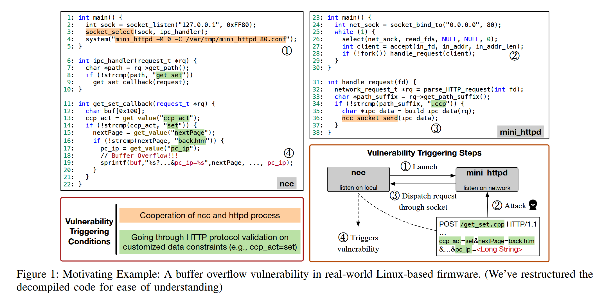
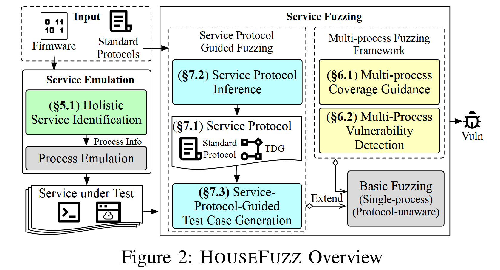
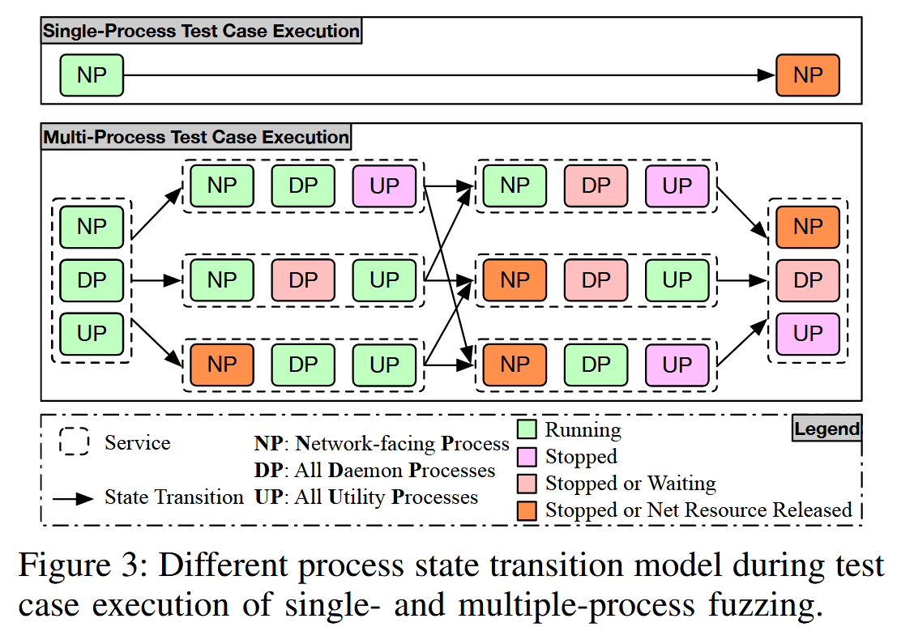
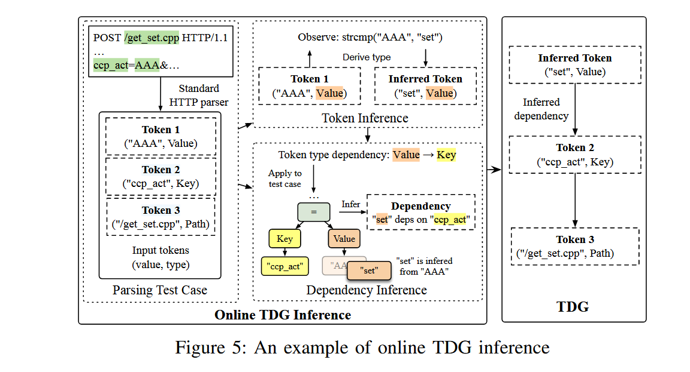
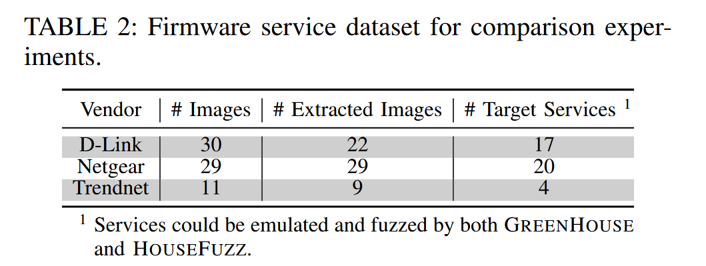
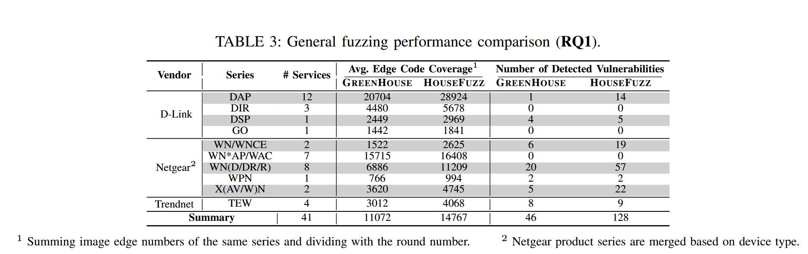
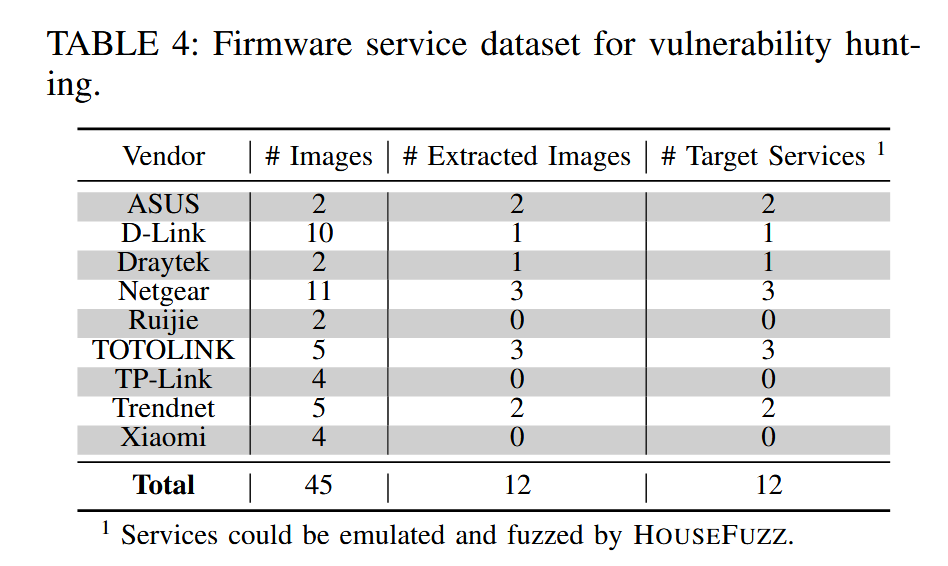
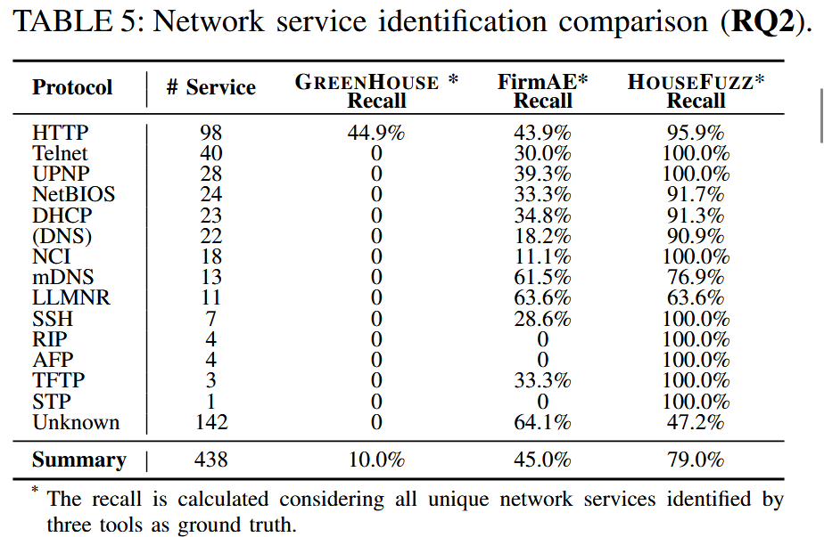
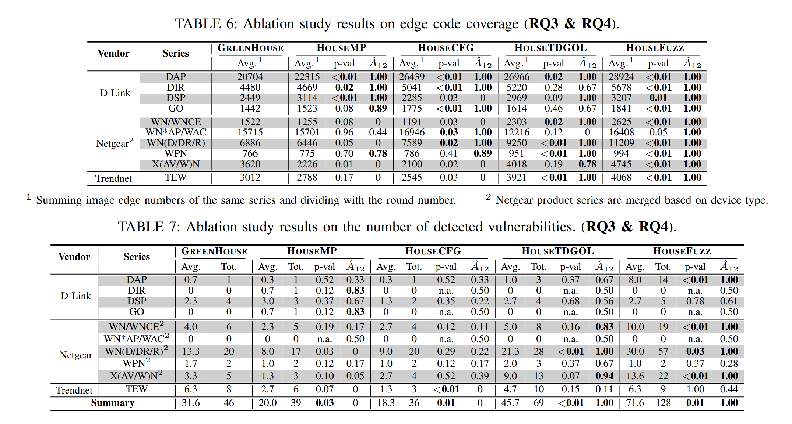
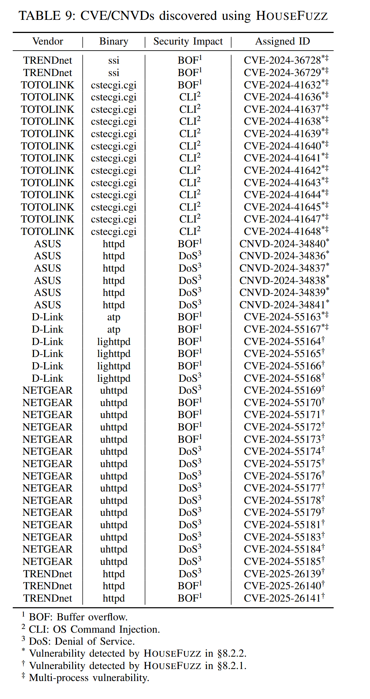

---
layout:
  width: wide
  title:
    visible: true
  description:
    visible: true
  tableOfContents:
    visible: true
  outline:
    visible: true
  pagination:
    visible: true
  metadata:
    visible: true
---

# iotFuzz-2

## HouseFuzz



[source code comming soon.....](https://github.com/HouseFuzz/HouseFuzz)



### Introduction 背景

论文研究方向：Linux 固件漏洞检测

Linux固件服务普遍依赖**多进程协作**实现复杂功能（如处理网络请求、系统配置）。论文将参与服务的进程按 “生命周期” 和 “访问方式” 分为三类：

* **长进程（Long-running Processes）**：持续运行以提供持久服务通道，又细分为 “网络面向进程”（可远程访问，如 HTTP 服务器的`httpd`进程）和 “守护进程”（仅本地访问，如处理系统配置的`nvramd`进程）；
* **工具进程（Utility Processes）**：由长进程临时调用，处理短期任务（如单条网络请求的解析），任务完成后终止；
* 三类进程通过**进程间通信（IPC）** 协作（如 socket、管道），一个 “服务” 即指所有协作完成某一通信通道服务的进程集合。

论文拆解固件网络服务的协议构成，指出 “标准协议 + 定制化协议” 的混合模式。

* **标准服务协议（Standard Service Protocol）**：有官方文档定义的通用协议（如 HTTP、UPnP、Telnet），厂商会遵循公开规范实现基础功能。例如，HTTP 协议通过 TCP 80 端口通信，UPnP 用于设备发现，现有模糊测试工具（如 GREENHOUSE）通常基于这些标准协议的模板（如 HTTP 请求格式）制作初始测试种子，以保证用例的语法正确性。
* **定制化服务协议（Customized Service Protocol）**：厂商为实现产品特有功能，在标准协议基础上进行**应用层修改**，会引入两大关键特征：
  1. **Token**：即自定义的具体数据。
  2. **Token之间的严格语义约束**：Token间存在依赖关系。

Linux 固件支撑 43% 的 IoT 设备，但网络服务漏洞易引发远程代码执行、拒绝服务等攻击。现有灰盒模糊测试存在三大关键局限，且在实际场景中影响显著：

*   **仿真难题**：Linux 固件服务并非单进程独立运行，而是依赖**多进程协作**—— 不仅包括直接对外提供网络服务的 “网络面向进程”（如 HTTP 服务器进程），还包括通过**进程间通信（IPC）** 触发的关联进程（如处理 IPC 请求的守护进程、临时任务的工具进程）。因此，要实现对固件服务的 “整体仿真”，前提是全面识别所有与网络服务相关的进程。

    现有方案分为 “系统级仿真” 和 “进程级仿真”，但均因设计问题无法完整识别进程：

    * **系统级仿真方案**：原理是模拟整个 Linux 系统（包括 OS 内核、所有初始化进程），通过 “公共网络通道”（如 TCP 端口）识别网络面向进程。但这类方案极易因 “仿真障碍”（如网络设备配置错误、NVRAM 存储异常）导致仿真中断，网络通道无法正常建立，进而漏检本应通过端口识别的网络面向进程。
    * **进程级仿真方案**：原理是通过 “进程名白名单” 筛选并仿真目标进程（仅模拟用户态进程，规避内核仿真开销）。但 “白名单启发式” 存在天然缺陷 —— 无法覆盖厂商自定义命名的进程（如特定守护进程），导致进程识别的 “召回率” 极低（即大量真实相关进程被漏检）。
* **反馈引导单一**：现有的灰盒固件模糊测试工具通常将多进程运行时特性过度简化为单进程运行时特性，仅收集网络面向进程的覆盖信息，无法触发需多进程协作的漏洞（如通过 IPC 通信触发的缓冲区溢出）。
* **测试用例无效性高**：定制化协议存在严格语义约束（如键值对依赖、路径关联），基于标准协议的随机变异难以绕过输入验证。

针对这些问题，HouseFuzz通过三大技术模块解决上述痛点，整体流程为 **“服务仿真→多进程模糊测试→协议引导用例生成”**

### Challenges and Insights

论文从一个**基于 Linux 的固件中存在的缓冲区溢出漏洞**出发分析

<figure><figcaption></figcaption></figure>

该漏洞需按固定顺序执行四步，少一步或不满足约束均无法触发，具体流程如下：

1. 服务初始化：系统启动时，`ncc`进程（守护进程）自动调用`mini_httpd`进程（网络面向进程），`mini_httpd`绑定网络通道（如 TCP 80 端口）并等待外部 HTTP 请求
2. **发送恶意请求：**&#x653B;击者发送恶意数据包以激&#x6D3B;_&#x6D;ini\_http&#x64;_&#x8FDB;程，请求需包含定制化参数（如`POST /get_set.cpp HTTP/1.1`，参数含`ccp_act=set&nextPage=back.htm&pc_ip=<超长字符串>`）
3. **请求转发：**`mini_httpd`解析请求后，通过`handle_request()`函数检查路径后缀 —— 发现请求路径后缀为`.ccp`（符合定制化协议规则），便将请求数据封装为 IPC 消息，通过 socket 转发给`ncc`进程
4. **漏洞触发：**`ncc`进程接收 IPC 请求后，调用`ipc_handler()`函数处理：
   1. 先通过`get_set_callback()`函数提取参数，验证`ccp_act=set`和`nextPage=back.htm`（满足定制化语义约束）；
   2. 提取`pc_ip`字段的超长字符串，用`sprintf()`函数将其格式化到固定大小（0x100 字节）的`buf`数组中，且未做长度检查 —— 最终导致缓冲区溢出，触发漏洞

从这个案例出发可以验证之前说的三个挑战：服务识别（ncc进程和mini\_httpd进程都要被识别）、多进程模糊测试的挑战（仅将面向网络的进程mini\_httpd作为模糊测试目标则无法发现ncc的崩溃异常）、处理定制化服务协议的挑战（为了通过 nc&#x63;_&#x6D41;&#x7A0B;_&#x4E2D;的验证，_“ccp\_act”_&#x548C;_“set”_&#x5FC5;须组合成语义有效的键值对）

### Overview of HOUSEFUZZ

<figure><figcaption></figcaption></figure>

* Linux服务仿真（§5）：解决 “哪些进程需要测试” 的问题，核心是识别所有与网络服务相关的进程（网络面向、守护进程）。
* 多进程模糊测试框架（§6）：解决 “如何全面收集反馈、检测多进程漏洞” 的问题，核心是覆盖引导和多进程漏洞预言机。
* 服务协议引导模糊测试（§7）：解决 “如何生成高质量测试用例” 的问题，核心是标准协议语法 + 定制协议语义约束建模。

### Service Emulation（服务仿真）

1.  初始化仿真

    仿真中容易卡死或崩溃（因为缺少硬件/NVRAM配置），HOUSEFUZZ 自动检测这些异常进程，并通过 **补丁（patching）** 来跳过出错代码，让仿真过程能自动越过固件中阻塞启动的代码，确保系统能正常启动所有服务

    **Algorithm 1 INIT Emulation：**

    1. 追踪所有进程执行；
    2. 检测异常（四类：INIT 终止、进程崩溃、CPU 占用异常、挂起等其他）；
    3. 定位异常代码并用 NOP 指令替换；
    4. 重复仿真直到系统能顺利完成初始化。
2.  网络进程识别

    这一阶段有两个目标，一是识别网络通道，二是推断启动进程的正确命令行，包括程序路径和参数

    * 分析系统调用日志 (进程 ID (PID)、系统调用名称和网络调用绑定`bind()`)来识别网络通道
    * 找出监听网络端口的进程；通道暴露于网络（即不是“localhost”），视为网络进程。而通过加密隧道间接与网络交互的，视为代理网络进程，HOUSEFUZZ基于已知的代理端口（例如 HTTP 服务器在80端口）来识别这些进程
    * 提取启动命令行（从相应的`execve()` 系统调用的参数中提取其命令行参数）
3.  守护进程识别

    这一阶段也是两个目标：推断并推理进程间的进程间通信（IPC）依赖关系，从而找到给定网络服务的守护进程；识别守护进程的命令行参数

    HOUSEFUZZ 通过系统调用来识别创建（例如 open()）或绑定（例如 bind()）IPC 通道（例如文件描述符和套接字地址）的 IPC“键”。当一个进程建立的 IPC 通道被其他服务进程读取或写入时，该进程就被视为守护进程。


Linux 进程的 IPC 通道由特定的“键”唯一标识，例如套接字文件路径。通过同一通道进行的 IPC 通信表明进程间存在依赖关系。


当上述识别完成后，HOUSEFUZZ 就能自动化地：

1. 启动守护进程daemon progress；
2. 再启动网络进程network-facing progress；
3. 用 QEMU对execve() 插桩，跟踪被测服务启动的所有进程，从而进行覆盖率收集和漏洞检测

### Multi-Process Fuzzing Framework

1.  测试用例终（TCE）止检测

    多进程模糊测试则需要检测所有服务进程是否已完成测试用例的处理。否则，模糊测试很可能收集到不完整的覆盖率，某些服务进程仍在处理测试用例，导致新的覆盖率被忽略。HOUSEFUZZ 将所有进程的测试完成事件 (TCE) 都已观察到视为测试用例已完成执行。

    1. **工具进程**：这种进程生命周期很短，是专门为处理单个请求而启动的，这类似于单进程灰盒模糊测试中的 PUT 请求，所以将这类进程的终止作为其测试用例终止 (TCE)
    2. 网络进程：这种进程通常会在处理完请求后释放网络资源。当 HOUSEFUZZ 检测到网络资源（即模糊测试中的网络套接字）被释放（即关闭）时，它也认为该进程的 TCE 已满足
    3. 守护进程：这种进程主要处理进程间通信 (IPC)。在处理完 IPC 通信后，守护进程可能会重用 IPC 通道而不是将其关闭，但守护进程会通过调用特定的 I/O 监听系统调用（例如 select、poll）反复等待进程间通信 (IPC) 请求，并在这些系统调用返回后开始处理请求。HOUSEFUZZ 对 I/O 监听系统调用进行插桩，当发现守护进程再次调用 I/O 监听系统调用认为该进程的 TCE 已满足

    <figure><figcaption></figcaption></figure>

2.  覆盖率

    为了在不发生数据竞争的情况下记录每个进程的覆盖率，HOUSEFUZZ 会在每个进程启动时为其分配一个隔离的共享内存作为覆盖率位图；在覆盖率指导使用完毕后，所有位图都会被清除并放入共享内存池中，以供下一轮测试使用。若多个进程加载**相同的可执行 ELF**（例如多进程 fork/exec 同一二进制），则在 TCE 后**把这些进程的位图合并到同一个 bitmap**（通过对 hit counter 求和），保证不同 run 中的比较是按“程序”而不是按进程实例进行的一致比较。只有当守护进程被“触发”时才开始收集其覆盖；没有被触发的守护进程跳过收集，减小内存与统计开销。

    不同测试中启动的进程可能不同（例如，启动不同的程序或使用不同的启动顺序），HOUSEFUZZ 必须确保进程覆盖率比较的一致性——比较的覆盖率数据对应于同一个程序。为了解决这个问题，HOUSEFUZZ 会整合加载同一可执行 ELF 对象的所有进程的覆盖率位图（通过对命中次数求和）。
3.  多进程漏洞检测

    HOUSEFUZZ能够检测所有服务进程中的漏洞，包括面向网络的进程、守护进程和实用程序进程。具体而言，实现了内存损坏和命令注入漏洞的漏洞检测

    1. 内存损坏 memory corruptions
       * 核心是**捕获进程的 crash signals**（例如segmentation fault），若任意进程 crash，就记录为一个崩溃事件
       * 但论文注意到：**utility 进程里有些崩溃只是“不可利用的 bug”，**&#x56E0;此他们做了**二次验证**：对导致崩溃的 PoC 做 bit-flip（变异）测试 —— 如果变异能引起不同的崩溃影响（例如从 NULL 改为访问其它指针），说明该崩溃受输入控制，判为“真实可利用的漏洞”；否则当作普通 bug 过滤。该方法在论文中被认为开销可接受
    2. 命令注入检测 command injection
       * 采用了基于Web应用程序的方法来检测固件二进制文件中的漏洞，该方法会对所有服务进程的execve()系统调用进行插桩

### Service-Protocol-Guided Fuzzing

协议标准化：技术路线： **Context-Free Grammar（CFG）** + **Token Dependency Graph (TDG)**



标准服务协议（syntax）对应CFG，定制协议（customized protocol）对应TDG

* TDG 的节点 n = (v, t)：v 是具体 token 字符串（如 `"set"`、`"ccp_act"`、`"/get_set.cpp"`），t 是 token 类型（论文定义了三类基本类型：`Path, Key, Value`）
* 有向边 e(ni, nj) 表示当在测试用例中使用 nj 时，**还需要**将 ni 插入才能满足语义依赖（比如 Value → Key，或控制流依赖）

标准协议识别：依据 **网络通道（端口）** 和 **字符串魔数（magic constants）** 来判定（例如端口 80 映射 HTTP；或二进制里出现 `"SUBSCRIBE"` 可判 UPnP）。这是一个轻量且常用的启发式方法

定制协议（TDG）推断：采用online + offline的模式，在线阶段在运行时对**字符串比较函数**（例如 `strcmp()`）做插桩，收集被比较的常量提取出 token 值。离线阶段使用静态分析，从二进制中提取可能的 `Path`/`Key` token。通过**控制流分析**（识别直接的 control-flow 依赖）和**数据流/到达定义分析**（识别 data-flow 依赖）来推断依赖边，这一部分和已有的工具一致。

<figure><figcaption></figcaption></figure>

**用 TDG 与 CFG 指导测试用例生成，**

* **先用 CFG（标准协议）生成语法合法的基础 test case**（例如根据 HTTP 的 CFG 生成 GET/POST 格式、参数位置等）。CFG 负责语法级别的 correctness。
* **在 CFG 生成的 test case 上“插 token”来满足 TDG 的语义依赖**：
  * 随机挑选 TDG 中的 token n(v,t)，在 test case 中找到一个具有相同类型 t 的位置（比如某个 parameter 的 value），把它替换成 v（把 `"AAA"` 替换为 `"set"`）。
  * 然后**逆向遍历 TDG，**&#x628A;这些依赖 token 也插入到 test case 的合适位置，尽量满足链式依赖。

### Evaluation 实验评估

#### DataSet&#x20;

作者参考最近的SoTA中使用的benchmark，包含来自3家厂商的70个固件镜像，用相同产品的最新版本镜像更新了数据集中的35个镜像，保留Binwalk提取成功的部分，最终数据集使用了剩余的60个可提取的固件镜像

<figure><figcaption></figcaption></figure>

#### General Fuzzing Performance (RQ1)

基线：GREENHOUSE（备选基线还有EQUAFL和Firm-AFL，现有评估表明GREENHOUSE比EQUAFL快2倍，EQUAFL比Firm-AFL快14倍）

数据集：基于现有固件镜像数据集中提取的 60 个固件镜像，我们首先运行 GREENHOUSE 来收集其中所有可模拟和可进行模糊测试的服务，共包含 41 个 Web 服务，作为模糊测试的固件数据集，对于每个工具，对每个服务运行 3 轮模糊测试，每轮使用 1 个 CPU 核心，持续 24 小时。两个工具都使用 GREENHOUSE 提供的相同初始种子

<figure><figcaption></figcaption></figure>

* 评估代码覆盖率时，仅考虑了面向网络程序的边缘覆盖率，因为 GREENHOUSE 不具备像 HOUSEFUZZ 那样收集多进程覆盖率的能力
* 开销方面，由于多进程反馈收集和 TDG 推理，HOUSEFUZZ 在 41 项服务上的平均时间开销是 GREENHOUSE 的 6.8 倍。内存开销方面，HOUSEFUZZ 为每个活动进程分配了一个 128 KB 的覆盖率位图，内存开销与活动进程数呈线性关系。作者认为这种开销是完全可以接受的，因为 HOUSEFUZZ 在漏洞检测和代码覆盖率方面明显优于 GREENHOUSE

#### 漏洞挖掘实验

鉴于先前对比实验使用的固件镜像数据集仅包含 2019 年之前发布的旧版固件，本实验旨在证明 HOUSEFUZZ 也能检测出仍在维护的产品最新固件镜像中的漏洞，使用 HOUSEFUZZ 对每个已识别的 Web 服务进行了 24 小时的模糊测试，成功检测到 5 个服务中的 21 个0-day漏洞，获得 21 个 CVE/CNVD 编号

<figure><figcaption></figcaption></figure>

#### Experiments on Service Identification (RQ2)

RQ1只对比了HOUSEFUZZ和GREENHOUSE均可模拟的固件服务，RQ2则验证提出的服务识别方法的有效性，是否能识别出那些被忽略的、存在潜在漏洞的服务

基线：FirmAE和GREENHOUSE

GREENHOUSE 使用进程名称白名单来识别面向网络的程序和守护进程。FirmAE 模拟整个固件系统，而不进行服务识别。为了与 FirmAE 进行比较，在模拟过程中运行了 netstat 工具来识别面向网络的进程，这类似于运行 HOUSEFUZZ 而不修补模拟异常代码。

<figure><figcaption></figcaption></figure>

#### Experiments on Multi-Process Fuzzing Framework (RQ3)

主要是三个实验

* 一项消融实验，以评估多进程模糊测试框架的整体有效性
  * 两种消融设置：GREENHOUSE 作为基础基线，仅执行单进程模糊测试；而 HOUSEMP 通过集成多进程模糊测试框架扩展了 GREENHOUSE 的功能
  * HOUSEMP 总共比 GREENHOUSE 少发现了 7 个漏洞，这主要是由于多进程反馈收集的开销造成的。尽管如此，HOUSEMP 在 16 个目标服务中实现了比 GREENHOUSE 显著更高的代码覆盖率，并检测到了 GREENHOUSE 未检测到的 14 个漏洞
* 一项人工漏洞分析，以验证多进程模糊测试框架是否确实有助于多进程漏洞的检测
  * 手动分析了RQ1中HOUSEFUZZ检测到的漏洞，为了检测多进程漏洞，模糊测试必须同时触发一个进程中的进程间通信（IPC）和另一个进程中的易受攻击代码，这需要来自两个进程的反馈。由于反馈收集范围有限，单进程模糊测试很难检测到此类漏洞。在RQ1和漏洞挖掘实验中，分别识别出的128个漏洞中有3个是多进程漏洞，21个漏洞中有15个是多进程漏洞。这些漏洞已被分配了17个CVE/CNVD编号，占所有45个已分配CVE/CNVD编号的38%。该结果表明，多进程模糊测试框架能够有效地检测真实的多进程漏洞。
* 评估多进程模糊测试框架使用的 TCE 检测方法是否足够稳健，是否能够实现一致的代码覆盖率收集
  * 从覆盖率收集稳定性的角度来验证TCE检测的稳定性。具体而言，使用之前实验中HOUSEFUZZ生成的队列种子作为测试用例数据集，并对每个种子重复执行N次（N=20），所有种子执行均在一致的运行环境下进行，并使用恒定的随机数设备（例如 /dev/random）。如果同一测试用例的所有执行都产生了一致的多进程代码覆盖率，则表明该种子的TCE检测是稳定的。
  * 评估了 13,453 个种子，其中 8,746 个（65%）种子的执行结果具有一致的代码覆盖率。这些种子在单进程模糊测试模式下被认为是稳定的，因此被用于评估 TCE 检测在多进程模糊测试模式下的稳定性。在这 8,746 个种子中，有 358 个种子在多进程模糊测试模式下执行时产生了不一致的代码覆盖率。作者发现这是由于 select() 系统调用在处理多个 IPC I/O 事件时出现 NCL 问题造成的。

<figure><figcaption></figcaption></figure>

#### Experiments on Service-Protocol-Guided Fuzzing (RQ4)

进行了两项实验，以验证 HOUSEFUZZ 服务协议引导模糊测试的有效性：一项消融实验，用于评估服务协议引导模糊测试的整​​体有效性；以及一项基于人工分析的研究，用于评估 TDG 推理的有效性。

消融实验的变体：

* HOUSECFG 引入了基于控制流图 (CFG) 的标准服务协议引导的测试用例生成方法，仅利用提取的令牌生成测试用例，而不包含自定义服务协议。
* HOUSETDGOL 是 HOUSEFUZZ 的一个变体，它排除了offline TDG推理组件。

结果：HOUSECFG 仅发现了 36 个漏洞。HOUSETDGOL 检测到的漏洞数量分别比 GREENHOUSE 和 HOUSECFG 多 49% 和 94%。通过进一步应用离线令牌依赖关系推断，HOUSEFUZZ 比 HOUSETDGOL 多发现了 55 个漏洞。

原因：HOUSEFUZZ 通过处理使用 TDG 形式化的自定义服务协议，有效地生成了高质量的测试用例。离线 TDG 推断组件通过提供初始 TDG 来补充在线组件；由于在线组件仅对标准字符串比较函数（例如 strcmp()）进行插桩以推断令牌，从而忽略了自定义字符串比较函数，因此离线组件识别出了更多的令牌及其依赖关系。

一项基于人工分析的研究，用于评估 TDG 推理的有效性：

* 分析先前实验中由HOUSEFUZZ生成的TDG，来验证TDG推理的能力。
* 首先计算了生成的TDG的大小，发现平均每个TDG包含734个节点（即词元）和2610条边（即依赖关系）。为了验证定制服务协议的普遍性，作者从每个生成的TDG中选取并分析了词元依赖关系及其对应的代码引用位置。
* 研究结果表明，所有TDG都具有独特且有意义的词元依赖关系，这些依赖关系描述了实际的输入结构。表明定制服务协议在Linux固件服务中确实很常见，使用TDG对其进行建模将有助于生成高质量的测试用例
* 对随机抽取的固件镜像进行了基于人工分析的研究，旨在回答以下两个问题：（1）词元推断的精度如何？（2）词元依赖关系推断的精度如何？
  1. 随机抽取了100个词元，人工验证是否能够构建有效的路径约束，结果表明，HOUSEFUZZ的词元推断技术达到了62%的精度，远优于GREENHOUSE的15%精度
  2. 随机抽取了100个推断出的TDG边，并检查它们是否描述了实际的数据依赖关系。结果表明，词元依赖关系推断的准确率达到了44%。

<figure><figcaption></figcaption></figure>
