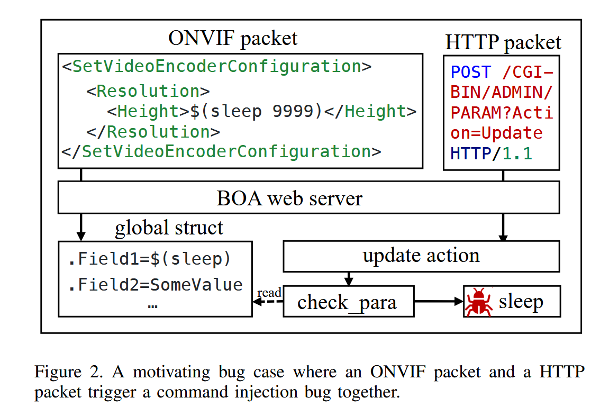
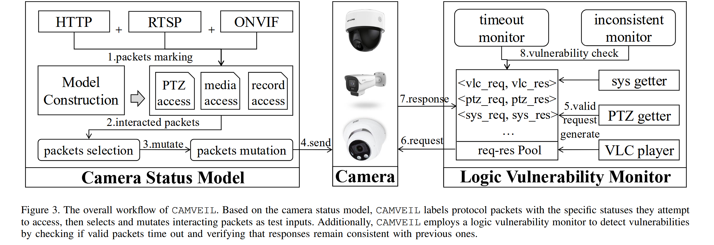

# iotFuzz-3

## IP摄像头

### Shodan



识别互联网网络上暴露的摄像头



### Ientifying Challenges with Fuzzing the RLC-510WA IP Camera using AFL++



总体遵循 OWASP 的 Firmware Security Testing Methodology（FSTM），使用AFL++的QEMU模式对 RLC-510WA的智能安全IP摄像头进行模糊测试，**并未发现任何crash或者安全漏洞**

* **固件获取**：使用 UART（Bus Pirate）连接并通过已有研究人员提供的 root credentials 获取 shell，从而提取固件与文件系统
* **文件系统提取 & 目标识别**：采用 binwalk/UBI 工具等提取文件系统，并定位可能作为 fuzz 目标的服务二进制（ONVIF、RTSP、NetServer、CGI 等）。
* **模拟（Emulation）**：使用 QEMU（vexpress 等平台）进行系统级模拟。因为没有 100% 相同的开发板，他们使用“相似板”并手工构建内核与 DTB，复制文件系统到可挂载镜像并多次调试启动脚本（init-wrapper 等）以让服务在 QEMU 中运行。
* **动态分析 / AFL++ 配置**：
  * 在宿主上安装 AFL++，尝试两种模式：**非 instrumented（无覆盖引导）** 的网络 fuzz（send-to-onvif.sh）与 **instrumented**（QEMU 模式）运行（论文展示了构建 AFL++ QEMU 模式、缺失包、修复 symlink 的操作）。他们发现非 instrumented 模式可行但效果差，instrumented 模式依赖文件系统布局、库符号等，容易出现兼容问题。
  * 进行了网络层黑盒 fuzz（使用 XML 字典与 send 脚本）并尝试通过 AFL++（非 instrumented）跑 PoC。也尝试了用编译好的 C-wrapper 替代 Bash wrapper，这样可显著提高执行速度。
  * 没有发现可复现的 crash/漏洞（因此也没进入 runtime 分析 / 利用阶段）。论文说明未发现挂起/崩溃，无法做进一步利用

### Camveil: Unveiling Security Camera Vulnerabilities through Multi-Protocol&#xD; Coordinated Fuzzing



在实际部署中，摄像机协议通常通过访问和修改共享的系统状态进行交互。当多个客户端同时通过不同的协议发出操作公共内部资源的命令时，就会出现这种交互。例如，如图 1 所示，HTTP 客户端可以发送 `continuous_move` 请求，将摄像机的运动状态从空闲更改为运动状态，并更新其位置值。与此同时，ONVIF 客户端可以发出 `move_up` 命令，同样修改摄像机的运动和位置状态。类似地，RTSP 客户端可以通过 `PLAY` 请求启动视频流，而 ONVIF 客户端同时重置编码方式，这两个操作都会影响摄像机的编码状态

<figure><figcaption></figcaption></figure>

* **ONVIF**：跨厂商安全设备标准协议。
* **RTSP**：实时流媒体控制（PLAY、PAUSE、SETUP）。
* **HTTP**：用于 PTZ 控制和各种配置项（如速度、位置）。

一个漏洞示例：[CVE2023-3959](https://nvd.nist.gov/vuln/detail/CVE-2023-3959)，并发的ONVIF和RTSP请求访问共享资源（例如编码状态）时，该漏洞会被触发，导致XML解析错误和实时视频流中断。



<figure><figcaption></figcaption></figure>

第一步：攻击者发送恶意 ONVIF 配置请求数据包包含如`SetVideoEncoderConfiguration` / `SetSystemDateAndTime` 或类似的 ONVIF 配置操作的字段

* 这些字段允许字符串内容（如 Encoder name、Profile name）。
* 字段内容未严格验证。
* 攻击者塞入恶意 payload，例如：`$(sleep 9999)` 或者`; reboot;`

ONVIF 守护进程把这些字段写入一个 **全局结构体 global\_config\_struct** 里。**这个结构体稍后会被其他模块读取。**

第二步：攻击者发送另一个 HTTP 请求

* 访问 Web 管理界面 CGI，如\
  `/param.cgi?action=update&...`
* 此操作会调用 firmware 中的函数（论文说是 `check_para()`）。
  * 它会从之前的**同一个全局结构体**中读取 encoder 配置字段。
  * 然后执行类似：`popen(global_config_struct->encoder_name, "r");`
* 如果这个字段是：`$(sleep 9999)` 或`; busybox reboot ;`，就会**直接通过 popen 执行命令**。

<table><thead><tr><th width="124.33331298828125">动作</th><th>协议</th><th>行为</th></tr></thead><tbody><tr><td>1</td><td><strong>ONVIF</strong></td><td>写入恶意数据到全局结构</td></tr><tr><td>2</td><td><strong>HTTP</strong></td><td>触发另一个进程逻辑读取这份数据</td></tr><tr><td>3</td><td><strong>HTTP</strong></td><td>popen 执行数据 → RCE</td></tr></tbody></table>

设计目标：一个实用的安全摄像头漏洞检测框架应具备以下特性：

* 跨协议交互覆盖。该框架应能有效探索跨多个协议的交互。许多实际应用中的IP摄像头漏洞都源于不同协议之间的相互作用。系统必须能够生成语义清晰且状态感知的消息序列，以反映真实的多协议工作流程并暴露交互引起的漏洞。
* 检测非崩溃逻辑漏洞。该框架应能够识别不会导致系统崩溃的功能性漏洞。这些漏洞包括命令注入、配置不一致和视频流冻结。为了检测此类细微问题，系统必须集成语义监视器（VLC播放器、PTZ状态检索器和系统状态检索器生成标准请求来查询摄像机的运行时状态），以分析运行时行为并检测除简单连接丢失或异常之外的异常情况。
* 黑盒兼容性。由于许多商用IP摄像头提供有限的访问权限和闭源固件，该框架必须在黑盒环境下工作，在这种情况下收集代码覆盖率是不可行的。它应仅依赖于外部可观察的行为和公开的协议接口，而无需插桩、调试符号或root权限。

<figure><figcaption></figcaption></figure>

## NVR设备



<table><thead><tr><th width="163">类别</th><th>监控内容</th></tr></thead><tbody><tr><td>system</td><td>进程、CPU、内存、重启</td></tr><tr><td>user</td><td>用户管理文件、账号更改</td></tr><tr><td>storage</td><td>HDD 状态、录像文件</td></tr><tr><td>network</td><td>端口、cloud 连接</td></tr><tr><td>video</td><td>RTSP 通道（多个通道）</td></tr></tbody></table>

#### **无 Crash 的逻辑漏洞**&#x20;

这种漏洞不会导致：

* 崩溃
* 异常退出
* 内存越界

但会导致

权限绕过、弱权限检查、文件未授权读取、配置被默默修改、命令被执行但返回数据正常 如200 OK、越权 API 调用

#### **Side-Effect（系统副作用）触发的漏洞 —— 系统产生异常行为**

很常见于 NVR / DVR / 路由器：

* 发一个请求 → 返回 200
* 但后台执行了危险操作

比如：

* 创建新用户
* 修改某配置
* 触发守护进程异常
* 导致录像停止
* 删除录像文件
* 写入某路径
* 导致系统重启或卡死（但不 crash）
* 接口执行耗时命令（CPU 满负载）

#### **配置变更引发的漏洞（Configuration-driven Bugs）**

很多 IoT / NVR 的漏洞不仅与输入有关，还与设备配置状态有关：

举例：

* 勾选某项 → 某个 CGI 自动被激活
* 开启“云同步” → 内部守护进程启动并开放未认证接口
* 修改语言 → CGI 使用不同编码 → 引发解析错误
* 切换视频通道 → 触发某个旧版本函数

很多漏洞必须在**特定设置下**才能复现。普通 fuzz 不会改变设备配置，因此无法测试。
