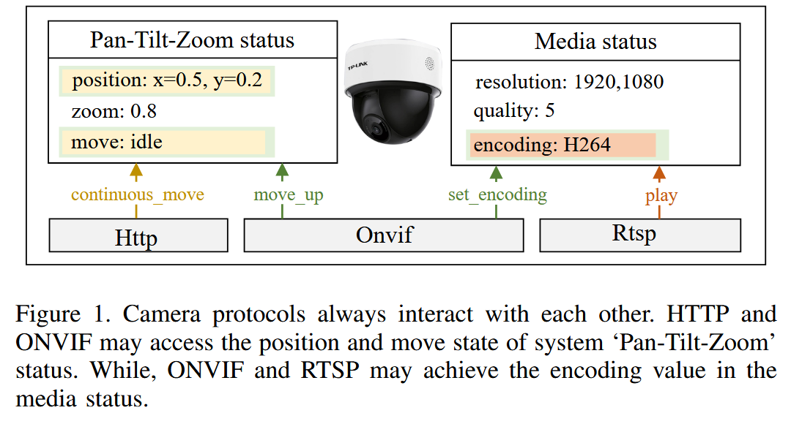

# iotFuzz-3

## Shodan



识别互联网网络上暴露的摄像头



## Ientifying Challenges with Fuzzing the RLC-510WA IP Camera using AFL++



总体遵循 OWASP 的 Firmware Security Testing Methodology（FSTM），使用AFL++的QEMU模式对 RLC-510WA的智能安全IP摄像头进行模糊测试，**并未发现任何crash或者安全漏洞**

* **固件获取**：使用 UART（Bus Pirate）连接并通过已有研究人员提供的 root credentials 获取 shell，从而提取固件与文件系统
* **文件系统提取 & 目标识别**：采用 binwalk/UBI 工具等提取文件系统，并定位可能作为 fuzz 目标的服务二进制（ONVIF、RTSP、NetServer、CGI 等）。
* **模拟（Emulation）**：使用 QEMU（vexpress 等平台）进行系统级模拟。因为没有 100% 相同的开发板，他们使用“相似板”并手工构建内核与 DTB，复制文件系统到可挂载镜像并多次调试启动脚本（init-wrapper 等）以让服务在 QEMU 中运行。
* **动态分析 / AFL++ 配置**：
  * 在宿主上安装 AFL++，尝试两种模式：**非 instrumented（无覆盖引导）** 的网络 fuzz（send-to-onvif.sh）与 **instrumented**（QEMU 模式）运行（论文展示了构建 AFL++ QEMU 模式、缺失包、修复 symlink 的操作）。他们发现非 instrumented 模式可行但效果差，instrumented 模式依赖文件系统布局、库符号等，容易出现兼容问题。
  * 进行了网络层黑盒 fuzz（使用 XML 字典与 send 脚本）并尝试通过 AFL++（非 instrumented）跑 PoC。也尝试了用编译好的 C-wrapper 替代 Bash wrapper，这样可显著提高执行速度。
  * 没有发现可复现的 crash/漏洞（因此也没进入 runtime 分析 / 利用阶段）。论文说明未发现挂起/崩溃，无法做进一步利用

Camveil: Unveiling Security Camera Vulnerabilities through Multi-Protocol
&#x20;Coordinated Fuzzing
-------------------------



在实际部署中，摄像机协议通常通过访问和修改共享的系统状态进行交互。当多个客户端同时通过不同的协议发出操作公共内部资源的命令时，就会出现这种交互。例如，如图 1 所示，HTTP 客户端可以发送 `continuous_move` 请求，将摄像机的运动状态从空闲更改为运动状态，并更新其位置值。与此同时，ONVIF 客户端可以发出 `move_up` 命令，同样修改摄像机的运动和位置状态。类似地，RTSP 客户端可以通过 `PLAY` 请求启动视频流，而 ONVIF 客户端同时重置编码方式，这两个操作都会影响摄像机的编码状态

一个漏洞示例：[CVE2023-3959](https://nvd.nist.gov/vuln/detail/CVE-2023-3959)，并发的ONVIF和RTSP请求访问共享资源（例如编码状态）时，该漏洞会被触发，导致XML解析错误和实时视频流中断。

<figure><figcaption></figcaption></figure>

* **ONVIF**：跨厂商安全设备标准协议。
* **RTSP**：实时流媒体控制（PLAY、PAUSE、SETUP）。
* **HTTP**：用于 PTZ 控制和各种配置项（如速度、位置）。
