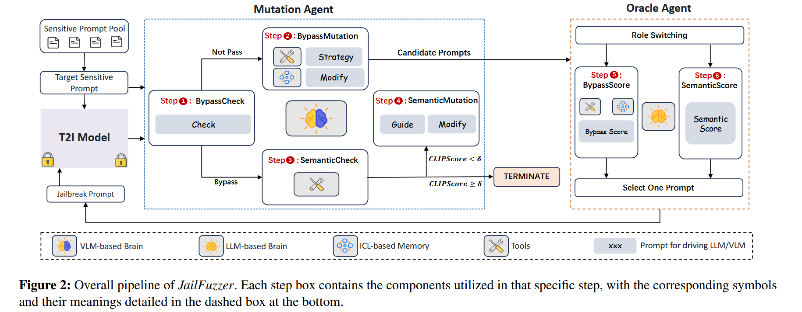
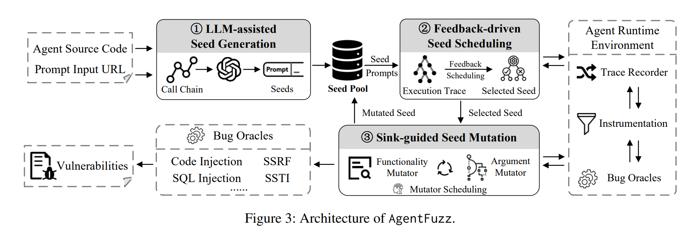
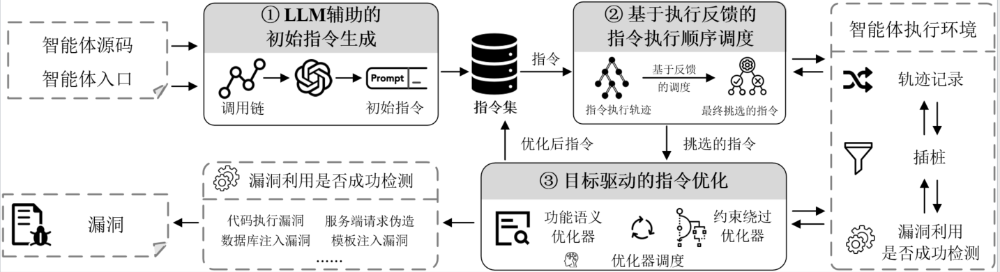

# LLMFuzzer

## JailFuzzer：由LLM-Agent驱动的自动化文生图模型越狱框架，CCF-A <a href="#activity-name" id="activity-name"></a>



源码：



### 背景

“越狱攻击”（Jailbreaking Attack）——即通过精心设计的提示词（Prompt）绕过模型的安全机制，生成不安全内容（NSFW）——是一个严峻的挑战。随着 Stable Diffusion、DALL-E 等文生图模型的普及，其安全和伦理问题也愈发引人关注。恶意用户可以通过构造特定的提示词，诱导模型生成暴力、色情或其他不当内容。

现有的越狱方法大多存在访问要求不切实际（如需要白盒访问）、生成的提示词不自然易被检测、搜索空间受限或查询成本高昂等局限。

一个由大型语言模型（LLM）智能体（Agent）驱动的新型模糊测试（Fuzz-Testing）框架。它能在黑盒设置下，高效地生成自然且语义完整的越狱提示词。JailFuzzer 创新地将模糊测试的经典三要素——种子池、引导诱变引擎和预言机（Oracle）——与强大的 LLM-Agent 相结合，显著提升了攻击的效率和隐蔽性。实验结果表明，JailFuzzer 在越狱 T2I 模型方面表现卓越：它生成的提示词自然流畅，难以被传统防御机制发现；同时，它以极低的查询开销实现了极高的越狱成功率（对多数安全过滤器接近100%，平均仅需 4.6 次查询），全面超越了现有方法。这项研究揭示了当前AIGC模型安全机制的脆弱性，并为未来构建更强大的防御体系奠定了基础。

### 设计与实现

JailFuzzer 的核心思想是将经典的模糊测试框架与先进的 LLM-Agent 相结合。其总体框架图如下所示，主要由种子池（Seed Pool）、引导诱变引擎（Guided Mutation Engine）和预言机（Oracle Function）三部分构成。整个攻击流程被设计成一个多轮攻击循环，灵感来源于“指数退避”策略，使得框架能从过去的成败经验中学习，动态进化。

<figure><figcaption></figcaption></figure>

其两个最关键的智能体：

**诱变智能体 (Mutation Agent)**

核心是一个视觉语言模型（VLM），负责执行两个关键任务：

1. 判断是否越狱成功：通过分析 T2I 模型返回的图像，判断当前提示词是否成功绕过了安全过滤器（例如，返回的是不是一张黑图或错误提示）。
2. 生成新的候选提示词：基于当前上下文和从“记忆”中学习到的经验，自适应地调整策略，对提示词进行修改和“诱变”。

为了让诱变智能体更“聪明”，作者为其设计了基于上下文学习（ICL）的记忆模块。所有成功的越狱提示词都会被存入一个长期记忆数据库。当需要诱变一个新的提示词时，智能体会从数据库中检索最相似的成功案例，反思（Reflection）这些案例的成功要素，并指导（Guide）下一步的诱变方向。

**预言机智能体 (Oracle Agent)**

预言机智能体的作用就是在不查询目标模型的情况下，评估并筛选出最有可能成功的候选者。它的核心是一个大型语言模型（LLM），通过模拟目标模型的安全过滤器来为候选提示词打分。它同样拥有一个记忆模块，存储了过去的成功和失败案例，使其能更精准地预测一个提示词的“越狱潜力”，从而大大降低了对目标 T2I 模型的查询次数。

通过这两个智能体的协同工作，JailFuzzer 实现了一个高效的闭环：评估 → 学习 → 诱变 → 筛选 → 再评估，从而能够快速定位到既自然又有效的越狱提示词。

Baseline：SneakyPrompt, DACA, Ring-A-Bell&#x20;

### TurboFuzzLLM <a href="#title" id="title"></a>



## AgentFuzz







（1）LLM辅助的种子生成：利用LLM的自然语言理解能力，解析代码中开发者意图，生成功能特定的初始种子提示；

（2）多维度反馈驱动的种子调度：设计了一套包含语义、距离和惩罚评分的综合反馈机制，以智能地优先选择最有可能触发漏洞的高质量种子；

（3）污点池引导的种子变异：采用功能变异器和参数变异器两种策略，对种子进行语义和逻辑层面的精准调整。

在对20个广泛使用的开源LLM智能体应用的评估中，AgentFuzz成功发现了34个高风险的0-day漏洞，精确率达到100%，其性能比现有最先进的方法高出33倍。这些发现已获得23个CVE编号，充分证明了该方法的有效性和现实世界的巨大影响 。

<figure><figcaption></figcaption></figure>

<figure><figcaption></figcaption></figure>

### 阶段一：LLM辅助的种子生成

污点池与调用链提取：流程始于静态分析。AgentFuzz**使用CodeQL扫描目标智能体的源代码，识别出预定义的安全敏感函数（“污点池”）**，例如eval、subprocess.run等，从这些“污点池”出发，向后追溯调用图，提取出所有能够到达这些危险函数的调用链。例如，它可能会发现一条路径为：eval ← ElasticsearchPermissionCheck.similarity\_search

#### 代码实现

**预定义的“敏感函数/ sink”位置：**

定义文件：call.qll 中的 predicate is\_sink(CallNode cn)，这里通过一系列或条件明确列出/匹配所有感兴趣的 sink（例如 eval、exec、subprocess.run、os.system、requests 的 get/post/request、数据库执行、模板渲染、Python REPL、GitLoader 等）。&#x20;

辅助小工具：print\_function()（同文件）用于把调用节点格式化为可匹配字符串；通用黑名单与辅助函数在 util.qll:1（如 getStrFuncName()、locStr()、isIncludeLocation2()）中定义。 为什么这些就是“预定义的敏感函数”

is\_sink 明确列出函数名、属性调用、模块对象检查和更复杂的模式（例如判断函数所在对象、DefinitionNode、调用链上下文等），因此 CodeQL 通过该谓词把源代码中符合这些模式的调用当作 sink。 调用链（call chain）如何被提取（CodeQL 层）

源（source）定义与路径生成：在 call.qll中，class Source extends PyFunctionObject 使用 r\_calls(...)（递归调用搜索）和 is\_sink(...) 来找到到达 sink 的路径，并提供路径字符串方法 getPathStr()（把中间函数按顺序 concat 成 "A@file -> B@file -> ... -> sink@loc"）。 具体拼接/格式化：get\_sink\_location() / getlocStr() 把 sink 的文件+行列拼为 path$$start:col$$end:col 形式；print\_callchain() / getPathStr() 返回前缀深度 + 函数序列 + sink 定位（QL 查询把这个字符串写入 SARIF message.text）。 IF / 控制流位置提取：查询 get\_if.ql 使用 BasicBlock / TestBlock 与 edges\*() 跟踪控制流，concat 出每个 if-test 的 (functionName)#(locStr) 串（用于后续抽取 if 片段）。 数据流约束提取：查询 get\_dataflow\_str\_constraint.ql:1 使用 DataFlow/TaintTracking 规则找到与 sink 相关的字符串产生点，并把 print\_function(cn) + "#" + locStr(...) 用 \~ 拼接输出（供 DSC JSON 使用）。 SARIF → 运行时 JSON 的桥接（如何被后续脚本消费）

auto\_analyze.py 运行上述 QL 查询并生成 SARIF（auto\_analyze.py）。 解析脚本（generate\_hook.py、generate\_if.py、generate\_dsc.py）按查询约定的分隔符解析 message.text（例如 @@, ->, \~, \$$），把 call chain、sink 定位、if 代码片段与 DSC 约束提取并写成 enter\_hook.json / oracle.json / \*-if.json / \*-dsc.json，供插桩和 fuzzer 使用（ generate\_hook.py、generate\_if.py、generate\_dsc.py）

Agentfuzz注意到，像ElasticsearchPermissionCheck.similarity\_search这样的调用链名称往往是开发者用来描述其功能的自然语言短语，将这些提取出的调用链信息，喂给一个LLM，并采用单样本学习（One-shot learning）和思维链（Chain of Thought, CoT）提示策略进行引导 ，从而生成高质量、功能特定的初始种子，例如：“Use Elasticsearch for a similarity search with permission checks to find documents with 'source\_doc:print(1)'”&#x20;

#### 阶段二：反馈驱动的种子调度

AgentFuzz提出了一个多维度评分函数：_**Fs=αSs+βDs−Ps**_

1. 语义分数 (Ss)：这是对传统方法的最大突破。当一个种子被执行后，AgentFuzz会**记录其动态执行轨迹（即实际调用的类和方法序列）**。然后，它再次利用LLM，要求其**比较这条实际执行轨迹的语义与目标漏洞调用链的语义之间的相似度**。例如，如果目标是ElasticsearchPermissionCheck，而种子实际触发了Elasticsearch，那么尽管没有命中目标，但LLM会认为它们在语义上高度相关，并给予较高的分数。反之，如果触发了风马牛不相及的Calculator组件，则分数会很低。这样模糊测试器能够识别出那些“正在取得进展”的种子
2. 距离分数 (Ds)：这是一个较为传统的度量，作为语义分数的补充。对于执行轨迹中能够被静态分析映射到CFG的部分，AgentFuzz会计算其中距离目标“污点池”最近的基本块的路径长度。距离越短，分数越高。其计算公式为 Ds(x)=x−k，其中 x 是最短距离 。  &#x20;
3. 惩罚分数 (Ps)：为了避免陷入局部最优（例如，反复变异一个看起来不错但实际上无法突破的种子），AgentFuzz引入了惩罚机制。每当一个种子或其对应的调用链被选中时，其惩罚分数就会增加，从而降低其在下一轮被选中的概率，公式为 Ps=γSf+ηCf 。

#### 阶段三：污点池引导的种子变异

当一个高质量的种子被选中后，AgentFuzz会根据运行时反馈，由LLM智能地调度两种专门的变异器之一，对其进行修改

1. 功能变异器：如果反馈显示（例如，语义分数低），当前种子虽然有潜力，但其语义未能准确调用到目标组件，那么功能变异器就会被激活。它利用LLM的自我改进（Self-Improvement）机制，在一个独立的聊天会话中进行工作。LLM会被提供该种子的所有历史变异尝试、执行结果和反馈分数，并被要求分析失败的原因，然后对提示的自然语言措辞进行润色和修改，以更好地匹配目标组件的功能 。  &#x20;
2. 参数变异器：如果反馈显示种子已经成功调用了正确的组件，但由于未能满足代码中的某个条件判断而卡在半路，那么参数变异器就会激活。参数变异器会进行约束识别（通过混合执行）和约束求解计算，最后进行提示-参数映射：
   1. 约束识别（通过混合执行）：AgentFuzz对包含未满足条件的目标组件启动混合执行（Concolic Execution）。它将组件的参数视为符号变量，在具体执行的同时收集符号约束。通过对比实际执行路径和通往“污点池”的期望路径，它能精确定位到第一个未能满足的条件语句，例如 if "source\_doc" in content: 。  &#x20;
   2. 约束求解：接着，它将收集到的符号约束（例如，“变量content必须包含子字符串"source\_doc"”）交给强大的Z3约束求解器。Z3会计算出一个能够满足该约束的具体值 。  &#x20;
   3. 提示-参数映射：现在，变异器需要修改原始的自然语言提示，使得智能体在处理这个新提示时，LLM的输出恰好能生成Z3求解出的那个值。AgentFuzz通过最长公共子串匹配（LCSM）算法来实现这一点。它在原始提示中寻找与未满足约束的变量（content）的原始值最匹配的部分，然后用Z3求解出的新值精准地替换或修改提示的这一部分。

#### 一些可以做的创新点

*   污点池是基于预定义的敏感函数（代码中call.ql的下面这个函数中定义

    ```
    predicate is_sink(CallNode cn)
    ```

    ）这个可以考虑训练一个模型来判断敏感函数？

