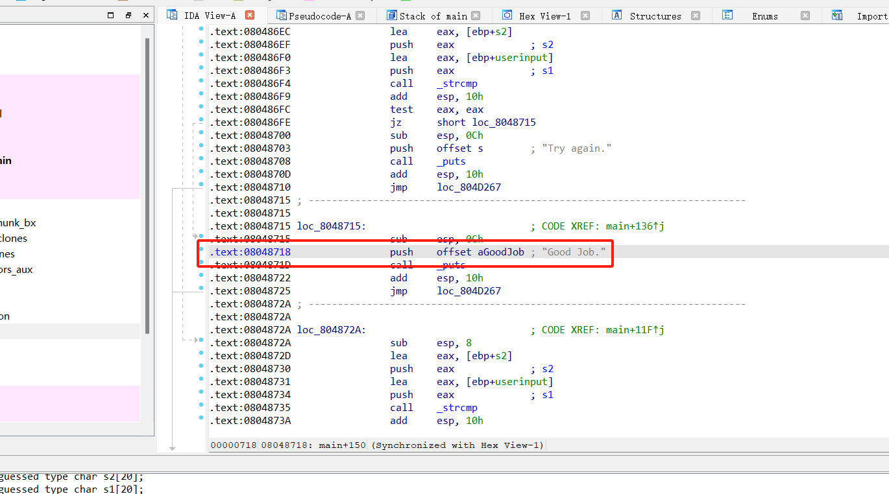

# Symbolic Execution

符号执行（Symbolic Execution），用于确定执行每条程序路劲所需的输入，

通过**采用抽象的符号代替具体值作为程序输入变量**，得到关于程序中函数和变量的符号表达式，以及在程序路径上每个条件分支可能的约束条件，最后通过求解程序路劲上积累的这些约束条件，确定执行该路径的可能输入

### **Concrete   VS   Symboic**

<figure><figcaption></figcaption></figure>

<figure><figcaption></figcaption></figure>

### SAT & SMT Solver

> 考虑一个简单的问题：如何求出三个布尔类型值**a、b、c**，使得以下公式返回True
>
> &#x20;**(  a and not b )  or (  not a and c )**

SAT：布尔表达式可满足性理论：用0和1来填充a/b/c，来判断上面的逻辑表达式是否成立

SMT：可满足性模拟理论，SAT的一个拓展，常用的工具：Z3 solver



### 静态符号执行工作流程概括

* **探索程序所有可能的路径**
* **在每个分支处积累约束条件**
* **使用SMT求解器来求解约束**
* PS：静态符号执行没有真正执行程序
* 存在的问题：路径爆炸、存在运行环境交互、数组的处理

### 动态符号执行

* 以一个具体的输入值（可以是随机值）——Seed，运行程序
* 收集路径约束
* 否定最后一个约束（取反），使用SMT solver求解取反后得到未执行的新路径及其对应的输入
* 重复上述过程知道没有新的路径发现

#### 符号执行框架

* Full System level
  * S2E
* User level
  * [Angr](https://github.com/angr/angr)、Triton、Manticore
* Code level
  * KLEE

### Fuzz增强

&#x20; 符号执行在Fuzz中的应用

思路：通过符号执行增强Afl-fuzz功能，发现新的、有趣的路径

* 基于AFL动态符号执行
* 在AFL“卡住”时进行符号执行
* Driller有选择的寻找AFL生成的输入作为DSE的种子并通过对约束条件取反，来找到AFL未覆盖到的新的路径，并生成对应的输入喂给AFL（Stephens N, Grosen J, Salls C, et al. Driller: Augmenting fuzzing through selective symbolic execution\[C]//NDSS. 2016, 16(2016): 1-16.）


Stephens N, Grosen J, Salls C, et al. Driller: Augmenting fuzzing through selective symbolic execution\[C]//NDSS. 2016, 16(2016): 1-16.



### 实操练习



<figure><figcaption></figcaption></figure>

示例程序如上，想要通过符号执行来到达分支输出GoodJob

<figure><figcaption></figcaption></figure>


```python
import angr
import sys
def Go():
    path_to_binary = "./02_angr_find_condition" 
    project = angr.Project(path_to_binary, auto_load_libs=False)
    # 告诉Angr从哪里开始执行（应该从main（）开始） 现在，使用entry_state函数指示Angr从main（）函数开始。
    initial_state = project.factory.entry_state()
    #创建使用启动状态初始化的模拟管理器。它提供了许多有用的工具来搜索和执行二进制文件。
    simulation = project.factory.simgr(initial_state)

    avoid_me_address =   0x08048744
    maybe_good_address = 0x08048718

    simulation.explore(find=maybe_good_address, avoid=avoid_me_address)
    #simulation.explore(find=maybe_good_address)
    if simulation.found:
        solution_state = simulation.found[0]
        solution = solution_state.posix.dumps(sys.stdin.fileno())
        print("[+] Success! Solution is: {}".format(solution.decode("utf-8")))
    else:
        raise Exception('Could not find the solution')

if __name__ == "__main__":
    print("[+] Start angr progress2")
    Go()
    
    
```

<figure><figcaption></figcaption></figure>

但是运行发现没有寻找到目标的输出，在ida中查看发现主函数中混淆了很多个输出good job的代码段，而刚刚`0x08048718`地址处代码中的只是其中之一，显然一个一个尝试找到真正的goodjob并不现实，一种解决思路是通过控制台输出来判断是否达到目标分支，修改代码如下：

```python
def Go():
    path_to_binary = "./02_angr_find_condition" 
    project = angr.Project(path_to_binary, auto_load_libs=False)
    # 告诉Angr从哪里开始执行（应该从main（）开始） 现在，使用entry_state函数指示Angr从main（）函数开始。
    initial_state = project.factory.entry_state()
    #创建使用启动状态初始化的模拟管理器。它提供了许多有用的工具来搜索和执行二进制文件。
    simulation = project.factory.simgr(initial_state)

    def is_successful(state):
    #通过控制台输出结果来判断是否达到预期的目标分支
        stdout_output = state.posix.dumps(sys.stdout.fileno())
        if b'Good Job.' in stdout_output:
            return True
        else: 
            return False

    def should_abort(state):
        stdout_output = state.posix.dumps(sys.stdout.fileno())
        if b'Try again.' in  stdout_output:
            return True
        else: 
            return False

    simulation.explore(find=is_successful, avoid=should_abort)
  
    if simulation.found:
        solution_state = simulation.found[0]
        solution = solution_state.posix.dumps(sys.stdin.fileno())
        print("[+] Success! Solution is: {}".format(solution.decode("utf-8")))
    else:
        raise Exception('Could not find the solution')
    
if __name__ == "__main__":

    print("[+] Start angr progress")
    Go()
```

运行结果如下，得到目标输出_`[+] Success! Solution is: HETOBRCU`_：

<figure><figcaption></figcaption></figure>
