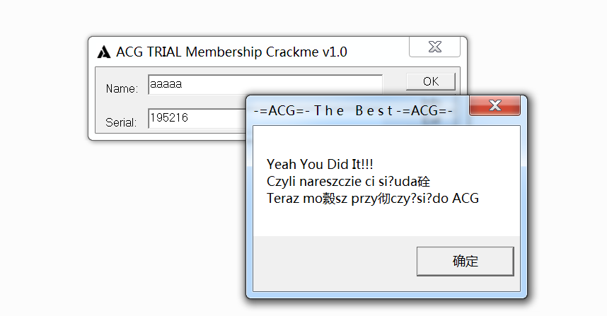

# Rust-2

## [Ownership](https://doc.rust-lang.org/book/ch04-01-what-is-ownership.html#what-is-ownership) 所有权 <a href="#what-is-ownership" id="what-is-ownership"></a>



Rust 的核心功能（之一）是**所有权（ownership）**。

所有程序都必须管理其运行时使用计算机内存的方式。一些语言中具有垃圾回收机制，在程序运行时有规律地寻找不再使用的内存；在另一些语言中，程序员必须亲自分配和释放内存。Rust 则选择了第三种方式：**通过所有权系统管理内存，编译器在编译时会根据一系列的规则进行检查。如果违反了任何这些规则，程序都不能编译。**在运行时，所有权系统的任何功能都不会减慢程序



关于堆栈：

（具体的stack和heap的基础知识不再赘述）

**分配数据到栈比在堆上分配更快**，因为分配器永远不必搜索存储新数据的位置；该位置始终位于栈的顶部。相比之下，在堆上分配空间需要更多工作，因为分配器必须先找到足够大的空间来容纳数据，然后执行簿记以准备下一次分配。

**访问堆中的数据比访问堆栈中的数据要慢**，因为堆必须通过指针才能到达。现代处理器在内存中跳转越少就越快（缓存）。出于同样原因，处理器在处理的数据彼此较近的时候（比如在栈上）比较远的时候（比如可能在堆上）能更好的工作。

当代码调用一个函数时，传递给函数的值（可能包括指向堆上数据的指针）和函数的局部变量会被推送到栈上。当函数结束时，这些值会从栈中弹出。

跟踪代码的哪些部分正在使用堆上的哪些数据、尽量减少堆上的重复数据量以及清理堆上未使用的数据以避免空间不足，这些都是所有权要解决的问题。


所有权在Rust中的规则

* Each value in Rust has an _owner_. Rust 中的每一个值都有一个**所有者**（owner）
* There can only be one owner at a time. 值在任一时刻有且只有一个所有者。
* When the owner goes out of scope, the value will be dropped. 当所有者（变量）离开作用域，这个值将被丢弃

### 词法作用域（生命周期）

想起了被软件分析课上被Data Flow analyse支配的恐惧哈哈哈

`match`、`for`、`loop`、`while`、`if let`、`while let`、`花括号`、`函数`、`闭包`都会创建新的作用域，相应绑定的所有权会被转移

函数体本身是独立的词法作用域：

* 当复制语义类型作为函数参数时，会按位复制。
* 如果是移动语义作为函数参数，则会转移所有权。

#### **String 类型**

为了演示所有权的规则需要 String 类型来做演示

<pre class="language-rust"><code class="lang-rust"><strong>{
</strong><strong>    let mut s = String::from("hello");
</strong>    //::运算符:允许将特定的 from 函数置于 String 类型的命名空间（namespace）下
    //不需要使用类似 string_from 这样的名字
    s.push_str(", world!"); // push_str() 在字符串后追加字面值
    println!("{}", s); // 将打印 `hello, world!`
}
// }结束时 s 离开作用域
//当变量离开作用域，Rust 为我们调用一个特殊的函数—— drop
//在这里 String 的作者可以放置释放内存的代码。Rust 在结尾的 } 处自动调用 drop
</code></pre>

而相较于之前的字符串字面值ss：

```
let ss = "hello";
```

`String` 由三部分组成，如图左侧所示：一个指向存放字符串内容内存的指针、一个长度和一个容量。这一组数据存储在栈上。右侧则是堆上存放内容的内存部分。

<figure><figcaption></figcaption></figure>

s是可变的，而ss是不可变的，而为了支持一个可变，可增长的文本片段，需要在堆上分配一块在编译时未知大小的内存来存放内容。这意味着：

* 必须在运行时向内存分配器（memory allocator）请求内存。
* 需要一个当我们处理完 `String` 时将内存返回给分配器的方法。

第一点由我们完成：**当调用 String::from 时，它的实现 (implementation) 请求其所需的内存。**这在编程语言中是非常通用的。

第二点实现起来就各有区别了。在有垃圾回收（garbage collector，GC）的语言中，GC 记录并清除不再使用的内存，而我们并不需要关心它。在大部分没有 GC 的语言中，识别出不再使用的内存并调用代码显式释放（C/C++）就是我们的责任了，跟请求内存的时候一样。从历史的角度上说正确处理内存回收曾经是一个困难的编程问题。如果忘记回收了会浪费内存。如果过早回收了，将会出现无效变量。如果重复回收，这也是个 bug。很多 bug 都是由于内存管理不当造成的，比如某块内存被释放了，某段代码还再去使用等情况。我们需要精确的为一个 allocate 配对一个 free。**Rust 采取了一个不同的策略：内存在拥有它的变量离开作用域后就被自动释放。下面是作用域例子的一个使用 `String` 而不是字符串字面值的版本**

#### **移动和克隆**

在Rust中，变量与数据交互的方式涉及到**移动**和**克隆**。

**移动**

一种不太正确但又合理的理解就是**浅拷贝**，例如： 将`String`变量 s1的内容拷贝给s2

```rust
let s1 = String::from("hello");
let s2 = s1;
```

这段代码执行以后，内存中的表现是这样的：

<figure><figcaption></figcaption></figure>

看这张图，**s1部分为灰色**，是因为在 `let s2 = s1;` 之后，Rust 认为 s1 不再有效

为什么要令s1失效？因为当我们将 s1 赋值给 s2时，直接从栈上拷贝了它的指针、长度和容量，并没有复制指针指向的堆上数据。而Rust 会自动调用 drop 函数并清理变量的堆内存。

这就有了一个问题：当 s2 和 s1 离开作用域，它们都会尝试释放相同的内存，也就是著名的二次释放（double free）问题，两次释放（相同）内存会导致内存污染

所以Rust在 `let s2 = s1;` 之后，Rust 认为 s1 不再有效，因此 Rust 不需要在 s1 离开作用域后清理任何东西，下面的代码是不合法的：

<pre class="language-rust"><code class="lang-rust">fn main() {
    let s1 = String::from("hello");
    let s2 = s1;
<strong>    //Rust 此后认为 s1 不再有效
</strong>    println!("{}, world!", s1); 
}
//编译报错：
Compiling playground v0.0.1 (/playground)
warning: unused variable: `s2`
 --> src/main.rs:3:9
  |
3 |     let s2 = s1;
  |         ^^ help: if this is intentional, prefix it with an underscore: `_s2`
  |
  = note: `#[warn(unused_variables)]` on by default

error[E0382]: borrow of moved value: `s1`
 --> src/main.rs:5:28
  |
2 |     let s1 = String::from("hello");
  |         -- move occurs because `s1` has type `String`, which does not implement the `Copy` trait
3 |     let s2 = s1;
  |              -- value moved here
4 |
5 |     println!("{}, world!", s1);
  |                            ^^ value borrowed here after move
  |
  = note: this error originates in the macro `$crate::format_args_nl` which comes from the expansion of the macro `println` (in Nightly builds, run with -Z macro-backtrace for more info)
help: consider cloning the value if the performance cost is acceptable
  |
3 |     let s2 = s1.clone();
  |                ++++++++

For more information about this error, try `rustc --explain E0382`.
warning: `playground` (bin "playground") generated 1 warning
error: could not compile `playground` (bin "playground") due to previous error; 1 warning emitted

</code></pre>

因为 Rust 使第一个变量无效了，这个操作被称为**移动**（move），而不是叫做浅拷贝。上面的例子可以解读为 s1 被**移动**到了 s2 中，Rust 永远也不会自动创建数据的 “深拷贝”。因此，任何自动的复制都可以被认为是对运行时性能影响较小的

**克隆**

如果我们确实需要深度复制 `String` 中堆上的数据，而不仅仅是栈上的数据，可以使用一个叫做 `clone` 的通用函数，例如下面的示例代码

```
let s1 = String::from("hello");
let s2 = s1.clone();

println!("s1 = {}, s2 = {}", s1, s2);
```

**只在栈上的数据：拷贝**

```
let x = 5;
let y = x;

println!("x = {}, y = {}", x, y);
//这段代码似乎与我们刚刚学到的内容相矛盾
//没有调用 clone，不过 x 依然有效且没有被移动到 y 中

//原因是像整型这样的在编译时已知大小的类型被整个存储在栈上，所以拷贝其实际的值是快速的
//所以这里调用 clone 并不会与通常的浅拷贝有什么不同
//Rust 有一个叫做 Copy trait 的特殊注解，可以用在类似整型这样的存储在栈上的类型上。
//如果一个类型实现了 Copy trait，那么一个旧的变量在将其赋值给其他变量后仍然可用。
```

如下是一些 Copy trait的类型：

* 所有整数类型，如 u32&#x20;
* 布尔类型，bool
* &#x20;所有浮点数类型，如 f64
* 字符类型，char
* 元组，**当且仅当其包含的类型也都实现 Copy 的时候**。比如，(i32, i32) 实现了 Copy，但 (i32, String) 就没有

**函数**

向函数传递值可能会移动或者复制，就像赋值语句一样。示例使用注释展示变量何时进入和离开作用域

```rust
fn main() {
    let s = String::from("hello");  // s 进入作用域

    takes_ownership(s);             // s 的值移动到函数里 ...
                                    // ... 所以到这里不再有效

    let x = 5;                      // x 进入作用域

    makes_copy(x);                  // x 应该移动函数里，
                                    // 但 i32 是 Copy 的，
                                    // 所以在后面可继续使用 x

} // 这里，x 先移出了作用域，然后是 s。但因为 s 的值已被移走，没有特殊之处

fn takes_ownership(some_string: String) { // some_string 进入作用域
    println!("{}", some_string);
} // 这里，some_string 移出作用域并调用 `drop` 方法。占用的内存被释放

fn makes_copy(some_integer: i32) { // some_integer 进入作用域
    println!("{}", some_integer);
} // 这里，some_integer 移出作用域。没有特殊之处

```
