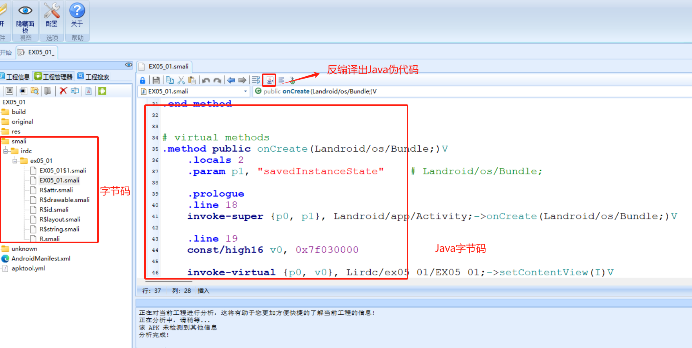
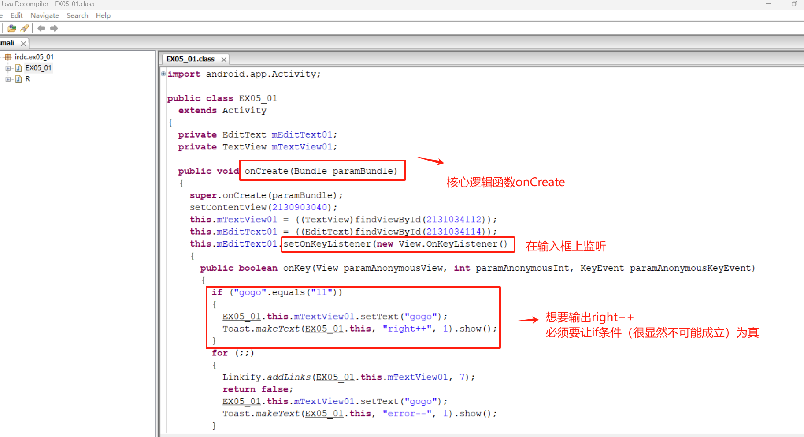
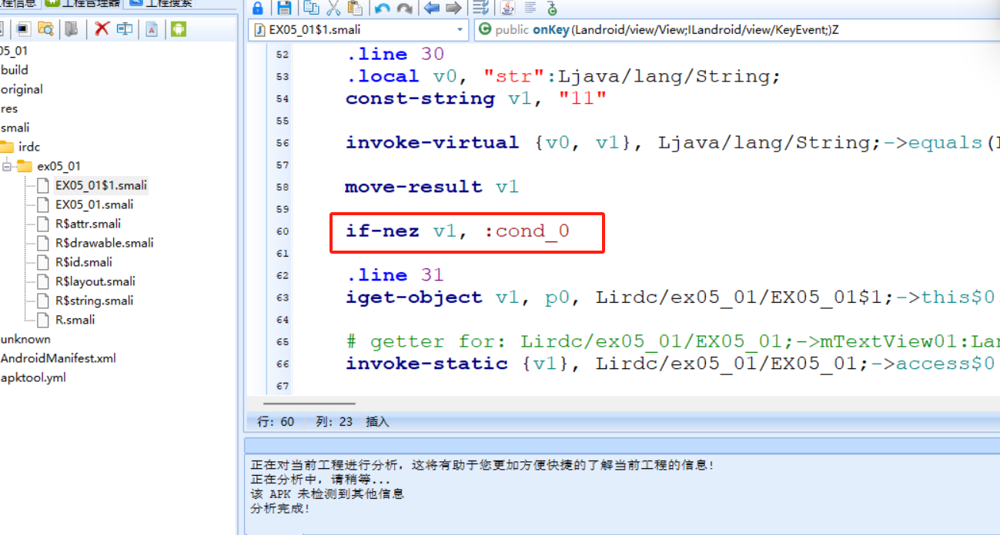
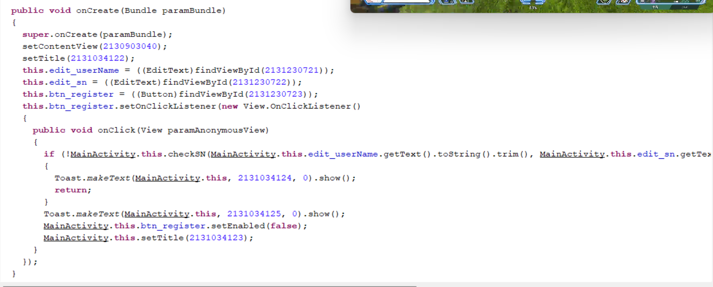

# Software Security

### 软件攻击面概述

代码层面：考虑加壳代码混淆等等

通信层面：通信劫持问题，更新机制，证书校验机制

文件层面

业务逻辑

运行时：运行时的内存是否可以远程注入


### 代码安全

典型的不安全代码示例阅读

* sql注入
* 栈溢出
* xss

### 漏洞概述

漏洞扫描与检测

* 源码扫描（SAST）
* 特征扫描：端口/函数/特征字符串/已有知识库

漏洞攻击检测

* 基于流量的检测
* 基于插桩等等检测
  * CFG检测流图
  * **ROP链检测**
  * 异常跳转检测

漏洞危害评估

* 评估维度
* 评估指标
* 评分标准

漏洞挖掘

* 代码审计
* 补丁比较
* Fuzz

漏洞利用

* 污点分析
* 符号执行
* shellcode

漏洞分析

* 静态分析
* 动态调试


#### 漏洞分类（按原理分类）

* 二进制
  * [栈溢出](software-security.md#zhan-yi-chu)
  * [堆溢出](software-security.md#dui-yi-chu)
  * [格式化字符串](software-security.md#ge-shi-hua-zi-fu-chuan-lou-dong)
  * Double Free
  * [UAF](software-security.md#uaf)
  * 整形溢出
* WEB
  * SQL注入
  * CSRF
  * XSS

三个概念

* POC：证明漏洞
* EXP：利用漏洞
* Shellcode：成功exp之后，在目标系统真正运行的代码
  * 主动查找DLL基址并动态获取API地址
  * 经典方法：TEB查找法，获取kernel32地址
    1. **获取TEB**：通过汇编指令 `fs:[0x30]` 来获取到当前线程的PEB（Process Environment Block）的地址。PEB中存储了很多关于当前进程的信息，其中也包含有一个叫做 `Ldr` 的成员变量。这个变量是一个指向 `PEB_LDR_DATA` 结构的指针，其中包含了当前进程已加载的模块列表。
    2. **获取PEB\_LDR\_DATA**：通过 `PEB+0x0C` 来获取 `PEB_LDR_DATA` 结构的地址。
    3. **获取InMemoryOrderModuleList**：在 `PEB_LDR_DATA` 结构中，有一个名为 `InMemoryOrderModuleList` 的链表，其中存储了所有已加载的模块的信息。通过 `PEB_LDR_DATA+0x14` 来获取该链表的头部地址。
    4. **遍历链表**：我们可以通过该链表，来遍历所有已加载的模块。对于每个模块，我们可以通过 `LDR_MODULE+0x30` 来获取它的基地址。对于我们想要找的 `kernel32` 模块，我们只需遍历这个链表，找到模块名为 `kernel32.dll` 的那个模块，然后就可以获取到它的基地址了。


#### 栈溢出

栈空间

函数调用时开辟栈空间，修改ebp和esp的值，由于修改了这个值，在回调时需要恢复，所以调用时第一步需要先`push ebp`，栈空间存储数据+控制流信息，栈空间在内存中是连续的

#### 堆溢出

动态增长的数据链表，开辟堆空间malloc、new，堆空间存储数据信息，堆数据结构包括两个部分，堆块是链表结构，所以堆块在内存中不是连续的

* 堆块
  * 块首：存放标识堆块的信息，如堆块大小，下一个堆块的指针
  * 块身：存放分配给用户的数据
* 堆表
  * 组织堆块的链表，一般位于堆区的起始位置
  * 最重要的两种堆表：
    * 空表：空闲双向链表Freelist，按照连接的空闲堆块**大小不同（设计不同大小的堆表减小内存碎片）**，空表总共被分为128条
    * 快表：快速单向链表Lookaside


#### 格式化字符串漏洞

print("格式化字符串%d, %08x ", A, \&B )，参数被逆序压栈，printf每次遍历格式化字符串中的一个字符，如果不是格式化参数的首字符（%），就继续复制输出字符，如果是格式化参数首字符（%），就采取相应的操作，将栈中的变量pop()，对应这个参数，栈指针下移

* %d/i，有符号整数
* %u，无符号整数
* %x/X，16 进制 unsigned int 。x 使用小写字母；X 使用大写字母。如果指定了精度，则输出的数字不足时在左侧补 0。默认精度为 1。精度为 0 且值为 0，则输出为空。
* %o，8 进制 unsigned int 。如果指定了精度，则输出的数字不足时在左侧补 0。默认精度为 1。精度为 0 且值为 0，则输出为空。
* %s，如果没有用 l 标志，输出 null 结尾字符串直到精度规定的上限；如果没有指定精度，则输出所有字节。如果用了 l 标志，则对应函数参数指向 wchar\_t 型的数组，输出时把每个宽字符转化为多字节字符，相当于调用 wcrtomb 函数。
* %c，如果没有用 l 标志，把 int 参数转为 unsigned char 型输出；如果用了 l 标志，把 wint\_t 参数转为包含两个元素的 wchart\_t 数组，其中第一个元素包含要输出的字符，第二个元素为 null 宽字符。
* %p， void \* 型，输出对应变量的值。printf("%p",a) 用地址的格式打印变量 a 的值，printf("%p", \&a) 打印变量 a 所在的地址。
* %n，不输出字符，但是把已经成功输出的字符个数写入对应的整型指针参数所指的变量。
* %%， '`%`'字面值，不接受任何 flags, width。


#### UAF

释放后重利用

```c
#include <stdio.h>
#include <cstdlib>
#include <string.h>
int main()
{
    char *p1;
    p1 = (char *) malloc(sizeof(char)*10);//申请内存空间
    memcpy(p1,"hello",10);
    printf("p1 addr:%x,%s\n",p1,p1);
    free(p1);//释放内存空间
    char *p2;
    p2 = (char *)malloc(sizeof(char)*10);//二次申请内存空间，与第一次大小相同，申请到了同一块内存
    memcpy(p1,"world",10);//对内存进行修改
    printf("p2 addr:%x,%s\n",p2,p1);//验证
    return 0;
}
```


### 漏洞利用

* 栈溢出
  * [shellcode覆盖法](software-security.md#shellcode-fu-gai-fa)
  * [SEH覆盖](software-security.md#seh-fu-gai-fa)
  * [ret2libc](software-security.md#ret2libc)
  * [ROP](software-security.md#rop-lian)
* 堆溢出
  * [堆喷射](software-security.md#dui-pen-she)
  * [fastbin attack](software-security.md#fastbin-attack)

#### shellcode覆盖法

**`payload：padding1 + address of shellcode + padding2 + shellcode`**

要求padding1 使得长度刚好触达返回地址，填充的address of shellcode位于原来的返回地址处，padding2内容为\x90（NOP）

这种方式一个问题是address of shellcode是固定的，遇到ASLR机制时失效，一种绕过思路是ret2reg（register），返回到寄存器地址执行的方式

* 找溢出函数返回时哪个寄存器指向溢出缓存区空间
* 找`call reg`或者`jmp reg`（ reg是刚刚找到的目标寄存器）的指令地址address
* 覆盖跳转地址为address

#### SEH覆盖法

将异常处理指针覆盖，从而控制程序执行流

SEH机制：

调试时：OS会首先把异常抛给调试进程处理。调试器几乎拥有被调试者的所有权限，它不仅可以运行、终止被调试者，还拥有被调试进程的虚拟内存、寄存器的读写权限。需要特别指出的是，被调试者内部发生的所有异常( 错误)都由调试器处理。所以调试过程中发生的所有异常( 错误)都要先交由调试器管理(被调试者的SEH依据优先顺序推给调试器)。像这样，被调试者发生异常时，调试器就会暂停运行，必须采取某种措施来处理异常,完成后继续调试。

异常处理器处理异常后会返回`ExceptionContinueExecution(0)`，从发生异常的代码出继续运行。若无法处理异常，则返回`ExceptionContinueSearch(1)`，将一场派送到SEH链的下一个异常处理器。

```cpp
//SEH结构体
typedef struct _EXCEPTION_REGISTRATION_RECORD
{
	// 链表以Next成员为FFFFFFFF的结构体结束，表示链表的最后一个结点
	PEXCEPTION_REGISTRATION_RECORD Next;
	// Handler：异常处理函数地址
	PEXCEPTION_DISPOSITION Handler;
} EXCEPTION_REGISTRATION_RECORD, *PEXCEPTION_REGISTRATION_RECORD;

// 异常顺着链传递，直到有异常处理器处理

```

<figure><figcaption></figcaption></figure>

#### SEH覆盖法实操

payload构造思路：

offset \* junk  + (short jump 06) + address of gadget(pop pop ret) + shellcode


(short jump 06) 覆盖第一个SEH结构体的NEXT SEH指针，address of gadget(pop pop ret)覆盖第一个SEH结构体的HANDLER指针，而offset需要通过一段junk溢出来确定，再搜索得到gadget的地址即可完成exp


#### ret2libc

当存在DEP堆栈不可执行保护机制时，一种绕过方式就是ret 到 libc库中的函数中，比如调用system("/bin/sh")函数来开启终端get shell

**`payload：padding1 + address of system() + padding2 + address of "/bin/sh"`**

padding2长度4字节（32位），内容随意（是调用完了system之后的返回地址）

address of system() 确定：根据libc版本


#### ROP链

寻找gadget代码片段来拼接实现目标操作，要求每个gadget**最后一条指令都是`ret`**，ret指令会`pop eip`，继续执行后面的gadget，形成**`rop链`**

**`payload：padding1 + address of gadget1 + address of gadget2 +... + address of gadgetn+shellcode`**

例如构造调用mprotect()的ROP链，开启站可执行权限后，找到push esp;ret;的gadget（作为最后一个gadget），然后再跟上目标shellcode，最后一个gadget执行后push address of shellcode，从而实现shellcode的执行


#### 堆喷射

heap spray，核心思想：在堆空间中大量填充shellcode+slidecode(NOP)，利用其他漏洞跳转到堆区（只要在slidecode中）就可以执行shellcode


#### fastbin attack

* fastbin attack + UAF
* fastbin attack +doubble free

fastbin使用`单向链表`来维护释放的堆块的，并且由fastbin管理的chunk即使被释放，其next\_chunk的`prev_inuse位也不会被清空`


### 操作系统的保护机制

* [GS机制](software-security.md#gs-ji-zhi)
* [DEP机制](software-security.md#dep-ji-zhi)
* SEH机制（见前面的章节）
* [ASLR机制](software-security.md#aslr-ji-zhi)
* [SafeSEH机制](software-security.md#safeseh-ji-zhi)
* [CFG机制](software-security.md#cfg-ji-zhi)


#### GS机制

针对栈溢出破坏返回地址的保护机制，Security-Cookie（Canary），在函数返回前（栈的EBP的前面）OS在返回前会将栈中的Security-Cookie和.data节中存的种子进行校验


Canary被篡改表示一定发生了栈溢出，OS会中止进程的执行，但是一旦攻击者可以泄露Canary的值并构造相应的Payload，GS机制就可以被绕过；或者攻击SEH机制，覆盖SEH处理函数（超长覆盖），在检查Canary之前触发异常进入异常处理

```
call CS_SEH.00401000 #进行Security-Cookie校验之前触发异常处理
```

> SEH机制：处理程序运行过程中产生的异常情况。一种常见的使用情况是，当程序尝试访问非法内存或执行非法操作时，SEH会捕获异常并给予适当的处理。\
> SEH中有两个关键部分：
>
> 1. Exception Handler：异常处理函数，当发生异常时，这个函数会被调用。
> 2. Exception Registration Record：异常注册记录，这是一个链表，用于存储异常处理函数的地址。链表的头部存储在TEB（Thread Environment Block）中，新的异常处理函数会被添加到链表的头部。

#### SafeSEH机制

针对上述的SEH攻击劫持控制流，提出SafeSEH机制：将已验证的异常处理程序注册并存储在一个表中，在执行给定的异常处理陈旭之前在这个表中进行查找校验

#### DEP机制

堆栈不可执行保护，将数据所在的内存页标志为不可执行，程序溢出转入shellcode时，尝试执行存放在数据中的代码，OS进行阻止

绕过DEP机制的一种手段是构造ROP链

#### ASLR机制

地址空间布局随机化机制，对抗ROP链构造的攻击手段

绕过ASLR机制的一种典型手段是堆喷射

#### CFG机制

Control Flow Guard控制流保护，在Win10正式被引用，是针对间接调用的一种保护机制

间接调用时汇编层面`call esi` ，但esi的值一旦被篡改在间接调用时就会被劫持控制流，CFG机制在`call esi` 之前`call guard_checj_icall`，基于CFGbitmap进行检查esi是否是一个合法的函数的起始位置


## 逆向

编译执行和解释执行

* 编译执行：编译阶段基于源代码生成目标程序，存在**跨平台的缺陷性**
* 解释执行：编译阶段生成中间语言，执行阶段将中间语言转为机器代码，具有平台无关性，兼容性好

指令集和汇编

* 精简指令集：运算性能不高
* 复杂指令集

汇编：指令集/寄存器/寻址方式

可执行文件

* windows平台可执行文件
  * 32位：PE32（如exe/dll/lib/sys/vxd）
    * PE头：ImageBase镜像基址（文件加载到文件的起始位置）、File\_Offset（**磁盘文件中**A的位置与文件起始地址的相对偏移）、VA（内存映像中A的位置）、RVA（**内存映像中**A的位置与文件映射基址的相对偏移）、VRk（文件映射到内存中后每一节之间填充的00个数，让16字节对齐）
      * VA = ImageBase + RVA = ImageBase + File\_Offset +VRk
    * 节表：索引节数据
    * 节数据：.data，.text等等
  * 64位：PE32+
* linux平台可执行文件
  * ELF
    * 链接视图
    * 执行视图
* android平台可执行文件
  * Apk：Android应用程序包，本质是一个压缩包
    * AndroidManifest.xml：程序全局配置信息
    * class.dex：Dalvik字节码，真正的可执行代码
    * resources.arsc：编译后的二进制资源文件的索引
  * android基于Linux开发，也可以运行ELF文件
* IOS/MacIOS
  * 以#！开头的脚本文件
  * 胖二进制文件：多个Mach-o文件的聚合体
  * Mach-o格式文件


### Android逆向

四个组件：

* Activity
* Service
* Broadcast receiver：全局消息传递机制，感知外部事件，例如接收验证码短信、电话
* Content provider：进程间数据交互和共享机制，**统一的数据访问接口，使用URI标识唯一的数据集**
  * **Uri由三部分组成："content://"，数据的路径，标识ID（可选）**

Binder机制：跨进程通信机制

intend机制：组件之间的通信机制


Android虚拟机：dalvik and art

* dalvik：依靠JIT编译器解释执行字节码，每次运行时预编译将字节码编译为机器语言，程序占用空间小但是运行速度慢
* art：应用安装时预编译字节码到机器语言（Ahead of time——AOT编译），同时支持解释执行，性能有了很大的提升


Android三种数据存储方式

* SharedPreference：基于xml文件存储的键值对数据
* 文件存储
* SQLite数据库存储：轻量级嵌入式数据库引擎


### 实操——Android 逆向实战

#### 工具

静态分析工具：**AndroidKiller\_v1.3**、Ulipad、010Editor

> 在使用**AndroidKiller\_v1.3**分析样本时**编译apk**时报错，发现问题是jdk版本和**AndroidKiller\_v1.3**不兼容，在AndroidKiller\_v1.3配置中将jdk17切换到**jdk1.8**解决问题，或者替换使用更高版本的Apptools

动态分析工具：雷电模拟器、JEB.android.

#### 样本一 EX05\_01\_.apk

要求：修改apk包让程序输出right++而非error++

首先在模拟器上运行程序，应用有一个简单的输入框，只要往输入框中输入数据，应用就会弹出error++。

使用AndroidKiller分析apk包：

<figure><figcaption></figcaption></figure>

<figure><figcaption></figcaption></figure>

阅读Java伪代码可以快速分析出程序的内部实现逻辑，再去字节码中寻找对应的部分进行下一步分析。

想要输出right++就必须绕过这个不可能成立的if语句，在字节码中找到这个跳转，将跳转条件取反，重新编译apk即可

<figure><figcaption></figcaption></figure>


#### 样本二 crackme.apk

要求：破解注册码

<figure><figcaption></figcaption></figure>


### ·Android 样本AddNumber.apk分析

#### 环境配置

本机操作系统：Win11

静态分析工具：AndroidKiller\_v1.3

JDK：jdk1.8.0\_281

模拟器：雷电模拟器

#### 逆向过程

首先在模拟器环境中尝试运行一下apk观察这个apk需要做什么：但发现这个apk无法在Android中正常安装，并且多次尝试仍然无法安装：

&#x20;

<figure><figcaption></figcaption></figure>

使用AndroidKiller\_v1.3打开这个apk，然后对其进行重新编译打包，将AndroidKiller重新编译的apk放入模拟器中，成功安装：

<figure><figcaption></figcaption></figure>

在模拟器中运行刚刚安装的caculate，根据提示需要将数目添加到87654321才能通关，并且软件中的添加按钮点击以后数值+1，显然我们要想办法绕过这个“点击87654321次”的条件

<figure><figcaption></figcaption></figure>

回到AndroidKiller中分析apk伪代码，首先找到主程序入口，在设置了需要的点击次数（87654321）之后监听按钮“添加”

<figure><figcaption></figcaption></figure>

接下来分析clickListener函数，在点击数达到需求以后执行paramAnonymousMessage = new Intent(MainActivity.this, success.class)启动succcess.class，然后获取一个字符串（根据success.class名字猜测应该是最后的目标字符串flag）：

<figure><figcaption></figcaption></figure>

所以我们现在的任务就是想办法跳出这个while循环，最简单方式就是绕过while的执行条件判断，在smali中找到这个while循环的java字节码部分：

<figure><figcaption></figcaption></figure>

看到这个if-lt(if less than)语句，即当v1\<v2时跳出循环，修改这个语句（我们让v1>v2时跳出）将if-lt改为if-gt(if greater than)那么此时只需要点击一次“添加”按钮就可以达成while循环的跳出条件，执行后面的代码，重新编译修改后的apk，安装后运行并点击添加，发现成功跳出循环执行了succcess.class，但根据提示还差一步，没有得到预期的flag

<figure><figcaption></figcaption></figure>

观察succcess.class中的代码发现启动这个class以后将字符串“成功离你只有一步之遥。。。。。。”显示在界面上，而我们想要的this.string字符串并没有显示出来：

<figure><figcaption></figcaption></figure>

阅读伪代码发现onBackPressed函数触发时会将this.string作为“data”传回到上一个页面，而上一个页面会对这个“data”进行打印显示

<figure><figcaption></figcaption></figure>

于是根据逻辑我们需要触发这个onBackPressed函数——点击返回按钮，成功getflag：

<figure><figcaption></figcaption></figure>

#### 复盘

在一开始安装软件的时候原始的apk无法安装，但是使用AndroidKiller重新编译以后可以正常安装，什么原因

首先分析AndroidKiller解包分析并进行重新编译这个过程改变了什么：

元数据的改变：反编译和重新编译可能会修改 APK 的元数据（版本信息、签名等）。重新编译的 APK 使用密钥重新进行签名，这会改变原本的签名。

字节码的改变：APK 的 .dex 文件是 Dalvik 字节码，它在反编译到 .smali 文件时可能丢失一些信息。在重新编译回 .dex 文件时，这可能导致生成的字节码与原始字节码有微小的差异。

对比原始apk和重编译的apk，发现在META-INT中多了一个MANIFEST.MF文件：

<figure><figcaption></figcaption></figure>

<figure><figcaption></figcaption></figure>

在APK文件中，MANIFEST.MF包含元数据，最关键的部分列出了APK文件中所有文件的名称以及对应的SHA-1摘要（即APK签名）所以分析得知原始的apk缺少签名而导致无法正常安装


### Windows逆向

#### 静态分析

常用工具：`PEiD` `010Editor` `IDA`

PEiD：查壳，查混淆

IDA：

字符串窗口String：在View中打开，shift+F12

交叉引用Xerfs：快捷键按X时点击需要分析交叉引用的函数名

反汇编Pseudoscode：F5

#### 动态分析

常用工具：`Windbg` `OllyDbg`

Ollydbg（OD）：


两种加载方式

* CreateProcess创建进程：ollydbg
* Attach方式：利用DebugActiveProcess函数，将调试器捆绑到正在运行的进程

快捷键：

* 单步步进：F7，遇到Call指令跟进，
* 单步步过：F8，遇到Call指令直接执行，不跟进
* 下断点：F2
* 跟随表达式窗口：Ctrl + G


**INT3断点：**执行一个INT 3断点时，该处的内存地址内容被改为了**INT 3 （0xCC），触发异常，**调试器捕捉异常从而停留在断点处


INT3断点存在的问题：改变了原有的汇编指令，容易被软件检测到，例如在MessageBoxA函数就存在INT3断点的检测：

```c
Uaddr = GetProcAddress(LoadLibrary("user32.dll"),"MessageBoxA")
Mark = *((BYTE*) Uaddr);//取MessageBoxA的第一个字节
if(Mark == 0xCC): //发现断点
    return TRUE
```


硬件断点：CPU支持的断点方式，当执行的指令地址匹配与调试寄存器时，使用四个调试寄存器（DR0，DR1，DR2，DR3），来设定地址，DR7设定状态，最多只能支持四个断点，但优点是速度快

内存断点：将所设地址设为不可访问、不可写属性，当程序想要访问写入这个地址时就会产生异常，调试器捕获异常并检查是不是断点地址

条件断点：（1）按寄存器条件中断（2）按内存值中断


#### Win32 API

创建和显示信息框

* MessageBox
* MessageBoxA
* MessageBoxW

获取文本框中的字符

* 16位
  * GetDlgItemText
  * GetWindowText
* 32位
  * GetDlgItemTextA：如果成功就返回文本长度
  * GetWindowTextA
* 64位
  * GetDlgItemTextW
  * GetWindowTextW


常见函数

* lstrcmp(lpstring1,lpstring2);  传入两个字符串的地址，如果两字符串内容**相等就返回0**


#### **32位软件逆向**

**虚函数**

在C++中，虚函数（Virtual Functions）是实现多态性（Polymorphism）的关键。多态性允许你使用父类指针来调用子类的方法。\
在基类中，用关键字 `virtual` 声明函数以使它成为虚函数。子类中的同名函数默认为虚函数，不需要使用关键字 `virtual` 显式声明。当使用父类（基类）指针或引用调用虚函数时，会调用与该指针或引用实际指向的对象类型相对应的函数版本。这称为动态链接，或延迟绑定。

```cpp
class Base {
public:
    virtual void foo() { cout << "Base::foo() called"; }
};

class Derived : public Base {
public:
    void foo() override { cout << "Derived::foo() called"; }
};

int main() {
    Base* basePtr = new Derived();
    basePtr->foo(); // Outputs "Derived::foo() called"
    delete basePtr;
    return 0;
}
```

一个类如果有虚函数，编译器就会给它添加一个虚函数表（virtual table），表中保存对虚函数的引用

#### Windows逆向实战

**Sample1 Crackme**

样本来源于《加密与解密》，简单分析，发现明文比对密码“9981”

<figure><figcaption></figcaption></figure>

可以通过修改控制流，将比较跳转的jnz修改为nop指令

<figure><figcaption></figcaption></figure>

<figure><figcaption></figcaption></figure>

<figure><figcaption></figcaption></figure>

实现任意序列码绕过

<figure><figcaption></figcaption></figure>


**Sample2 Crackeme 2**

直接分析核心代码，发现拿到flag需要让v7==9且v17==8，

<figure><figcaption></figcaption></figure>

并且每次变化v7和v17时需要满足 byte\_40E018\[10 \* v7 + v17] == 35，这个索引方式可以将其看成二维数组byte\_40E016\[v7]\[v17]

byte\_40E016的值为：

```
**********
*####*****
*#**#*****
##*##*****
***#******
***#*#####
***###***#
*********#
*********#
********##


```

这就类似一个走迷宫，初始位置在第四行的第一列处（v17 = 0, v7 = 3），而根据下面这段代码：

```
switch ( *(&v8 + v16) )
    {
      case 1:
        --v7;
        break;
      case 2:
        ++v7;
        break;
      case 3:
        --v17;
        break;
      case 4:
        ++v17;
        break;
      default:
        break;
    }
  
```

可以得出需要的411444 223222 441444 422223

而赋值这个字符串的函数：

```
int __cdecl sub_401000(int a1, int a2)
{
  int result; // eax
  int v3; // [esp+0h] [ebp-8h]
  int i; // [esp+4h] [ebp-4h]

  v3 = 0;
  for ( i = 0; i < 6; ++i )
  {
    while ( v3 < 4 )
    {
      if ( *(char *)(i + a1) == byte_40E000[4 * i + v3] )
      {
        *(_BYTE *)(i + a2) = v3 + 1;
        break;
      }
      ++v3;
    }
    v3 = 0;
    result = i + 1;
  }
  return result;
}

其中byte_40E000中值为：

```


rel.exe

样本

<figure><figcaption></figcaption></figure>


样本TracMe.exe

进行了简单的静态分析，得到了以下关键结论：程序逻辑的入口电在DialogFunc函数中，从对话框中获取用户输入的用户名和序列号，验证用户名的长度合法以后，将输入的用户名和序列号、用户名长度三次参数传入sub\_401340()这个函数进行验证，而核心的验证逻辑位于这个sub\_401340()函数中

<figure><figcaption></figcaption></figure>

并使用动态调试的方式成功得到“123456”对应的合法注册码：

<figure><figcaption></figcaption></figure>

<figure><figcaption></figcaption></figure>

<figure><figcaption></figcaption></figure>

而在IDA中，根据之前对源码的分析，想要编写注册机，需要分析sub\_401340()这个函数是如何根据用户输入用户名计算出合法的序列号并进行校验的：

<figure><figcaption></figcaption></figure>

在这个函数中可以看出，程序根据用户输入userinput，计算出合法的序列号，存放在v4变量中，再调用wsprintfA函数，将这个序列号值赋给userinput，最后调用lstrcmpA函数进行比对，返回结果，核心的计算是一个for循环，从索引i=0到i=length（userinput）-1，每八个一轮循环（因为byte\_405030\[8]）计算byte\_405030\[i]\*userinput\[v3++]的和作为注册码，在data段可以看到byte\_405030\[8]的值：{0x0C, 0x0A, 0x13, 0x09, 0x0C, 0x0B, 0x0A, 0x08}，由此编写解密代码如下：

```
#include <stdio.h>
#include <string.h>
//.byte_405030     db 0Ch                  ; DATA XREF: sub_401340+27↑r
//.data:00405031                 db  0Ah
//.data:00405032                 db  13h
//.data:00405033                 db    9
//.data:00405034                 db  0Ch
//.data:00405035                 db  0Bh
//.data:00405036                 db  0Ah
//.data:00405037                 db    8
int byte_405030[8] = {0x0C, 0x0A, 0x13, 0x09, 0x0C, 0x0B, 0x0A, 0x08};
 
int main(){
    char inputs[256] = "";
    fgets(inputs,sizeof(inputs), stdin);
    int a2[256];
    int length = strlen(inputs)-1;
    printf("length of input: %d",length);
    int i, v3 = 3, v4 = 0;
    for(i = 0; i < length; i++) {
        a2[i] = inputs[i];
    }
       
    i = 0;  
    while(v3 < length){
        if(i > 7)
            i = 0;
        unsigned char temp = byte_405030[i];
        int a2v3 = a2[v3];
        v4 += temp * a2v3;
        v3 += 1;
        i += 1;
    }
    printf("result: %d", v4);
   
    return 0;
}
```

运行结果如下，成功根据用户输入计算出合法的注册码（123456——2180）：

<figure><figcaption></figcaption></figure>


### 加壳和脱壳

* 整包加密
  * 对抗方法
    * 人工分析：效率低技术要求高
    * 内存Dump：搜索magic字段，以magic字段为起点dump内存，得到解密后的dex
  * 在libs中添加decrypt.so，对classes1.dex进行加密
  * 运行时虚拟机解释执行new.dex，调用decrypt.so对加密的classes1.dex进行解密并**加载到内存**
* 字节码变形
  * 对抗方法
    * HOOK：修改dalvik虚拟机代码，hook关键函数，监控类的加载和初始化函数，将执行过的类的代码dump出来进行dex重组（其实原理还是内存dump）
    * 虚拟执行：监控MainActivity，遍历所有Classes，强制进行初始化并dump所有的类
  * 按函数对原始字节码进行加密和存储，执行时分别解密函数并映射到内存执行，执行完后从内存中删除解密的字节，有效的对抗内存Dump
* Vmprotect
  * 不再使用dalvik虚拟机或者APT来对DEX文件进行解释执行，利用自建的虚拟机解释执行加密的dex

### Hook技术

Xposed框架



### 升级替换漏洞

软件升级替换时对网络数据包合法性校验不足，导致可能存在中间人攻击风险


### IOT设备固件逆向

IOT设备特点：硬件成本低，大多使用简单原始的硬件

* 硬件
  * USB接口
  * 无线接口
  * 串口
  * 存储
  * 内存
  * CPU架构
* 软件
  * bootLoader：引导操作系统
  * 操作系统：Linux/RT-Linux/VxWorks等嵌入式OS，少量使用Android

IOT设备固件提取

* &#x20;官网地址
* 在线升级抓包分析固件下载地址
* **JTAG/SWD调试接口读取**
* **编程器读取**
* **串口uboot提取**

**工具**

* binwork：提取固件内文件夹和文件
  * `binwork -Me filename`
* firmwalker：寻找包含特定字符串的文件（如pwd，url，ip，telnet）
  * `./firmwalker.sh /path/filename`
* sqlite3：查看数据库db文件
  * `sqlite3 dbname.db`
* IDA


