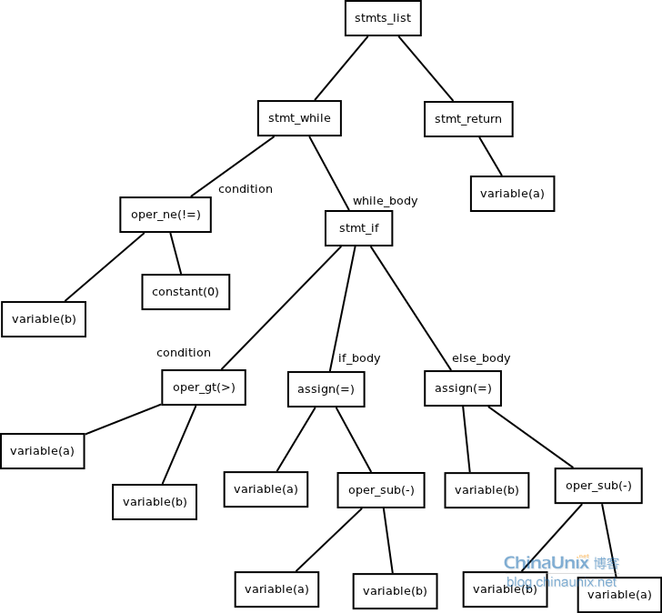
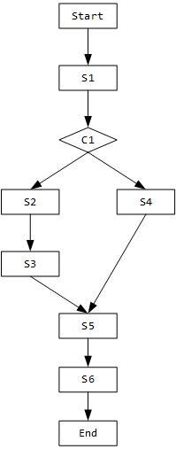

# BCSD2-Graph in BCSD

## AST

<figure><figcaption></figcaption></figure>

抽象语法树特点：

* 无论语法分析方法是 LL(1) 还是 LR(1)，都要求在语法分析构造出相同的语法树。即使是前端采用了不同的文法，都只需要改变前端代码，而不用连累到后端。
* 在构造语法树时，不依赖于语言的细节。

简单流程：

1. 词法分析，scanner。对每一个代码中的单词进行分析，并得出其性质；->数组
2. 语法分析，解析器；数组->语法树（AST会删除其中没有必要的token，如不完整的括号，这与CST（具体语法树）对应）；例babel


## 控制流与数据流


### 控制流：CFG、CDG

控制流程图：Control Flow Graphs (_CFG_) &#x20;

控制依赖图Control Dependence Graphs _(CDG)_（由FDT前向支配树产生）

示例伪代码：（ $$S_i$$​ 表示statement i， $$C_i$$ ​ 表示condition i）&#x20;

```c
S1;
if (C1){
    S2;
    S3;
}
else
    S4;
S5;
S6;

```

CFG如下：

<figure><figcaption><p>CFG</p></figcaption></figure>

接下来看CFG如何转为CDG，转换规则如下：

* 如果CFG中所有从 $$n_i$$ ​ 开始到 end 结点的路径都经过 $$n_j$$ ​ ，那么称 $$n_j$$ ​ post-dominate $$n_i$$（后面的支配前面的）
* 如果存在CFG中存在一个从 $$n_i$$ ​ 到 $$n_j$$​ 的路径，并且满足 $$n_j$$ post-dominate 这个路径上除了 $$n_i$$ ​ 和 $$n_j$$ ​ 之外的所有结点并且不post-dominate $$n_i$$​ 。那么 $$n_j$$ 控制依赖于 $$n_i$$ 。

在这个CFG中，可以看到 S1 和 C1 到 END 的2条路径都经过了 S5,S6，因此S5，S6 post-dominate C1。但是S2,S3,S4不post-dominate C1和S1。

对于路径C1->S2->S3 来说，S3 post-dominate S2 但是不post-dominate C1，所以 S3 依赖于 C1。依此类推，可以发现控制依赖源点是condition，终点是block中的语句

所以CDG图如下：

<figure><figcaption></figcaption></figure>

ACFG 源自于Genius项目

### 数据流：DFG、DDG

变量使用的依赖，eazy，pass

### 程序流：PDG，SDG

<figure><figcaption></figcaption></figure>

PDG是有向图，其中节点（或顶点）表示语句或控制谓词，弧（或有向边）表示两个节点之间的数据或控制依赖关系。 SDG可以通过主叫-被叫关系从PDG导出。

#### NCS

即源代码各个单词的顺序出现；

论文举例：Devign: Effective Vulnerability Identification by Learning Comprehensive Program Semantics via Graph Neural Networks

工作流程：

1. 提取代码的AST、CFG、DFG、NCS，每个节点由代码+节点组成，分别使用word2vec进行编码再结合作为节点；
2. 通过邻接矩阵来对邻接节点的信息进行聚合，将聚合节点和当前节点一起经过GRU网络得到下一时刻的当前节点。以此类推，经过T时刻，生成所有节点的最终的节点表征；（就剩了个邻接矩阵，初始为{0，1}，之前获取的那些信息不用了？）
3. 不使用节点特征线性的输入到MLP中然后通过softmax分类的一般方案，本文使用Conv进行训练一维卷积和dense层来对节点特征进行提取从而实现图级别的分类

## 图嵌入

[https://zhuanlan.zhihu.com/p/62629465](https://zhuanlan.zhihu.com/p/62629465)

图分析的目的包括四种： ( a )节点分类，( b )链接预测，( c )聚类，( d )可视化 嵌入的思想是在向量空间中保持连接的节点彼此靠近。拉普拉斯特征映射（Laplacian Eigenmaps）和局部线性嵌入（Locally Linear Embedding ，LLE） 自2010年以来，关于图嵌入的研究已经转移到解决网络稀疏性的可伸缩图嵌入技术上。 保持一阶二阶网络邻近度

目前研究的难点和目标：

* _属性选择_ 节点的“良好”向量表示应保留图的结构和单个节点之间的连接。第一个挑战是选择嵌入应该保留的图形属性。考虑到图中所定义的距离度量和属性过多，这种选择可能很困难，性能可能取决于实际的应用场景。
* _可扩展性_ 大多数真实网络都很大，包含大量节点和边。嵌入方法应具有可扩展性，能够处理大型图。定义一个可扩展的模型具有挑战性，尤其是当该模型旨在保持网络的全局属性时。
* _嵌入的维数_ 实际嵌入时很难找到表示的最佳维数。例如，较高的维数可能会提高重建精度，但具有较高的时间和空间复杂性。较低的维度虽然时间、空间复杂度低，但无疑会损失很多图中原有的信息。

大体上可以将这些嵌入方法分为三大类：

* 基于因子分解的方法
* 基于随机游走的方法(源于word2vec) 首先选择某一特定点为起始点，做随机游走得到点的序列，然后将这个得到的序列视为句子，用word2vec来学习，得到该点的表示向量。
  * deepwalk，使用RandomWalk一种可重复访问已访问节点的深度优先遍历算法；每个节点开始分别遍历，直到访问序列长度满足预设条件。使用skip-gram model进行向量学习，使用Hierarchical Softmax来做超大规模分类的分类器；
  * node2vec
* 基于深度学习的方法
* LINE PAPER SOURCE：ang J , Qu M , Wang M , et al. LINE: Large-scale information network embedding\[J]. 24th International Conference on World Wide Web, WWW 2015, 2015.

### 激活函数

1，相比Sigmoid/tanh函数，使用梯度下降（GD）法时，收敛速度更快

2，相比Sigmoid/tanh函数，Relu只需要一个门限值，即可以得到激活值，计算速度更快

缺点是：

Relu的输入值为负的时候，输出始终为0，其一阶导数也始终为0，这样会导致神经元不能更新参数，称为“Dead Neuron”。

为了解决Relu函数这个缺点，在Relu函数的负半区间引入一个泄露（Leaky）值，所以称为Leaky Relu函数；

\$$\
LeaekyReLU(x) = \begin{cases} x, & x\gt 0 \\\ ax, & x\le 0 \end{cases}\
\$$\


### 聚类

使用聚类算法：频谱聚类算法 [谱聚类的相关知识](https://www.cnblogs.com/pinard/p/6221564.html)

#### K-means聚类算法介绍

[K-means聚类算法](https://www.cnblogs.com/pinard/p/6164214.html)

简单介绍：

```
  在图b中，我们随机选择了两个k类所对应的类别质心，即图中的红色质心和蓝色质心，
  然后分别求样本中所有点到这两个质心的距离，并标记每个样本的类别为和该样本距离最小的质心的类别，如图c所示，
  经过计算样本和红色质心和蓝色质心的距离，我们得到了所有样本点的第一轮迭代后的类别。
  此时我们对我们当前标记为红色和蓝色的点分别求其新的质心，如图4所示，
  新的红色质心和蓝色质心的位置已经发生了变动。
  图e和图f重复了我们在图c和图d的过程，即将所有点的类别标记为距离最近的质心的类别并求新的质心。
  最终我们得到的两个类别如图f。
```

* _**传统K-means算法流程**_
  1. 经验确定k值；
  2. 随机选择k个样本作为初始质心；
  3. 计算其他点到已选质心的欧式距离，将最小值加入对应的聚类中；
  4. 重新以平均值计算该类的质心；
  5. 若质心不再变化则结束，否则继续执行第三步；
* _**K-means++算法流程**_ 优化质心选择算法：
  1. 随机选择一个点作为起始质心；
  2. 计算为选择点到已选择点的距离（取各个点中的最小值），取其最大值作为下一个质心；
  3. 重复2直至完成k个点的质心选择；
* _**距离计算优化的elkan K-means算法**_ 执行两种规律，利用质心间的距离减少点到质心的计算距离：
  1. 是对于一个样本点x和两个质心μj1,μj2。如果我们预先计算出了这两个质心之间的距离D(j1,j2)，则如果计算发现2D(x,j1)≤D(j1,j2),我们立即就可以知道D(x,j1)≤D(x,j2)。此时我们不需要再计算D(x,j2),也就是说省了一步距离计算。
  2. 规律是对于一个样本点x和两个质心μj1,μj2。我们可以得到D(x,j2)≥max{0,D(x,j1)−D(j1,j2)}。这个从三角形的性质也很容易得到。
* _**大样本优化 Mini Batch K-Means算法**_ 选取部分集中的样本首先进行传统K-means算法，batch size一般是通过无放回的随机采样得到的。 为了增加算法的准确性，我们一般会多跑几次Mini Batch K-Means算法，用得到不同的随机采样集来得到聚类簇，选择其中最优的聚类簇。

#### DBSCAN聚类算法

[参考博客链接](https://blog.csdn.net/hansome_hong/article/details/107596543)

DBSCAN是一种基于密度的聚类算法，基于定义距离下的半径内最少点数目进行聚类；邻域半径R内的点的个数大于最少点数目时就是密集。

评价：简单快捷，仅按照点与点之间的距离作为判断依据，因此半径和最小内点数量需要经验设计；

_**节点定义**_：

* _核心点_：邻域半径R内样本点的数量大于等于最小内点数量；
* _边界点_：不属于核心点但在某个核心点的邻域内；
* _噪声点_：排除上述两者剩余的点；

_**关系定义**_：

* _密度直达_：
  * 出发点是核心点（具有单向性）；
  * 在R邻域内；
* _密度可达_：
  * 间接直达；
  * 基于直达，以此也具有单向性；
* _密度相连_：
  * 取消起点是核心点的要求（去除单向性）后，密度可达；
  * 具有双向性；
  * 在该定义下，密度相连的两组认为同属一个簇；
* _非密度相连_：
  * 非密度相连的情况；
  * 表示不属于同簇或者为噪声点；

_**聚类流程**_：

_输入_：数据集，邻域半径 Eps，邻域中数据对象数目阈值 MinPts; _输出_：密度联通簇的集；

1. 从数据集中任意选取一个数据对象点 p，按照参数Eps（半径）和MinPts判断点p是否为核心点；
2. 是，则找出所有从 p 密度可达的数据对象点，形成一个簇；
3. 否则选取另一个数据对象点；
4. 重复2、3步，直到所有点被处理。

### 图神经网络

#### _**Scalable Graph-based Bug Search for Firmware Images**_

论文链接

固件漏洞挖掘

参考计算机视觉中的技术，基于CFG的高阶向量的表示方法 Genius

计算机视觉图形检索的主要步骤：

1. 原始特征提取
2. 码本生成
3. 特征编码
4. 在线搜索 离线索引（包括前三步）和在线搜索

**文章提出的ACFG**

其他方法MCS最大公共子图，效率有限

**码本生成**

从原始特征中学习一组分类：C={c1，c2，…，ck}，其中ci是第i个码字或“质心”，共分为两步：

* 相似性度量计算： 二部图法量化相似性，并用结构特征添加来防止二部图无图结构特征造成的误差积累导致不精确 将两张ACFG图组合为一张二部图，每个匹配都与成本相关联。两个图的最小代价是映射上所有边代价的总和。二部图匹配可以有效地遍历所有映射，并以最小的代价选择从G1到G2的节点上的一对一映射。边缘成本由该边缘上两个基本块之间的距离计算。 如果特征是集合，我们使用Jaccard来计算集合差。
*   利用空图计算的归一化； 两个图的匹配成本大于一，并且与比较的ACFG的大小正相关。因此，我们将成本归一化以计算相似性得分。对于成本归一化，我们为每个比较的ACFG创建一个空ACFGΦ。空图中的每个节点都有一个空特征向量，并且空图的大小被设置为对应的比较图的大小。通过与这个空的ACFG进行比较，我们可以获得被比较图可以得到的最大匹配成本; $\kappa(g\_1,g\_2)=1-\frac{cost(g\_1,g\_2)}{max(cost(g\_1,\phi),cost(\phi,g\_2))}$

    学习目标是找到能够最大化不同ACFG的距离同时最小化等效ACFG距离的权重参数(人话：不同类差距最大化，近似类差距最小化)

    雅卡尔指数（英语：Jaccard index），又称为交并比、雅卡尔相似系数，比较样本集的相似性与多样性的统计量，定义为交集与并集的比值； 雅卡尔距离（Jaccard distance）用于量度样本集之间的不相似度，其定义为1减去雅卡尔系数； 有人将雅卡尔距离定义两集合对称差$A\Delta B=|A\cup B|-|A\cap B|$的大小与并集大小之间的比例
*   聚类 输入为相应ACFG的相似性得分核矩阵，为用于训练集的ACFG划分，寻找聚类和划分质心，所有质心节点的集合构成代码本。此处考虑效率和准确率，码本大小设置为16；

    分层抽样：首先收集一个数据集，该数据集涵盖了来自不同架构的不同功能的ACFG。参见第5.2节。然后将ACFG分成不同尺寸范围的单独“地层”。然后将每个层作为独立的子群体进行采样，从中随机选择各个ACFG。

加速方式：并行聚类、近似聚类、层次聚类算法

**特征编码**

* 能更好容忍函数在不同体系结构中的变化，每个维度都是与分类的相似关系，与ACFG本身相比，该分类对二进制函数的变化不太敏感。
* 编码后的ACFG原始特征成为高维空间中的一个点，可用hash方法快速搜索； $q:G\to R^n$ in $C={c\_1,...,c\_n}$ 设$NN(g\_i)$表示图$g\_i$码本中最近质心邻居 $NN(g\_i)=\arg\\,\max\_{c\_i\in C}\kappa (g\_i,c\_j)$ 图像检索中的一种常见做法是不仅考虑最近的邻居，还考虑几个最近的邻居;

1. 特征包编码BOF模型 特征包编码将图形映射到码本中的一些质心，将每个函数表示为特征包。量化器是将图转化至码本中的最近质心的独热码；
2. VALD编码 词袋是只要质心是图的最近邻居，图与质心距离就会被忽视； 该方案合并一阶差异，将图分配给单个混合物组分 将独热码更改为相关信息，提高了向量包含的语义信息，反应了质心的相似性分布； 以三个函数举例： F1在x86的架构下编译的结果，F1在mips架构下编译的结果，F2在mips下编译的结果；
   * 编译不同，结构图存在一定的差别；
   * 相似性是最大共子图/最大图；
   * 成对匹配将通过ACFG直接匹配两个函数，而Genius将通过编码向量匹配它们。VLAD编码通过将ACFG与其码本中最接近的前3个质心节点进行比较来生成编码向量。

**在线搜索**

LSH（位置敏感散列）

1. 使用BOF算法或VALD算法，进行函数特征编码；
2. 使用LSH，通过学习投影来在大数据集中进行查询；投影公式： $h\_i(q(g))=\lfloor(v·q(g)+b)/w\rfloor$ where w is the number of quantized bin, v is a randomly selected vector from a Gaussian distribution, and b is a random variable sampled from a uniform distribution between 0 and w. 理论基础：如果两个点在特征编码空间中更靠近，那么它们在哈希空间中的投影之后应该保持接近； $lsh(g)=\[h\_1(q(g)),...,h\_w(q(g))]$ 距离可用余弦距离和欧氏距离；

基线软件：

* discovRe
* Multi-MH和Multi-k-MH
* 基于质心的搜索

### 图模型

部分性能的比较图如下：

* 图模型：
* 图表示：
* 图嵌入：

来自论文Neural software vulnerability analysis using rich intermediate graph representations of programs

#### GGNN

论文链接

先前关于图结构输入的特征学习的工作主要集中在产生单个输出的模型上，如图级分类，但图输入的许多问题需要输出序列。比如图上的路径、具有所需属性的图节点的枚举，或与起始节点和结束节点混合的全局分类序列。

图上的特征学习有两种设置：（1）学习输入图的表示，(2) 在生成序列的过程中学习内部状态的表示输出。

是基于GRU在空间域message passing的模型；

上图为控制图中节点如何通信的稀疏矩阵的例子表示

输入与训练： 等式1是初始化步骤，它将节点注释复制到隐藏状态的第一个分量中，并用零填充其余部分。 等式2是通过输入和输出边在图的不同节点之间传递信息的步骤，其参数取决于边类型和方向。$a^{(t)}\_v\in R^{2D}$包含来自两个方向的边的激活。 其余的是类似GRU的更新，它包含了来自其他节点和前一个时间步的信息，以更新每个节点的隐藏状态。 z和r是更新门和重置门; 使用BPTT算法（Back Propagation Through Time）以计算梯度。

输出：

* 图级输出 图级表示向量： $h\_G=tanh(\sum\_{v\in V}{\sigma(i(h\_v^{(T)},x\_v))\odot tanh(j(h\_v^{(T)},x\_v))})$ i和j是神经网络,以$h\_v^{(T)}$和$x\_v$的级联作为输入,输出实值向量的。$\sigma(i(h\_v^{(T)},x\_v))$可以作为一种注意力机制；
* 节点输出

->GGS-NNs(Gated Graph Sequence Neural Networks)使用多个GGNN网络生成输出序列；

#### GCN

RNN针对一维结构，针对序列前后信息的互相影响，图不存在这样的线性关系； CNN针对二维结构，依靠的是平移时的结构不变性，使得参数能够在各个核中共享，但图不存在这样的优势； 图并不能用上述欧式空间描述；-> GNN;DeepWalk;Node2vec

$\hat{A}=A+I, \hat{D}是A$的节点度矩阵；

邻接矩阵A对角为0，因此与H相乘时，会放弃自己node的特征，因此$\hat{A}=A+I$,让H相乘时获取自身特征；

$\hat{D}^{-\frac{1}{2\}}\hat{A}\hat{D}^{-\frac{1}{2\}}$进行归一化

$c\_{ij}$为归一化因子；N是该层中第i个单位的单跳邻居集合；

[作者博客链接](http://tkipf.github.io/graph-convolutional-networks/)

#### GAT

[博客链接](https://zhuanlan.zhihu.com/p/134148937) 图方法分为谱方法和空间方法：

* 谱方法是将图映射到谱域上，例如拉普拉斯矩阵经过特征分解得到的空间，代表方法之一是GCN；
* 空间方法是直接在图上进行操作，代表方法之一GAT；

学习流程：

* 输入:N个节点的特征$h={h\_1,...,h\_N}$，$h\_i\in \Kappa^F$
* 乘W变换，将h映射到维度$\hat{F}$
* 注意力权重$e\_{ij}=a(Wh\_i,Wh\_j)$
* softmax函数归一化
* 注意力机制是一个单层的前馈神经网络，激活函数采用LeakyReLU
* 注意力参数$&#x61;_{ij}=softmax\_j(e_{ij})=\frac{exp(&#x65;_{ij})}{\sum_{k\in N\_i}exp(e\_{ik})}$
* $\hat{h\_i}=\sigma(\su&#x6D;_{j\in N\_i} a_{ij}W\hat{h}\_j)$
* 输出:$\hat{h}={\hat{h}_1,...,\hat{h}_&#x69;}$，$\hat h\_i\in \Kappa^F$

采用多头注意力（Multi-head Attention）扩展注意力对模型是有提升的。 采用K头注意力机制的两种计算公式如下：

1. 拼接方式：
2. 均值方法：

#### Highway GCN

缩写为H-GCN，来自于Highway Network；

* Highway Networks
  * 在门机制引入了transform gate T,carry gate C;
  * 残差连接：$y=H(x,W\_H)\cdot T(x,W\_T)+x\cdot (1-T(x,W\_C))$ 由上图可知，该网络部分忽视输入，部分处理；

#### DEEPGCNs

TODO

#### JUMP KNOWLEDGE NETWORK

TODO

### TF-IDF

TF-IDF是潜在语义分析（LSA）技术的一个示例，该技术给出了一个文档语料库，为语料库的每个文档中的每个术语提供了分数。 TF-IDF(t,d,D)=$f\_{t,d}\multimaplog\frac{|D|}{|D\_t|}$

其中$f\_{t,d}$,是文档d中的t术语频率；|D|文档数量，|$D\_t$|包含t的文档数量；TF-IDF的一个重要限制是该技术产生的张量的高维度。解决这个问题的一种方法是使用统计降维技术，例如主成分分析（PCA）或奇异值分解（SVD）。这种方法执行正交线性变换，并且能够将高维数据投影到低维空间\[1]。

\
