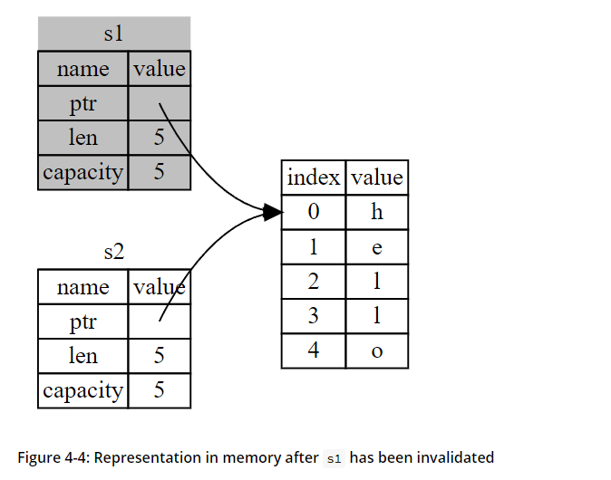

# JavaScript

## Efficient Static Vulnerability Analysis for JavaScript with Multiversion Dependency Graphs，2024，CCF-A





技术路线：提出了一种对CDG图的轻量级改进设计：**Multiversion Dependency Graph (MDG)** ，采用图查询匹配（非机器学习）来实现四种漏洞的检测

#### **MDG的结构与组成（还有点没看懂）**

**(1) 节点类型**

* **对象节点（Object Node）**
  * 表示程序执行过程中创建的对象或原始值。
  * 标签格式：`𝑜𝑥 :𝑣~`（如 `𝑜5:config[op]`），其中：
    * `𝑜𝑥`：对象版本标识符。
    * `𝑣~`：源代码中指向该对象的变量名或属性路径。
  * **动态属性**：用通配符 `*` 表示未知属性名（如 `𝑜1 P(*)→𝑜5`）。
* **函数调用节点（Function Call Node）**
  * 表示函数调用（如 `exec()`）。
  * 标签格式：`𝑓𝑥 :𝑣~()`（如 `𝑓1:exec()`）。

**(2) 边类型**

* **属性边（Property Edge, `P(p)`）**
  * 表示对象属性的内部结构（如 `𝑜1 P(*)→𝑜5`）。
  * 边标签 `p` 为属性名，`*` 表示动态属性。
* **版本边（Version Edge, `V(p)`）**
  * 表示对象版本更新（如 `𝑜5 V(*)→𝑜6`）。
  * 新版本继承旧版本属性，并记录属性变更（如动态属性添加）。
* **依赖边（Dependency Edge, `D`）**
  * 表示数据依赖关系，包括：
    1. **动态属性名依赖**（如 `𝑜3 D→𝑜6`，分支名动态影响属性名）。
    2. **属性值到函数调用的依赖**（如 `𝑜8 D→𝑓1`，`options.cmd` 影响 `exec()` 参数）。

<figure><figcaption></figcaption></figure>

实现了四种Java漏洞的检测，**检测的四种漏洞分类与对比：**

| **漏洞类型**             | **所属类别** | **关键特征**        | **典型防御手段**   |
| -------------------- | -------- | --------------- | ------------ |
| Prototype Pollution  | 对象原型篡改   | 污染JavaScript原型链 | 冻结原型、过滤敏感键   |
| OS Command Injection | 污点式漏洞    | 拼接不可信数据到系统命令    | 参数化命令、输入白名单  |
| Arbitrary Code Exec  | 污点式漏洞    | 动态执行用户输入的代码     | 禁用eval、沙箱隔离  |
| Path Traversal       | 污点式漏洞    | 利用路径跳转符访问受限文件   | 路径规范化、目录权限控制 |

***

* **原型污染**：针对JavaScript原型链的篡改，需警惕动态对象操作。
* **污点式漏洞**：核心是**数据流未净化**，需对输入输出严格管控。
  * **OS命令注入**：关注命令拼接与特殊字符过滤。
  * **任意代码执行**：避免动态执行不可信代码。
  * **路径遍历**：规范化路径并限制文件访问范围。

## Project Achilles: A Prototype Tool for Static Method-Level Vulnerability Detection of Java Source Code Using a Recurrent Neural Network，2019，CCF-A





技术路线：LSTM+RNN，实现了29种类型的漏洞检测，在24种漏洞中准确率都高于90%

<figure><figcaption></figcaption></figure>

<figure><figcaption></figcaption></figure>
